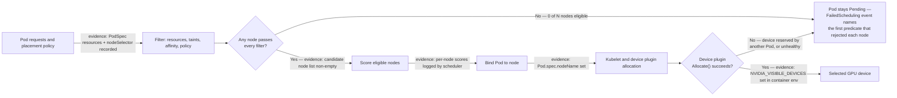

# GPU Scheduling and Topology

Kubernetes can place a Pod that requests an integer GPU resource on a node that advertises sufficient allocatable capacity. That is necessary but often not sufficient. A multi-GPU training job may care about peer connectivity, CPU and NIC locality, and simultaneous start. An inference service may prefer flexible placement and fast scale-out. Treating both as the same scheduling problem either wastes scarce capacity or produces unpredictable performance.

GPU scheduling is therefore the practice of expressing only the placement constraints that the workload can justify, then measuring the utilization cost of those constraints. The best placement is not always the most local one; it is the one that meets the service objective without creating unnecessary stranded capacity.

## Learning objectives

After this chapter, you will be able to:

- separate GPU capacity, node eligibility, and device-level locality;
- select Kubernetes controls for pool isolation and workload placement;
- recognize when distributed jobs need coordinated scheduling; and
- balance performance predictability against fragmentation and operational complexity.

## The scheduler sees a staged decision

**Figure 10.8.1 — Node selection precedes device allocation.** A request for `nvidia.com/gpu` constrains quantity. The scheduler does not automatically infer the workload’s preferred NVLink, PCIe, NUMA, or NIC relationship from that quantity alone. The two decision points matter because they are different failure classes with different fixes: `FilterOK=No` is a policy or capacity problem visible entirely from `kubectl describe pod` events before the Pod ever touches a node, while `AllocOK=No` means the scheduler's view of free capacity was already stale by the time kubelet tried to actually reserve the device — a race that shows up as a bound Pod stuck in `ContainerCreating`, not `Pending`.

The device plugin and extended-resource model are described in [Chapter 04](./chapter-04-device-plugin-and-kubernetes-resource-model). Feature discovery supplies the labels that make pool eligibility expressible in [Chapter 05](./chapter-05-node-and-gpu-feature-discovery). Neither component by itself turns a generic scheduler decision into a complete topology policy.

## Four placement questions

Ask these in order for every workload class:

1. **Capacity:** how many GPU resources, and of which resource name, are required?
2. **Eligibility:** which validated node class may run the workload?
3. **Locality:** does the workload have measured sensitivity to CPU, NUMA, NIC, storage, or GPU-peer topology?
4. **Coordination:** must multiple Pods start together or be admitted through a queue?

This order prevents a common design error: encoding topology rules before proving that the application benefits from them. It also makes a Pending Pod easier to diagnose because the scheduler event can be mapped to one explicit question.

## Core controls and what they do not do

| Control | Appropriate use | It does not guarantee |
|---|---|---|
| GPU request and limit | reserve an integer extended resource | model, memory, topology, or application health |
| Taint and toleration | reserve GPU pools for authorized workloads | selection of a particular node or GPU |
| Node affinity | require or prefer a governed service class | a particular device within the node |
| Pod affinity / anti-affinity | co-locate or separate related Pods | gang admission or network topology |
| CPU Manager | allocate CPUs according to configured CPU policy | GPU-to-NIC locality by itself |
| Topology Manager | coordinate NUMA hints from participating components | an application-aware communication plan |
| Queue or gang scheduler | admit related Pods together | free capacity or correct hardware labels |

Use a request and limit consistently for GPU extended resources according to the cluster policy. Then add the fewest eligibility and locality constraints needed to meet a documented workload objective. Required affinity is a compatibility commitment; preferred affinity is usually more appropriate for an optimization.

## Topology is a path, not a label

Performance-sensitive work moves data across paths: CPU memory through a PCIe root complex, GPU-to-GPU links, GPU-to-NIC paths for distributed communication, and storage or network adapters. A label such as `topology=fast` can describe an approved class, but it cannot reveal whether the resources actually assigned to a particular Pod form the intended path.

Kubernetes CPU Manager and Topology Manager can help coordinate CPU, device, and NUMA allocation when configured policies and hint providers align. They are not universal topology solvers. GPU peer connectivity, multi-node fabric behavior, and network attachment can require platform-specific topology awareness, node-pool design, or scheduler integration. Read [Volume 07, Chapter 08](../volume-07/chapter-08-topology-aware-placement) before designing placement for distributed GPU communication.

For single-node multi-GPU training, a homogeneous pool with documented topology may be simpler and safer than per-Pod topology logic. For multi-node jobs, combine node-class selection with verified fabric configuration and the workload framework’s communication behavior; a perfect local CPU allocation cannot compensate for a congested or misconfigured network path.

## Coordinated-start workloads

Distributed training often needs a complete set of workers before useful work starts. If independent Pods are scheduled one at a time, some can reserve GPUs while their peers wait in Pending state. The cluster appears allocated, but the job produces no progress.

Queueing or gang-style admission mechanisms can avoid this partial allocation by admitting the group only when its required resources are available. They introduce their own policy decisions: queue fairness, priority, timeout, preemption, and how long capacity may wait for a large job. Do not bolt them onto every GPU workload. They are justified when partial start has material cost, such as tightly coupled training, not merely because the workload uses GPUs.

## Fragmentation is the price of specificity

Every hard constraint reduces the candidate set. That can protect SLOs, but it can also leave isolated GPUs, create long queues while other pools are idle, and turn a hardware refresh into a capacity incident. Track these effects by service class rather than only by total cluster utilization.

| Workload class | Typical priority | Scheduling posture |
|---|---|---|
| Interactive development | rapid admission | flexible pool, bounded sharing or quotas as policy allows |
| Online inference | latency and availability | validated serving class, replicas spread for resilience |
| Batch inference | throughput and cost | flexible placement, queue-aware admission where useful |
| Distributed training | predictable collective performance | topology-aware class, coordinated admission, checkpoint-aware disruption policy |

Start with a small service catalog and add a class only when it has a measured performance, reliability, or governance reason. Review class utilization and wait time after changes. A constraint that provides no measurable benefit is operational debt.

## Production story: a successful placement that missed the objective

A four-worker training job begins on nodes with sufficient GPU count. The scheduler is healthy and every Pod is Running, but step time varies dramatically between runs. Investigation shows CPU allocation, GPU peer layout, and network attachment differ among the chosen nodes. The platform had defined only a generic GPU pool, so it had no contract for the data path the job required.

The remediation is not to hard-code a specific SKU into every job. The team creates a validated topology-sensitive training class, tests representative jobs, and uses coordinated admission for the worker group. Less sensitive inference workloads remain in a flexible pool. This improves predictability while preserving a place for capacity-efficient work.

## Fairness, preemption, and disruption

Quota, priority, and preemption policies are capacity-management controls, not performance features. A high-priority workload may need to displace lower-priority work, but terminating a training job can discard expensive progress if its checkpoint path is not healthy. Define which classes are preemptible, required checkpoint expectations, grace behavior, and the human approval or automation boundary before enabling aggressive policy.

Likewise, a drain policy for a topology-sensitive workload must consider the group, not only the individual Pod. Capacity headroom and checkpoint verification are often more valuable than a clever scheduler rule during planned maintenance.

## Troubleshooting placement and performance

For a Pending Pod, read its events first. Check its GPU request, matching allocatable resources, node-class affinity, taints and tolerations, quota, priority, and—in a group workload—the status of its peers or queue. Determine whether the problem is an incorrect policy, a stale label, or genuine lack of eligible capacity before relaxing any constraint.

For a running but slow workload, prove the allocation and compare the affected placement with a known-good one. Examine assigned GPUs, CPU sets, NUMA relationship, peer topology, network attachment, and competing workload behavior. Pair this with DCGM, application, network, and storage telemetry. A Running Pod proves scheduling success; it does not establish that the chosen placement meets its performance objective.

## Customer architecture discussion

One global policy is rarely appropriate for a shared GPU cluster. Offer clear service classes: flexible capacity for elastic work, protected serving capacity for latency-sensitive workloads, and controlled topology-aware capacity for tightly coupled jobs. Make the cost of each class visible in utilization, queue time, and operational complexity. That lets application teams choose a contract instead of reverse-engineering the fleet.

## Interview preparation

**Why can topology-aware scheduling lower total utilization?**

It restricts which otherwise free devices are eligible. The restriction is worthwhile only when the workload’s measured benefit from locality exceeds the queueing and stranded-capacity cost.

**Why is `nvidia.com/gpu: 4` insufficient for a distributed training placement policy?**

It asks for four allocatable devices but says nothing about their peer topology, CPU and NIC locality, node class, network path, or whether all required workers can start together.

## Key takeaways

- Capacity, eligibility, locality, and coordination are distinct scheduling questions.
- Extended GPU resources express quantity, not complete performance intent.
- Use topology controls only for a measured workload requirement.
- Gang-style admission addresses partial starts for coordinated workloads.
- Manage fragmentation through a small, evidence-based service-class catalog.

## Cross references and further reading

- [Node and GPU Feature Discovery](./chapter-05-node-and-gpu-feature-discovery)
- [Device Plugin and Kubernetes Resource Model](./chapter-04-device-plugin-and-kubernetes-resource-model)
- [GPU Observability with DCGM](./chapter-09-gpu-observability-with-dcgm)
- [Volume 07 — Topology-Aware Placement](../volume-07/chapter-08-topology-aware-placement)
- [Kubernetes Topology Manager documentation](https://kubernetes.io/docs/tasks/administer-cluster/topology-manager/)
