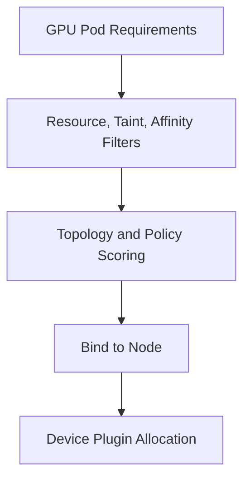

# GPU Scheduling and Topology

The default scheduler can place a Pod on a node with enough GPUs, but it does not automatically understand NVLink groups, PCIe roots, NIC locality, memory bandwidth, or application communication. Production GPU scheduling combines extended resources with labels, affinity, topology policies, and workload classes.

## Learning Objectives

After completing this chapter, you will be able to:

- explain how resource requests and limits shape GPU placement;
- use taints, tolerations, and affinity to control where GPU Pods can land;
- describe why topology matters for multi-GPU and multi-node jobs;
- reason about fragmentation, fairness, and utilization trade-offs;
- identify when a scheduling policy is too coarse or too rigid;
- troubleshoot a Pod that is Pending for policy rather than capacity reasons.

## Scheduling Model

## Placement Controls

| Control | Use |
|---|---|
| GPU request/limit | Reserve integer device resources |
| Taints/tolerations | Protect GPU nodes from unrelated workloads |
| Node affinity | Select model, memory class, validation state |
| Pod affinity/anti-affinity | Co-locate or spread services |
| CPU Manager | Provide exclusive CPU sets where needed |
| Topology Manager | Align CPU, device, and NUMA hints |
| Scheduler extensions | Gang, topology, or queue-aware placement |

Multi-node distributed jobs often require several Pods to start together. Without gang or queue semantics, partial scheduling can hold resources while the job cannot run.

## Production Story

A training team asks for “any node with four GPUs,” but the job slows down after every scale-up because the Pods are landing on nodes with the wrong CPU locality and poor communication paths. The cluster is technically satisfying the request, but the actual placement is hurting throughput.

The incident review shows that the scheduler was not wrong. The policy was incomplete. The platform team needed a topology-aware class, a clearer separation between flexible and topology-sensitive pools, and a validation test that measured real performance rather than only resource count.

## Fragmentation

Strict model and topology constraints improve predictability but fragment capacity. Offer a small number of platform classes and separate topology-sensitive training pools from flexible inference pools. Measure whether each constraint provides value.

The goal is not to squeeze every last GPU into the same pool. It is to make the trade-off explicit so that the platform can choose whether utilization or locality matters more for a given workload class.

## Production Design

Label only validated capabilities. Use quotas and priority classes to control fairness. Define preemption policy carefully; terminating a long training job can waste significant work unless checkpointing is healthy.

For GPU/NIC locality, standard Kubernetes labels may be insufficient. Use topology-aware network attachment or scheduler integration appropriate to the platform.

| Control | Typical use |
|---|---|
| GPU request | Reserve device quantity |
| Node affinity | Select a validated pool or model class |
| Taints and tolerations | Reserve expensive GPU nodes |
| Topology Manager | Align CPU, device, and NUMA hints |
| Priority class | Decide which job wins a scarce slot |
| Quotas | Enforce fair sharing between teams |

When the platform needs stronger placement semantics than the default scheduler offers, introduce them deliberately. Do not smuggle placement policy into application names or ad hoc node selectors.

## Troubleshooting

**Pod Pending:** inspect events, GPU allocatable, affinity, taints, quotas, priority, and whether a distributed job is waiting for peers.

**Pod Runs Slowly:** compare allocated GPU, CPU set, NUMA domain, NIC, peer topology, and contention. Scheduling success is not placement quality.

**Pod lands on the wrong node class:** inspect labels, selectors, and whether the manifest is asking for a class label or only a resource count.

**Distributed job only partially schedules:** inspect gang or queue semantics, quotas, and whether the platform left enough spare capacity for coordinated admission.

## Customer Perspective

A shared GPU cluster needs service classes, not one global scheduling policy. Training, inference, interactive, and batch workloads value different trade-offs.

Customers usually accept slightly lower theoretical utilization if the platform can promise stable performance and predictable fairness. That trade only works if the classes are documented and enforced consistently.

## Interview Preparation

**Question:** Why can topology-aware scheduling lower utilization?

It narrows eligible placements and can strand resources. Use it selectively for workloads whose measured benefit exceeds fragmentation cost.

**Question:** Why is resource count alone insufficient for performance-sensitive workloads?

Because the same GPU count can hide very different CPU, NUMA, network, and peer-communication paths.

## Key Takeaways

- GPU quantity is only the first scheduling dimension.
- CPU, NUMA, NIC, and peer locality can determine performance.
- Distributed jobs need coordinated scheduling.
- Stable workload classes balance predictability and utilization.
- Placement policy should be explicit and measurable.
- Topology sensitivity is a workload property, not a default assumption.

## Cross References

- [Driver Containers and Node Operands](./chapter-07-driver-containers-and-node-operands)
- [Next: Observability](./chapter-09-gpu-observability-with-dcgm)
