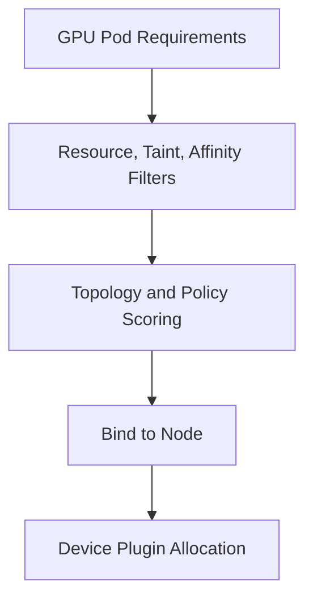

# GPU Scheduling and Topology

The default scheduler can place a Pod on a node with enough GPUs, but it does not automatically understand NVLink groups, PCIe roots, NIC locality, memory bandwidth, or application communication. Production GPU scheduling combines extended resources with labels, affinity, topology policies, and workload classes.

## Learning Objectives

Explain resource requests, taints, affinity, topology manager behavior, gang-style needs, and fragmentation trade-offs.

## Scheduling Model

## Placement Controls

| Control | Use |
|---|---|
| GPU request/limit | Reserve integer device resources |
| Taints/tolerations | Protect GPU nodes from unrelated workloads |
| Node affinity | Select model, memory class, validation state |
| Pod affinity/anti-affinity | Co-locate or spread services |
| CPU Manager | Provide exclusive CPU sets where needed |
| Topology Manager | Align CPU, device, and NUMA hints |
| Scheduler extensions | Gang, topology, or queue-aware placement |

Multi-node distributed jobs often require several Pods to start together. Without gang or queue semantics, partial scheduling can hold resources while the job cannot run.

## Fragmentation

Strict model and topology constraints improve predictability but fragment capacity. Offer a small number of platform classes and separate topology-sensitive training pools from flexible inference pools. Measure whether each constraint provides value.

## Production Design

Label only validated capabilities. Use quotas and priority classes to control fairness. Define preemption policy carefully; terminating a long training job can waste significant work unless checkpointing is healthy.

For GPU/NIC locality, standard Kubernetes labels may be insufficient. Use topology-aware network attachment or scheduler integration appropriate to the platform.

## Troubleshooting

**Pod Pending:** inspect events, GPU allocatable, affinity, taints, quotas, priority, and whether a distributed job is waiting for peers.

**Pod Runs Slowly:** compare allocated GPU, CPU set, NUMA domain, NIC, peer topology, and contention. Scheduling success is not placement quality.

## Customer Perspective

A shared GPU cluster needs service classes, not one global scheduling policy. Training, inference, interactive, and batch workloads value different trade-offs.

## Interview Preparation

**Question:** Why can topology-aware scheduling lower utilization?

It narrows eligible placements and can strand resources. Use it selectively for workloads whose measured benefit exceeds fragmentation cost.

## Key Takeaways

- GPU quantity is only the first scheduling dimension.
- CPU, NUMA, NIC, and peer locality can determine performance.
- Distributed jobs need coordinated scheduling.
- Stable workload classes balance predictability and utilization.

## Cross References

- [Driver Containers and Node Operands](./chapter-07-driver-containers-and-node-operands)
- [Next: Observability](./chapter-09-gpu-observability-with-dcgm)
