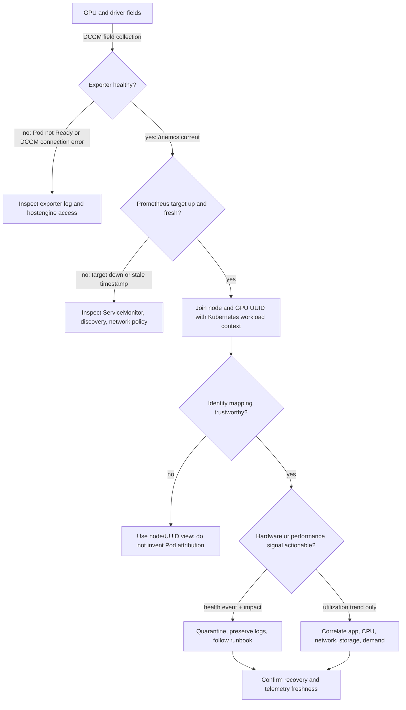

# GPU Observability with DCGM

A Kubernetes Pod can be `Running` while its assigned GPU is reset, thermally constrained, waiting on input, or producing errors that have not yet reached the application. Conversely, a low-utilization GPU is not necessarily waste: an online inference service may be deliberately provisioned for latency. The operating question is therefore not “what is GPU utilization?” It is “which layer is limiting this workload, and is that condition actionable?”

NVIDIA Data Center GPU Manager (DCGM) supplies the device-side evidence Kubernetes lacks. DCGM Exporter makes selected DCGM fields available to Prometheus. Together with Kubernetes object state, kubelet and runtime logs, and application signals, they let an operator distinguish capacity, health, and performance incidents.

## Learning objectives

After this chapter, you should be able to design a telemetry path that preserves device identity, correlate a GPU with its allocated workload, choose alert conditions that lead to an action, and recognize when the monitoring system itself is the failed component.

## Start with an operational question

Consider a training team reporting that step time doubled overnight. A dashboard showing 40 percent GPU utilization is not an explanation. The operator needs a time-aligned view of the job, GPU UUID, node, allocated CPU and NUMA locality, input-pipeline behavior, recent node changes, and hardware events. That evidence can separate a data-loader stall from a power limit, a topology regression, a driver event, or ordinary variation in the workload.

This is why telemetry design begins with decisions. Page only when somebody must interrupt their work: loss of a schedulable GPU, an actionable hardware or driver event, sustained throttling with service impact, or loss of monitoring coverage. Use dashboards and capacity reports for utilization, utilization trends, and potential right-sizing. A page for “GPU utilization is low” usually trains responders to ignore the alert.

## The evidence path



**Figure 10.9.1 — The monitoring path has its own failure modes.** A blank chart can mean a healthy idle device, a failed exporter, a failed scrape, or a bad label join. The decision branches force the operator to prove data freshness before interpreting GPU state.

The GPU UUID is the durable join key for device evidence. Device indexes are convenient for a local command but can change after a reboot, reset, or inventory change. Preserve node and UUID labels; add Pod, namespace, and container context only where the exporter and platform integration can establish that mapping correctly. Do not manufacture a workload association from a sampled process list and treat it as allocation truth.

## Metrics with an owner and a response

| Evidence domain | What it can establish | Typical response |
|---|---|---|
| Availability | A device or node is no longer available to the platform | Quarantine or drain the node, protect capacity, investigate the first failed layer |
| Reliability | Error counters, XID evidence, and memory-health indicators changed | Correlate with driver and workload failures; follow the hardware-support procedure when required |
| Thermal and power | The device is operating under a limit or throttle condition | Check cooling, power policy, clocks, and workload impact before changing limits |
| Utilization and memory | The device is active, idle, or near memory capacity | Diagnose workload behavior and plan capacity; do not page from a single sample |
| Fabric and topology | Interconnect state or counters indicate a possible path issue | Compare with peer topology and collective-job symptoms |
| Telemetry pipeline | Exporter, scrape, or series freshness is failing | Restore observability first; mark health conclusions as uncertain until coverage returns |

Metric names and available fields vary with the DCGM Exporter version and hardware. Build recording rules from the field list actually deployed, and keep the selected metrics under version control with the platform configuration. This avoids an alert rule silently becoming meaningless after an image or configuration change.

### Inspect raw exporter evidence

**Purpose:** verify that the exporter endpoint returns current device series with stable identity.

```bash
kubectl -n gpu-operator port-forward pod/nvidia-dcgm-exporter-7p8wd 9400:9400
curl -s http://127.0.0.1:9400/metrics | grep -E 'DCGM_FI_DEV_GPU_UTIL|DCGM_FI_DEV_FB_USED' | head -6
```

**Representative output:**

```text
DCGM_FI_DEV_GPU_UTIL{gpu="0",UUID="GPU-3c2e38d1-6a2c-4a31-b44b-9d82a8c80735",device="nvidia0",Hostname="gpu-node-03"} 92
DCGM_FI_DEV_FB_USED{gpu="0",UUID="GPU-3c2e38d1-6a2c-4a31-b44b-9d82a8c80735",device="nvidia0",Hostname="gpu-node-03"} 61240
DCGM_FI_DEV_GPU_UTIL{gpu="1",UUID="GPU-722d1344-1b6d-4a95-8cb9-1c572eb5ad94",device="nvidia1",Hostname="gpu-node-03"} 7
DCGM_FI_DEV_FB_USED{gpu="1",UUID="GPU-722d1344-1b6d-4a95-8cb9-1c572eb5ad94",device="nvidia1",Hostname="gpu-node-03"} 1840
```

The first GPU is active and uses 61,240 MiB of frame-buffer memory in this representative sample; the second is mostly idle. `UUID` and `Hostname` provide the join keys. A single `92` utilization sample does not prove efficiency, and `61240` used memory does not by itself prove memory pressure. Trend, total memory, application throughput, and error fields are required.

**Purpose:** verify Prometheus target health and freshness.

```bash
kubectl -n monitoring exec prometheus-0 -- wget -qO- 'http://localhost:9090/api/v1/query?query=up%7Bjob%3D%22dcgm-exporter%22%7D' | jq '.data.result[] | {instance:.metric.instance,value:.value}'
```

```json
{
  "instance": "10.42.3.24:9400",
  "value": [1786028012.441, "1"]
}
```

The final string `"1"` means the scrape target is up. The Unix timestamp must be recent relative to incident time; an old successful sample can leave a dashboard looking populated after the target has failed.

## Build a monitoring contract

A production GPU pool needs a small, explicit contract:

1. **Coverage:** every accepted GPU node is scraped, and the platform alerts when expected targets disappear or their data becomes stale.
2. **Identity:** dashboards can pivot from a workload to its node and GPU UUID, then to node events and driver evidence.
3. **Semantics:** each alert states the triggering condition, likely blast radius, owner, first checks, and safe mitigation.
4. **Retention:** raw data is retained long enough to compare a workload regression with the relevant deployment or maintenance window; aggregate trends serve longer-term capacity work.
5. **Cost control:** labels are bounded. Per-process, per-container, or highly dynamic labels can turn a useful GPU dashboard into an expensive and unreliable Prometheus workload.

The same contract applies to multi-tenant clusters. Tenant-facing views should expose the capacity and service signals they need without leaking other tenants’ Pod names, namespaces, or detailed hardware inventory.

### Worked cardinality example

A fleet has 100 nodes with eight GPUs each and exports 80 metrics per GPU:

```text
100 × 8 × 80 = 64,000 base time series
```

If every series also receives an unbounded `pod_uid` label and each GPU runs 20 short-lived Pods per day, the monitoring system can create roughly:

```text
64,000 × 20 = 1,280,000 daily label combinations
```

This simplified arithmetic is illustrative, but it shows why dynamic workload labels require deliberate relabeling and retention design. Stable node and UUID labels should form the base; workload attribution should be added only where its operational value justifies the cardinality.

## Correlation during an incident

Use a stable order. First establish scope: one Pod, one GPU, one node pool, or the fleet. Then determine whether Kubernetes has allocated the device and whether the application can initialize CUDA. Only then interpret utilization, memory, clocks, power, and reliability signals. An error event close to a workload failure is evidence, not automatically root cause; compare it with a healthy node and the change timeline.

For a workload that is slow but healthy, compare allocated GPU model, peer topology, CPU placement, NIC locality, input rate, and batch behavior before declaring a GPU fault. The scheduler can make a valid allocation that is still a poor fit for a topology-sensitive job. [GPU Scheduling and Topology](./chapter-08-gpu-scheduling-and-topology) develops that placement boundary.

### Worked percentile comparison

Suppose a training job’s step-time samples before and after a node-image change are:

```text
before: p50=420 ms, p95=455 ms
 after: p50=431 ms, p95=902 ms
```

The median changed by only 2.6%:

```text
(431 − 420) / 420 × 100 = 2.62%
```

The p95 nearly doubled:

```text
(902 − 455) / 455 × 100 = 98.24%
```

An average-only dashboard can hide intermittent stalls. Correlate the p95 spikes with GPU clocks, CPU input latency, network retransmission or fabric counters, storage latency, and Kubernetes events in the same time window.

## Failure patterns that mislead operators

| Symptom | First evidence | Interpretation boundary |
|---|---|---|
| No GPU metrics | exporter readiness, log, target health, sample timestamp | telemetry failure versus absent node |
| Metrics lack workload context | UUID/node labels and allocation source | identity limitation, not necessarily collection failure |
| Reliability alert after reset | XID/DCGM event, driver log, Pod failure time | correlation before causation |
| Every GPU appears idle | scrape freshness, query labels, traffic and queue state | monitoring gap, no demand, or upstream bottleneck |
| Memory used is high | total memory, allocation trend, application behavior | capacity clue, not automatic OOM prediction |

### Evidence row 1: exporter process runs but collection is broken

```bash
kubectl -n gpu-operator get pod nvidia-dcgm-exporter-r8p4s
kubectl -n gpu-operator logs nvidia-dcgm-exporter-r8p4s --tail=10
```

```text
NAME                           READY   STATUS    RESTARTS
nvidia-dcgm-exporter-r8p4s     0/1     Running   0

Error connecting to DCGM hostengine at localhost:5555: connection refused
No metrics collected; retrying in 5s
```

`STATUS=Running` reports the container lifecycle; `READY=0/1` and the log prove the collection dependency is unavailable. Do not infer GPU health from the absence of alerts while this condition exists.

### Evidence row 2: Prometheus is scraping the wrong label set

```bash
curl -s 'http://prometheus.monitoring.svc:9090/api/v1/query?query=count%28DCGM_FI_DEV_GPU_UTIL%29' | jq -r '.data.result[0].value[1]'
curl -s 'http://prometheus.monitoring.svc:9090/api/v1/query?query=count%28DCGM_FI_DEV_GPU_UTIL%7BHostname%3D~%22gpu-node-.%2B%22%7D%29' | jq -r '.data.result[0].value[1]'
```

```text
800
0
```

The metric exists for 800 GPUs, but the dashboard query’s `Hostname` matcher returns zero. The exporter version or relabeling may use a different key such as `node`. Fix the query or relabeling; restarting every exporter would not address the mismatch.

### Evidence row 3: low GPU utilization caused by input starvation

```bash
kubectl exec trainer-rank-0 -- nvidia-smi dmon -s pucm -c 3
kubectl top pod trainer-rank-0 --containers
```

```text
# gpu   pwr  gtemp  sm  mem  enc  dec  mclk  pclk
    0    92     48  12    8    0    0  1593  1095
    0    88     48   9    6    0    0  1593  1095
    0    94     49  14    9    0    0  1593  1095

POD              NAME      CPU(cores)   MEMORY(bytes)
trainer-rank-0   trainer   7900m        61Gi
```

The GPU SM and memory activity remain low while the container consumes nearly eight CPU cores. This paired snapshot supports an upstream preprocessing or data-loading hypothesis. It does not prove the exact CPU function; use application profiling and storage metrics next.

## Production design review

The observability stack must cross the same boundaries as the GPU platform: privileged host access for collection, network access for scraping, and permissions to discover Kubernetes context. Review those boundaries along with the operator deployment. Restrict metrics endpoints appropriately, mirror approved images where required, and test the behavior when Prometheus, the exporter, or a node is unavailable.

Acceptance testing should prove more than that an endpoint responds. Schedule a representative GPU Pod, identify its node and UUID, verify recent metrics and workload context, and exercise the alert routing path with a safe test condition. The acceptance gates in [Production Installation and Configuration](./chapter-10-production-installation-and-configuration) should make this a release requirement.

## Senior-level design questions

**Why is a utilization threshold a poor primary paging signal?**

> “Utilization has no inherent failure meaning. Low utilization can be normal demand, reserved latency headroom, CPU or storage starvation, or missing telemetry. High utilization can be healthy throughput. I page on conditions with a clear owner and action, such as lost capacity, a reliability event with workload impact, sustained throttling, or missing monitoring coverage. I use utilization trends for diagnosis and capacity planning.”

**What makes GPU telemetry trustworthy?**

> “I require coverage, freshness, stable node and GPU UUID identity, documented field semantics, bounded labels, and a demonstrated join to Kubernetes and application evidence. I also monitor the exporter and Prometheus target themselves. A dashboard that cannot prove when its last sample arrived is a visualization, not an operational control.”

**How would you investigate a step-time regression?**

> “I would establish the change window and compare p50 and tail latency, not only the average. Then I would join the job to its node and GPU UUIDs, confirm allocation and placement, and correlate DCGM clocks, utilization, memory, power, and reliability fields with CPU, network, storage, and application input metrics. I would compare a known-good placement before declaring hardware fault.”

## Key takeaways

- DCGM supplies device evidence; it does not replace Kubernetes, runtime, or application observability.
- Preserve GPU UUID and node identity, then add workload context only when it is accurate.
- Alerts need an owner and a safe action; trends belong in dashboards and capacity reviews.
- Monitor exporter and scrape health as carefully as GPU health.

## Cross references

- [GPU Scheduling and Topology](./chapter-08-gpu-scheduling-and-topology)
- [Production Installation and Configuration](./chapter-10-production-installation-and-configuration)
- [Upgrades and Production Troubleshooting](./chapter-11-upgrades-and-production-troubleshooting)
