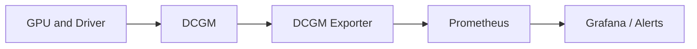

# GPU Observability with DCGM

Kubernetes knows whether a Pod is Running, but not whether its GPU is throttling, accumulating ECC errors, consuming power, or remaining idle. NVIDIA Data Center GPU Manager (DCGM) and DCGM Exporter expose hardware and workload telemetry for production monitoring.

## Learning Objectives

Classify GPU metrics, connect device telemetry to Pods, design alerts, and troubleshoot monitoring blind spots.

## Monitoring Flow

## Metric Domains

| Domain | Examples |
|---|---|
| Utilization | GPU, memory, encoder/decoder activity |
| Memory | used capacity, bandwidth-related counters |
| Reliability | ECC, retired pages, XID events |
| Thermals | temperature, throttling reasons |
| Power | draw, limits, clocks |
| Fabric | NVLink state and counters where exposed |
| Workload | Pod, namespace, container, and device association |

Healthy values depend on workload. Low utilization may indicate underuse or a service waiting for requests. High temperature may be normal within platform limits. Alert on actionable conditions and change rates.

## Kubernetes Context

Metrics should carry node, GPU UUID, Pod, namespace, and container labels where available. Preserve UUID-based identity because device indexes can change. Correlate DCGM with kubelet, runtime, operator, application, network, and storage telemetry.

## Production Design

Define recording rules and retention. Page on critical XID classes, sustained thermal/power throttling, loss of telemetry, and capacity loss. Use tickets or dashboards for utilization and efficiency trends rather than paging.

Monitor the monitoring stack: exporter scrape failures, stale series, duplicate identities, and cardinality growth can create false confidence.

## Troubleshooting

**No metrics:** inspect exporter Pod, device mounts, DCGM host engine mode, service discovery, Prometheus targets, and network policy.

**Metrics without Pod labels:** inspect kubelet integration, exporter configuration, and whether the workload allocation can be mapped.

**Alert after driver reset:** correlate XID, node events, operator operands, and workload failures before replacing hardware.

## Customer Perspective

Observability should answer three questions: Is hardware healthy? Is capacity being used? Which workload or tenant is affected? Dashboards that answer only one are incomplete.

## Interview Preparation

**Question:** Why is GPU utilization alone insufficient?

It does not reveal memory pressure, power/thermal throttling, errors, data-pipeline waits, or whether the work meets service objectives.

## Key Takeaways

- DCGM adds hardware-level visibility missing from Kubernetes.
- Device metrics need workload and infrastructure context.
- Alert on actionable health conditions, not arbitrary utilization.
- Telemetry pipeline health must be monitored.

## Cross References

- [GPU Scheduling and Topology](./chapter-08-gpu-scheduling-and-topology)
- [Next: Installation and Configuration](./chapter-10-production-installation-and-configuration)
