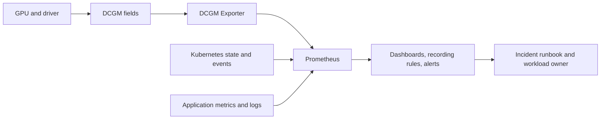

# GPU Observability with DCGM

A Kubernetes Pod can be `Running` while its assigned GPU is reset, thermally constrained, waiting on input, or producing errors that have not yet reached the application. Conversely, a low-utilization GPU is not necessarily waste: an online inference service may be deliberately provisioned for latency. The operating question is therefore not “what is GPU utilization?” It is “which layer is limiting this workload, and is that condition actionable?”

NVIDIA Data Center GPU Manager (DCGM) supplies the device-side evidence Kubernetes lacks. DCGM Exporter makes selected DCGM fields available to Prometheus. Together with Kubernetes object state, kubelet and runtime logs, and application signals, they let an operator distinguish capacity, health, and performance incidents.

## Learning objectives

After this chapter, you should be able to design a telemetry path that preserves device identity, correlate a GPU with its allocated workload, choose alert conditions that lead to an action, and recognize when the monitoring system itself is the failed component.

## Start with an operational question

Consider a training team reporting that step time doubled overnight. A dashboard showing 40 percent GPU utilization is not an explanation. The operator needs a time-aligned view of the job, GPU UUID, node, allocated CPU and NUMA locality, input-pipeline behavior, recent node changes, and hardware events. That evidence can separate a data-loader stall from a power limit, a topology regression, a driver event, or ordinary variation in the workload.

This is why telemetry design begins with decisions. Page only when somebody must interrupt their work: loss of a schedulable GPU, an actionable hardware or driver event, sustained throttling with service impact, or loss of monitoring coverage. Use dashboards and capacity reports for utilization, utilization trends, and potential right-sizing. A page for “GPU utilization is low” usually trains responders to ignore the alert.

## The evidence path

**Figure 10.9.1 — GPU metrics become useful only when they can be joined with workload and platform evidence.** The exporter is one observation point, not a complete diagnosis system.

The GPU UUID is the durable join key for device evidence. Device indexes are convenient for a local command but can change after a reboot, reset, or inventory change. Preserve node and UUID labels; add Pod, namespace, and container context only where the exporter and platform integration can establish that mapping correctly. Do not manufacture a workload association from a sampled process list and treat it as allocation truth.

## Metrics with an owner and a response

| Evidence domain | What it can establish | Typical response |
|---|---|---|
| Availability | A device or node is no longer available to the platform | Quarantine or drain the node, protect capacity, investigate the first failed layer |
| Reliability | Error counters, XID evidence, and memory-health indicators changed | Correlate with driver and workload failures; follow the hardware-support procedure when required |
| Thermal and power | The device is operating under a limit or throttle condition | Check cooling, power policy, clocks, and workload impact before changing limits |
| Utilization and memory | The device is active, idle, or near memory capacity | Diagnose workload behavior and plan capacity; do not page from a single sample |
| Fabric and topology | Interconnect state or counters indicate a possible path issue | Compare with peer topology and collective-job symptoms |
| Telemetry pipeline | Exporter, scrape, or series freshness is failing | Restore observability first; mark health conclusions as uncertain until coverage returns |

Metric names and available fields vary with the DCGM Exporter version and hardware. Build recording rules from the field list actually deployed, and keep the selected metrics under version control with the platform configuration. This avoids an alert rule silently becoming meaningless after an image or configuration change.

## Build a monitoring contract

A production GPU pool needs a small, explicit contract:

1. **Coverage:** every accepted GPU node is scraped, and the platform alerts when expected targets disappear or their data becomes stale.
2. **Identity:** dashboards can pivot from a workload to its node and GPU UUID, then to node events and driver evidence.
3. **Semantics:** each alert states the triggering condition, likely blast radius, owner, first checks, and safe mitigation.
4. **Retention:** raw data is retained long enough to compare a workload regression with the relevant deployment or maintenance window; aggregate trends serve longer-term capacity work.
5. **Cost control:** labels are bounded. Per-process, per-container, or highly dynamic labels can turn a useful GPU dashboard into an expensive and unreliable Prometheus workload.

The same contract applies to multi-tenant clusters. Tenant-facing views should expose the capacity and service signals they need without leaking other tenants’ Pod names, namespaces, or detailed hardware inventory.

## Correlation during an incident

Use a stable order. First establish scope: one Pod, one GPU, one node pool, or the fleet. Then determine whether Kubernetes has allocated the device and whether the application can initialize CUDA. Only then interpret utilization, memory, clocks, power, and reliability signals. An error event close to a workload failure is evidence, not automatically root cause; compare it with a healthy node and the change timeline.

For a workload that is slow but healthy, compare allocated GPU model, peer topology, CPU placement, NIC locality, input rate, and batch behavior before declaring a GPU fault. The scheduler can make a valid allocation that is still a poor fit for a topology-sensitive job. [GPU Scheduling and Topology](./chapter-08-gpu-scheduling-and-topology) develops that placement boundary.

## Failure patterns that mislead operators

**No GPU metrics.** Start at the exporter Pod and work outward: scheduling, container logs, host-device access, DCGM connectivity, ServiceMonitor or scrape configuration, target health, and network policy. A green Grafana panel with no recent samples is not proof of a healthy GPU.

**Metrics have no workload context.** Confirm what association mechanism is enabled and what it promises. Cross-check a known allocated Pod against the device-plugin allocation and the exporter labels. If the mapping is unavailable, make the dashboard explicitly node- and UUID-oriented rather than implying Pod-level precision it does not have.

**A reliability alert follows a reset.** Protect workloads first: stop new placement or cordon the affected node according to the runbook. Capture node events, driver logs, relevant DCGM evidence, and the workload timeline before a reboot or replacement removes useful state. Then decide whether recovery, a node drain, or hardware escalation is warranted.

**A utilization alert says every GPU is idle.** Treat this as a possible telemetry failure until scrape freshness, label selection, and time range are confirmed. If the data is real, ask whether the service has traffic, whether jobs are pending for another constraint, and whether capacity policy intentionally keeps headroom.

## Production design review

The observability stack must cross the same boundaries as the GPU platform: privileged host access for collection, network access for scraping, and permissions to discover Kubernetes context. Review those boundaries along with the operator deployment. Restrict metrics endpoints appropriately, mirror approved images where required, and test the behavior when Prometheus, the exporter, or a node is unavailable.

Acceptance testing should prove more than that an endpoint responds. Schedule a representative GPU Pod, identify its node and UUID, verify recent metrics and workload context, and exercise the alert routing path with a safe test condition. The acceptance gates in [Production Installation and Configuration](./chapter-10-production-installation-and-configuration) should make this a release requirement.

## Senior-level design questions

**Why is a utilization threshold a poor primary paging signal?** It has no inherent failure semantics. A low value may be normal demand, a host-side bottleneck, or missing telemetry; a high value can be healthy throughput. Page on a condition with a defined responder action and use utilization for diagnosis and planning.

**What makes GPU telemetry trustworthy?** Coverage, stable identity, known field semantics, bounded labels, freshness monitoring, and a demonstrated link to Kubernetes and application evidence. A dashboard without those properties is a visualization, not an operational control.

## Key takeaways

- DCGM supplies device evidence; it does not replace Kubernetes, runtime, or application observability.
- Preserve GPU UUID and node identity, then add workload context only when it is accurate.
- Alerts need an owner and a safe action; trends belong in dashboards and capacity reviews.
- Monitor exporter and scrape health as carefully as GPU health.

## Cross references

- [GPU Scheduling and Topology](./chapter-08-gpu-scheduling-and-topology)
- [Production Installation and Configuration](./chapter-10-production-installation-and-configuration)
- [Upgrades and Production Troubleshooting](./chapter-11-upgrades-and-production-troubleshooting)
