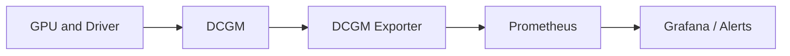

# GPU Observability with DCGM

Kubernetes knows whether a Pod is Running, but not whether its GPU is throttling, accumulating ECC errors, consuming power, or remaining idle. NVIDIA Data Center GPU Manager (DCGM) and DCGM Exporter expose hardware and workload telemetry for production monitoring.

## Learning Objectives

After completing this chapter, you will be able to:

- classify GPU metrics into utilization, health, and reliability domains;
- connect device telemetry to Pods, nodes, and tenants;
- design alerts that page on actionable conditions rather than vanity utilization;
- troubleshoot missing or stale telemetry;
- explain why observability must cover both hardware and the monitoring pipeline;
- use telemetry to support rollout and incident decisions.

## Monitoring Flow

## Metric Domains

| Domain | Examples |
|---|---|
| Utilization | GPU, memory, encoder/decoder activity |
| Memory | used capacity, bandwidth-related counters |
| Reliability | ECC, retired pages, XID events |
| Thermals | temperature, throttling reasons |
| Power | draw, limits, clocks |
| Fabric | NVLink state and counters where exposed |
| Workload | Pod, namespace, container, and device association |

Healthy values depend on workload. Low utilization may indicate underuse or a service waiting for requests. High temperature may be normal within platform limits. Alert on actionable conditions and change rates.

## Production Story

A GPU fleet looks healthy from the Kubernetes API, but one node has an XID spike and silent thermal throttling. Application owners only notice slower response times. The missing piece is not a new scheduler policy; it is telemetry that reaches the people who can act on it.

The incident shows why the platform must monitor more than capacity. The team needs hardware health, workload association, alert routing, and a way to tell whether the monitoring pipeline itself is broken.

## Kubernetes Context

Metrics should carry node, GPU UUID, Pod, namespace, and container labels where available. Preserve UUID-based identity because device indexes can change. Correlate DCGM with kubelet, runtime, operator, application, network, and storage telemetry.

If you cannot map a metric back to a node and workload, the metric is often too detached from operations to be useful. Context makes telemetry actionable.

## Production Design

Define recording rules and retention. Page on critical XID classes, sustained thermal/power throttling, loss of telemetry, and capacity loss. Use tickets or dashboards for utilization and efficiency trends rather than paging.

Monitor the monitoring stack: exporter scrape failures, stale series, duplicate identities, and cardinality growth can create false confidence.

| Alert type | Typical action |
|---|---|
| Critical hardware error | Page on-call and isolate the node |
| Sustained thermal throttling | Investigate cooling, placement, or workload behavior |
| Lost telemetry | Restore the exporter or scrape path |
| Capacity loss | Compare node health, labels, and operator status |
| Utilization trend | Review in dashboard or report |

## Troubleshooting

**No metrics:** inspect exporter Pod, device mounts, DCGM host engine mode, service discovery, Prometheus targets, and network policy.

**Metrics without Pod labels:** inspect kubelet integration, exporter configuration, and whether the workload allocation can be mapped.

**Alert after driver reset:** correlate XID, node events, operator operands, and workload failures before replacing hardware.

**Metrics arrive but lack workload labels:** inspect kubelet metadata enrichment, exporter configuration, and whether the Pod-to-device mapping is still intact after restart or reschedule.

**Only some nodes export metrics:** compare operand placement, security policy, and host access. A single node with a broken exporter can look like a fleet problem if the dashboard is not normalized correctly.

## Customer Perspective

Observability should answer three questions: Is hardware healthy? Is capacity being used? Which workload or tenant is affected? Dashboards that answer only one are incomplete.

Customers need telemetry that supports the incident workflow, not just a pretty chart. That means pairing GPU metrics with ownership metadata, node identity, and enough history to understand change over time.

## Interview Preparation

**Question:** Why is GPU utilization alone insufficient?

It does not reveal memory pressure, power/thermal throttling, errors, data-pipeline waits, or whether the work meets service objectives.

**Question:** Why should the monitoring pipeline itself be monitored?

Because missing scrapes, stale series, and identity duplication can hide a real hardware issue or invent a false one.

## Key Takeaways

- DCGM adds hardware-level visibility missing from Kubernetes.
- Device metrics need workload and infrastructure context.
- Alert on actionable health conditions, not arbitrary utilization.
- Telemetry pipeline health must be monitored.
- Observability is a control loop, not just a dashboard.
- Context turns GPU metrics into operational evidence.

## Cross References

- [GPU Scheduling and Topology](./chapter-08-gpu-scheduling-and-topology)
- [Next: Installation and Configuration](./chapter-10-production-installation-and-configuration)
