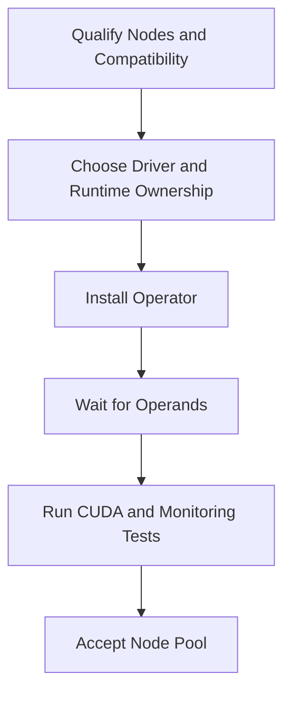

# Production Installation and Configuration

A successful Helm install proves only that Kubernetes accepted the manifests. Production installation begins earlier with node qualification, ownership, version selection, security review, and rollback planning—and ends only after a real CUDA workload, monitoring, and operational runbooks are validated.

## Learning Objectives

Design prerequisites, select host-managed or operator-managed components, structure Helm values, validate readiness, and define acceptance gates.

## Deployment Flow

## Preinstallation Decisions

| Decision | Options |
|---|---|
| Driver ownership | Host image, package automation, or operator driver container |
| Runtime ownership | Preconfigured toolkit or operator-managed toolkit |
| Node scope | Labels, selectors, taints, and dedicated pools |
| Monitoring | DCGM exporter enabled and scraped |
| Sharing | Full GPU, MIG, or time-slicing policy |
| Security | Registry, signatures, RBAC, privileged admission |
| Upgrade | Canary and maintenance process |

Use one source-controlled values file per environment. Pin versions according to the qualified matrix. Avoid copying values from unrelated clusters without reviewing kernel, runtime, and node differences.

## Installation

Create the namespace, apply required labels/taints, add the approved chart repository or internal mirror, inspect rendered manifests, and install with Helm. Commands should reference the organization’s pinned versions rather than an unverified “latest.”

After installation, inspect the ClusterPolicy status, operator logs, DaemonSets, Pods, events, and node labels. Identify the first operand not Ready rather than waiting indefinitely.

## Acceptance Gates

1. Driver loaded and `nvidia-smi` healthy.
2. Runtime configured and minimal CUDA container passes.
3. Device plugin advertises expected allocatable resources.
4. Feature labels match hardware and policy.
5. DCGM metrics reach Prometheus with correct identity.
6. Representative workload and topology test pass.
7. Drain, reboot, and recovery procedure is documented.

## Production Risks

Privileged operands, internet image pulls, automatic driver updates, and broad node selectors can create supply-chain or outage risk. Mirror images where required, verify provenance, restrict RBAC, and stage changes.

## Troubleshooting

If operator Pods run but no operands appear, inspect policy and controller logs. If driver operands fail, inspect kernel/header/signing evidence. If runtime operands succeed but validation fails, inspect container runtime configuration and image compatibility.

## Customer Perspective

Installation is a lifecycle commitment. The customer needs ownership for values, compatibility, maintenance, alerts, and support escalation—not only a deployment command.

## Interview Preparation

**Question:** What is your definition of done for GPU Operator installation?

A strong answer includes reconciliation, driver/runtime/plugin/discovery/monitoring health, CUDA workload validation, topology checks, metrics, failure recovery, and documented lifecycle.

## Key Takeaways

- Helm success is not platform acceptance.
- Decide component ownership before deployment.
- Use pinned, source-controlled configuration.
- Validate every layer with a real workload and telemetry.

## Cross References

- [GPU Observability](./chapter-09-gpu-observability-with-dcgm)
- [Next: Upgrades and Troubleshooting](./chapter-11-upgrades-and-production-troubleshooting)
