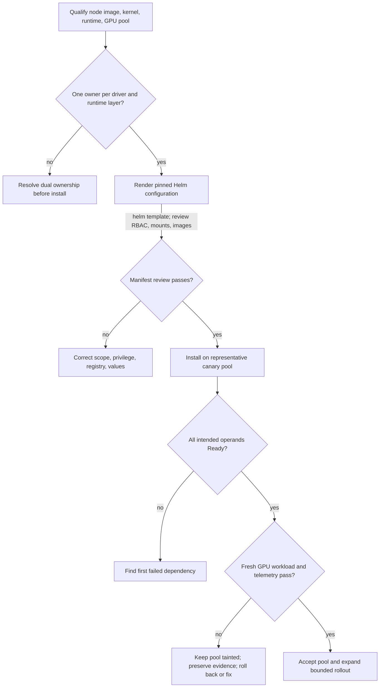

# Production Installation and Configuration

A Helm release in the `deployed` state is not a GPU platform. It says the API server accepted the release resources; it says nothing about a driver loading on the intended kernel, the runtime injecting devices, the kubelet advertising a resource, or a workload completing CUDA initialization. Production installation is a controlled lifecycle decision with a measurable acceptance boundary.

The NVIDIA GPU Operator can reconcile a set of GPU software operands, but it does not remove the need to decide who owns node images, drivers, runtimes, registry access, security policy, validation, and rollback. Make those choices before a change window, then encode them in reviewed configuration rather than a shell history.

## Learning objectives

By the end of this chapter, you should be able to qualify a node pool, select component ownership, organize an environment-specific configuration, validate the full workload path, and reject an installation that is syntactically successful but operationally incomplete.

## Define the platform boundary first



**Figure 10.10.1 — Installation is a fault-isolation workflow, not a Helm command.** Every promotion edge carries evidence. The failure branches preserve a small blast radius and an identifiable owner.

Before selecting values, document the supported Kubernetes distribution and version, kernel and operating-system image, container runtime, GPU inventory, driver branch, and required firmware posture. Treat this as a compatibility set. “Works on another cluster” is not a compatibility claim when the kernel, runtime, security controls, or node image differs.

## Ownership decisions that determine the design

| Decision | Questions to settle before deployment |
|---|---|
| Driver ownership | Is the driver part of a curated node image, installed by host automation, or managed by the operator? Who rebuilds it after a kernel change? |
| Runtime ownership | Does the base image configure the NVIDIA Container Toolkit, or will an operator-managed operand do so? Which runtime handlers and CDI behavior are approved? |
| Node scope | Which dedicated pools are eligible? How do labels, taints, selectors, and admission policy prevent accidental installation on control-plane or incompatible nodes? |
| Image supply chain | Which registry is authoritative? Are images mirrored, scanned, signed, and reachable during an incident? |
| Sharing policy | Are nodes full-GPU, MIG, or time-sliced, and which workload class is allowed on each? |
| Operations | Who owns values, compatibility review, alert response, maintenance windows, and vendor escalation? |

There is no universal correct driver-ownership model. A curated host image can simplify compliance and boot-time predictability; operator-managed driver containers can centralize lifecycle handling. Both require a tested compatibility and rollback process. Mixing models within one pool without an explicit design makes incidents needlessly ambiguous.

## Treat Helm values as an interface

Keep one source-controlled values file per environment, with a reviewable overlay mechanism where needed. Pin chart and image versions according to the qualified release documentation and internal policy. Record why non-default settings exist, particularly node selectors, driver and toolkit enablement, MIG or sharing configuration, DCGM Exporter settings, registry locations, tolerations, and security exceptions.

Render the release before applying it. Review service accounts, cluster-scoped permissions, privileged workloads, host mounts, DaemonSet selectors, image references, and namespace-scoped network assumptions. GPU platform operands often require privileged host interaction; that makes an installation review both a reliability and supply-chain review.

### Render and inspect before applying

**Purpose:** render the exact release inputs and count high-risk resources before the API server sees them.

```bash
helm template gpu-operator nvidia/gpu-operator \
  --namespace gpu-operator \
  --values values-production.yaml \
  > /tmp/gpu-operator-rendered.yaml

yq 'select(.kind == "DaemonSet") | .metadata.name' /tmp/gpu-operator-rendered.yaml
yq '[select(.kind == "ClusterRole")] | length' /tmp/gpu-operator-rendered.yaml
```

**Representative output:**

```text
nvidia-driver-daemonset
nvidia-container-toolkit-daemonset
nvidia-device-plugin-daemonset
gpu-feature-discovery
nvidia-dcgm-exporter
6
```

The DaemonSet list shows the node-local components this configuration intends to deploy. The value `6` is an illustrative count for this rendered example, not a product invariant. A change in the count between releases is a review signal: inspect new cluster-scoped permissions rather than assuming they are harmless.

**Purpose:** inspect node scope and privilege in the rendered driver workload.

```bash
yq 'select(.kind == "DaemonSet" and .metadata.name == "nvidia-driver-daemonset") | {nodeSelector:.spec.template.spec.nodeSelector,tolerations:.spec.template.spec.tolerations,containers:[.spec.template.spec.containers[]|{name,privileged:.securityContext.privileged,image}]}' /tmp/gpu-operator-rendered.yaml
```

```yaml
nodeSelector:
  gpu.platform.example/driver-owner: operator
tolerations:
  - key: nvidia.com/gpu
    operator: Exists
    effect: NoSchedule
containers:
  - name: nvidia-driver-ctr
    privileged: true
    image: registry.internal.example/gpu/driver@sha256:8d4b...a2f1
```

The selector limits driver ownership to the intended nodes. The digest pins the artifact content. `privileged: true` is a deliberate host-integration requirement and a security review boundary. If `nodeSelector` is empty in a mixed cluster, stop before installation and confirm the operator cannot target control-plane or host-managed-driver nodes.

Do not copy a values file simply because it installed elsewhere. Configuration can be valid YAML and still target the wrong node group, overwrite a runtime assumption, or enable an operand that conflicts with the existing node image.

## Install in an intentionally small blast radius

Begin with a dedicated canary pool that represents the intended production hardware and policy. Apply labels and taints before installation so ordinary workloads cannot race into a partially configured pool. Verify registry credentials and internal mirrors before the maintenance window; an image-pull delay is not a driver diagnosis.

Install the pinned release, then follow reconciliation rather than only release status. Inspect the ClusterPolicy (or equivalent operator status), controller logs, events, DaemonSet rollout state, and the Pods for each enabled operand. When the result is incomplete, identify the first operand that cannot become Ready and investigate its dependency. Repeatedly deleting the whole deployment converts a diagnosable state into a larger outage.

### Follow the rollout with concrete evidence

```bash
helm status gpu-operator -n gpu-operator
```

**Representative output:**

```text
NAME: gpu-operator
NAMESPACE: gpu-operator
STATUS: deployed
REVISION: 1
TEST SUITE: None
```

`STATUS: deployed` proves Helm stored the release and Kubernetes accepted its resources. It does not prove operands are Ready.

```bash
kubectl -n gpu-operator get ds \
  -o custom-columns='NAME:.metadata.name,DESIRED:.status.desiredNumberScheduled,READY:.status.numberReady,AVAILABLE:.status.numberAvailable'
```

```text
NAME                                      DESIRED   READY   AVAILABLE
nvidia-driver-daemonset                   2         2       2
nvidia-container-toolkit-daemonset        2         2       2
nvidia-device-plugin-daemonset            2         2       2
gpu-feature-discovery                     2         2       2
nvidia-dcgm-exporter                      2         2       2
```

The canary scope is two nodes in this example. Matching desired, ready, and available counts proves Kubernetes rollout state for each DaemonSet. A CUDA acceptance Pod remains necessary.

## Acceptance is an end-to-end proof

Use a small, approved CUDA validation image and a representative workload test. The exact image and commands should be maintained in the platform’s controlled validation procedure, not selected ad hoc during an incident. Acceptance should establish all of the following:

1. The node detects its expected GPUs and the driver is healthy.
2. The selected runtime path can create a GPU container and initialize CUDA.
3. The device plugin advertises the expected allocatable resource after kubelet registration.
4. Hardware and policy labels describe the intended capability; taints and selectors constrain placement as designed.
5. A scheduled workload receives the expected device and passes a functional test.
6. DCGM telemetry is scraped with stable device identity and reaches the intended dashboards.
7. A controlled drain, reboot, and return-to-service path restores the node without undocumented manual repair.

The topology-sensitive portion of this test belongs to the workload class. A single-device CUDA smoke test proves a different thing from a distributed training validation. Use [GPU Scheduling and Topology](./chapter-08-gpu-scheduling-and-topology) to decide what the representative test must cover.

### One acceptance bundle

```bash
kubectl get node gpu-canary-01 -o json | jq '{ready:[.status.conditions[]|select(.type=="Ready")|.status],gpu:.status.allocatable["nvidia.com/gpu"],class:.metadata.labels["gpu.platform.example/class"],validated:.metadata.labels["gpu.platform.example/validated"]}'
kubectl logs cuda-acceptance-gpu-canary-01
```

**Representative output:**

```text
{
  "ready": ["True"],
  "gpu": "8",
  "class": "training-topology",
  "validated": "true"
}
CUDA devices detected: 8
selected UUID: GPU-3c2e38d1-6a2c-4a31-b44b-9d82a8c80735
vector-add elements: 1048576
verification: PASS
```

The Node object proves cluster state and platform assertions. The workload proves a fresh container obtained a device and executed a kernel. `validated=true` should be written only by the controlled acceptance process; if it predates the current change generation, it is stale evidence.

## Operational guardrails

Restrict operator scope to approved GPU nodes. Prefer immutable node-image and release inputs, use internal registries where policy requires them, and make the intended image provenance visible to reviewers. Ensure Pod Security, RBAC, and any admission policy allow the required operands deliberately—not through broad, unexplained exemptions.

Define a negative acceptance path too. A node that fails driver validation, loses the device plugin, or stops exporting telemetry must not silently re-enter the general workload pool. Cordon, quarantine, or keep the node out of the eligible selector until the runbook establishes recovery.

### Worked canary capacity calculation

A production pool has 20 eight-GPU nodes. Two nodes form the canary pool:

```text
physical inventory = 20 × 8 = 160 GPUs
canary capacity     =  2 × 8 = 16 GPUs
production capacity during canary = 144 GPUs
144 / 160 = 90% raw capacity remains
```

If the workload queue requires ten full-node eight-GPU jobs, 18 remaining nodes still provide 18 full-node slots. If several nodes are already fragmented by one- and two-GPU Pods, the usable full-node count may be lower. Admission planning must use node-level free blocks, not only the 90% figure.

## Troubleshooting installation without guesswork

| Symptom | First evidence | Decision boundary |
|---|---|---|
| Release deployed, no GPU resource | node scope, driver, plugin, kubelet registration | configuration versus host dependency |
| Driver operand fails | kernel, signing, headers, driver log | node profile compatibility |
| Pod bound, sandbox fails | RuntimeClass, CDI, Toolkit, CRI event | runtime integration |
| Workload passes, metrics missing | exporter, target discovery, freshness | telemetry acceptance |
| Only canary node fails | compare exact node profile and event timeline | localized drift versus release-wide issue |

### Evidence row 1: deployed release targets zero nodes

```bash
kubectl -n gpu-operator get ds nvidia-driver-daemonset \
  -o custom-columns='DESIRED:.status.desiredNumberScheduled,CURRENT:.status.currentNumberScheduled,READY:.status.numberReady,NODESELECTOR:.spec.template.spec.nodeSelector'
```

```text
DESIRED   CURRENT   READY   NODESELECTOR
0         0         0       map[gpu.platform.example/driver-owner:operator]
```

The DaemonSet is valid but no node matches the selector. Compare canary labels before inspecting kernel logs.

```bash
kubectl get nodes -l gpu.platform.example/canary=true \
  -o custom-columns='NAME:.metadata.name,OWNER:.metadata.labels.gpu\.platform\.example/driver-owner'
```

```text
NAME             OWNER
gpu-canary-01    host
gpu-canary-02    host
```

The canaries declare host-owned drivers, so an operator-managed driver DaemonSet correctly schedules nowhere. Resolve the ownership design or values; do not add tolerations blindly.

### Evidence row 2: driver image cannot be pulled

```bash
kubectl -n gpu-operator describe pod nvidia-driver-daemonset-6m29k | sed -n '/Events:/,$p'
```

```text
Events:
  Warning  Failed  34s  kubelet  Failed to pull image "registry.internal.example/gpu/driver@sha256:8d4b...a2f1":
  failed to authorize: failed to fetch anonymous token: 401 Unauthorized
```

This is a supply-chain access failure before driver initialization. Verify the pull secret, mirror, and node egress path. Kernel remediation is premature.

### Evidence row 3: compute path works, telemetry acceptance fails

```bash
kubectl logs cuda-acceptance-gpu-canary-01
kubectl -n monitoring get servicemonitor dcgm-exporter -o jsonpath='{.spec.selector.matchLabels}{"\n"}'
kubectl -n monitoring get endpoints -l app=nvidia-dcgm-exporter
```

```text
verification: PASS
map[app:dcgm-exporter]
No resources found in monitoring namespace.
```

The workload passes, but the ServiceMonitor selects `app=dcgm-exporter` while no matching endpoint exists in the namespace. Keep the node unaccepted until metrics discovery is repaired; compute success does not satisfy the observability contract.

## Senior-level design questions

**What is “done” for a GPU Operator deployment?**

> “I call the deployment complete only when the qualified canary nodes have the intended ownership model, the rendered configuration has passed security and scope review, every enabled operand is Ready, a fresh CUDA workload succeeds, the expected resource and service-class labels are present, telemetry is fresh, and the drain/reboot/recovery path has been tested. Helm `deployed` is installation evidence, not service acceptance.”

**Why isolate a canary pool?**

> “A representative canary limits blast radius and preserves a known-good comparison group. I calculate both the raw capacity removed and the workload slots lost, because one eight-GPU node is more than 5% of a 20-node pool’s full-node scheduling capacity. I promote only after the canary passes host, runtime, resource, workload, and telemetry gates.”

**Why render manifests before installation?**

> “Rendering exposes the exact RBAC, privileged Pods, host mounts, images, selectors, and tolerations generated by the values file. Valid YAML can still target the wrong nodes or create an unexpected cluster-wide permission. I want that evidence in code review before the controller begins reconciling it.”

## Key takeaways

- Decide node, driver, runtime, and image-supply-chain ownership before installation.
- Treat values files and rendered manifests as reviewed platform interfaces.
- Accept a GPU pool only after the complete workload and telemetry path succeeds.
- Preserve a small, representative canary pool for both initial deployment and change.

## Cross references

- [GPU Observability with DCGM](./chapter-09-gpu-observability-with-dcgm)
- [GPU Scheduling and Topology](./chapter-08-gpu-scheduling-and-topology)
- [Upgrades and Production Troubleshooting](./chapter-11-upgrades-and-production-troubleshooting)
