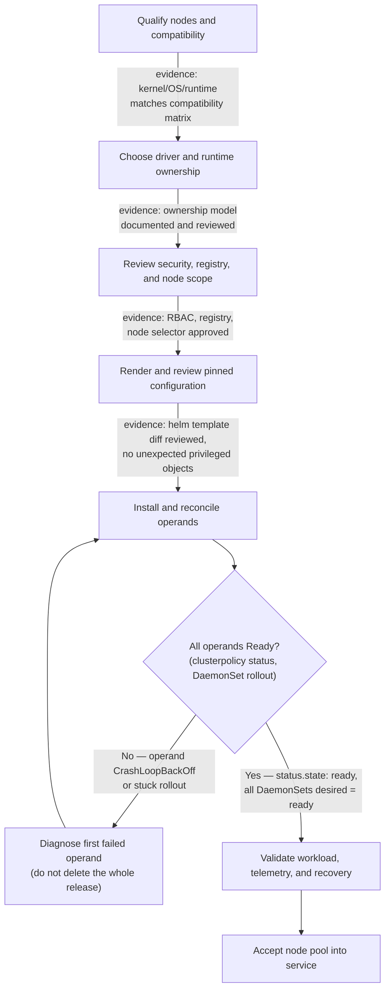

# Production Installation and Configuration

A Helm release in the `deployed` state is not a GPU platform. It says the API server accepted the release resources; it says nothing about a driver loading on the intended kernel, the runtime injecting devices, the kubelet advertising a resource, or a workload completing CUDA initialization. Production installation is a controlled lifecycle decision with a measurable acceptance boundary.

The NVIDIA GPU Operator can reconcile a set of GPU software operands, but it does not remove the need to decide who owns node images, drivers, runtimes, registry access, security policy, validation, and rollback. Make those choices before a change window, then encode them in reviewed configuration rather than a shell history.

## Learning objectives

By the end of this chapter, you should be able to qualify a node pool, select component ownership, organize an environment-specific configuration, validate the full workload path, and reject an installation that is syntactically successful but operationally incomplete.

## Define the platform boundary first



**Figure 10.10.1 — Installation is a sequence of evidence gates, not a single Helm command.** Each edge names the artifact that actually proves the prior gate passed — not just that a command returned success. The `Ready?` decision point is where most "the install looked fine" incidents actually live: `helm install` can report `STATUS: deployed` while `Reconcile` is still failing, because Helm's success only means the API server accepted the manifests, not that any DaemonSet Pod is Running. A failure at any gate should identify the owner and preserve a safe recovery path — the diagnose loop returns to `Reconcile` rather than to a fresh install, so evidence from the failed attempt is not discarded.

Before selecting values, document the supported Kubernetes distribution and version, kernel and operating-system image, container runtime, GPU inventory, driver branch, and required firmware posture. Treat this as a compatibility set. “Works on another cluster” is not a compatibility claim when the kernel, runtime, security controls, or node image differs.

## Ownership decisions that determine the design

| Decision | Questions to settle before deployment |
|---|---|
| Driver ownership | Is the driver part of a curated node image, installed by host automation, or managed by the operator? Who rebuilds it after a kernel change? |
| Runtime ownership | Does the base image configure the NVIDIA Container Toolkit, or will an operator-managed operand do so? Which runtime handlers and CDI behavior are approved? |
| Node scope | Which dedicated pools are eligible? How do labels, taints, selectors, and admission policy prevent accidental installation on control-plane or incompatible nodes? |
| Image supply chain | Which registry is authoritative? Are images mirrored, scanned, signed, and reachable during an incident? |
| Sharing policy | Are nodes full-GPU, MIG, or time-sliced, and which workload class is allowed on each? |
| Operations | Who owns values, compatibility review, alert response, maintenance windows, and vendor escalation? |

There is no universal correct driver-ownership model. A curated host image can simplify compliance and boot-time predictability; operator-managed driver containers can centralize lifecycle handling. Both require a tested compatibility and rollback process. Mixing models within one pool without an explicit design makes incidents needlessly ambiguous.

## Treat Helm values as an interface

Keep one source-controlled values file per environment, with a reviewable overlay mechanism where needed. Pin chart and image versions according to the qualified release documentation and internal policy. Record why non-default settings exist, particularly node selectors, driver and toolkit enablement, MIG or sharing configuration, DCGM Exporter settings, registry locations, tolerations, and security exceptions.

Render the release before applying it. Review service accounts, cluster-scoped permissions, privileged workloads, host mounts, DaemonSet selectors, image references, and namespace-scoped network assumptions. GPU platform operands often require privileged host interaction; that makes an installation review both a reliability and supply-chain review.

Do not copy a values file simply because it installed elsewhere. Configuration can be valid YAML and still target the wrong node group, overwrite a runtime assumption, or enable an operand that conflicts with the existing node image.

## Install in an intentionally small blast radius

Begin with a dedicated canary pool that represents the intended production hardware and policy. Apply labels and taints before installation so ordinary workloads cannot race into a partially configured pool. Verify registry credentials and internal mirrors before the maintenance window; an image-pull delay is not a driver diagnosis.

Install the pinned release, then follow reconciliation rather than only release status. Inspect the ClusterPolicy (or equivalent operator status), controller logs, events, DaemonSet rollout state, and the Pods for each enabled operand. When the result is incomplete, identify the first operand that cannot become Ready and investigate its dependency. Repeatedly deleting the whole deployment converts a diagnosable state into a larger outage.

**Why Helm's own status is not the acceptance gate.** A pinned install against a canary pool of 6 nodes:

```text
$ helm install gpu-operator nvidia/gpu-operator \
    --namespace gpu-operator --create-namespace \
    --version 24.9.1 -f canary-values.yaml --wait --timeout 15m
NAME: gpu-operator
LAST DEPLOYED: Tue Aug  4 09:12:03 2026
NAMESPACE: gpu-operator
STATUS: deployed
REVISION: 1
```

`STATUS: deployed` only means the API server accepted the manifests and `--wait` observed the objects it knows how to wait on (Deployments, not every DaemonSet on every labeled node) reach a ready condition within the timeout. It says nothing about whether the driver container actually loaded a kernel module on all 6 canary nodes. The next command is the real gate:

```text
$ kubectl get clusterpolicy cluster-policy -o jsonpath='{.status.state}{"\n"}'
notReady

$ kubectl get pods -n gpu-operator -o wide | grep -v Running
NAME                                          READY   STATUS             RESTARTS   NODE
nvidia-driver-daemonset-7q2kd                 0/1     CrashLoopBackOff   5          gpu-node-04
```

`clusterpolicy` reports `notReady` even though Helm reported `deployed` — that gap is exactly why this section says "follow reconciliation rather than only release status." One driver Pod is crash-looping on `gpu-node-04` while the other 5 canary nodes are fine, which turns "the install failed" into a much narrower question: what is different about `gpu-node-04` (kernel headers, Secure Boot, a stale image cache) rather than a full re-install.

```text
$ kubectl logs -n gpu-operator nvidia-driver-daemonset-7q2kd --previous | tail -5
Stopping NVIDIA persistence daemon...
Unloading NVIDIA driver kernel modules...
modprobe: ERROR: could not insert 'nvidia': Key was rejected by service
mount: /run/nvidia/driver/usr/src/nvidia-535.129.03: No such file or directory
Failed to install the kernel module through DKMS
```

`Key was rejected by service` is the Secure Boot signing failure signature, not a generic driver bug — it sends the investigation straight to "is this node's Secure Boot MOK enrollment consistent with the other 5," which the ownership table's Driver row was already asking teams to settle before deployment.

## Acceptance is an end-to-end proof

Use a small, approved CUDA validation image and a representative workload test. The exact image and commands should be maintained in the platform’s controlled validation procedure, not selected ad hoc during an incident. Acceptance should establish all of the following:

1. The node detects its expected GPUs and the driver is healthy.
2. The selected runtime path can create a GPU container and initialize CUDA.
3. The device plugin advertises the expected allocatable resource after kubelet registration.
4. Hardware and policy labels describe the intended capability; taints and selectors constrain placement as designed.
5. A scheduled workload receives the expected device and passes a functional test.
6. DCGM telemetry is scraped with stable device identity and reaches the intended dashboards.
7. A controlled drain, reboot, and return-to-service path restores the node without undocumented manual repair.

The topology-sensitive portion of this test belongs to the workload class. A single-device CUDA smoke test proves a different thing from a distributed training validation. Use [GPU Scheduling and Topology](./chapter-08-gpu-scheduling-and-topology) to decide what the representative test must cover.

**Item 3 in practice — allocatable is a kubelet claim, not a driver claim.** After the driver issue above is fixed on `gpu-node-04`, allocatable resource is the next thing to check per node, not just cluster-wide:

```text
$ kubectl get node gpu-node-04 -o jsonpath='{.status.capacity.nvidia\.com/gpu}{" capacity / "}{.status.allocatable.nvidia\.com/gpu}{" allocatable\n"}'
8 capacity / 8 allocatable
```

`capacity` and `allocatable` matching (`8 / 8`) is the device plugin confirming what the driver already fixed — if `allocatable` had stayed `0` after the driver started reporting healthy, the fault would have moved one layer up, to device-plugin registration with kubelet rather than the driver itself. That is why item 3 is listed as its own acceptance step instead of being folded into item 1: a healthy driver and a healthy kubelet advertisement are two different claims that happen to usually succeed together.

**Item 5 and 6 in practice — a scheduled workload plus telemetry, correlated.** The approved CUDA validation Pod, then the metric it should produce:

```text
$ kubectl logs gpu-validate-node04
GPU 0: NVIDIA H100 80GB HBM3 (UUID: GPU-3a91...)
CUDA_VALIDATED

$ curl -s http://dcgm-exporter.gpu-operator:9400/metrics | grep 'DCGM_FI_DEV_GPU_UTIL{.*gpu_node04'
DCGM_FI_DEV_GPU_UTIL{gpu="0",UUID="GPU-3a91...",node="gpu-node-04"} 97
```

The `UUID` in the Pod log (`GPU-3a91...`) and the `UUID` label on the DCGM series match — that identity match is the actual proof for item 6 ("DCGM telemetry is scraped with stable device identity"). A dashboard that shows *a* number for the node without matching device UUIDs could be reporting a different, unrelated GPU on the same host under MIG or multi-GPU layouts, which is a real failure mode this acceptance step exists to catch.

## Operational guardrails

Restrict operator scope to approved GPU nodes. Prefer immutable node-image and release inputs, use internal registries where policy requires them, and make the intended image provenance visible to reviewers. Ensure Pod Security, RBAC, and any admission policy allow the required operands deliberately—not through broad, unexplained exemptions.

Define a negative acceptance path too. A node that fails driver validation, loses the device plugin, or stops exporting telemetry must not silently re-enter the general workload pool. Cordon, quarantine, or keep the node out of the eligible selector until the runbook establishes recovery.

## Troubleshooting installation without guesswork

**The release installed but no GPU resources appear.** Compare the target node selector with actual nodes, then walk the dependency path: host detection and driver, runtime, device-plugin Pod, kubelet registration, and node allocatable resources. Events and operand logs should reveal the first failed component.

```text
$ kubectl get node gpu-node-07 --show-labels | tr ',' '\n' | grep nvidia.com
nvidia.com/gpu.present=true
nvidia.com/gpu.count=8
nvidia.com/gpu.deploy.device-plugin=true

$ kubectl get node gpu-node-07 -o jsonpath='{.status.allocatable.nvidia\.com/gpu}{"\n"}'
<no value>
```

Labels confirm NFD and the operator agree the node *should* have 8 GPUs, but `allocatable` returns nothing — the node selector and hardware detection layer is fine, so the fault is downstream of it (device plugin or kubelet registration), not in "no GPU resources appear" being a node-selector mismatch as the first guess would suggest.

**The driver operand fails.** Collect kernel release, headers or build dependencies where relevant, signing or Secure Boot evidence where applicable, image logs, and host driver state. Do not attempt a workload-level fix before the host layer is sound. (See the `Key was rejected by service` example above — that log line is exactly this row's evidence in practice.)

**The runtime is present but a CUDA Pod cannot start.** Check the selected runtime handler or CDI configuration, runtime logs, device mounts, security context, and the validation image’s library expectations. A Pod start failure and a CUDA initialization failure are distinct failure boundaries.

```text
$ kubectl describe pod gpu-validate-node07 | tail -6
  Warning  Failed     8s    kubelet  Error: failed to create containerd task: failed to create shim:
  OCI runtime create failed: unable to retrieve OCI runtime error
  (open /run/nvidia/driver/dev/nvidia0: no such file or directory): unknown
```

This is a Pod **start** failure — the container never reached its entrypoint, so no CUDA code ran yet. `/run/nvidia/driver/dev/nvidia0` missing means the toolkit's device injection path did not find a device node to mount, which is a runtime/CDI-layer fault. A CUDA initialization failure instead would show the Pod as `Running` with an in-application error like `CUDA error: no CUDA-capable device is detected` — the same underlying driver problem, but discovered one layer later. Treating these as the same symptom sends the investigation to the wrong log source.

**Metrics are missing after the functional test passes.** The compute path may be correct while the telemetry path is not. Investigate exporter readiness, DCGM access, Prometheus target discovery, scrape health, and network policy as a separate acceptance failure. See [GPU Observability with DCGM](./chapter-09-gpu-observability-with-dcgm).

```text
$ kubectl get pods -n gpu-operator -l app=nvidia-dcgm-exporter -o wide
NAME                          READY   STATUS    NODE
nvidia-dcgm-exporter-9fvqk    1/1     Running   gpu-node-07

$ curl -s gpu-node-07:9400/metrics | grep -c DCGM_FI_DEV_GPU_UTIL
0
```

The exporter Pod is `Running` — a naive check would call telemetry "up." But the metrics endpoint returns zero `DCGM_FI_DEV_GPU_UTIL` series, which means DCGM itself cannot see a device on that host (commonly because the exporter container lost access to the driver socket after a driver Pod restart). This is why the row exists as its own acceptance check separate from "functional test passes": a workload can successfully run CUDA while the sidecar telemetry path is independently broken.

## Senior-level design questions

**What is “done” for a GPU Operator deployment?**
**Model answer:** "`helm install` reporting `deployed` is not done — I've seen that status while `clusterpolicy` sat at `notReady` because one driver DaemonSet was crash-looping on a single node with a Secure Boot signing failure. Done means: a qualified node pool with an agreed owner, a pinned and reviewed values file, every intended operand actually Ready — not just the release — a real workload that allocated a device and initialized CUDA, DCGM telemetry showing the same device UUID the workload used, and a tested drain-and-return path. Helm success is one data point out of about seven; treating it as the finish line is exactly how a partially-broken canary gets accepted."

**Why isolate a canary pool?**
**Model answer:** "Because a GPU platform change touches the kernel, driver, runtime, and operator all at once, and any one of those can be silently incompatible with a specific node image or hardware batch. A canary limits that blast radius to nodes I can afford to lose and gives me a comparison group — if the canary fails and a sibling pool with the old config is still healthy, I know immediately it's the change, not ambient cluster noise. The catch is representativeness: a canary has to run the same node image, driver ownership model, and workload class as the pool it stands in for. An idle spare node with different hardware proves nothing about the fleet I'm actually about to change."

## Key takeaways

- Decide node, driver, runtime, and image-supply-chain ownership before installation.
- Treat values files and rendered manifests as reviewed platform interfaces.
- Accept a GPU pool only after the complete workload and telemetry path succeeds.
- Preserve a small, representative canary pool for both initial deployment and change.

## Cross references

- [GPU Observability with DCGM](./chapter-09-gpu-observability-with-dcgm)
- [GPU Scheduling and Topology](./chapter-08-gpu-scheduling-and-topology)
- [Upgrades and Production Troubleshooting](./chapter-11-upgrades-and-production-troubleshooting)
