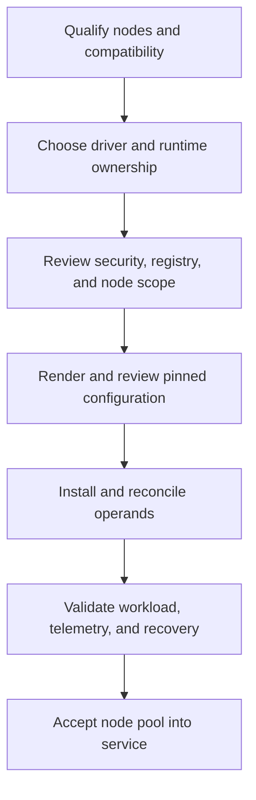

# Production Installation and Configuration

A Helm release in the `deployed` state is not a GPU platform. It says the API server accepted the release resources; it says nothing about a driver loading on the intended kernel, the runtime injecting devices, the kubelet advertising a resource, or a workload completing CUDA initialization. Production installation is a controlled lifecycle decision with a measurable acceptance boundary.

The NVIDIA GPU Operator can reconcile a set of GPU software operands, but it does not remove the need to decide who owns node images, drivers, runtimes, registry access, security policy, validation, and rollback. Make those choices before a change window, then encode them in reviewed configuration rather than a shell history.

## Learning objectives

By the end of this chapter, you should be able to qualify a node pool, select component ownership, organize an environment-specific configuration, validate the full workload path, and reject an installation that is syntactically successful but operationally incomplete.

## Define the platform boundary first

**Figure 10.10.1 — Installation is a sequence of evidence gates, not a single Helm command.** A failure at any gate should identify the owner and preserve a safe recovery path.

Before selecting values, document the supported Kubernetes distribution and version, kernel and operating-system image, container runtime, GPU inventory, driver branch, and required firmware posture. Treat this as a compatibility set. “Works on another cluster” is not a compatibility claim when the kernel, runtime, security controls, or node image differs.

## Ownership decisions that determine the design

| Decision | Questions to settle before deployment |
|---|---|
| Driver ownership | Is the driver part of a curated node image, installed by host automation, or managed by the operator? Who rebuilds it after a kernel change? |
| Runtime ownership | Does the base image configure the NVIDIA Container Toolkit, or will an operator-managed operand do so? Which runtime handlers and CDI behavior are approved? |
| Node scope | Which dedicated pools are eligible? How do labels, taints, selectors, and admission policy prevent accidental installation on control-plane or incompatible nodes? |
| Image supply chain | Which registry is authoritative? Are images mirrored, scanned, signed, and reachable during an incident? |
| Sharing policy | Are nodes full-GPU, MIG, or time-sliced, and which workload class is allowed on each? |
| Operations | Who owns values, compatibility review, alert response, maintenance windows, and vendor escalation? |

There is no universal correct driver-ownership model. A curated host image can simplify compliance and boot-time predictability; operator-managed driver containers can centralize lifecycle handling. Both require a tested compatibility and rollback process. Mixing models within one pool without an explicit design makes incidents needlessly ambiguous.

## Treat Helm values as an interface

Keep one source-controlled values file per environment, with a reviewable overlay mechanism where needed. Pin chart and image versions according to the qualified release documentation and internal policy. Record why non-default settings exist, particularly node selectors, driver and toolkit enablement, MIG or sharing configuration, DCGM Exporter settings, registry locations, tolerations, and security exceptions.

Render the release before applying it. Review service accounts, cluster-scoped permissions, privileged workloads, host mounts, DaemonSet selectors, image references, and namespace-scoped network assumptions. GPU platform operands often require privileged host interaction; that makes an installation review both a reliability and supply-chain review.

Do not copy a values file simply because it installed elsewhere. Configuration can be valid YAML and still target the wrong node group, overwrite a runtime assumption, or enable an operand that conflicts with the existing node image.

## Install in an intentionally small blast radius

Begin with a dedicated canary pool that represents the intended production hardware and policy. Apply labels and taints before installation so ordinary workloads cannot race into a partially configured pool. Verify registry credentials and internal mirrors before the maintenance window; an image-pull delay is not a driver diagnosis.

Install the pinned release, then follow reconciliation rather than only release status. Inspect the ClusterPolicy (or equivalent operator status), controller logs, events, DaemonSet rollout state, and the Pods for each enabled operand. When the result is incomplete, identify the first operand that cannot become Ready and investigate its dependency. Repeatedly deleting the whole deployment converts a diagnosable state into a larger outage.

## Acceptance is an end-to-end proof

Use a small, approved CUDA validation image and a representative workload test. The exact image and commands should be maintained in the platform’s controlled validation procedure, not selected ad hoc during an incident. Acceptance should establish all of the following:

1. The node detects its expected GPUs and the driver is healthy.
2. The selected runtime path can create a GPU container and initialize CUDA.
3. The device plugin advertises the expected allocatable resource after kubelet registration.
4. Hardware and policy labels describe the intended capability; taints and selectors constrain placement as designed.
5. A scheduled workload receives the expected device and passes a functional test.
6. DCGM telemetry is scraped with stable device identity and reaches the intended dashboards.
7. A controlled drain, reboot, and return-to-service path restores the node without undocumented manual repair.

The topology-sensitive portion of this test belongs to the workload class. A single-device CUDA smoke test proves a different thing from a distributed training validation. Use [GPU Scheduling and Topology](./chapter-08-gpu-scheduling-and-topology) to decide what the representative test must cover.

## Operational guardrails

Restrict operator scope to approved GPU nodes. Prefer immutable node-image and release inputs, use internal registries where policy requires them, and make the intended image provenance visible to reviewers. Ensure Pod Security, RBAC, and any admission policy allow the required operands deliberately—not through broad, unexplained exemptions.

Define a negative acceptance path too. A node that fails driver validation, loses the device plugin, or stops exporting telemetry must not silently re-enter the general workload pool. Cordon, quarantine, or keep the node out of the eligible selector until the runbook establishes recovery.

## Troubleshooting installation without guesswork

**The release installed but no GPU resources appear.** Compare the target node selector with actual nodes, then walk the dependency path: host detection and driver, runtime, device-plugin Pod, kubelet registration, and node allocatable resources. Events and operand logs should reveal the first failed component.

**The driver operand fails.** Collect kernel release, headers or build dependencies where relevant, signing or Secure Boot evidence where applicable, image logs, and host driver state. Do not attempt a workload-level fix before the host layer is sound.

**The runtime is present but a CUDA Pod cannot start.** Check the selected runtime handler or CDI configuration, runtime logs, device mounts, security context, and the validation image’s library expectations. A Pod start failure and a CUDA initialization failure are distinct failure boundaries.

**Metrics are missing after the functional test passes.** The compute path may be correct while the telemetry path is not. Investigate exporter readiness, DCGM access, Prometheus target discovery, scrape health, and network policy as a separate acceptance failure. See [GPU Observability with DCGM](./chapter-09-gpu-observability-with-dcgm).

## Senior-level design questions

**What is “done” for a GPU Operator deployment?** The answer is a qualified node pool with an agreed owner, a pinned and reviewed configuration, all intended operands reconciled, a real workload validated, telemetry visible, and a tested recovery procedure. Helm success is evidence, but it is not the acceptance criterion.

**Why isolate a canary pool?** It limits the change blast radius and provides a controlled comparison group. A canary must be representative enough to prove the compatibility set; an unused node with different hardware or policy is not a meaningful canary.

## Key takeaways

- Decide node, driver, runtime, and image-supply-chain ownership before installation.
- Treat values files and rendered manifests as reviewed platform interfaces.
- Accept a GPU pool only after the complete workload and telemetry path succeeds.
- Preserve a small, representative canary pool for both initial deployment and change.

## Cross references

- [GPU Observability with DCGM](./chapter-09-gpu-observability-with-dcgm)
- [GPU Scheduling and Topology](./chapter-08-gpu-scheduling-and-topology)
- [Upgrades and Production Troubleshooting](./chapter-11-upgrades-and-production-troubleshooting)
