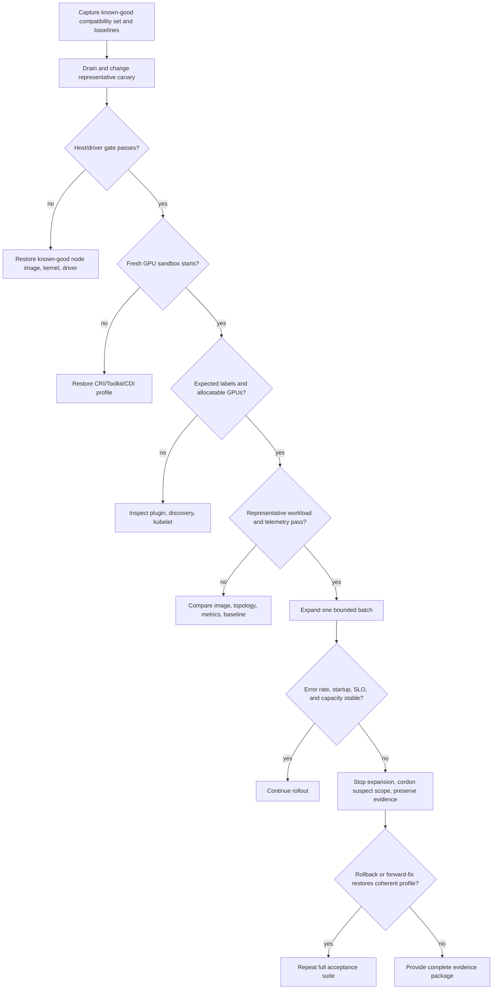

# Upgrades and Production Troubleshooting

A GPU-platform upgrade is not a chart upgrade with a longer wait time. It changes a compatibility set that can include the Kubernetes distribution, node operating-system image and kernel, NVIDIA driver, container runtime, GPU Operator operands, firmware, and workload libraries. Each layer may appear healthy while its interface to the next layer has failed.

Production safety comes from constraining that change, proving it on representative nodes, and retaining a rollback that restores a coherent state. The same layered model gives incident response a disciplined order: establish scope, find the first failed boundary, preserve evidence, and apply the smallest safe mitigation.

## Learning objectives

You will be able to plan a canary rollout, define the validation and rollback gates, diagnose common GPU workload failures by layer, and assemble evidence that a platform or hardware support team can act on.

## Change the compatibility set, not a component in isolation



**Figure 10.11.1 — Upgrade and incident response use the same decision path.** Each gate has a rollback unit and a proof. Ambiguous evidence stops expansion; it is not treated as a reason to wait longer.

The release record should state the prior and proposed values for Kubernetes, node image and kernel, driver, runtime, operator/chart and operand images, relevant firmware, and the GPU workload validation image. It should also name the node pools, maintenance window, workload owners, capacity reservation, and decision authority for pause or rollback.

| Change surface | Failure boundary to validate | Recovery consideration |
|---|---|---|
| Kernel or node image | Driver module load and node boot | Usually requires a known-good node image and reboot path |
| Driver | Device initialization, CUDA compatibility, reset behavior | Roll back with a compatible kernel and runtime; do not assume chart rollback is sufficient |
| Container runtime or toolkit | Device injection, CDI or runtime handler, Pod sandbox creation | Validate a fresh GPU Pod, not only an already-running one |
| Operator or chart | Operand reconciliation and configuration interpretation | Restore pinned chart and values only when host state remains compatible |
| Kubernetes or kubelet | Device-plugin registration, allocatable resources, scheduling | Compare kubelet behavior and node state with a healthy pool |
| Firmware | Device availability, fabric behavior, resets | Follow the hardware maintenance and support procedure; recovery may require a power cycle or replacement |

## Design the canary as a production experiment

Use a dedicated canary pool that matches the hardware, node image, runtime, security policy, and workload class of the pool it represents. Drain it deliberately and confirm that long-running work has a healthy checkpoint or rescheduling path before disruption. Retain enough spare capacity to meet service objectives while the canary is unavailable.

Run the acceptance suite after every meaningful change, including a fresh CUDA workload, expected allocatable resources, required labels, DCGM scrape and identity checks, and a workload-level test appropriate to the class. A distributed training pool needs a topology and communication validation; a single-device smoke test does not prove that boundary. Establish a comparison baseline before the change so that “it looks slow” can become a measurable difference in startup time, failure rate, step time, or serving latency.

### Worked rollout and rollback budget

A 40-node pool has eight GPUs per node:

```text
40 × 8 = 320 GPUs
```

A two-node canary removes 16 GPUs, leaving 304:

```text
304 / 320 = 95% raw capacity remains
```

The maintenance objective allows at most 10% capacity loss. A later four-node batch removes 32 GPUs:

```text
32 / 320 = 10%
```

That batch consumes the entire raw-capacity error budget before considering unhealthy devices, fragmented nodes, or checkpoint delays. If one additional node fails during the batch, unavailable capacity becomes:

```text
5 nodes × 8 = 40 GPUs
40 / 320 = 12.5%
```

The rollout automation should stop before the fifth node is disrupted, not after service owners report queue growth.

### Record the baseline and proposed profile

```bash
kubectl get nodes -l gpu.platform.example/pool=training \
  -o custom-columns='NAME:.metadata.name,KERNEL:.status.nodeInfo.kernelVersion,RUNTIME:.status.nodeInfo.containerRuntimeVersion,GPU:.status.allocatable.nvidia\.com/gpu' \
  > before-nodes.txt

helm get values gpu-operator -n gpu-operator -a > before-gpu-operator-values.yaml
```

**Representative `before-nodes.txt`:**

```text
NAME          KERNEL             RUNTIME                       GPU
gpu-node-01   6.8.0-40-generic   containerd://1.7.18            8
gpu-node-02   6.8.0-40-generic   containerd://1.7.18            8
gpu-node-03   6.8.0-40-generic   containerd://1.7.18            8
```

The snapshot records cluster-visible kernel and runtime versions plus resource state. It does not record the driver or actual runtime handler, so add host and workload evidence to the change record rather than treating this table as the complete profile.

## A layered incident method

Start with blast radius and time. Is this one Pod, all Pods on one node, one node pool, or every GPU node? Did it begin after a deployment, a node reboot, a scheduled maintenance action, or an application release? Compare one affected node or workload with a known-good peer before changing the affected system.

Then test in dependency order:

1. Hardware inventory, node boot state, kernel, and driver health.
2. Container runtime device-injection path and Pod creation.
3. Device-plugin registration, kubelet state, and allocatable GPU resource.
4. Node labels, taints, quotas, affinity, priority, and scheduler decisions.
5. Allocated Pod, security context, mounted devices, CUDA initialization, and application libraries.
6. DCGM, driver, and Kubernetes evidence correlated with the incident time.

This order prevents a scheduler investigation from hiding a driver failure, and it prevents a hardware replacement from becoming the default response to an application image regression.

## Failure patterns and first safe checks

| Symptom | First evidence | Safe first decision |
|---|---|---|
| Node does not advertise GPUs | host driver, plugin, kubelet registration | quarantine node; repair lowest failed layer |
| GPU Pod remains Pending | scheduler events and effective placement contract | separate shortage, policy, and fragmentation |
| Pod fails before application logs | admission, image, sandbox, CRI/runtime event | isolate runtime versus generic container failure |
| CUDA initialization fails | minimal image and application image on same allocation class | identify platform versus image boundary |
| Metrics disappear | exporter readiness, scrape target, sample freshness | declare observability degraded |
| Operator upgrade stalls | policy generation, controller, first nonready operand | stop expansion; preserve failed state |

### Evidence row 1: node loses allocatable GPUs after reboot

```bash
kubectl get node gpu-node-17 -o custom-columns='READY:.status.conditions[?(@.type=="Ready")].status,GPU:.status.allocatable.nvidia\.com/gpu'
nvidia-smi
journalctl -k -b | grep -i -E 'nvidia|module verification|secure boot' | tail -8
```

**Representative output:**

```text
READY   GPU
True    <none>

NVIDIA-SMI has failed because it couldn't communicate with the NVIDIA driver.

Aug 06 10:17:22 gpu-node-17 kernel: Lockdown: modprobe: unsigned module loading is restricted
Aug 06 10:17:22 gpu-node-17 kernel: nvidia: module verification failed: required key missing
```

Kubernetes general readiness is intact, while the driver and resource gates fail. The kernel log identifies a signing boundary. Keep the node cordoned and restore the qualified signing or node-image path; device-plugin restarts cannot repair this.

### Evidence row 2: Pending Pod is blocked by both policy and capacity

```bash
kubectl describe pod trainer-rank-0 | sed -n '/Events:/,$p'
```

```text
Events:
  Warning  FailedScheduling  43s  default-scheduler  0/20 nodes are available:
  4 Insufficient nvidia.com/gpu,
  8 node(s) had untolerated taint {gpu.platform/serving: true},
  8 node(s) didn't match Pod's node affinity/selector.
```

Four nodes are in the correct class but lack free GPUs. Sixteen others are intentionally excluded by serving policy or affinity. Relaxing the selector may violate the training contract; restarting the scheduler changes none of the three facts.

### Evidence row 3: runtime regression affects only new Pods

```bash
kubectl get pods -l app=cuda-check -o custom-columns='POD:.metadata.name,AGE:.metadata.creationTimestamp,STATUS:.status.phase,NODE:.spec.nodeName'
kubectl describe pod cuda-check-new | sed -n '/Events:/,$p'
```

```text
POD              AGE                    STATUS    NODE
cuda-check-old   2026-08-06T08:00:00Z   Running   gpu-node-18
cuda-check-new   2026-08-06T11:12:00Z   Pending   gpu-node-18

Events:
  Warning  FailedCreatePodSandBox  12s  kubelet  no runtime for "nvidia" is configured
```

The old sandbox remains alive, while a fresh sandbox cannot resolve the handler. This is classic runtime drift after a change. Existing workload health does not validate new-container creation.

### Evidence row 4: minimal image succeeds, application image fails

```bash
kubectl logs cuda-minimal
kubectl logs llm-server -c server | tail -8
```

```text
CUDA devices: 1
vector-add verification: PASS

RuntimeError: CUDA error: initialization error
libcuda loaded from /opt/compat/lib/libcuda.so.1
```

The platform path works for the approved minimal image. The application loads an image-specific compatibility library. Compare image contents and library search path before replacing hardware or rolling back the cluster.

## Containment, rollback, and forward recovery

Containment protects users while diagnosis proceeds: stop rollout, cordon a suspect node or pool, drain only when the workload recovery plan allows it, and redirect new work to known-good capacity. Capture volatile evidence before rebooting or replacing a node—events, relevant logs, device identity, driver state, DCGM observations, and the change timeline.

Rollback has to restore a compatible set. Returning Helm values may reverse a control-plane configuration but cannot necessarily revert a driver module, kernel, runtime configuration, or firmware. When host state changed, use the tested node-image and reboot path. After either rollback or forward recovery, rerun the full acceptance suite; a green operator status is not enough.

### Verify recovery rather than assuming it

```bash
kubectl get node gpu-node-17 -o json | jq '{gpu:.status.allocatable["nvidia.com/gpu"],validated:.metadata.labels["gpu.platform.example/validated"],taints:.spec.taints}'
kubectl logs cuda-acceptance-gpu-node-17
```

```text
{
  "gpu": "8",
  "validated": "true",
  "taints": [
    {"key":"nvidia.com/gpu","value":"present","effect":"NoSchedule"}
  ]
}
CUDA devices detected: 8
verification: PASS
```

The standard GPU-pool taint remains and is expected to be tolerated by approved workloads. The quarantine taint is gone, validation is current, and a fresh workload passes. This is stronger recovery evidence than `NodeReady` alone.

## Evidence package for escalation

An actionable escalation contains the scope and business impact, a timestamped change timeline, cluster and operator versions, pinned release configuration, node kernel and runtime details, GPU and firmware inventory, operand state, relevant kubelet and runtime logs, node labels and allocatable resources, an approved minimal reproducer, and DCGM or driver evidence. Redact tenant data and secrets, but do not omit version and time correlation—the support engineer needs both to reproduce the boundary you found.

## Senior-level design questions

**Why can chart rollback be unsafe after a GPU platform change?**

> “The chart is only one part of the compatibility set. If the change also altered the kernel, driver, runtime, or node image, reverting manifests can leave host and control-plane components mismatched. I restore the known-good profile for every changed layer, then create a fresh GPU Pod and rerun telemetry and workload acceptance. I do not use controller readiness as the sole rollback verification.”

**What is the most valuable first action after a canary failure?**

> “I stop expansion and preserve a known-good comparison group. Then I establish blast radius and find the first failed evidence gate—host, runtime, resource, placement, workload, or telemetry. That protects capacity and prevents broad restarts from erasing the state that distinguishes a localized node issue from a release-wide regression.”

**How would you decide between rollback and forward-fix?**

> “I compare time to restore, confidence, blast radius, data or checkpoint risk, and whether the current state is a coherent supported profile. If rollback is tested and restores service quickly, I favor it. If rollback would create another unqualified combination or firmware state, I contain the scope and use a vendor-supported forward recovery. Either path must end with the full acceptance suite.”

## Key takeaways

- Treat upgrades as compatibility-set changes with explicit gates and a representative canary.
- Troubleshoot from host and driver through runtime, discovery, scheduling, and workload execution.
- Preserve evidence before resets, drains, or replacements erase it.
- Roll back node state as well as release configuration when the changed boundary requires it.

## Cross references

- [Production Installation and Configuration](./chapter-10-production-installation-and-configuration)
- [GPU Observability with DCGM](./chapter-09-gpu-observability-with-dcgm)
- [Volume 10 Summary](./chapter-12-volume-10-summary)
