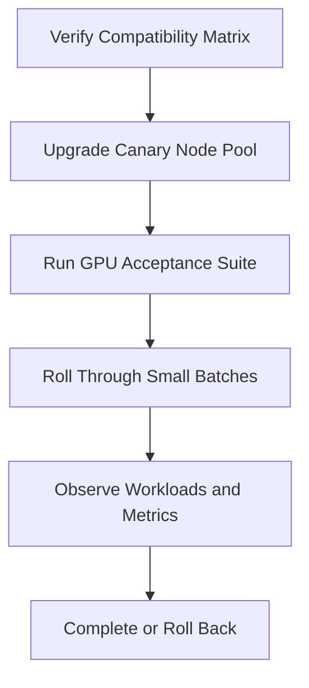

# Upgrades and Production Troubleshooting

GPU platform upgrades cross Kubernetes, kernel, driver, runtime, operator, firmware, and workload layers. Production safety comes from staged change, drain discipline, explicit validation, and a rollback that restores the complete compatibility set.

## Learning Objectives

Design canary upgrades, distinguish control-plane and node failures, use a layered incident flow, and produce support evidence.

## Upgrade Flow

## Change Categories

| Change | Main risk |
|---|---|
| Kernel | Driver module build/load |
| Driver | GPU reset, CUDA compatibility |
| Container runtime | Device injection and sandbox creation |
| Operator/chart | Operand versions and reconciliation |
| Kubernetes | APIs, kubelet, runtime, scheduling |
| Firmware | Hardware behavior and reset |

Drain nodes before disruptive work. Check checkpoint health for long-running training. Maintain spare capacity so maintenance does not violate service objectives.

## Incident Method

### Node Does Not Advertise GPUs

Check host GPU/driver, operator policy, driver operand, device plugin, kubelet registration, node labels, and events.

### Pod Pending

Check requests, allocatable GPUs, taints, affinity, quotas, priority, and distributed-job coordination.

### Pod Fails to Start

Check runtime handler or CDI, toolkit configuration, device mounts, security context, image pull, and driver-library compatibility.

### Pod Runs but CUDA Fails

Run a minimal validated CUDA image. Inspect application libraries, assigned device, XID events, and driver state.

### Metrics Missing

Check DCGM exporter, device access, scrape target, service discovery, network policy, and label mapping.

### Operator Upgrade Stalls

Identify the first operand not Ready, compare old/new versions, inspect policy status, and avoid deleting all resources at once.

## Evidence Package

- cluster, Kubernetes, runtime, and operator versions;
- node kernel, driver, firmware, and GPU inventory;
- Helm values/ClusterPolicy;
- operand status, logs, and events;
- kubelet/runtime logs;
- node labels and allocatable resources;
- minimal CUDA reproducer;
- DCGM/XID evidence;
- change timeline and affected workloads.

## Rollback

Rollback chart and values only if operand versions and host state remain compatible. A driver or kernel change may require node-image rollback or reboot. Validate the same acceptance gates after rollback.

## Customer Perspective

A production GPU cluster needs maintenance windows, canary pools, spare capacity, workload checkpoint policy, and cross-team ownership. Automation reduces effort but does not remove disruption risk.

## Interview Preparation

**Question:** GPU Pods fail after a Kubernetes node upgrade. How do you proceed?

Scope the failure, compare canary and healthy nodes, validate driver, runtime, device plugin, allocation, and minimal CUDA in order, then roll back the compatibility set if the first failing layer cannot be corrected safely.

## Key Takeaways

- GPU upgrades are compatibility-set changes.
- Canary and acceptance suites are mandatory.
- Troubleshoot from host hardware upward.
- Rollback must restore a coherent stack, not one package.

## Cross References

- [Production Installation](./chapter-10-production-installation-and-configuration)
- [Next: Volume 10 Summary](./chapter-12-volume-10-summary)
