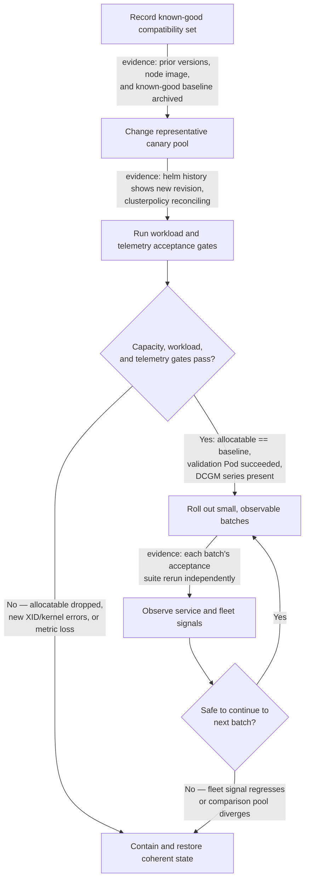

# Upgrades and Production Troubleshooting

A GPU-platform upgrade is not a chart upgrade with a longer wait time. It changes a compatibility set that can include the Kubernetes distribution, node operating-system image and kernel, NVIDIA driver, container runtime, GPU Operator operands, firmware, and workload libraries. Each layer may appear healthy while its interface to the next layer has failed.

Production safety comes from constraining that change, proving it on representative nodes, and retaining a rollback that restores a coherent state. The same layered model gives incident response a disciplined order: establish scope, find the first failed boundary, preserve evidence, and apply the smallest safe mitigation.

## Learning objectives

You will be able to plan a canary rollout, define the validation and rollback gates, diagnose common GPU workload failures by layer, and assemble evidence that a platform or hardware support team can act on.

## Change the compatibility set, not a component in isolation



**Figure 10.11.1 — A canary is an evidence gate, not a smaller production outage.** Progression requires explicit acceptance; ambiguity is a reason to stop expansion. Note there are now two decision points, not one: `Pass` gates the canary itself before any wider rollout is even considered, and `Decision` gates every subsequent batch independently — a canary that passed does not pre-approve batch 3 of 6, because a driver or firmware issue can be node-population-dependent (a specific hardware revision, a specific BIOS setting) and only show up once the rollout reaches the nodes that have it.

The release record should state the prior and proposed values for Kubernetes, node image and kernel, driver, runtime, operator/chart and operand images, relevant firmware, and the GPU workload validation image. It should also name the node pools, maintenance window, workload owners, capacity reservation, and decision authority for pause or rollback.

| Change surface | Failure boundary to validate | Recovery consideration |
|---|---|---|
| Kernel or node image | Driver module load and node boot | Usually requires a known-good node image and reboot path |
| Driver | Device initialization, CUDA compatibility, reset behavior | Roll back with a compatible kernel and runtime; do not assume chart rollback is sufficient |
| Container runtime or toolkit | Device injection, CDI or runtime handler, Pod sandbox creation | Validate a fresh GPU Pod, not only an already-running one |
| Operator or chart | Operand reconciliation and configuration interpretation | Restore pinned chart and values only when host state remains compatible |
| Kubernetes or kubelet | Device-plugin registration, allocatable resources, scheduling | Compare kubelet behavior and node state with a healthy pool |
| Firmware | Device availability, fabric behavior, resets | Follow the hardware maintenance and support procedure; recovery may require a power cycle or replacement |

## Design the canary as a production experiment

Use a dedicated canary pool that matches the hardware, node image, runtime, security policy, and workload class of the pool it represents. Drain it deliberately and confirm that long-running work has a healthy checkpoint or rescheduling path before disruption. Retain enough spare capacity to meet service objectives while the canary is unavailable.

Run the acceptance suite after every meaningful change, including a fresh CUDA workload, expected allocatable resources, required labels, DCGM scrape and identity checks, and a workload-level test appropriate to the class. A distributed training pool needs a topology and communication validation; a single-device smoke test does not prove that boundary. Establish a comparison baseline before the change so that “it looks slow” can become a measurable difference in startup time, failure rate, step time, or serving latency.

Expand in small batches only while the canary and the first batch remain stable for the agreed observation period. Preserve one healthy comparison pool until the rollout completes. Automation should stop on failed gates; it should not automatically force every node through a broken state.

**Sizing the canary and the batches — a worked, illustrative example.** For a fleet of 120 GPU nodes across 4 identical hardware batches (30 nodes each, procured at different times and therefore not guaranteed to share a BIOS/firmware revision):

- Canary: 2 nodes per hardware batch = 8 nodes total (~7% of the fleet). Fewer than 2 per batch risks mistaking a single bad node for a systemic driver problem; going straight to a fleet-wide canary defeats the point of bounding blast radius.
- First rollout batch after the canary passes: 10% of the fleet, or 12 nodes — large enough to catch a rollout-order or scheduler-interaction issue the 8-node canary was too small to expose, small enough that losing all 12 still leaves 90% of capacity serving traffic.
- Subsequent batches: double each time the observation window is clean — 12 → 24 → remaining 76 — rather than a fixed step, so a fault caught late in the rollout has stopped before it reached the majority of the fleet.
- Blast-radius arithmetic if a bad driver is missed and reaches batch 3 (24 nodes) before detection: at 8 GPUs/node that is `24 x 8 = 192 GPUs` unavailable, against a fleet total of `120 x 8 = 960 GPUs` — 20% of fleet GPU capacity, which is the number that belongs in an incident summary, not "some nodes are affected."

These figures are illustrative — the right canary and batch sizes depend on fleet size, hardware heterogeneity, and how much spare capacity the environment actually has; the arithmetic pattern (bound the canary, size batches to what a clean observation window can prove, compute blast radius in GPUs not nodes) is the transferable part.

## A layered incident method

Start with blast radius and time. Is this one Pod, all Pods on one node, one node pool, or every GPU node? Did it begin after a deployment, a node reboot, a scheduled maintenance action, or an application release? Compare one affected node or workload with a known-good peer before changing the affected system.

Then test in dependency order:

1. Hardware inventory, node boot state, kernel, and driver health.
2. Container runtime device-injection path and Pod creation.
3. Device-plugin registration, kubelet state, and allocatable GPU resource.
4. Node labels, taints, quotas, affinity, priority, and scheduler decisions.
5. Allocated Pod, security context, mounted devices, CUDA initialization, and application libraries.
6. DCGM, driver, and Kubernetes evidence correlated with the incident time.

This order prevents a scheduler investigation from hiding a driver failure, and it prevents a hardware replacement from becoming the default response to an application image regression.

## Failure patterns and first safe checks

### A node does not advertise GPUs

Confirm the physical inventory and host driver state first. Next inspect the operator policy and the driver, toolkit, and device-plugin operands; then inspect kubelet events and node `capacity` and `allocatable`. Compare labels and operand versions with a healthy node of the same class. A DaemonSet that is Running does not prove the kubelet has accepted its registration.

**Evidence, post-upgrade.** After a driver-version bump, one canary node stops advertising GPUs while its sibling in the same batch is fine:

```text
$ kubectl get ds -n gpu-operator nvidia-device-plugin-daemonset -o wide
NAME                              DESIRED   CURRENT   READY   UP-TO-DATE
nvidia-device-plugin-daemonset    8         8         8       8

$ kubectl get node gpu-node-11 -o jsonpath='{.status.allocatable.nvidia\.com/gpu}{"\n"}'
0
$ kubectl get node gpu-node-12 -o jsonpath='{.status.allocatable.nvidia\.com/gpu}{"\n"}'
8
```

The DaemonSet reports `8/8 Ready` fleet-wide — that is the "Running does not prove registration" trap this row warns about. `gpu-node-11` and `gpu-node-12` came from the same rollout batch, but only `gpu-node-11` shows `allocatable: 0`. That per-node asymmetry, not the DaemonSet's aggregate status, is the actual signal: something node-specific (driver load, a stale toolkit socket) broke registration on one host even though the plugin Pod on that host reports `Ready`.

### A GPU Pod remains Pending

Read scheduler events before changing labels. Check the requested extended resource against allocatable capacity, then taints and tolerations, node affinity, quota, priority, and any queue or gang-scheduling requirement. A multi-Pod job can remain unusable even when one member could be placed; avoid claiming capacity is available until its full placement contract can be met.

### A Pod fails before its application starts

Separate image-pull, admission, sandbox, and container-start errors. For GPU-specific failures, examine the selected runtime handler or CDI path, toolkit configuration, device mounts, security context, and runtime logs. These failures occur before application CUDA code, so an application-level workaround rarely fixes them.

### CUDA initialization fails in a Running Pod

Run the approved minimal validation workload on the same node and allocation class. Compare image libraries and environment with the failing workload, verify the assigned device, then inspect driver state and device events. If the minimal workload also fails, the platform boundary is implicated; if it passes, focus on the application image or workload configuration.

### Metrics disappear or report an implausible fleet state

Validate the monitoring path independently: exporter scheduling and logs, host access, DCGM connectivity, scrape discovery and freshness, network policy, and label mapping. Missing telemetry means hardware health is unknown; it must not be interpreted as healthy hardware. [GPU Observability with DCGM](./chapter-09-gpu-observability-with-dcgm) covers the monitoring contract.

### An operator upgrade stalls

Inspect the policy status, controller logs, events, and operand rollout state to identify the *first* component not becoming Ready. Compare its node selector, tolerations, image access, and version with the prior state. Do not delete every operand or repeatedly reinstall the release: that removes comparison evidence and can broaden an isolated reconciliation issue into a pool outage.

## Containment, rollback, and forward recovery

Containment protects users while diagnosis proceeds: stop rollout, cordon a suspect node or pool, drain only when the workload recovery plan allows it, and redirect new work to known-good capacity. Capture volatile evidence before rebooting or replacing a node—events, relevant logs, device identity, driver state, DCGM observations, and the change timeline.

Rollback has to restore a compatible set. Returning Helm values may reverse a control-plane configuration but cannot necessarily revert a driver module, kernel, runtime configuration, or firmware. When host state changed, use the tested node-image and reboot path. After either rollback or forward recovery, rerun the full acceptance suite; a green operator status is not enough.

## Evidence package for escalation

An actionable escalation contains the scope and business impact, a timestamped change timeline, cluster and operator versions, pinned release configuration, node kernel and runtime details, GPU and firmware inventory, operand state, relevant kubelet and runtime logs, node labels and allocatable resources, an approved minimal reproducer, and DCGM or driver evidence. Redact tenant data and secrets, but do not omit version and time correlation—the support engineer needs both to reproduce the boundary you found.

## Senior-level design questions

**Why can chart rollback be unsafe after a GPU platform change?** The chart may be only one part of the compatibility set. If the change also altered a driver, kernel, or runtime, reverting manifests can leave host and control-plane components mismatched. Recovery must restore a tested combination.

**What is the most valuable first action after a canary failure?** Stop expansion, protect workload capacity, and preserve a healthy comparison group. Then determine the first failed layer with time-correlated evidence. A fast, broad rollback without that discipline may trade one failure for a harder-to-diagnose one.

## Key takeaways

- Treat upgrades as compatibility-set changes with explicit gates and a representative canary.
- Troubleshoot from host and driver through runtime, discovery, scheduling, and workload execution.
- Preserve evidence before resets, drains, or replacements erase it.
- Roll back node state as well as release configuration when the changed boundary requires it.

## Cross references

- [Production Installation and Configuration](./chapter-10-production-installation-and-configuration)
- [GPU Observability with DCGM](./chapter-09-gpu-observability-with-dcgm)
- [Volume 10 Summary](./chapter-12-volume-10-summary)
