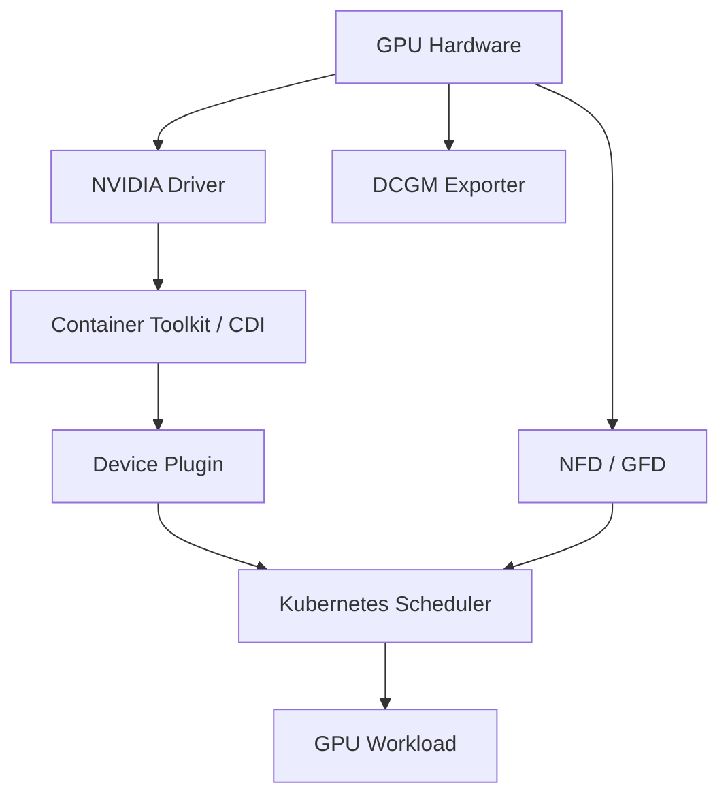

# Volume 10 Summary

Kubernetes does not manage GPUs by itself. A production GPU platform combines firmware, kernel driver, container runtime integration, device discovery, resource advertisement, feature labels, scheduling policy, validation, telemetry, and controlled lifecycle automation.

## Architecture Summary

## Quick Revision

| Component | Responsibility |
|---|---|
| Driver | Control hardware and expose kernel interfaces |
| Container Toolkit | Inject devices and driver libraries into containers |
| Device Plugin | Advertise and allocate extended resources |
| NFD/GFD | Publish hardware capability labels |
| GPU Operator | Reconcile GPU platform operands |
| DCGM Exporter | Expose GPU health and utilization metrics |
| Scheduler policy | Place workloads by quantity and capability |
| Validators | Prove important layer boundaries |

## Production Synthesis

Volume 10 is really about boundaries:

- hardware versus host software;
- host software versus container runtime integration;
- discovery versus scheduling;
- placement quantity versus placement quality;
- node health versus workload health;
- reconciliation versus compatibility;
- telemetry versus telemetry context.

When a GPU platform fails, one of those boundaries is usually blurred. The fix is to make the boundary explicit, observable, and owned by one team.

## Production Principles

- Pin and test the complete compatibility matrix.
- Decide whether host automation or the operator owns drivers and runtime.
- Treat privileged operands as supply-chain-sensitive infrastructure.
- Use stable workload classes and selective topology constraints.
- Accept nodes only after CUDA, topology, and monitoring validation.
- Upgrade through canary pools with spare capacity and rollback.
- Correlate Kubernetes state with host, driver, runtime, and DCGM evidence.
- Treat label taxonomies and scheduling classes as contracts.
- Require a real workload and a real reboot before declaring success.

## Troubleshooting Checklist

1. Hardware, firmware, kernel, and driver.
2. Toolkit/CDI or runtime handler.
3. Device-plugin registration and node allocatable.
4. Feature labels, taints, affinity, quota, and scheduling.
5. Pod allocation, mounts, security, and image libraries.
6. CUDA validation and application logs.
7. DCGM metrics, XID, thermal, and power state.

## Interview Notes

A senior answer should distinguish discovery, allocation, runtime injection, scheduling, and application execution. “The GPU Operator installs drivers” is incomplete; explain the reconciliation architecture, operands, lifecycle decisions, security, observability, and failure handling.

In practice, the strongest answers also explain what the platform does not do: it does not magically solve topology, fairness, application profiling, or workload-specific validation without deliberate policy.

## Lab Checklist

- Qualify a GPU Kubernetes node.
- Install the GPU Operator with pinned configuration.
- Validate scheduling, CUDA, and DCGM metrics.
- Inject and recover from an operand failure.

## Operational Maturity

If the node pool is stable, the platform is still not finished unless:

- the compatibility matrix is documented;
- the node acceptance workflow is repeatable;
- telemetry is connected to workload ownership;
- the rollback path has been tested;
- the support handoff is clear for kernel, driver, runtime, and operator changes.

## Next Volume

[Volume 11 — GPU Sharing](../volume-11/index) will cover MIG, time slicing, vGPU, isolation, multi-tenancy, scheduling, accounting, and performance trade-offs.
