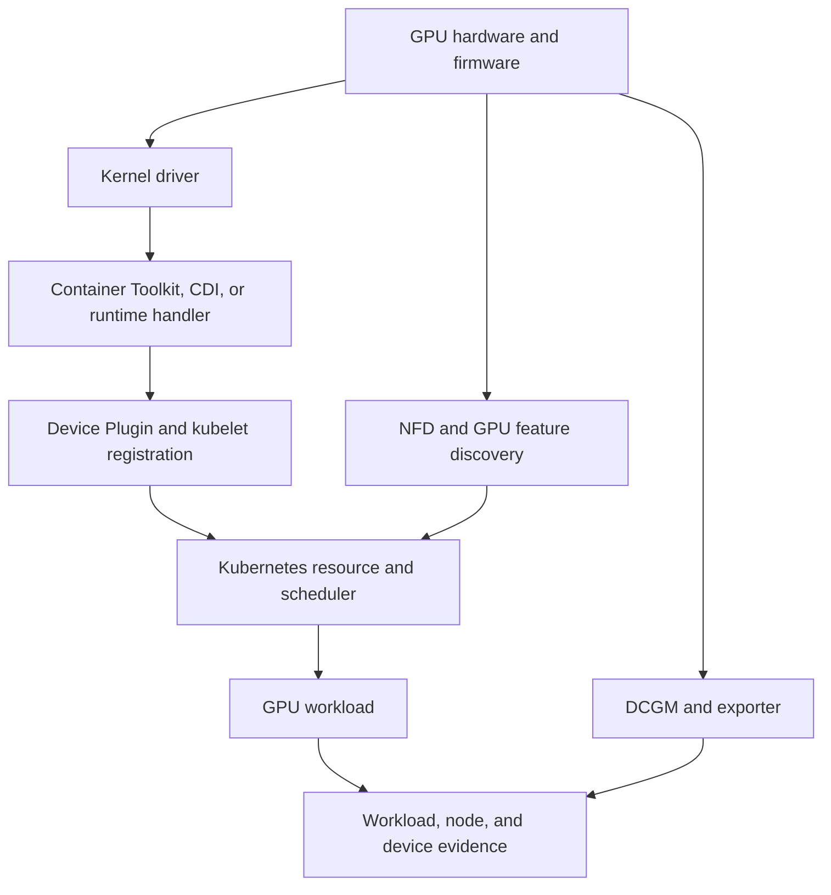

# Volume 10 Summary

Kubernetes schedules a declared extended resource; it does not, by itself, create a safe GPU lifecycle. A production platform must make the GPU usable on the host, expose it to the chosen container runtime, discover and advertise it to the kubelet, describe its capability to the scheduler, inject it into a workload, observe its health, and change the entire stack without leaving incompatible layers behind.

That chain is the central model of this volume. It gives the platform team a way to turn “GPU Pod failed” into a smaller, testable question about one interface at a time.

## The platform lifecycle

**Figure 10.12.1 — The GPU platform is a chain of contracts.** A healthy lower layer is necessary but not sufficient for the layer above it.

## What each component is responsible for

| Component | Responsibility | It does not prove |
|---|---|---|
| GPU hardware and firmware | Makes a physical device available with its platform-level behavior | That the operating system or a workload can use it |
| NVIDIA driver | Exposes the device to the host and supports CUDA execution | That a container receives the device |
| Container Toolkit, CDI, or runtime handler | Makes the approved GPU path available to containers | That kubelet advertises a schedulable resource |
| Device plugin | Registers and allocates GPU extended resources with kubelet | That placement meets topology or workload requirements |
| NFD and GPU feature discovery | Publishes node capabilities for placement and policy | That labels reflect an accepted, healthy node unless the platform enforces that contract |
| GPU Operator | Reconciles enabled GPU platform operands | That every operand is healthy or every workload works |
| Scheduler policy | Selects a node that satisfies declared constraints | That the resulting CPU, NIC, and GPU topology is optimal |
| DCGM Exporter | Exposes selected device telemetry | That an alert has workload impact or a responder action |

This separation of responsibility is useful in design reviews and incidents. It prevents the imprecise statement “the GPU Operator is broken” from hiding a node-image, runtime, device-plugin, scheduler, or workload problem.

## The production operating model

Make the following decisions explicit and source controlled:

- Define eligible GPU node pools, their labels and taints, and the workload classes they serve.
- Choose driver and runtime ownership: curated host image, host automation, operator-managed operands, or a deliberate combination with clear boundaries.
- Pin and qualify the complete compatibility set: Kubernetes, node image and kernel, driver, runtime, operator, operand images, firmware where relevant, and validation workload.
- Treat privileged operands, host mounts, registry access, and RBAC as platform security controls rather than installation details.
- Accept nodes only after a real GPU workload, expected resource advertisement, required topology behavior, and telemetry path all pass.
- Preserve a representative canary pool, spare capacity, a maintenance process, and a coherent rollback path.

The goal is not to expose the maximum number of knobs. It is to offer a small number of stable platform classes—such as topology-sensitive training, latency-sensitive inference, or flexible batch—whose placement, sharing, and lifecycle rules are understandable to users and operators.

## A reusable diagnosis sequence

When a GPU workload is pending, fails, or slows down, establish the scope and change timeline first. Then walk the dependency chain rather than hopping between dashboards:

1. Verify hardware inventory, node boot state, kernel, driver, and device evidence.
2. Verify runtime injection and the creation of a fresh GPU Pod.
3. Verify device-plugin registration, kubelet state, capacity, and allocatable resources.
4. Verify labels, taints, affinity, quotas, priority, and any coordinated-scheduling rule.
5. Verify the allocated workload, security context, image libraries, CUDA initialization, and application behavior.
6. Correlate DCGM, driver, Kubernetes, network, storage, and application evidence at the same time range.

This is an evidence order, not a claim that every fault starts in hardware. It is designed to find the first broken interface and avoid changing healthy layers before they have been ruled out.

## Revision prompts

**Why is a `Running` GPU Pod not proof of GPU health?** Pod phase reports Kubernetes lifecycle state. It does not establish CUDA initialization, performance, device health, or telemetry coverage.

**Why is resource quantity insufficient for placement?** GPU model and memory, CPU and NUMA locality, NIC and peer topology, sharing mode, queue semantics, and workload class can all change whether an allocation is useful.

**What makes a deployment production-ready?** A qualified compatibility set, reviewed ownership and security boundaries, reconciled operands, workload and telemetry acceptance, documented recovery, and operating capacity for maintenance.

**Why is rollback more than Helm rollback?** Host and workload boundaries may have changed with a kernel, driver, runtime, or firmware update. Recovery must return the affected node to a tested combination.

## Continue the practice

Use the labs to turn the lifecycle into observable evidence: inspect a node, install and validate the platform, diagnose missing allocatable GPUs, and perform a controlled upgrade. Keep the exact validation image, expected evidence, and rollback decision points with the platform’s runbooks; an operator should not have to improvise them under pressure.

Revisit the key chapters as you operate the platform:

- [NVIDIA Container Toolkit, RuntimeClass, and CDI](./chapter-03-container-toolkit-runtimeclass-and-cdi) for the container boundary.
- [Device Plugin and Kubernetes Resource Model](./chapter-04-device-plugin-and-kubernetes-resource-model) and [Node and GPU Feature Discovery](./chapter-05-node-and-gpu-feature-discovery) for advertisement and labeling.
- [GPU Operator Architecture](./chapter-06-gpu-operator-architecture) and [Driver Containers and Node Operands](./chapter-07-driver-containers-and-node-operands) for reconciliation and host ownership.
- [GPU Scheduling and Topology](./chapter-08-gpu-scheduling-and-topology), [GPU Observability with DCGM](./chapter-09-gpu-observability-with-dcgm), and [Upgrades and Production Troubleshooting](./chapter-11-upgrades-and-production-troubleshooting) for the production feedback loop.

## Next volume

[Volume 11 — GPU Sharing](../volume-11/index) extends this platform model to MIG, time slicing, vGPU, isolation, multi-tenancy, scheduling, accounting, and performance trade-offs.
