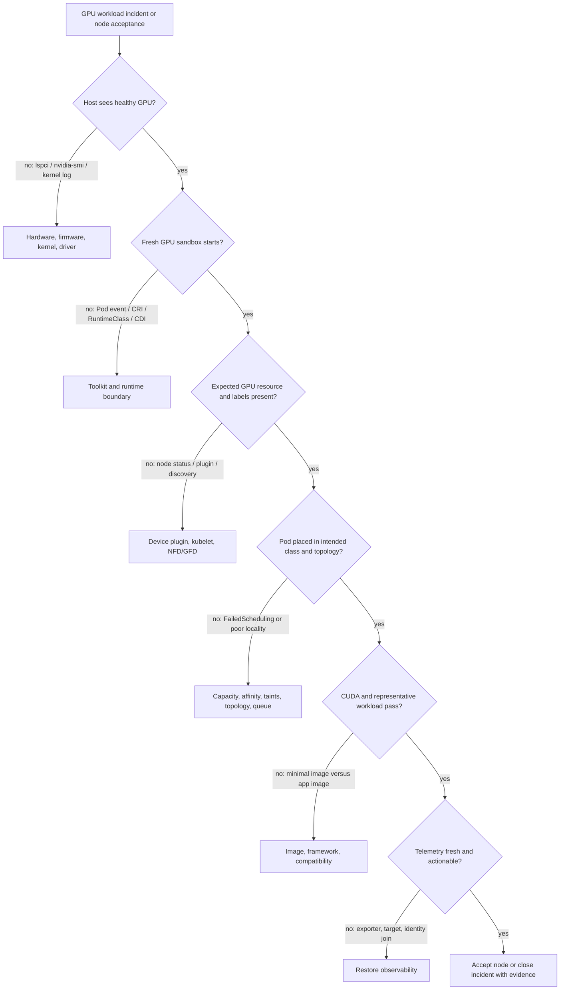

# Volume 10 Summary

Kubernetes schedules a declared extended resource; it does not, by itself, create a safe GPU lifecycle. A production platform must make the GPU usable on the host, expose it to the chosen container runtime, discover and advertise it to the kubelet, describe its capability to the scheduler, inject it into a workload, observe its health, and change the entire stack without leaving incompatible layers behind.

That chain is the central model of this volume. It gives the platform team a way to turn “GPU Pod failed” into a smaller, testable question about one interface at a time.

## The platform lifecycle



**Figure 10.12.1 — The volume’s final diagram is the reusable fault-isolation algorithm.** Every branch attaches a proof to one interface. The sequence prevents a downstream symptom from becoming an excuse to change every layer.

## What each component is responsible for

| Component | Responsibility | It does not prove |
|---|---|---|
| GPU hardware and firmware | Makes a physical device available with its platform-level behavior | That the operating system or a workload can use it |
| NVIDIA driver | Exposes the device to the host and supports CUDA execution | That a container receives the device |
| Container Toolkit, CDI, or runtime handler | Makes the approved GPU path available to containers | That kubelet advertises a schedulable resource |
| Device plugin | Registers and allocates GPU extended resources with kubelet | That placement meets topology or workload requirements |
| NFD and GPU feature discovery | Publishes node capabilities for placement and policy | That labels reflect an accepted, healthy node unless the platform enforces that contract |
| GPU Operator | Reconciles enabled GPU platform operands | That every operand is healthy or every workload works |
| Scheduler policy | Selects a node that satisfies declared constraints | That the resulting CPU, NIC, and GPU topology is optimal |
| DCGM Exporter | Exposes selected device telemetry | That an alert has workload impact or a responder action |

This separation of responsibility is useful in design reviews and incidents. It prevents the imprecise statement “the GPU Operator is broken” from hiding a node-image, runtime, device-plugin, scheduler, or workload problem.

## One complete evidence bundle

The following is **representative output** from a healthy eight-GPU node. No single command is sufficient; the value comes from the sequence.

### Host and driver

```bash
nvidia-smi --query-gpu=index,name,uuid,driver_version --format=csv,noheader
```

```text
0, NVIDIA H100 80GB HBM3, GPU-3c2e38d1-6a2c-4a31-b44b-9d82a8c80735, 550.54.15
1, NVIDIA H100 80GB HBM3, GPU-722d1344-1b6d-4a95-8cb9-1c572eb5ad94, 550.54.15
... six additional devices ...
```

This proves host-driver communication and stable UUID identity. The abbreviated six rows are explicitly omitted for readability; a real acceptance record should preserve all eight.

### Kubernetes resource and service class

```bash
kubectl get node gpu-node-01 -o json | jq '{gpu:.status.allocatable["nvidia.com/gpu"],class:.metadata.labels["gpu.platform.example/class"],validated:.metadata.labels["gpu.platform.example/validated"]}'
```

```json
{
  "gpu": "8",
  "class": "training-topology",
  "validated": "true"
}
```

The node advertises eight units and belongs to the platform-owned class. `validated=true` is meaningful only if the controller updated it after the current change generation.

### Fresh runtime and workload execution

```bash
kubectl get pod cuda-acceptance-gpu-node-01 -o wide
kubectl logs cuda-acceptance-gpu-node-01
```

```text
NAME                                READY   STATUS      NODE
cuda-acceptance-gpu-node-01         0/1     Completed   gpu-node-01

CUDA devices detected: 8
selected UUID: GPU-3c2e38d1-6a2c-4a31-b44b-9d82a8c80735
vector-add verification: PASS
```

`Completed` plus `PASS` proves a newly created sandbox received the device and executed a functional kernel. It does not certify distributed topology or application performance.

### Telemetry freshness

```bash
curl -s 'http://prometheus.monitoring.svc:9090/api/v1/query?query=up%7Bjob%3D%22dcgm-exporter%22%2Cinstance%3D~%22.%2A%22%7D' | jq '.data.result[0] | {instance:.metric.instance,value:.value}'
```

```json
{
  "instance": "10.42.3.24:9400",
  "value": [1786028012.441, "1"]
}
```

The target is up at the sample timestamp. Compare the timestamp with current time; stale data can leave a visually populated dashboard after collection fails.

## The production operating model

Make the following decisions explicit and source controlled:

- Define eligible GPU node pools, their labels and taints, and the workload classes they serve.
- Choose driver and runtime ownership: curated host image, host automation, operator-managed operands, or a deliberate combination with clear boundaries.
- Pin and qualify the complete compatibility set: Kubernetes, node image and kernel, driver, runtime, operator, operand images, firmware where relevant, and validation workload.
- Treat privileged operands, host mounts, registry access, and RBAC as platform security controls rather than installation details.
- Accept nodes only after a real GPU workload, expected resource advertisement, required topology behavior, and telemetry path all pass.
- Preserve a representative canary pool, spare capacity, a maintenance process, and a coherent rollback path.

The goal is not to expose the maximum number of knobs. It is to offer a small number of stable platform classes—such as topology-sensitive training, latency-sensitive inference, or flexible batch—whose placement, sharing, and lifecycle rules are understandable to users and operators.

### Worked fleet-capacity summary

A fleet has 12 nodes with eight GPUs each:

```text
physical inventory = 12 × 8 = 96 GPUs
```

One node is a canary, one is maintenance headroom, and one has a quarantined GPU but seven healthy units:

```text
guaranteed production nodes = 12 − 2 = 10 nodes
full-node capacity = 10 × 8 = 80 GPUs
quarantined node contributes 0 to guaranteed capacity until acceptance
```

Although the physical inventory is 96 GPUs and one quarantined node still advertises seven healthy units, the service contract may intentionally guarantee only 80. Capacity reporting should distinguish physical, healthy, admitted, allocated, and free resources.

## A reusable diagnosis sequence

When a GPU workload is pending, fails, or slows down, establish the scope and change timeline first. Then walk the dependency chain rather than hopping between dashboards:

1. Verify hardware inventory, node boot state, kernel, driver, and device evidence.
2. Verify runtime injection and the creation of a fresh GPU Pod.
3. Verify device-plugin registration, kubelet state, capacity, and allocatable resources.
4. Verify labels, taints, affinity, quotas, priority, and any coordinated-scheduling rule.
5. Verify the allocated workload, security context, image libraries, CUDA initialization, and application behavior.
6. Correlate DCGM, driver, Kubernetes, network, storage, and application evidence at the same time range.

This is an evidence order, not a claim that every fault starts in hardware. It is designed to find the first broken interface and avoid changing healthy layers before they have been ruled out.

## Production troubleshooting revision table

| Symptom | Decisive paired evidence | Likely interpretation |
|---|---|---|
| Node Ready, GPU absent | node status + `nvidia-smi`/kernel log | general kubelet health with broken driver or plugin path |
| Pod Pending | scheduler event + node free blocks and policy | shortage, fragmentation, affinity, taint, or quota |
| Bound Pod cannot start | Pod event + RuntimeClass/CDI/CRI evidence | runtime injection failure |
| Minimal CUDA passes, app fails | paired workload logs and library path | image or framework boundary |
| Dashboard empty | exporter readiness + Prometheus target freshness | monitoring failure before hardware conclusion |

### Evidence row 1: Node Ready, driver broken

```text
$ kubectl get node gpu-node-07
NAME          STATUS   ROLES    AGE   VERSION
gpu-node-07   Ready    <none>   21d   v1.30.3

$ nvidia-smi
NVIDIA-SMI has failed because it couldn't communicate with the NVIDIA driver.
```

The first line proves general Kubernetes node health; the second disproves GPU host readiness. This is the shortest demonstration of the volume’s central principle.

### Evidence row 2: scheduler reports fragmentation

```text
$ kubectl describe pod four-gpu-job | sed -n '/Events:/,$p'
Warning  FailedScheduling  default-scheduler  0/4 nodes are available: 4 Insufficient nvidia.com/gpu.

node-a: 1 free
node-b: 1 free
node-c: 1 free
node-d: 1 free
```

The cluster has four free units but no four-unit node-local block. The event is correct; the fix is capacity reshaping or a different workload request.

### Evidence row 3: metrics absent because exporter is unhealthy

```text
$ kubectl -n gpu-operator get pod nvidia-dcgm-exporter-r8p4s
NAME                           READY   STATUS
nvidia-dcgm-exporter-r8p4s     0/1     Running

$ kubectl -n gpu-operator logs nvidia-dcgm-exporter-r8p4s --tail=2
Error connecting to DCGM hostengine: connection refused
No metrics collected; retrying in 5s
```

The container process is Running, but readiness and logs prove the telemetry dependency is broken. Silence from alerts cannot be treated as hardware health.

## Interview preparation

**Why is a `Running` GPU Pod not proof of GPU health?**

> “Pod phase reports the Kubernetes lifecycle, not the accelerator service result. A process can be Running before CUDA initializes, and a workload can continue while telemetry or one peer GPU is unhealthy. I verify the assigned device, run or inspect a functional CUDA result, check UUID-based telemetry and reliability events, and correlate application progress. `Running` is one clue, not the acceptance criterion.”

**Why is resource quantity insufficient for placement?**

> “The GPU extended resource is an integer. It does not encode memory size, architecture, peer links, CPU and NIC locality, sharing mode, or coordinated start. I combine the request with a governed service class and only the topology constraints the workload can justify. Then I measure the utilization and queueing cost of those constraints.”

**What makes a deployment production-ready?**

> “I require a qualified compatibility set, one owner for each host layer, reviewed privileged manifests and image provenance, reconciled operands, expected labels and allocatable resources, a fresh representative workload, fresh telemetry, a tested drain and reboot path, and a coherent rollback. Helm success alone proves none of those end-to-end contracts.”

**Why is rollback more than Helm rollback?**

> “A release can change the kernel, driver, runtime, node image, firmware, and application interface in addition to chart objects. Reverting the chart while retaining a changed host profile can leave an untested combination. I restore every changed layer to a known-good profile and rerun the complete acceptance suite.”

## Continue the practice

Use the labs to turn the lifecycle into observable evidence: inspect a node, install and validate the platform, diagnose missing allocatable GPUs, and perform a controlled upgrade. Keep the exact validation image, expected evidence, and rollback decision points with the platform’s runbooks; an operator should not have to improvise them under pressure.

Revisit the key chapters as you operate the platform:

- [NVIDIA Container Toolkit, RuntimeClass, and CDI](./chapter-03-container-toolkit-runtimeclass-and-cdi) for the container boundary.
- [Device Plugin and Kubernetes Resource Model](./chapter-04-device-plugin-and-kubernetes-resource-model) and [Node and GPU Feature Discovery](./chapter-05-node-and-gpu-feature-discovery) for advertisement and labeling.
- [GPU Operator Architecture](./chapter-06-gpu-operator-architecture) and [Driver Containers and Node Operands](./chapter-07-driver-containers-and-node-operands) for reconciliation and host ownership.
- [GPU Scheduling and Topology](./chapter-08-gpu-scheduling-and-topology), [GPU Observability with DCGM](./chapter-09-gpu-observability-with-dcgm), and [Upgrades and Production Troubleshooting](./chapter-11-upgrades-and-production-troubleshooting) for the production feedback loop.

## Next volume

[Volume 11 — GPU Sharing](../volume-11/index) extends this platform model to MIG, time slicing, vGPU, isolation, multi-tenancy, scheduling, accounting, and performance trade-offs.
