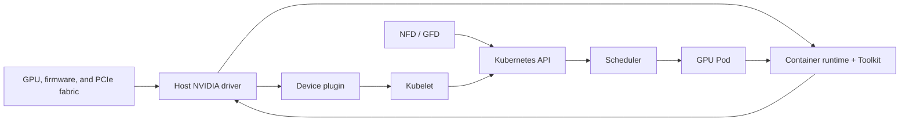

# Volume 10 — Kubernetes GPU Platform

A GPU node is not ready because Kubernetes reports `Ready`. It is ready when a compatible driver controls the hardware, the container runtime can construct a GPU-enabled sandbox, Kubernetes can advertise and allocate healthy devices, and a representative workload can execute. Those are separate contracts, owned by different layers, and they fail differently.

This volume develops the platform layer that makes those contracts repeatable. It starts at the boundary between Kubernetes and the host, follows the lifecycle through discovery, allocation, and runtime injection, then examines operator reconciliation, node operands, topology-aware scheduling, telemetry, installation, upgrades, and incident response. The goal is not to memorize manifests. It is to make a GPU fleet predictable during routine change and diagnosable when one of its dependency boundaries breaks.

| Volume field | Value |
|---|---|
| Audience | Experienced DevOps, SRE, platform, cloud, infrastructure, and MLOps engineers |
| Difficulty | Advanced |
| Estimated reading time | 18–24 hours, excluding labs |
| Prerequisites | Kubernetes node and workload operations; Volumes 01–09 |
| Outcome | Design, validate, upgrade, and troubleshoot a production Kubernetes GPU platform |

## The Platform Contract

**Figure 10.0.1 — A GPU platform has an allocation path and an execution path.** The device plugin and kubelet make an extended resource schedulable. The runtime and driver make the allocated device usable inside the resulting container. Neither path is sufficient on its own.

The platform team should be able to state, and continuously test, a concrete contract:

- which node images, kernels, GPU models, drivers, and runtime configurations are supported;
- which GPU resource names and workload classes application teams may request;
- what evidence admits a node into service and what evidence removes it;
- how a disruptive change is canaried, drained, validated, rolled back, and communicated.

That contract is more valuable than a one-time installation guide. It converts a collection of privileged node components into an operable service.

## How to Read This Volume

The first four chapters establish the dependency chain. Chapter 1 explains why CPU-era Kubernetes operations are not enough for GPUs. Chapter 2 turns the software stack into a lifecycle and change-management problem. Chapter 3 covers the runtime boundary—NVIDIA Container Toolkit, RuntimeClass, and CDI. Chapter 4 explains the Kubernetes device-plugin API and the limits of an integer extended resource.

Chapters 5 through 9 add the controls needed to operate that chain: capability labels, GPU Operator reconciliation, privileged node operands, placement and topology, and DCGM-based observability. The final chapters turn those controls into installation, upgrade, rollback, and troubleshooting practice.

## Chapter Sequence

1. [Why Kubernetes Needs a GPU Platform Layer](./chapter-01-why-kubernetes-needs-a-gpu-platform-layer)
2. [GPU Software Lifecycle in Kubernetes](./chapter-02-gpu-software-lifecycle-in-kubernetes)
3. [NVIDIA Container Toolkit, RuntimeClass, and CDI](./chapter-03-container-toolkit-runtimeclass-and-cdi)
4. [Device Plugin and Kubernetes Resource Model](./chapter-04-device-plugin-and-kubernetes-resource-model)
5. [Node and GPU Feature Discovery](./chapter-05-node-and-gpu-feature-discovery)
6. [GPU Operator Architecture](./chapter-06-gpu-operator-architecture)
7. [Driver Containers and Node Operands](./chapter-07-driver-containers-and-node-operands)
8. [GPU Scheduling and Topology](./chapter-08-gpu-scheduling-and-topology)
9. [GPU Observability with DCGM](./chapter-09-gpu-observability-with-dcgm)
10. Production Installation and Configuration
11. Upgrades and Production Troubleshooting
12. Volume 10 Summary

## Operating Perspective

Treat every platform change as a hypothesis about the whole chain. A successful driver DaemonSet rollout is not proof that Pods can use CUDA. A visible `nvidia.com/gpu` resource is not proof that the intended GPU class, NUMA locality, or framework image is suitable. Conversely, a failed workload does not prove the device plugin is at fault.

The validation sequence follows the dependency order: hardware and driver, runtime injection, resource advertisement, a minimal GPU container, then a representative workload. The troubleshooting sequence uses the same order. This volume returns to that discipline repeatedly because it prevents the most expensive failure mode in GPU operations: debugging symptoms at the application layer while a lower platform boundary is broken.

## Planned Labs

- Inspect the evidence chain on a Kubernetes GPU node.
- Install and validate the GPU Operator on a scoped node pool.
- Diagnose a missing allocatable GPU without masking the first failure.
- Perform a controlled GPU-platform upgrade with canary, drain, validation, and rollback criteria.

Before running a lab, establish whether it targets real GPU hardware. Commands that load a driver, reset a device, drain a production node, or alter a container runtime are hardware- and environment-specific; they must run only in the scoped lab or maintenance environment described by the lab.

## Further Reading

- [Kubernetes device plugins](https://kubernetes.io/docs/concepts/extend-kubernetes/compute-storage-net/device-plugins/)
- [Kubernetes extended resources](https://kubernetes.io/docs/tasks/configure-pod-container/extended-resource/)
- [NVIDIA GPU Operator documentation](https://docs.nvidia.com/datacenter/cloud-native/gpu-operator/latest/)
- [NVIDIA Container Toolkit documentation](https://docs.nvidia.com/datacenter/cloud-native/container-toolkit/latest/)
