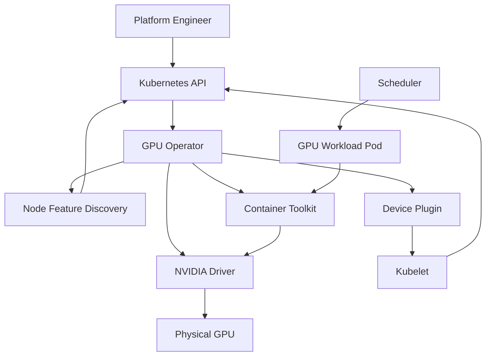

# Volume 10 — Kubernetes GPU Platform

Kubernetes schedules containers, but a production GPU platform requires much more than exposing a device file to a Pod. Nodes need compatible drivers, container runtime integration, device discovery, health reporting, scheduling resources, labels, telemetry, upgrade coordination, and failure recovery. Without a lifecycle architecture, every GPU node becomes a manually maintained exception.

This volume explains how NVIDIA GPU resources become schedulable Kubernetes infrastructure. It begins with the control flow from hardware discovery to Pod admission, then develops the GPU Operator architecture, device plugin, feature discovery, runtime integration, driver containers, Helm lifecycle, validation, upgrades, and production troubleshooting.

| Volume field | Value |
|---|---|
| Difficulty | Advanced |
| Estimated reading time | 18–24 hours |
| Prerequisites | Kubernetes operations and Volumes 01–09 |
| Primary focus | Production Kubernetes GPU lifecycle |
| Outcome | Design, deploy, validate, upgrade, and troubleshoot a GPU-enabled Kubernetes platform |

## The Big Picture

**Figure 10.0.1 — Kubernetes GPU enablement is a lifecycle pipeline.** Discovery, software installation, resource advertisement, scheduling, runtime configuration, and health must agree before a Pod can use a GPU reliably.

## Planned Chapter Sequence

1. Why Kubernetes Needs a GPU Platform Layer
2. GPU Resource Discovery and Scheduling
3. NVIDIA Container Toolkit and Runtime Integration
4. Kubernetes Device Plugin
5. Node Feature Discovery and GPU Feature Discovery
6. GPU Operator Architecture
7. Driver Containers and Host-Installed Drivers
8. RuntimeClass and Workload Admission
9. Helm Deployment and Configuration
10. Validation, Upgrades, and Rollback
11. Production Troubleshooting
12. Volume 10 Summary

## Planned Labs

- Inspect a Kubernetes GPU node
- Install and validate GPU Operator
- Diagnose a missing allocatable GPU
- Perform a controlled GPU platform upgrade

No pull request will be opened until the complete chapter and lab set exists and the branch passes a full Docusaurus validation review.
