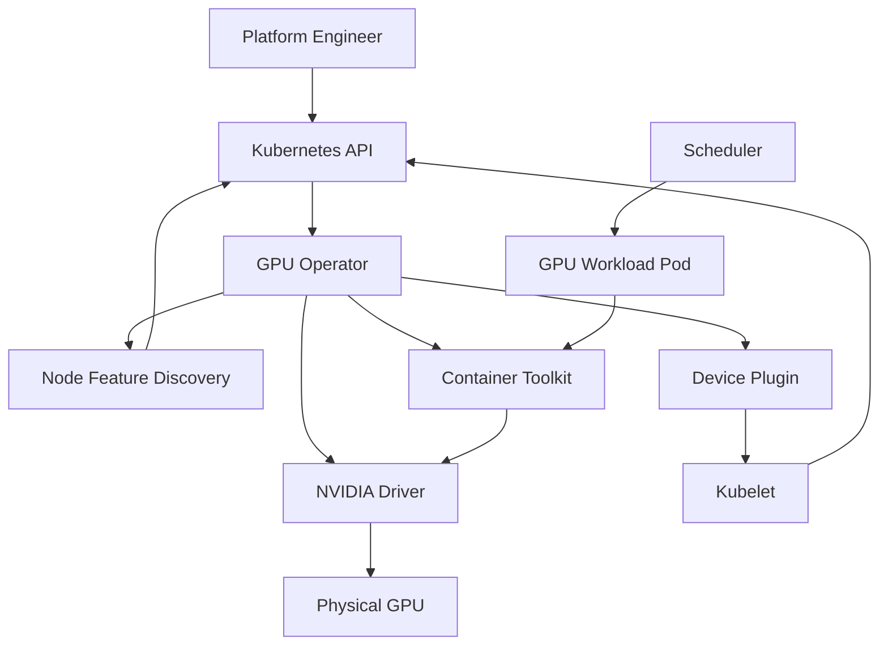

# Volume 10 — Kubernetes GPU Platform

Kubernetes can place Pods, but a production GPU platform requires a deeper operating model than “install a driver and request a device.” A usable GPU node needs a compatible kernel module, runtime integration, discoverable resources, node labels, health reporting, scheduling policy, telemetry, validation, and controlled upgrades. If any of those layers drift, GPU workloads become slow to start, hard to support, or impossible to recover at scale.

This volume explains how NVIDIA GPU resources become a managed Kubernetes platform. It starts with the control path from hardware to schedulable resource, then builds the runtime and device-plumbing model, the operator-managed node stack, topology-aware scheduling, observability, installation, upgrades, and production troubleshooting. The goal is not only to make GPUs work, but to make them predictable under change.

| Volume field | Value |
|---|---|
| Difficulty | Advanced |
| Estimated reading time | 18–24 hours |
| Prerequisites | Kubernetes operations and Volumes 01–09 |
| Primary focus | Production Kubernetes GPU lifecycle |
| Outcome | Design, deploy, validate, upgrade, and troubleshoot a GPU-enabled Kubernetes platform |

## The Big Picture

**Figure 10.0.1 — Kubernetes GPU enablement is a lifecycle pipeline.** Discovery, software installation, resource advertisement, scheduling, runtime configuration, and health must agree before a Pod can use a GPU reliably.

## What This Volume Covers

The chapters are arranged from first principles to production operations:

1. Why Kubernetes Needs a GPU Platform Layer
2. GPU Software Lifecycle in Kubernetes
3. NVIDIA Container Toolkit, RuntimeClass, and CDI
4. Kubernetes Device Plugin and Kubernetes Resource Model
5. Node Feature Discovery and GPU Feature Discovery
6. GPU Operator Architecture
7. Driver Containers and Node Operands
8. GPU Scheduling and Topology
9. GPU Observability with DCGM
10. Production Installation and Configuration
11. Upgrades and Production Troubleshooting
12. Volume 10 Summary

The first four chapters establish the platform contract. The remaining chapters show how that contract is deployed, observed, upgraded, and recovered in a real cluster.

## Planned Labs

- Inspect a Kubernetes GPU node
- Install and validate GPU Operator
- Diagnose a missing allocatable GPU
- Perform a controlled GPU platform upgrade

## How to Read This Volume

- Start with Chapter 01 to build the control-path mental model.
- Read Chapters 02 to 04 as one sequence: lifecycle, runtime integration, and resource advertisement are separate layers that must line up.
- Use Chapters 05 to 08 to understand how the platform becomes schedulable and operable.
- Treat Chapters 09 to 12 as the production runbook: observe, install, upgrade, troubleshoot, and summarize the platform.

## Cross References

- [Volume 03 — CUDA Software Stack](../volume-03/chapter-02-cuda-software-stack)
- [Volume 07 — GPU Networking](../volume-07/index)
- [Volume 08 — InfiniBand](../volume-08/index)
