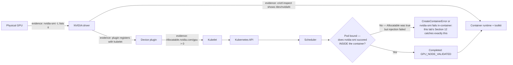

# Lab 01 — Inspect a Kubernetes GPU Node

| Field | Value |
|---|---|
| Chapter | 02 — GPU Software Lifecycle in Kubernetes |
| Difficulty / time | Intermediate / 60 minutes |
| Type | Exploration and evidence collection |
| Audience | Platform engineers, SREs, and GPU infrastructure engineers |

## 1. Objective

Establish evidence that one Kubernetes node can discover its NVIDIA GPU, advertise an allocatable extended resource, and run a one-GPU container. The result is a baseline for later incident and upgrade decisions, not a benchmark.

## 2. Production Story

An application team reports that a cluster has GPU nodes, yet their Pod remains Pending. The node may have a working driver while Kubernetes has no allocatable resource, or it may advertise a resource while the runtime cannot start CUDA. Inspect the dependency chain before changing it.

## 3. Learning Outcomes

By completion, you can collect host, runtime, device-plugin, kubelet, and workload evidence; distinguish Capacity from Allocatable; and identify the first failed layer.

## 4. Architecture



**Figure — this lab validates every edge above, in order.** Sections 9-10 prove the host and Kubernetes-state edges; Section 11 crosses the `Bound` decision point; Section 12 is the only step that actually confirms the `Yes` branch instead of assuming it from Pod phase.

## 5. Prerequisites

- A non-production or approved GPU node, `kubectl` access, and permission to create Pods.
- SSH or console access to the selected node for host checks.
- An approved CUDA container image available to the cluster. Substitute it below; do not assume public-registry access.

## 6. Safety and Change Boundaries

This lab is read-only except for one named validation Pod and a local evidence directory. Do not restart kubelet, edit runtime configuration, drain a node, or run the validation Pod against capacity reserved for production work.

## 7. Environment and Variables

Record the client and cluster context first.

**Purpose:** Confirm that commands target the intended cluster.

**Command:**
```bash
kubectl config current-context
kubectl get nodes -o wide
```

**Expected evidence:**
```text
$ kubectl config current-context
gpu-staging-us-east-1

$ kubectl get nodes -o wide
NAME          STATUS   ROLES    AGE   VERSION   INTERNAL-IP   OS-IMAGE             KERNEL-VERSION
cpu-node-01   Ready    <none>   40d   v1.29.4   10.0.4.11     Ubuntu 22.04.4 LTS   5.15.0-1053-aws
gpu-node-07   Ready    <none>   12d   v1.29.4   10.0.4.27     Ubuntu 22.04.4 LTS   5.15.0-1053-aws
gpu-node-11   Ready    <none>   3d    v1.29.4   10.0.4.31     Ubuntu 22.04.4 LTS   5.15.0-1053-aws
```
`gpu-staging-us-east-1` matching the intended cluster is the whole point of this step — proceeding on the wrong context turns a read-only inspection into an accidental production change. `STATUS Ready` on `gpu-node-07`/`gpu-node-11` confirms kubelet is reporting in; it does **not** yet confirm either node has GPU capacity — that's the next step, deliberately kept separate.

**Explanation:** Context mistakes can turn a safe inspection into a production change.

**Common-failure interpretation:** Authentication or authorization errors require the cluster administrator; do not work around them with broader credentials.

Select a node only after confirming resource advertisement.

**Purpose:** List the Kubernetes view of GPU Capacity and Allocatable.

**Command:**
```bash
kubectl get nodes -o custom-columns=NAME:.metadata.name,CAPACITY:.status.capacity.nvidia\.com/gpu,ALLOCATABLE:.status.allocatable.nvidia\.com/gpu
export GPU_NODE='<approved-gpu-node>'
```

**Expected evidence:**
```text
$ kubectl get nodes -o custom-columns=NAME:.metadata.name,CAPACITY:.status.capacity.nvidia\.com/gpu,ALLOCATABLE:.status.allocatable.nvidia\.com/gpu
NAME          CAPACITY   ALLOCATABLE
cpu-node-01   <none>     <none>
gpu-node-07   8          8
gpu-node-11   8          0

$ export GPU_NODE='gpu-node-07'
```
`CAPACITY 8 / ALLOCATABLE 8` on `gpu-node-07` is the number to select for a clean baseline run. `gpu-node-11` showing `CAPACITY 8 / ALLOCATABLE 0` is a real example of the exact failure this lab exists to catch: the kubelet reported the node's total device count (`Capacity`, from the device plugin's last successful registration) but nothing is currently schedulable (`Allocatable`) — a driver reload, plugin crash, or reset in progress. Do not select that node for the baseline run; it belongs in [Lab 03](./lab-03-diagnose-a-missing-allocatable-gpu) instead.

**Explanation:** Capacity is what kubelet reports; Allocatable is what scheduling may consume after reservations.

**Common-failure interpretation:** Empty columns are a diagnosis target, not proof that hardware is absent; continue with the layered checks in this lab.

## 8. Components and Data Flow

| Layer | Responsibility | Evidence |
|---|---|---|
| Driver | Enumerates and controls the GPU | `nvidia-smi` |
| Runtime/toolkit | Makes GPU devices and libraries available to containers | runtime configuration and workload result |
| Device plugin | Registers `nvidia.com/gpu` with kubelet | Pod state and plugin logs |
| Kubelet | Publishes node resources | Node status |
| Scheduler | Binds a Pod that requests a GPU | Pod events and node assignment |

## 9. Procedure: Inspect Kubernetes State

**Purpose:** Capture the node’s labels, conditions, taints, and advertised resources.

**Command:**
```bash
kubectl describe node "$GPU_NODE"
kubectl get node "$GPU_NODE" -o jsonpath='{.status.capacity.nvidia\.com/gpu}{" capacity\n"}{.status.allocatable.nvidia\.com/gpu}{" allocatable\n"}'
```

**Expected evidence:**
```text
$ kubectl describe node "$GPU_NODE" | grep -A6 'Conditions:'
Conditions:
  Type             Status  LastHeartbeatTime  Reason              Message
  ----             ------  -----------------  ------              -------
  MemoryPressure   False   ...                KubeletHasSufficientMemory
  DiskPressure     False   ...                KubeletHasNoDiskPressure
  PIDPressure      False   ...                KubeletHasSufficientPID
  Ready            True    ...                KubeletReady

$ kubectl describe node "$GPU_NODE" | grep -A2 'Taints:'
Taints:             nvidia.com/gpu=present:NoSchedule

$ kubectl get node "$GPU_NODE" -o jsonpath='{.status.capacity.nvidia\.com/gpu}{" capacity\n"}{.status.allocatable.nvidia\.com/gpu}{" allocatable\n"}'
8 capacity
8 allocatable
```
`Ready True` plus zero pressure conditions means kubelet itself is healthy — necessary but, as this lab keeps emphasizing, not sufficient. The `nvidia.com/gpu=present:NoSchedule` taint is a deliberate pool-isolation control: a Pod without the matching toleration will never be considered for this node regardless of allocatable capacity, which is exactly the kind of thing that produces a Pending Pod with no obvious resource shortage. `8 capacity` / `8 allocatable` matching confirms no GPU is currently reserved by another allocation on this node.

**Explanation:** Labels explain capability selection; taints and allocatable values explain why a request may not schedule.

**Common-failure interpretation:** A NotReady node is a cluster/node-health issue. Missing resources move the investigation to Lab 03.

**Purpose:** Identify the deployed GPU platform operands without assuming their namespace or names.

**Command:**
```bash
kubectl get pods -A -o wide | grep -Ei 'nvidia|gpu-feature|node-feature|dcgm' || true
```

**Expected evidence:**
```text
$ kubectl get pods -A -o wide | grep -Ei 'nvidia|gpu-feature|node-feature|dcgm' || true
gpu-operator   nvidia-driver-daemonset-xk2p9        1/1   Running   0   3d   10.0.4.27   gpu-node-07
gpu-operator   nvidia-container-toolkit-daemonset-9j4   1/1   Running   0   3d   10.0.4.27   gpu-node-07
gpu-operator   nvidia-device-plugin-daemonset-vqz2t  1/1   Running   0   3d   10.0.4.27   gpu-node-07
gpu-operator   gpu-feature-discovery-4tnkr           1/1   Running   0   3d   10.0.4.27   gpu-node-07
gpu-operator   nvidia-dcgm-exporter-p8m2x            1/1   Running   0   3d   10.0.4.27   gpu-node-07
```
Five operands, one Pod per DaemonSet on `gpu-node-07`, all `1/1 Running` — this is what an operator-managed node looks like. `1/1 Running` proves the Pod's own container started; it does **not** prove the driver module actually loaded or the plugin actually registered — those are the host and Kubernetes-state checks in Sections 9-10, which is exactly why this step and the next two are kept as separate pieces of evidence instead of one "everything's green" summary.

**Explanation:** The `|| true` preserves a successful inspection when the search has no matches.

**Common-failure interpretation:** No matching Pods can be valid for a standalone deployment; establish the deployed ownership model before modifying components.

## 10. Procedure: Inspect the Host (Hardware Only)

Run the following on `$GPU_NODE` through the approved console or SSH path.

**Purpose:** Prove that the host driver can enumerate GPU devices and report topology.

**Command:**
```bash
nvidia-smi
nvidia-smi -L
nvidia-smi topo -m
```

**Expected evidence:**
```text
$ nvidia-smi
+-----------------------------------------------------------------------------------------+
| NVIDIA-SMI 550.90.07              Driver Version: 550.90.07      CUDA Version: 12.4      |
|-----------------------------------------+------------------------+----------------------+
| GPU  Name                 Persistence-M | Bus-Id          Disp.A | Volatile Uncorr. ECC |
| Fan  Temp   Perf          Pwr:Usage/Cap |           Memory-Usage | GPU-Util  Compute M. |
|===========================================+========================+======================|
|   0  NVIDIA A100-SXM4-80GB          On  | 00000000:1B:00.0 Off  |                    0 |
| N/A   34C    P0             62W / 400W |      4MiB / 81920MiB |      0%      Default |
+-----------------------------------------------------------------------------------------+

$ nvidia-smi -L
GPU 0: NVIDIA A100-SXM4-80GB (UUID: GPU-3a1e9f2b-6c7d-4e91-9a02-1f8b7c0d5e11)

$ nvidia-smi topo -m
        GPU0  CPU Affinity  NUMA Affinity
GPU0     X    0-31          0
```
`Driver Version: 550.90.07` and `CUDA Version: 12.4` are host driver facts, independent of anything Kubernetes reports — this is the ground truth Section 9's `Allocatable` number depends on but cannot itself confirm. `4MiB / 81920MiB` memory used on an otherwise-idle node is normal driver overhead, not a leak. Record the `UUID` from `nvidia-smi -L` now — it is the join key you will match against the validation Pod's in-container output in Section 12, proving the exact physical device that was allocated is the one the container actually received.

**Explanation:** Kubernetes cannot repair a GPU that the host driver cannot initialize.

**Common-failure interpretation:** “Failed to communicate” or no devices requires driver, kernel, PCIe, firmware, or passthrough investigation before device-plugin work.

**Purpose:** Record the runtime configuration that should select NVIDIA support.

**Command:**
```bash
sudo crictl info
sudo grep -R "nvidia" /etc/containerd /etc/nvidia-container-runtime 2>/dev/null || true
```

**Expected evidence:**
```text
$ sudo crictl info | grep -A3 '"runtimeType"'
      "runtimeType": "io.containerd.runc.v2",
      "runtimeEngine": "",
      "runtimeRoot": "",
      "PodSandboxImage": "registry.k8s.io/pause:3.9"

$ sudo grep -R "nvidia" /etc/containerd /etc/nvidia-container-runtime 2>/dev/null || true
/etc/containerd/config.toml:  default_runtime_name = "nvidia"
/etc/containerd/config.toml:[plugins."io.containerd.grpc.v1.cri".containerd.runtimes.nvidia]
/etc/nvidia-container-runtime/config.toml:accept-nvidia-visible-devices-as-volume-mounts = false
```
`default_runtime_name = "nvidia"` means containerd routes container creation through the NVIDIA runtime handler for every container on this node by default (a common operator-managed configuration) rather than requiring each Pod to declare a RuntimeClass explicitly — confirm which model this cluster uses before assuming a Pod without an explicit RuntimeClass will get GPU support.

**Explanation:** The first command is read-only; the second is intentionally tolerant of distribution-specific paths.

**Common-failure interpretation:** Missing configuration does not by itself prove failure; use the validation Pod to test the effective runtime path.

## 11. Validation Workload

Replace `&lt;approved-cuda-image&gt;` with a tested image that includes `nvidia-smi`. Save the manifest locally as `gpu-node-validation.yaml`.

```yaml
apiVersion: v1
kind: Pod
metadata:
  name: gpu-node-validation
spec:
  restartPolicy: Never
  nodeName: <approved-gpu-node>
  containers:
    - name: cuda
      image: <approved-cuda-image>
      command: ["bash", "-lc", "nvidia-smi && echo GPU_NODE_VALIDATED"]
      resources:
        limits:
          nvidia.com/gpu: 1
```

**Purpose:** Create the bounded, one-GPU validation Pod.

**Command:**
```bash
kubectl apply -f gpu-node-validation.yaml
kubectl get pod gpu-node-validation -w
```

**Expected evidence:**
```text
$ kubectl apply -f gpu-node-validation.yaml
pod/gpu-node-validation created

$ kubectl get pod gpu-node-validation -w
NAME                   READY   STATUS              RESTARTS   AGE
gpu-node-validation    0/1     Pending             0          1s
gpu-node-validation    0/1     ContainerCreating    0          3s
gpu-node-validation    1/1     Running             0          9s
gpu-node-validation    0/1     Completed           0          11s
```
The `Pending` → `ContainerCreating` → `Running` → `Completed` sequence crosses exactly the `Bound` decision point in this lab's Architecture diagram: `ContainerCreating` is where runtime injection happens, and a stall here (rather than a fast pass-through) is the first symptom of an injection failure — a Pending Pod and a container stuck in `ContainerCreating` point at different boundaries even though both look like "the Pod isn't ready yet."

**Explanation:** `nodeName` intentionally tests this selected node; remove it only when testing scheduler placement.

**Common-failure interpretation:** Pending Pods require event inspection. `ImagePullBackOff` is a registry issue; `CreateContainerError` often points to runtime integration.

## 12. Verification and Acceptance Criteria

**Purpose:** Verify the executed container rather than only its Kubernetes phase.

**Command:**
```bash
kubectl logs gpu-node-validation
kubectl describe pod gpu-node-validation
```

**Expected evidence:**
```text
$ kubectl logs gpu-node-validation
+-----------------------------------------------------------------------------------------+
| NVIDIA-SMI 550.90.07              Driver Version: 550.90.07      CUDA Version: 12.4      |
|===========================================+========================+======================|
|   0  NVIDIA A100-SXM4-80GB          On  | 00000000:1B:00.0 Off  |                    0 |
+-----------------------------------------------------------------------------------------+
GPU_NODE_VALIDATED

$ kubectl describe pod gpu-node-validation | tail -4
Events:
  Type    Reason     Age   From               Message
  ----    ------     ----  ----               -------
  Normal  Scheduled  40s   default-scheduler  Successfully assigned default/gpu-node-validation to gpu-node-07
  Normal  Pulled     38s   kubelet            Container image already present on machine
  Normal  Created    38s   kubelet            Created container cuda
  Normal  Started    37s   kubelet            Started container cuda
```
The `NVIDIA-SMI` banner appearing inside `kubectl logs` output (not just on the host) is the proof this whole lab exists to produce: the container process — not just the node — can see the GPU. Confirm the `Bus-Id 00000000:1B:00.0` here matches the host-side `nvidia-smi` output from Section 10; a mismatch would mean the wrong physical device was injected. `GPU_NODE_VALIDATED` on its own line confirms the shell command completed after `nvidia-smi` returned success, not that it crashed partway through. Events showing `Scheduled → Pulled → Created → Started` with no `Failed`/`BackOff` reason between them means every layer up to and including runtime injection succeeded cleanly.

**Explanation:** Completion proves the container initialized the assigned GPU through the runtime.

**Common-failure interpretation:** A successful schedule with failing logs isolates the problem above resource advertisement; retain the events and runtime evidence.

Acceptance requires: host enumeration (where access exists), a non-empty allocatable resource, a completed one-GPU Pod, and logs that show the explicit marker.

## 13. Observability and Evidence Collection

**Purpose:** Create a small incident-ready evidence bundle.

**Command:**
```bash
mkdir -p gpu-node-baseline
kubectl describe node "$GPU_NODE" > gpu-node-baseline/node-describe.txt
kubectl get pod gpu-node-validation -o yaml > gpu-node-baseline/validation-pod.yaml
kubectl logs gpu-node-validation > gpu-node-baseline/validation.log
```

**Expected evidence:** Three timestampable files contain node, Pod, and workload evidence.

**Explanation:** Keep this bundle with the change or incident record; redact credentials if any appear.

**Common-failure interpretation:** If a Pod disappears before logs are collected, use namespace events and controller logs instead of recreating the failure.

## 14. Measurements and Baseline

Record GPU model, driver version, topology, allocatable count, validation start-to-completion time, idle utilization, memory use, temperature, and power. These are node-specific comparison values, not universal health thresholds.

## 15. Safe Failure Exercise

In a disposable cluster only, change the validation limit to `nvidia.com/gpu: 99` and inspect events; then restore the manifest before deleting the Pod.

**Purpose:** Observe scheduler evidence for an unsatisfiable extended-resource request.

**Command:**
```bash
kubectl describe pod gpu-node-validation
```

**Expected evidence:**
```text
$ kubectl describe pod gpu-node-validation | tail -4
Events:
  Type     Reason            Age   From               Message
  ----     ------            ----  ----               -------
  Warning  FailedScheduling  8s    default-scheduler  0/3 nodes are available:
    1 Insufficient nvidia.com/gpu, 2 node(s) didn't match Pod's node affinity/selector.
```
`Insufficient nvidia.com/gpu` naming the resource explicitly is the scheduler telling you the exact number requested (99) exceeds what any node advertises — this is the correct, boring failure mode for an unsatisfiable request, and it is the same evidence shape the "Pod Pending" row of the troubleshooting table below uses for a real capacity shortage. Contrast this event text with Section 12's clean `Scheduled` event: an event with `Reason: FailedScheduling` never reaches `ContainerCreating` at all, which is how you can tell from the event log alone, without watching Pod phase, which side of the Architecture diagram's `Bound` decision a failure happened on.

**Explanation:** This changes only a disposable validation workload and does not alter node software.

**Common-failure interpretation:** If it schedules, the test cluster has at least 99 allocatable GPUs or the manifest was not updated; stop and verify the applied spec.

## 16. Troubleshooting Decision Table

| Symptom | First evidence | Likely layer |
|---|---|---|
| `nvidia-smi` fails | driver and kernel logs | hardware/driver |
| No allocatable GPU | plugin state and kubelet logs | plugin/registration |
| Pod Pending | Pod events, taints, requests | scheduler/policy |
| Pod runs but CUDA fails | container logs and runtime config | toolkit/runtime |
| Missing capability labels | discovery Pods and labels | NFD/GFD |

## 17. Cleanup and Operational Handoff

**Purpose:** Remove only the disposable validation workload.

**Command:**
```bash
kubectl delete pod gpu-node-validation --ignore-not-found
```

**Expected evidence:** Kubernetes reports deletion or “not found.”

**Explanation:** Evidence files remain for review; no node component is changed.

**Common-failure interpretation:** A terminating Pod may need ordinary cluster investigation; do not force-delete it without confirming workload impact.

Handoff: attach the evidence bundle, selected node, driver/runtime versions, resource counts, validation result, and any deviation from acceptance criteria.

## 18. Summary, Challenges, and Further Reading

You validated the end-to-end node path. Next, run the same baseline across a node pool, compare topology and labels, and use [Lab 03](./lab-03-diagnose-a-missing-allocatable-gpu) when Allocatable is absent.

- [Volume 10 introduction](../index)
- [GPU Software Lifecycle in Kubernetes](../chapter-02-gpu-software-lifecycle-in-kubernetes)
- [Device Plugin and Kubernetes Resource Model](../chapter-04-device-plugin-and-kubernetes-resource-model)
