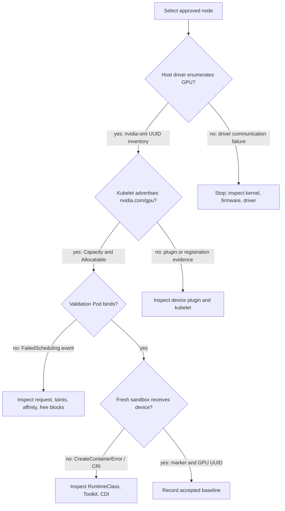

# Lab 01 — Inspect a Kubernetes GPU Node

| Field | Value |
|---|---|
| Chapter | 02 — GPU Software Lifecycle in Kubernetes |
| Difficulty / time | Intermediate / 60 minutes |
| Type | Exploration and evidence collection |
| Audience | Platform engineers, SREs, and GPU infrastructure engineers |

## 1. Objective

Establish evidence that one Kubernetes node can discover its NVIDIA GPU, advertise an allocatable extended resource, and run a one-GPU container. The result is a baseline for later incident and upgrade decisions, not a benchmark.

## 2. Production Story

An application team reports that a cluster has GPU nodes, yet their Pod remains Pending. The node may have a working driver while Kubernetes has no allocatable resource, or it may advertise a resource while the runtime cannot start CUDA. Inspect the dependency chain before changing it.

## 3. Learning Outcomes

By completion, you can collect host, runtime, device-plugin, kubelet, and workload evidence; distinguish Capacity from Allocatable; and identify the first failed layer.

## 4. Architecture



**Figure L10.1 — The lab follows the same decision path used during an incident.** Each transition has an observable proof and a stop condition.

## 5. Prerequisites

- A non-production or approved GPU node, `kubectl` access, and permission to create Pods.
- SSH or console access to the selected node for host checks.
- An approved CUDA validation image available to the cluster.

The commands below use the **illustrative** values:

```text
GPU_NODE=gpu-node-01
CUDA_VALIDATION_IMAGE=registry.internal.example/platform/cuda-validation@sha256:9a2f...7c10
```

Replace them with your reviewed node and immutable image digest.

## 6. Safety and Change Boundaries

This lab is read-only except for one named validation Pod and a local evidence directory. Do not restart kubelet, edit runtime configuration, drain a node, or run the validation Pod against capacity reserved for production work.

## 7. Environment

### Confirm the cluster context

**Purpose:** prevent a safe inspection from running against the wrong cluster.

```bash
kubectl config current-context
kubectl get nodes -o wide
```

**Representative output:**

```text
platform-lab-eu1

NAME          STATUS   ROLES    AGE   VERSION   INTERNAL-IP   OS-IMAGE
cpu-node-01   Ready    <none>   31d   v1.30.3   10.20.0.11    Ubuntu 24.04 LTS
gpu-node-01   Ready    <none>   31d   v1.30.3   10.20.0.21    Ubuntu 24.04 LTS
gpu-node-02   Ready    <none>   31d   v1.30.3   10.20.0.22    Ubuntu 24.04 LTS
```

`platform-lab-eu1` must match the approved context. `Ready` is general Kubernetes evidence only. It does not prove GPU readiness.

Set reviewed variables:

```bash
export GPU_NODE='gpu-node-01'
export CUDA_VALIDATION_IMAGE='registry.internal.example/platform/cuda-validation@sha256:9a2f...7c10'
```

### List GPU Capacity and Allocatable

```bash
kubectl get nodes -o custom-columns='NAME:.metadata.name,CAPACITY:.status.capacity.nvidia\.com/gpu,ALLOCATABLE:.status.allocatable.nvidia\.com/gpu'
```

**Representative output:**

```text
NAME          CAPACITY   ALLOCATABLE
cpu-node-01   <none>     <none>
gpu-node-01   8          8
gpu-node-02   8          8
```

`capacity=8` means kubelet reports eight healthy units. `allocatable=8` is the scheduling quantity before existing Pod allocations. Empty CPU-node fields are expected. Empty GPU-node fields would move the investigation to host and plugin evidence.

## 8. Components

| Layer | Responsibility | Evidence |
|---|---|---|
| Driver | Enumerates and controls the GPU | `nvidia-smi` |
| Runtime/toolkit | Makes assigned devices available to containers | fresh validation Pod and CRI events |
| Device plugin | Registers `nvidia.com/gpu` with kubelet | node Capacity/Allocatable and plugin logs |
| Kubelet | Publishes node resources | Node status |
| Scheduler | Binds a Pod that requests a GPU | Pod events and node assignment |

## 9. Deployment Steps — Inspect Kubernetes State

### Capture conditions, taints, and resources

```bash
kubectl get node "$GPU_NODE" -o json | jq '{conditions:[.status.conditions[]|select(.type=="Ready" or .type=="MemoryPressure" or .type=="DiskPressure")|{type,status,reason}],taints:.spec.taints,capacity:.status.capacity["nvidia.com/gpu"],allocatable:.status.allocatable["nvidia.com/gpu"]}'
```

**Representative output:**

```json
{
  "conditions": [
    {"type":"MemoryPressure","status":"False","reason":"KubeletHasSufficientMemory"},
    {"type":"DiskPressure","status":"False","reason":"KubeletHasNoDiskPressure"},
    {"type":"Ready","status":"True","reason":"KubeletReady"}
  ],
  "taints": [
    {"key":"nvidia.com/gpu","value":"present","effect":"NoSchedule"}
  ],
  "capacity": "8",
  "allocatable": "8"
}
```

The GPU taint reserves the node for Pods with an approved toleration. It does not make the node unschedulable to every workload. Capacity and Allocatable prove resource registration, not runtime injection.

### Identify node-local operands

```bash
kubectl get pods -A --field-selector spec.nodeName="$GPU_NODE" -o wide | grep -Ei 'nvidia|gpu-feature|node-feature|dcgm' || true
```

**Representative output:**

```text
gpu-operator   nvidia-driver-daemonset-m4k7q             1/1   Running   0   gpu-node-01
gpu-operator   nvidia-container-toolkit-daemonset-x5m2p  1/1   Running   0   gpu-node-01
gpu-operator   nvidia-device-plugin-daemonset-bp7jf      1/1   Running   0   gpu-node-01
gpu-operator   gpu-feature-discovery-n2v8d               1/1   Running   0   gpu-node-01
gpu-operator   nvidia-dcgm-exporter-7p8wd                1/1   Running   0   gpu-node-01
```

This output establishes deployment presence. `Running` alone does not prove the driver, runtime, or metrics path. The next steps test those contracts.

## 10. Validation — Inspect the Host

Run these commands on `$GPU_NODE` through the approved access path.

### Prove host driver enumeration

```bash
nvidia-smi --query-gpu=index,name,uuid,driver_version,memory.total --format=csv,noheader
```

**Representative output:**

```text
0, NVIDIA H100 80GB HBM3, GPU-3c2e38d1-6a2c-4a31-b44b-9d82a8c80735, 550.54.15, 81559 MiB
1, NVIDIA H100 80GB HBM3, GPU-722d1344-1b6d-4a95-8cb9-1c572eb5ad94, 550.54.15, 81559 MiB
... six additional rows ...
```

The index is a local convenience; record UUIDs as stable identities. The driver version is representative, not a recommendation. If the command prints “couldn’t communicate with the NVIDIA driver,” stop before plugin diagnosis.

### Record topology

```bash
nvidia-smi topo -m
```

**Representative excerpt:**

```text
        GPU0  GPU1  NIC0  CPU Affinity  NUMA Affinity
GPU0     X    NV18  NODE  0-31          0
GPU1    NV18   X    NODE  0-31          0
NIC0    NODE  NODE   X
```

The table is a baseline for later placement comparison. `NV18` and `NODE` meanings depend on the platform and tool legend; preserve the real output rather than converting it into a universal claim.

### Record runtime evidence

```bash
sudo crictl info | jq '{runtimeName:.status.runtimeName,runtimeVersion:.status.runtimeVersion,config:.config}'
```

**Representative excerpt:**

```json
{
  "runtimeName": "containerd",
  "runtimeVersion": "1.7.18",
  "config": {
    "containerd": {
      "runtimes": {
        "nvidia": {
          "runtimeType": "io.containerd.runc.v2"
        }
      }
    }
  }
}
```

This proves a configured handler in the effective CRI view. Only a fresh Pod proves it functions.

## 11. Verification — Create a One-GPU Workload

Create `gpu-node-validation.yaml`:

```yaml
apiVersion: v1
kind: Pod
metadata:
  name: gpu-node-validation
spec:
  restartPolicy: Never
  nodeName: gpu-node-01
  tolerations:
    - key: nvidia.com/gpu
      operator: Equal
      value: present
      effect: NoSchedule
  containers:
    - name: cuda
      image: registry.internal.example/platform/cuda-validation@sha256:9a2f...7c10
      command:
        - bash
        - -lc
        - |
          nvidia-smi --query-gpu=index,uuid,name --format=csv,noheader
          echo GPU_NODE_VALIDATED
      resources:
        limits:
          nvidia.com/gpu: 1
```

The digest and node are illustrative; replace them before applying.

```bash
kubectl apply -f gpu-node-validation.yaml
kubectl get pod gpu-node-validation -w
```

**Representative lifecycle:**

```text
NAME                  READY   STATUS              NODE
gpu-node-validation   0/1     ContainerCreating   gpu-node-01
gpu-node-validation   0/1     Completed           gpu-node-01
```

`Completed` proves the command exited successfully. Read logs to prove the device path:

```bash
kubectl logs gpu-node-validation
```

```text
0, GPU-3c2e38d1-6a2c-4a31-b44b-9d82a8c80735, NVIDIA H100 80GB HBM3
GPU_NODE_VALIDATED
```

The container saw one assigned GPU and printed the explicit marker. The output does not benchmark performance or validate multi-GPU topology.

## 12. Observability

```bash
kubectl -n gpu-operator get pod -l app=nvidia-dcgm-exporter --field-selector spec.nodeName="$GPU_NODE"
```

**Representative output:**

```text
NAME                           READY   STATUS    RESTARTS
nvidia-dcgm-exporter-7p8wd     1/1     Running   0
```

Where Prometheus is available, verify `up{job="dcgm-exporter"}=1` and a recent GPU UUID series. A Running exporter without a healthy target is not sufficient.

## 13. Performance Measurements

Record, but do not enforce as universal thresholds:

| Measurement | Representative value | Interpretation |
|---|---:|---|
| Validation Pod create-to-complete | 11.4 s | Includes scheduling, image availability, sandbox, and command time |
| Allocatable GPUs | 8 | Kubernetes resource contract |
| Idle temperature | 38 °C | Node-specific baseline |
| Idle power | 71 W | Node-specific baseline |
| Driver version | 550.54.15 | Representative compatibility-set field |

Repeat measurements on equivalent nodes before using them for regression detection.

## 14. Failure Injection

Create `gpu-node-unschedulable.yaml` by copying the validation manifest, changing the name to `gpu-node-unschedulable`, removing `nodeName`, and requesting 99 GPUs.

```bash
kubectl apply -f gpu-node-unschedulable.yaml
kubectl describe pod gpu-node-unschedulable | sed -n '/Events:/,$p'
```

**Representative broken output:**

```text
Events:
  Warning  FailedScheduling  8s  default-scheduler  0/3 nodes are available:
  1 node(s) had untolerated taint {node-role.kubernetes.io/control-plane: },
  2 Insufficient nvidia.com/gpu.
```

The scheduler cannot satisfy 99 units. This is safe because it changes only a disposable Pod request. It does not alter node software.

## 15. Troubleshooting

| Symptom | First evidence | Likely layer |
|---|---|---|
| `nvidia-smi` fails | driver and kernel logs | hardware/driver |
| No allocatable GPU | plugin state and kubelet logs | plugin/registration |
| Pod Pending | Pod events, taints, requests | scheduler/policy |
| Pod bound, `CreateContainerError` | Pod event and CRI log | toolkit/runtime |
| Pod completes but metrics absent | exporter readiness and scrape target | observability |

### Broken runtime example

```text
Warning  Failed  kubelet  OCI runtime create failed:
requested CDI device nvidia.com/gpu=0 not found
```

The Pod is bound and allocation reached the runtime. Inspect CDI generation and Toolkit configuration; scheduler changes are irrelevant.

### Broken plugin example

```text
nvidia-device-plugin-daemonset-bp7jf   0/1   CrashLoopBackOff
error creating plugin manager: no valid devices found
```

If host `nvidia-smi` succeeds, compare plugin configuration and mounts. If it fails, return to the driver gate.

## 16. Cleanup

```bash
kubectl delete pod gpu-node-validation gpu-node-unschedulable --ignore-not-found
```

**Representative output:**

```text
pod "gpu-node-validation" deleted
pod "gpu-node-unschedulable" deleted
```

No node component is changed. Keep the evidence bundle for review.

## 17. Challenge Exercises

- Repeat the baseline across every node in a canary pool and diff UUID count, labels, runtime handler, and topology.
- Add a script that fails when `Ready=True` but GPU Allocatable is missing.
- Verify the Prometheus sample timestamp for the selected UUID.
- Compare a one-GPU Pod with a multi-GPU Pod and document what additional topology evidence is required.

## 18. Further Reading

- [Volume 10 introduction](../index)
- [GPU Software Lifecycle in Kubernetes](../chapter-02-gpu-software-lifecycle-in-kubernetes)
- [Device Plugin and Kubernetes Resource Model](../chapter-04-device-plugin-and-kubernetes-resource-model)
- [Lab 03 — Diagnose a Missing Allocatable GPU](./lab-03-diagnose-a-missing-allocatable-gpu)
