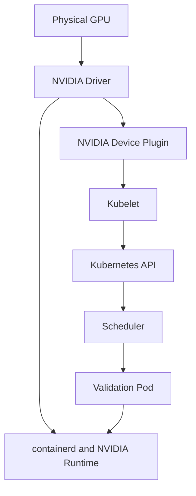

# Lab 01 — Inspect a Kubernetes GPU Node

```yaml
Title: Inspect a Kubernetes GPU Node
Volume: 10
Chapter: 02
Difficulty: Intermediate
Estimated Time: 60 Minutes
Prerequisites: Kubernetes administration, kubectl access, one NVIDIA GPU node
Target Platform: Kubernetes with containerd
Target Audience: Platform Engineers, SREs, GPU Infrastructure Engineers
Lab Type: Exploration
```

## 1. Objective

Prove that one Kubernetes node can enumerate NVIDIA GPU hardware, load the driver, expose the device through the container runtime, advertise `nvidia.com/gpu`, and run a validation Pod end to end.

## 2. Scenario

An operations team sees a node that looks healthy in Kubernetes, but workload placement is uncertain. A host-level `nvidia-smi` is not enough. This lab builds a layered baseline so you can tell the difference between host health, runtime integration, and Kubernetes resource advertisement.

## 3. Learning Outcomes

After this lab, you should be able to:

- identify GPU nodes from Kubernetes state;
- confirm host-side GPU and driver health;
- verify container runtime integration;
- correlate platform operands with the node;
- schedule a CUDA validation Pod;
- capture evidence you can reuse during incidents.

## 4. Architecture



## 5. Prerequisites

- A Kubernetes cluster with at least one node that physically contains an NVIDIA GPU.
- Permission to inspect Nodes and create Pods.
- Console or SSH access to the target node.
- A registry path that can pull the CUDA validation image used in this lab.

## 6. Environment

Run the following checks and record the results before you touch the workload path.

| Purpose | Command | Expected evidence | Explanation | Common failure interpretation |
|---|---|---|---|---|
| Confirm API and client access | `kubectl version` | Matching client/server versions or a clear version skew | Establishes the control plane you are troubleshooting against | `kubectl` cannot reach the cluster, or your context points elsewhere |
| Confirm runtime tooling | `kubectl get nodes -o wide` | Node list with OS and internal IP data | Gives you the candidate node list and basic node identity | No GPU node is visible, or the node pool is not joined |
| Confirm node inventory | `kubectl get nodes -o custom-columns=NAME:.metadata.name,GPU:.status.capacity.nvidia\\.com/gpu,ALLOCATABLE:.status.allocatable.nvidia\\.com/gpu` | A node with non-zero GPU capacity and allocatable values | Shows whether Kubernetes already sees the GPU as schedulable | Capacity or allocatable is missing, which usually means an upstream layer is failing |

Set a working variable for the node you want to inspect:

```bash
export GPU_NODE='<gpu-node-name>'
```

## 7. Components

| Component | Responsibility |
|---|---|
| NVIDIA driver | Controls the physical device and exposes it to the OS |
| Container Toolkit | Makes GPU devices and libraries visible inside containers |
| Device Plugin | Advertises schedulable GPU resources to Kubernetes |
| Node Feature Discovery | Publishes node capability labels |
| GPU Feature Discovery | Publishes GPU-specific labels |
| Kubelet | Tracks capacity, allocatable, and resource registration |
| Scheduler | Places Pods that request GPU resources |

## 8. Procedure

### 8.1 Identify the node and capture its state

| Purpose | Command | Expected evidence | Explanation | Common failure interpretation |
|---|---|---|---|---|
| Select a GPU node | `kubectl get nodes -o jsonpath='{range .items[?(@.status.capacity.nvidia\\.com/gpu)]}{.metadata.name}{"\n"}{end}'` | At least one node name prints | This is the safest way to find a node that already advertises GPU capacity | No output means the cluster is not advertising any GPU capacity |
| Inspect the node record | `kubectl describe node "$GPU_NODE"` | Capacity, allocatable, labels, taints, and events | This is the fastest way to see whether kubelet has registered the GPU resource | Missing allocatable or suspicious events point to plugin, kubelet, or policy issues |

### 8.2 Inspect host GPU and driver state

| Purpose | Command | Expected evidence | Explanation | Common failure interpretation |
|---|---|---|---|---|
| Confirm driver communication | `nvidia-smi` | GPU model, driver version, and device summary | Proves the OS can talk to the GPU through the NVIDIA driver | Driver communication errors mean host driver, kernel module, or hardware issues |
| List devices | `nvidia-smi -L` | One line per visible GPU | Verifies that the node can enumerate individual devices | No devices often means a driver or firmware problem |
| Inspect topology | `nvidia-smi topo -m` | GPU, CPU, and interconnect topology | Gives you the baseline for NUMA and placement analysis | Unexpected topology can explain poor placement or performance |

### 8.3 Inspect runtime integration

| Purpose | Command | Expected evidence | Explanation | Common failure interpretation |
|---|---|---|---|---|
| Read container runtime information | `sudo crictl info | grep -i -A4 runtime` | Runtime configuration details | Confirms that kubelet is pointing at the expected runtime stack | Wrong runtime handler or missing NVIDIA integration breaks GPU container startup |
| Look for NVIDIA runtime configuration | `sudo grep -R "nvidia" /etc/containerd /etc/nvidia-container-runtime 2>/dev/null` | Configuration entries that mention NVIDIA | Shows whether the host runtime has been wired for GPU containers | No matches usually means the node still needs runtime setup |

### 8.4 Inspect platform operands

| Purpose | Command | Expected evidence | Explanation | Common failure interpretation |
|---|---|---|---|---|
| Find GPU-related Pods | `kubectl get pods -A -o wide | grep -Ei 'nvidia|gpu-feature|node-feature|dcgm'` | Pods related to driver, toolkit, device plugin, discovery, or telemetry | Shows which operands are present in the environment | Missing Pods may be expected in a standalone deployment, but they can also indicate an incomplete platform install |

## 9. Validation

Create a short-lived validation manifest:

```yaml
apiVersion: v1
kind: Pod
metadata:
  name: gpu-node-validation
spec:
  restartPolicy: Never
  containers:
    - name: cuda
      image: nvcr.io/nvidia/cuda:12.4.1-base-ubuntu22.04
      command: ["bash", "-lc", "nvidia-smi && nvidia-smi -L"]
      resources:
        limits:
          nvidia.com/gpu: 1
```

| Purpose | Command | Expected evidence | Explanation | Common failure interpretation |
|---|---|---|---|---|
| Apply the validation Pod | `kubectl apply -f gpu-node-validation.yaml` | Pod object is created | Requests one GPU so the scheduler must bind a real GPU node | Admission, quota, or image policy may reject the Pod before it starts |
| Watch it start | `kubectl get pod gpu-node-validation -w` | Pod transitions to Running and then Completed | Confirms that scheduling and container startup both worked | Pending or ImagePullBackOff means the issue is above CUDA initialization |
| Read the logs | `kubectl logs gpu-node-validation` | `nvidia-smi` output from inside the container | Proves the container can access the host GPU through the runtime | Empty or failing logs point to runtime, driver, or device-plugin gaps |

## 10. Verification

| Purpose | Command | Expected evidence | Explanation | Common failure interpretation |
|---|---|---|---|---|
| Confirm placement | `kubectl get pod gpu-node-validation -o wide` | Pod scheduled on a GPU node | Verifies scheduler behavior | The Pod may have landed elsewhere because the GPU request was not honored or the node was not eligible |
| Confirm scheduling details | `kubectl describe pod gpu-node-validation` | Node assignment, events, and container state | Gives you the exact rejection or success path | Events usually explain Pending, scheduling, or runtime failures |
| Confirm allocatable count | `kubectl get node "$GPU_NODE" -o jsonpath='{.status.allocatable.nvidia\\.com/gpu}{"\n"}'` | A positive integer | Confirms that kubelet is advertising GPU capacity for scheduling | No value means the node is not exposing GPU resources to Kubernetes |

## 11. Observability

Capture a compact baseline bundle for the node.

| Purpose | Command | Expected evidence | Explanation | Common failure interpretation |
|---|---|---|---|---|
| Save node description | `kubectl describe node "$GPU_NODE" > gpu-node-baseline/node-describe.txt` | Node inventory and event history | Gives you a reusable snapshot for incident comparison | Missing or stale events make later diagnosis harder |
| Save cluster pod inventory | `kubectl get pods -A -o wide > gpu-node-baseline/pods.txt` | All Pods and their node placement | Lets you correlate platform operands with the node | If the GPU node hosts no GPU Pods, scheduling may still be healthy |
| Save validation logs | `kubectl logs gpu-node-validation > gpu-node-baseline/validation-log.txt` | CUDA validation output | Preserves the most important proof point | Empty logs mean the container never reached the command path |
| Save host GPU evidence | `nvidia-smi -q > gpu-node-baseline/nvidia-smi-q.txt` | Detailed GPU and driver state | Useful for later comparisons | Driver query failures point back to host-level issues |
| Save topology | `nvidia-smi topo -m > gpu-node-baseline/topology.txt` | Interconnect and topology data | Supports placement and performance analysis | Unusual topology can indicate a hardware or platform change |

## 12. Performance Measurements

Record idle utilization, memory use, temperature, power, and PCIe link state for the node you just validated. The purpose here is not to define a universal threshold. It is to create a node-specific baseline you can compare against after future changes.

## 13. Failure Injection

Use a disposable namespace and a temporary Pod that asks for too many GPUs.

| Purpose | Command | Expected evidence | Explanation | Common failure interpretation |
|---|---|---|---|---|
| Create an isolated namespace | `kubectl create namespace gpu-node-lab` | Namespace exists | Keeps the failure scoped | Skipping this step risks interfering with other workloads |
| Apply an over-requested Pod | `kubectl -n gpu-node-lab run too-many-gpus --image=nvcr.io/nvidia/cuda:12.4.1-base-ubuntu22.04 --restart=Never --overrides='{"spec":{"containers":[{"name":"too-many-gpus","image":"nvcr.io/nvidia/cuda:12.4.1-base-ubuntu22.04","command":["bash","-lc","sleep 300"],"resources":{"limits":{"nvidia.com/gpu":99}}}]}}'` | Pod remains Pending | Demonstrates the scheduler’s response when demand exceeds supply | If the Pod starts, the cluster is not enforcing the request you think it is |
| Observe the event | `kubectl -n gpu-node-lab describe pod too-many-gpus` | Insufficient GPU scheduling event | Confirms the failure is safe and expected | No event means the manifest may not have been applied correctly |

## 14. Troubleshooting

| Symptom | Likely layer | First checks |
|---|---|---|
| `nvidia-smi` fails on the host | Hardware or driver | PCI enumeration, kernel logs, driver module state |
| Host works but allocatable is absent | Device plugin or kubelet | plugin Pods, logs, and node registration |
| Pod is Pending | Scheduler policy | taints, selectors, quotas, and GPU count |
| Pod starts but CUDA fails | Runtime integration | toolkit and containerd configuration |
| Labels are missing | Discovery | Node Feature Discovery and GPU Feature Discovery |

## 15. Cleanup

| Purpose | Command | Expected evidence | Explanation | Common failure interpretation |
|---|---|---|---|---|
| Delete the validation Pod | `kubectl delete pod gpu-node-validation --ignore-not-found` | Pod is removed | Clears the test workload | Stuck Terminating usually points to finalizers or node issues |
| Delete the failure-injection Pod | `kubectl -n gpu-node-lab delete pod too-many-gpus --ignore-not-found` | Pod is removed | Returns the disposable namespace to a clean state | If the Pod never existed, the earlier apply likely failed |
| Remove the disposable namespace | `kubectl delete namespace gpu-node-lab --ignore-not-found` | Namespace disappears | Removes the scoped failure environment | Leftover resources mean cleanup did not finish |
| Remove the local manifest | `rm -f gpu-node-validation.yaml` | File is deleted locally | Keeps the workspace tidy | If the file remains, you may accidentally reapply it later |

## 16. Summary

You validated the GPU path from physical hardware to a Kubernetes workload and captured a baseline you can reuse during later incidents.

## 17. Challenge Exercises

- Repeat the inspection on every GPU node and compare the topology.
- Add a GPU-model selector to the validation Pod.
- Store the baseline bundle in version control with the cluster name and date.
- Compare host driver evidence before and after a controlled reboot.

## 18. Further Reading

- [Volume 10 Introduction](../index)
- [GPU Software Lifecycle in Kubernetes](../chapter-02-gpu-software-lifecycle-in-kubernetes)
- [Device Plugin and Kubernetes Resource Model](../chapter-04-device-plugin-and-kubernetes-resource-model)
