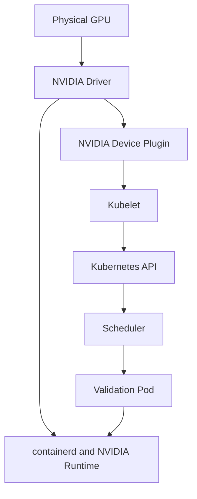

# Lab 01 — Inspect a Kubernetes GPU Node

```yaml
Title: Inspect a Kubernetes GPU Node
Volume: 10
Chapter: 02
Difficulty: Intermediate
Estimated Time: 60 Minutes
Prerequisites: Kubernetes administration, kubectl access, one NVIDIA GPU node
Target Platform: Kubernetes with containerd
Target Audience: Platform Engineers, SREs, GPU Infrastructure Engineers
Lab Type: Exploration
```

## 1. Objective

Prove that a Kubernetes node can enumerate its GPU hardware, load the NVIDIA driver, expose the device through the container runtime, advertise `nvidia.com/gpu`, and run a validation Pod.

## 2. Background

A healthy host-level `nvidia-smi` does not prove that Kubernetes can schedule a GPU. Likewise, an allocatable resource does not prove that a container can initialize CUDA. This lab validates the complete path in dependency order.

## 3. Learning Outcomes

You will be able to inspect hardware and driver state, verify runtime integration, read Capacity and Allocatable, identify platform operands, run a GPU Pod, and collect a reusable incident baseline.

## 4. Architecture



## 5. Prerequisites

- Kubernetes cluster with at least one NVIDIA GPU node
- Permission to create Pods and inspect Nodes
- Node console or SSH access
- Working container registry path

## 6. Environment

```bash
kubectl version
kubectl get nodes -o wide
```

Record the Kubernetes version, node OS and kernel, runtime version, GPU model, driver version, and whether the platform uses GPU Operator or individually managed components.

## 7. Components

| Component | Responsibility |
|---|---|
| NVIDIA driver | Controls the physical device |
| Container Toolkit | Injects devices and libraries into containers |
| Device Plugin | Advertises schedulable GPU resources |
| NFD/GFD | Publishes hardware capability labels |
| Kubelet | Reports capacity and allocatable state |
| Scheduler | Places Pods that request GPUs |

## 8. Deployment Steps

### Identify GPU nodes

```bash
kubectl get nodes -o custom-columns=NAME:.metadata.name,GPU:.status.capacity.nvidia\\.com/gpu,ALLOCATABLE:.status.allocatable.nvidia\\.com/gpu
```

Choose one node:

```bash
GPU_NODE=$(kubectl get nodes -o jsonpath='{range .items[?(@.status.capacity.nvidia\\.com/gpu)]}{.metadata.name}{"\n"}{end}' | head -n1)
kubectl describe node "$GPU_NODE"
```

### Inspect hardware and driver state

On the node:

```bash
nvidia-smi
nvidia-smi -L
nvidia-smi topo -m
```

Expected output includes the GPU model, driver version, device identifiers, and topology. A driver communication error must be resolved before continuing.

### Inspect runtime integration

```bash
sudo crictl info | grep -i -A4 runtime
sudo grep -R "nvidia" /etc/containerd /etc/nvidia-container-runtime 2>/dev/null
```

### Inspect platform operands

```bash
kubectl get pods -A -o wide | grep -Ei 'nvidia|gpu-feature|node-feature|dcgm'
```

Identify the driver, toolkit, device-plugin, discovery, validation, and telemetry Pods present in the environment.

## 9. Validation

Create `gpu-node-validation.yaml`:

```yaml
apiVersion: v1
kind: Pod
metadata:
  name: gpu-node-validation
spec:
  restartPolicy: Never
  containers:
    - name: cuda
      image: nvcr.io/nvidia/cuda:12.4.1-base-ubuntu22.04
      command: ["bash", "-lc", "nvidia-smi && nvidia-smi -L"]
      resources:
        limits:
          nvidia.com/gpu: 1
```

```bash
kubectl apply -f gpu-node-validation.yaml
kubectl get pod gpu-node-validation -w
kubectl logs gpu-node-validation
```

## 10. Verification

```bash
kubectl get pod gpu-node-validation -o wide
kubectl describe pod gpu-node-validation
kubectl get node "$GPU_NODE" -o jsonpath='{.status.allocatable.nvidia\\.com/gpu}{"\n"}'
```

The Pod must complete on a GPU node and its logs must show the assigned device.

## 11. Observability

```bash
mkdir -p gpu-node-baseline
kubectl describe node "$GPU_NODE" > gpu-node-baseline/node-describe.txt
kubectl get pods -A -o wide > gpu-node-baseline/pods.txt
kubectl logs gpu-node-validation > gpu-node-baseline/validation-log.txt
nvidia-smi -q > gpu-node-baseline/nvidia-smi-q.txt
nvidia-smi topo -m > gpu-node-baseline/topology.txt
```

## 12. Performance Measurements

Record idle utilization, memory use, temperature, power, and PCIe link state. These values form a node-specific baseline rather than universal thresholds.

## 13. Failure Injection

In a disposable environment, change the Pod request to `nvidia.com/gpu: 99`. The Pod should remain Pending with an insufficient GPU event.

## 14. Troubleshooting

| Symptom | Likely layer | First checks |
|---|---|---|
| Host cannot run `nvidia-smi` | Hardware or driver | PCI enumeration, kernel logs, driver Pod |
| Host works but allocatable is absent | Plugin or kubelet | plugin logs, registration, Node status |
| Pod is Pending | Scheduler policy | events, taints, selectors, resource count |
| Pod starts but CUDA fails | Runtime integration | toolkit and containerd configuration |
| Labels are missing | Feature discovery | NFD and GFD Pods and logs |

## 15. Cleanup

```bash
kubectl delete pod gpu-node-validation --ignore-not-found
rm -f gpu-node-validation.yaml
```

## 16. Summary

You validated the end-to-end GPU path from physical hardware to an executing Kubernetes workload.

## 17. Challenge Exercises

Run the validation on every GPU node, compare topology and labels, add a GPU-model selector, and store the resulting baseline in version control.

## 18. Further Reading

- [Volume 10 Introduction](../index)
- [GPU Software Lifecycle in Kubernetes](../chapter-02-gpu-software-lifecycle-in-kubernetes)
- [Device Plugin and Kubernetes Resource Model](../chapter-04-device-plugin-and-kubernetes-resource-model)
