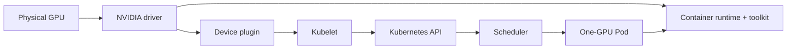

# Lab 01 — Inspect a Kubernetes GPU Node

| Field | Value |
|---|---|
| Chapter | 02 — GPU Software Lifecycle in Kubernetes |
| Difficulty / time | Intermediate / 60 minutes |
| Type | Exploration and evidence collection |
| Audience | Platform engineers, SREs, and GPU infrastructure engineers |

## 1. Objective

Establish evidence that one Kubernetes node can discover its NVIDIA GPU, advertise an allocatable extended resource, and run a one-GPU container. The result is a baseline for later incident and upgrade decisions, not a benchmark.

## 2. Production Story

An application team reports that a cluster has GPU nodes, yet their Pod remains Pending. The node may have a working driver while Kubernetes has no allocatable resource, or it may advertise a resource while the runtime cannot start CUDA. Inspect the dependency chain before changing it.

## 3. Learning Outcomes

By completion, you can collect host, runtime, device-plugin, kubelet, and workload evidence; distinguish Capacity from Allocatable; and identify the first failed layer.

## 4. Architecture



## 5. Prerequisites

- A non-production or approved GPU node, `kubectl` access, and permission to create Pods.
- SSH or console access to the selected node for host checks.
- An approved CUDA container image available to the cluster. Substitute it below; do not assume public-registry access.

## 6. Safety and Change Boundaries

This lab is read-only except for one named validation Pod and a local evidence directory. Do not restart kubelet, edit runtime configuration, drain a node, or run the validation Pod against capacity reserved for production work.

## 7. Environment and Variables

Record the client and cluster context first.

**Purpose:** Confirm that commands target the intended cluster.

**Command:**
```bash
kubectl config current-context
kubectl get nodes -o wide
```

**Expected evidence:** The expected context and at least one Ready GPU-capable node are listed.

**Explanation:** Context mistakes can turn a safe inspection into a production change.

**Common-failure interpretation:** Authentication or authorization errors require the cluster administrator; do not work around them with broader credentials.

Select a node only after confirming resource advertisement.

**Purpose:** List the Kubernetes view of GPU Capacity and Allocatable.

**Command:**
```bash
kubectl get nodes -o custom-columns=NAME:.metadata.name,CAPACITY:.status.capacity.nvidia\.com/gpu,ALLOCATABLE:.status.allocatable.nvidia\.com/gpu
export GPU_NODE='<approved-gpu-node>'
```

**Expected evidence:** `GPU_NODE` is a single approved node name; a healthy node normally has a numeric resource value.

**Explanation:** Capacity is what kubelet reports; Allocatable is what scheduling may consume after reservations.

**Common-failure interpretation:** Empty columns are a diagnosis target, not proof that hardware is absent; continue with the layered checks in this lab.

## 8. Components and Data Flow

| Layer | Responsibility | Evidence |
|---|---|---|
| Driver | Enumerates and controls the GPU | `nvidia-smi` |
| Runtime/toolkit | Makes GPU devices and libraries available to containers | runtime configuration and workload result |
| Device plugin | Registers `nvidia.com/gpu` with kubelet | Pod state and plugin logs |
| Kubelet | Publishes node resources | Node status |
| Scheduler | Binds a Pod that requests a GPU | Pod events and node assignment |

## 9. Procedure: Inspect Kubernetes State

**Purpose:** Capture the node’s labels, conditions, taints, and advertised resources.

**Command:**
```bash
kubectl describe node "$GPU_NODE"
kubectl get node "$GPU_NODE" -o jsonpath='{.status.capacity.nvidia\.com/gpu}{" capacity\n"}{.status.allocatable.nvidia\.com/gpu}{" allocatable\n"}'
```

**Expected evidence:** Node conditions are Ready and the resource values are recorded along with any taints.

**Explanation:** Labels explain capability selection; taints and allocatable values explain why a request may not schedule.

**Common-failure interpretation:** A NotReady node is a cluster/node-health issue. Missing resources move the investigation to Lab 03.

**Purpose:** Identify the deployed GPU platform operands without assuming their namespace or names.

**Command:**
```bash
kubectl get pods -A -o wide | grep -Ei 'nvidia|gpu-feature|node-feature|dcgm' || true
```

**Expected evidence:** Operator-managed environments show relevant driver, toolkit, device-plugin, discovery, validator, or telemetry Pods.

**Explanation:** The `|| true` preserves a successful inspection when the search has no matches.

**Common-failure interpretation:** No matching Pods can be valid for a standalone deployment; establish the deployed ownership model before modifying components.

## 10. Procedure: Inspect the Host (Hardware Only)

Run the following on `$GPU_NODE` through the approved console or SSH path.

**Purpose:** Prove that the host driver can enumerate GPU devices and report topology.

**Command:**
```bash
nvidia-smi
nvidia-smi -L
nvidia-smi topo -m
```

**Expected evidence:** GPU model, driver information, logical GPU list, and a topology table appear.

**Explanation:** Kubernetes cannot repair a GPU that the host driver cannot initialize.

**Common-failure interpretation:** “Failed to communicate” or no devices requires driver, kernel, PCIe, firmware, or passthrough investigation before device-plugin work.

**Purpose:** Record the runtime configuration that should select NVIDIA support.

**Command:**
```bash
sudo crictl info
sudo grep -R "nvidia" /etc/containerd /etc/nvidia-container-runtime 2>/dev/null || true
```

**Expected evidence:** Runtime details and, where configured, NVIDIA-related configuration are captured.

**Explanation:** The first command is read-only; the second is intentionally tolerant of distribution-specific paths.

**Common-failure interpretation:** Missing configuration does not by itself prove failure; use the validation Pod to test the effective runtime path.

## 11. Validation Workload

Replace `<approved-cuda-image>` with a tested image that includes `nvidia-smi`. Save the manifest locally as `gpu-node-validation.yaml`.

```yaml
apiVersion: v1
kind: Pod
metadata:
  name: gpu-node-validation
spec:
  restartPolicy: Never
  nodeName: <approved-gpu-node>
  containers:
    - name: cuda
      image: <approved-cuda-image>
      command: ["bash", "-lc", "nvidia-smi && echo GPU_NODE_VALIDATED"]
      resources:
        limits:
          nvidia.com/gpu: 1
```

**Purpose:** Create the bounded, one-GPU validation Pod.

**Command:**
```bash
kubectl apply -f gpu-node-validation.yaml
kubectl get pod gpu-node-validation -w
```

**Expected evidence:** The Pod is scheduled to the approved node, then reaches `Completed`.

**Explanation:** `nodeName` intentionally tests this selected node; remove it only when testing scheduler placement.

**Common-failure interpretation:** Pending Pods require event inspection. `ImagePullBackOff` is a registry issue; `CreateContainerError` often points to runtime integration.

## 12. Verification and Acceptance Criteria

**Purpose:** Verify the executed container rather than only its Kubernetes phase.

**Command:**
```bash
kubectl logs gpu-node-validation
kubectl describe pod gpu-node-validation
```

**Expected evidence:** Logs include the GPU inventory and `GPU_NODE_VALIDATED`; events show no allocation/runtime failure.

**Explanation:** Completion proves the container initialized the assigned GPU through the runtime.

**Common-failure interpretation:** A successful schedule with failing logs isolates the problem above resource advertisement; retain the events and runtime evidence.

Acceptance requires: host enumeration (where access exists), a non-empty allocatable resource, a completed one-GPU Pod, and logs that show the explicit marker.

## 13. Observability and Evidence Collection

**Purpose:** Create a small incident-ready evidence bundle.

**Command:**
```bash
mkdir -p gpu-node-baseline
kubectl describe node "$GPU_NODE" > gpu-node-baseline/node-describe.txt
kubectl get pod gpu-node-validation -o yaml > gpu-node-baseline/validation-pod.yaml
kubectl logs gpu-node-validation > gpu-node-baseline/validation.log
```

**Expected evidence:** Three timestampable files contain node, Pod, and workload evidence.

**Explanation:** Keep this bundle with the change or incident record; redact credentials if any appear.

**Common-failure interpretation:** If a Pod disappears before logs are collected, use namespace events and controller logs instead of recreating the failure.

## 14. Measurements and Baseline

Record GPU model, driver version, topology, allocatable count, validation start-to-completion time, idle utilization, memory use, temperature, and power. These are node-specific comparison values, not universal health thresholds.

## 15. Safe Failure Exercise

In a disposable cluster only, change the validation limit to `nvidia.com/gpu: 99` and inspect events; then restore the manifest before deleting the Pod.

**Purpose:** Observe scheduler evidence for an unsatisfiable extended-resource request.

**Command:**
```bash
kubectl describe pod gpu-node-validation
```

**Expected evidence:** The Pod remains Pending with an insufficient-resource scheduling event.

**Explanation:** This changes only a disposable validation workload and does not alter node software.

**Common-failure interpretation:** If it schedules, the test cluster has at least 99 allocatable GPUs or the manifest was not updated; stop and verify the applied spec.

## 16. Troubleshooting Decision Table

| Symptom | First evidence | Likely layer |
|---|---|---|
| `nvidia-smi` fails | driver and kernel logs | hardware/driver |
| No allocatable GPU | plugin state and kubelet logs | plugin/registration |
| Pod Pending | Pod events, taints, requests | scheduler/policy |
| Pod runs but CUDA fails | container logs and runtime config | toolkit/runtime |
| Missing capability labels | discovery Pods and labels | NFD/GFD |

## 17. Cleanup and Operational Handoff

**Purpose:** Remove only the disposable validation workload.

**Command:**
```bash
kubectl delete pod gpu-node-validation --ignore-not-found
```

**Expected evidence:** Kubernetes reports deletion or “not found.”

**Explanation:** Evidence files remain for review; no node component is changed.

**Common-failure interpretation:** A terminating Pod may need ordinary cluster investigation; do not force-delete it without confirming workload impact.

Handoff: attach the evidence bundle, selected node, driver/runtime versions, resource counts, validation result, and any deviation from acceptance criteria.

## 18. Summary, Challenges, and Further Reading

You validated the end-to-end node path. Next, run the same baseline across a node pool, compare topology and labels, and use [Lab 03](./lab-03-diagnose-a-missing-allocatable-gpu) when Allocatable is absent.

- [Volume 10 introduction](../index)
- [GPU Software Lifecycle in Kubernetes](../chapter-02-gpu-software-lifecycle-in-kubernetes)
- [Device Plugin and Kubernetes Resource Model](../chapter-04-device-plugin-and-kubernetes-resource-model)
