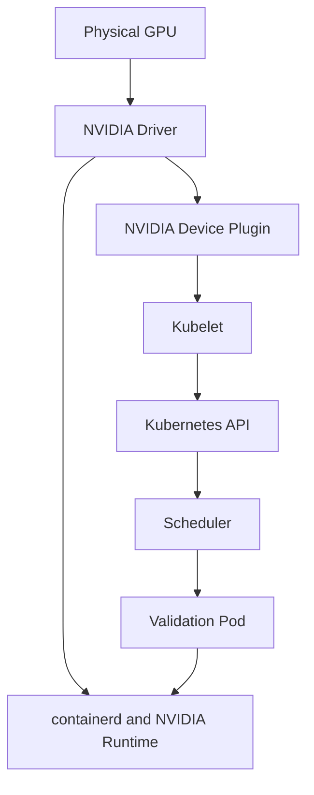

# Lab 01 — Inspect a Kubernetes GPU Node

```yaml
Title: Inspect a Kubernetes GPU Node
Volume: 10
Chapter: 02
Difficulty: Intermediate
Estimated Time: 60 Minutes
Prerequisites: Kubernetes administration, kubectl access, one NVIDIA GPU node
Target Platform: Kubernetes with containerd
Target Audience: Platform Engineers, SREs, GPU Infrastructure Engineers
Lab Type: Exploration
```

## 1. Objective

Build a reproducible baseline that proves a Kubernetes node can see its GPU hardware, load the NVIDIA driver, expose the device through the container runtime, advertise `nvidia.com/gpu`, and run a validation Pod.

## 2. Background

A GPU Pod depends on several layers that can fail independently. A healthy `nvidia-smi` on the host does not prove that Kubernetes can schedule the device. An allocatable resource on the Node object does not prove that a container can initialize CUDA. This lab verifies the complete path in order.

## 3. Learning Outcomes

After completing this lab, you will be able to:

- inspect GPU hardware and driver state;
- verify container-runtime integration;
- read node capacity and allocatable GPU resources;
- identify the device-plugin and discovery components;
- run a controlled GPU validation Pod;
- collect a baseline for future incident comparison.

## 4. Architecture



**Figure 10.L1.1 — GPU node validation path.** Each layer must agree before a workload can use the device.

## 5. Prerequisites

- A Kubernetes cluster with at least one NVIDIA GPU node
- `kubectl` access with permission to create Pods
- SSH or console access to the GPU node
- `nvidia-smi` installed or provided by the driver container
- A working container registry path

## 6. Environment

Record the actual environment before beginning.

| Field | Value |
|---|---|
| Kubernetes version | `kubectl version` |
| Node operating system | `kubectl get node -o wide` |
| Container runtime | containerd |
| GPU model | discovered during lab |
| Driver version | discovered during lab |
| GPU platform method | GPU Operator or manually managed components |

## 7. Components

- **NVIDIA driver:** Controls the GPU and exposes kernel interfaces.
- **NVIDIA Container Toolkit:** Configures GPU devices and libraries inside containers.
- **NVIDIA Device Plugin:** Advertises GPU resources to kubelet.
- **Node Feature Discovery:** Labels hardware characteristics.
- **Kubelet:** Reports capacity and allocatable resources.
- **Scheduler:** Places Pods that request GPUs.

## 8. Deployment Steps

### Step 1 — Identify GPU nodes

**Purpose:** Find nodes that advertise NVIDIA GPU capacity.

```bash
kubectl get nodes -o custom-columns=NAME:.metadata.name,GPU:.status.capacity.nvidia\.com/gpu,ALLOCATABLE:.status.allocatable.nvidia\.com/gpu
```

**Expected output:** At least one node shows a non-zero GPU capacity and allocatable value.

**Explanation:** Capacity reflects discovered resources. Allocatable reflects what kubelet can currently offer after reservations and health filtering.

### Step 2 — Inspect node labels and conditions

```bash
GPU_NODE=$(kubectl get nodes -o jsonpath='{range .items[?(@.status.capacity.nvidia\.com/gpu)]}{.metadata.name}{"\n"}{end}' | head -n1)
kubectl describe node "$GPU_NODE"
```

Check:

- `nvidia.com/gpu` under Capacity and Allocatable;
- GPU-related labels;
- `Ready=True`;
- no repeated kubelet or runtime warnings.

### Step 3 — Inspect hardware and driver state on the node

```bash
nvidia-smi
nvidia-smi -L
nvidia-smi topo -m
```

**Expected output:** The commands list the GPU model, driver version, device identifiers, and topology.

**Common errors:**

- `NVIDIA-SMI has failed` indicates a driver or device problem.
- No devices listed indicates hardware enumeration, passthrough, or driver binding failure.

### Step 4 — Inspect the container runtime

```bash
sudo crictl info | grep -i -A4 runtime
sudo grep -R "nvidia" /etc/containerd /etc/nvidia-container-runtime 2>/dev/null
```

**Expected output:** Runtime configuration references the NVIDIA runtime or compatible CDI configuration.

### Step 5 — Find GPU platform Pods

```bash
kubectl get pods -A -o wide | grep -Ei 'nvidia|gpu-feature|node-feature|dcgm'
```

Identify the driver, toolkit, device-plugin, feature-discovery, validation, and telemetry Pods where present.

## 9. Validation

Create a validation Pod.

```yaml
apiVersion: v1
kind: Pod
metadata:
  name: gpu-node-validation
spec:
  restartPolicy: Never
  containers:
    - name: cuda
      image: nvcr.io/nvidia/cuda:12.4.1-base-ubuntu22.04
      command: ["bash", "-lc", "nvidia-smi && nvidia-smi -L"]
      resources:
        limits:
          nvidia.com/gpu: 1
```

```bash
kubectl apply -f gpu-node-validation.yaml
kubectl get pod gpu-node-validation -w
kubectl logs gpu-node-validation
```

**Expected output:** The Pod reaches `Completed`, and its logs show the assigned GPU and driver information.

## 10. Verification

```bash
kubectl get pod gpu-node-validation -o wide
kubectl describe pod gpu-node-validation
kubectl get node "$GPU_NODE" -o jsonpath='{.status.allocatable.nvidia\.com/gpu}{"\n"}'
```

Verify that the Pod ran on a GPU node and requested exactly one GPU resource.

## 11. Observability

Collect a small baseline bundle.

```bash
mkdir -p gpu-node-baseline
kubectl describe node "$GPU_NODE" > gpu-node-baseline/node-describe.txt
kubectl get pods -A -o wide > gpu-node-baseline/pods.txt
kubectl logs gpu-node-validation > gpu-node-baseline/validation-log.txt
nvidia-smi -q > gpu-node-baseline/nvidia-smi-q.txt
nvidia-smi topo -m > gpu-node-baseline/topology.txt
```

This bundle becomes useful when comparing a future broken state.

## 12. Performance Measurements

Record idle values with `nvidia-smi dmon` or DCGM where available:

- GPU utilization;
- memory utilization;
- temperature;
- power draw;
- PCIe link state.

The goal is not to establish universal thresholds. It is to establish a known baseline for this node and hardware generation.

## 13. Failure Injection

Delete the validation Pod and recreate it with an impossible request:

```yaml
resources:
  limits:
    nvidia.com/gpu: 99
```

Observe:

```bash
kubectl describe pod gpu-node-validation
```

The Pod should remain Pending with an insufficient GPU scheduling message.

## 14. Troubleshooting

| Symptom | Likely layer | First checks |
|---|---|---|
| Host cannot run `nvidia-smi` | Hardware or driver | PCI enumeration, kernel logs, driver Pods |
| Host works but allocatable GPU is absent | Device plugin or kubelet | plugin logs, kubelet logs, Node status |
| Pod is Pending | Scheduler or request | events, selectors, taints, resource count |
| Pod starts but CUDA fails | Runtime integration | toolkit, containerd config, runtime logs |
| GPU labels are missing | Feature discovery | NFD and GFD Pods and logs |

## 15. Cleanup

```bash
kubectl delete pod gpu-node-validation --ignore-not-found
rm -f gpu-node-validation.yaml
```

Keep the baseline bundle if it will be used operationally.

## 16. Summary

You validated GPU hardware, driver state, runtime integration, resource advertisement, scheduling, and in-container visibility as one end-to-end path.

## 17. Challenge Exercises

- Run the validation Pod on every GPU node.
- Compare topology and labels across nodes.
- Add a node selector for a specific GPU model.
- Export the baseline into a version-controlled inventory repository.

## 18. Further Reading

- [Volume 10 Introduction](../index)
- [GPU Resource Discovery and Scheduling](../chapter-02-gpu-resource-discovery-and-scheduling)
- [Kubernetes Device Plugin](../chapter-04-kubernetes-device-plugin)
