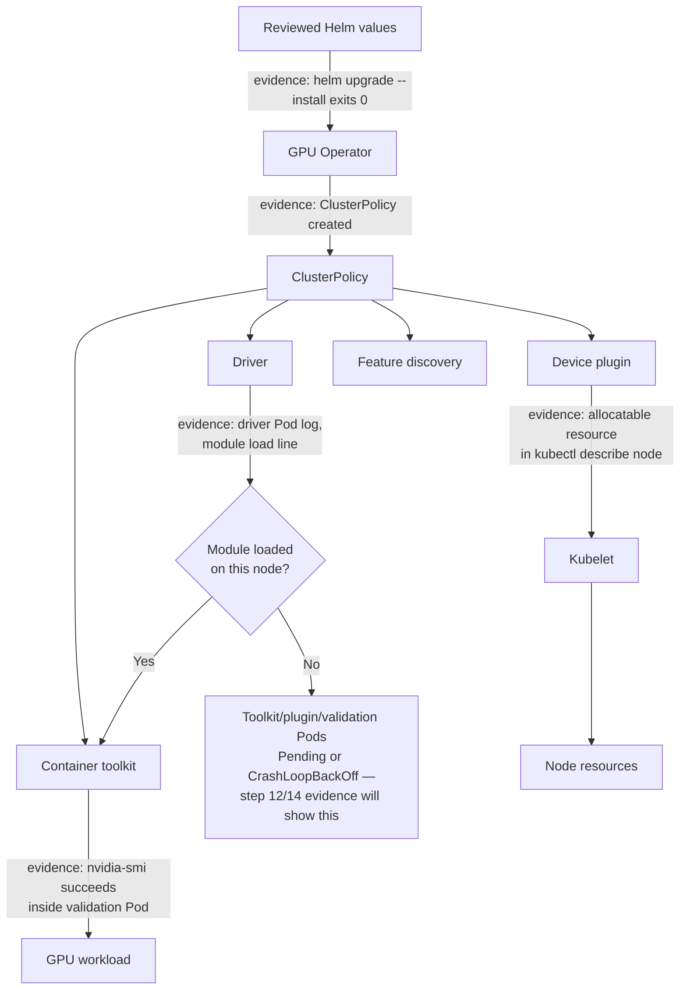

# Lab 02 — Install and Validate GPU Operator

| Field | Value |
|---|---|
| Chapter | 06 — GPU Operator Architecture |
| Difficulty / time | Advanced / 90 minutes |
| Type | Installation and validation |
| Scope | Approved non-production cluster or canary node pool |

## 1. Objective

Install a pinned GPU Operator chart using an explicit driver-ownership decision, then prove reconciliation, node resource advertisement, and GPU workload access.

## 2. Production Story

An unpinned Helm install can appear healthy while an operand is incompatible with the node kernel, runtime, registry, or existing host driver. Production readiness is the agreement of every operand and an actual GPU workload—not a successful Helm exit code.

## 3. Learning Outcomes

You will select the ownership model, capture rollback artifacts, install a reviewed release, interpret ClusterPolicy and operand status, and collect failure evidence.

## 4. Architecture



**Figure — install-time evidence chain.** This is the same architecture the lab's steps walk through in order: step 11 proves the `Helm -> Operator` hop, step 12 proves `Operator -> Policy -> operands`, step 13 proves `Plugin -> Kubelet -> Node`, and step 14 proves `Toolkit -> Workload`. The `DriverCheck` decision is the most common way this lab actually fails: a driver Pod can show `Running` while the kernel module never loaded, which blocks every operand downstream of it without the operator itself ever reporting an error — see step 12's annotated output below for what that looks like in practice.

## 5. Prerequisites

- Cluster-admin approval, Helm 3, an approved GPU node/pool, and a maintenance window.
- A tested chart version, approved registry/mirror, and an approved CUDA test image.
- A documented decision: operator-managed driver, or a qualified host-installed driver. Review the relevant NVIDIA support documentation for the exact release combination before proceeding.

## 6. Safety and Rollback Boundary

Run only in a disposable cluster or an isolated canary pool. Preserve current values and the previous Helm revision before changing anything. Do not install an operator-managed driver over an unreviewed host-driver configuration.

## 7. Environment and Variables

**Purpose:** Verify tools and define values that prevent an accidental unpinned install.

**Command:**
```bash
kubectl config current-context
helm version
export GPU_OPERATOR_VERSION='<reviewed-chart-version>'
export CUDA_VALIDATION_IMAGE='<approved-cuda-image>'
```

**Expected evidence:** The intended context and Helm client are shown; both variables are non-empty reviewed values.

**Explanation:** The chart and image are intentionally parameters because support and mirror policy are environment-specific.

**Common-failure interpretation:** Missing `helm` or inaccessible context is a workstation/RBAC issue; do not substitute “latest.”

## 8. Components and Ownership Decision

| Operand | Function | Preflight question |
|---|---|---|
| Operator / ClusterPolicy | Reconciles desired state | Is the chart version qualified? |
| Driver | Initializes the GPU | Who owns its lifecycle? |
| Toolkit | Configures container GPU access | Is the runtime supported? |
| Device plugin | Registers extended resources | Can it reach kubelet and enumerate GPUs? |
| NFD/GFD | Publishes labels | Are discovery labels required by scheduling policy? |
| Validator / DCGM exporter | Validates path / telemetry | Are they enabled and observable? |

For a qualified host-installed driver, create and review a values file containing `driver.enabled: false`; otherwise use the approved operator-managed-driver configuration. Treat this as a change-controlled decision, not a lab toggle.

## 9. Preflight Evidence

**Purpose:** Capture the pre-change node and release state.

**Command:**
```bash
mkdir -p gpu-operator-evidence
kubectl get nodes -o wide > gpu-operator-evidence/nodes-before.txt
helm list -A > gpu-operator-evidence/helm-before.txt
kubectl get pods -A -o wide > gpu-operator-evidence/pods-before.txt
```

**Expected evidence:** Files show the initial cluster, release, and workload state.

**Explanation:** This is the comparison and rollback record.

**Common-failure interpretation:** Permission errors mean the operator cannot be safely validated with current access; request scoped read access.

## 10. Procedure: Add and Inspect the Chart

**Purpose:** Discover available chart versions from the NVIDIA repository before selecting the reviewed one.

**Command:**
```bash
helm repo add nvidia https://helm.ngc.nvidia.com/nvidia
helm repo update
helm search repo nvidia/gpu-operator --versions | head -n 20
```

**Expected evidence:** Repository update succeeds and the candidate version is visible.

**Explanation:** Discovery does not approve a version; use the compatibility decision made in preflight.

**Common-failure interpretation:** TLS, proxy, or DNS failures require registry/network remediation or an approved mirror—never an unaudited download.

## 11. Procedure: Install the Pinned Release

Use the reviewed `target-values.yaml`; for host-owned drivers it must contain the reviewed driver-disable setting.

**Purpose:** Install or reconcile exactly the approved GPU Operator release.

**Command:**
```bash
helm upgrade --install gpu-operator nvidia/gpu-operator \
  --namespace gpu-operator --create-namespace \
  --version "$GPU_OPERATOR_VERSION" -f target-values.yaml \
  --wait --timeout 15m
```

**Expected evidence:** Helm reports a deployed release; the namespace and operator resources exist.

**Explanation:** `upgrade --install` is repeatable only when the reviewed values file is retained.

**Common-failure interpretation:** Timeout means operands did not become ready. Stop and inspect Pods/events; do not rerun blindly.

## 12. Validation: Reconciliation and Operands

**Purpose:** Inspect declarative state and every managed operand.

**Command:**
```bash
helm status gpu-operator -n gpu-operator
kubectl get clusterpolicy
kubectl get pods,daemonsets -n gpu-operator -o wide
kubectl get events -n gpu-operator --sort-by=.lastTimestamp
```

**Expected evidence:** The ClusterPolicy is present; required Pods are Running/Completed and DaemonSets have desired availability on intended nodes.

A healthy run looks like this:

```text
$ helm status gpu-operator -n gpu-operator
NAME: gpu-operator
LAST DEPLOYED: Wed Aug 12 09:14:44 2026
NAMESPACE: gpu-operator
STATUS: deployed
REVISION: 1

$ kubectl get clusterpolicy
NAME             AGE   STATUS
cluster-policy   6m    ready

$ kubectl get pods,daemonsets -n gpu-operator -o wide
NAME                                                READY   STATUS      RESTARTS   AGE
pod/gpu-operator-7d8f9c6b4-xk2p9                    1/1     Running     0          6m
pod/nvidia-driver-daemonset-7z4kd                   1/1     Running     0          5m
pod/nvidia-container-toolkit-daemonset-hq9lm        1/1     Running     0          4m
pod/nvidia-device-plugin-daemonset-k2vqp            1/1     Running     0          4m
pod/nvidia-cuda-validator-9x2kq                     0/1     Completed   0          3m

NAME                                                 DESIRED   CURRENT   READY   UP-TO-DATE   AVAILABLE
daemonset.apps/nvidia-driver-daemonset               3         3         3       3            3
daemonset.apps/nvidia-device-plugin-daemonset        3         3         3       3            3
```

Read this field by field: `STATUS: deployed` from `helm status` is the Helm-level claim only — it means the chart applied, not that operands are healthy. `clusterpolicy ... STATUS ready` is the controller's own reconciliation claim (Figure step `Operator -> Policy`). The decisive evidence is the DaemonSet columns: `DESIRED 3 / READY 3 / AVAILABLE 3` for both the driver and device-plugin DaemonSets means all three intended nodes actually have a working operand, not just a scheduled one. The validator Pod shows `0/1 Completed` — that `0/1` is expected and correct for a Job-style validator that ran its check and exited, not a failure; a validator stuck at `0/1 Running` past a few minutes, by contrast, is a hang.

**Explanation:** Names vary by release and configuration, so inspect the actual resources rather than hard-code a Pod name.

**Common-failure interpretation:** Driver failures commonly require kernel/secure-boot/host-driver review; image pull failures require registry credentials or mirror checks. If `READY` lags `DESIRED` on the driver DaemonSet (e.g. `3 3 2 3 2`), do not proceed to step 13 — that gap is the `DriverCheck: No` branch in the architecture figure, and it will surface as an empty allocatable value in the very next step rather than a clear error here.

## 13. Validation: Resource Advertisement

**Purpose:** Verify kubelet exposes GPU resources after operands converge.

**Command:**
```bash
kubectl get nodes -o custom-columns=NAME:.metadata.name,ALLOCATABLE:.status.allocatable.nvidia\.com/gpu
kubectl get nodes --show-labels | grep -F 'nvidia.com' || true
```

**Expected evidence:** Intended GPU nodes report a numeric allocatable resource and applicable GPU labels.

```text
$ kubectl get nodes -o custom-columns=NAME:.metadata.name,ALLOCATABLE:.status.allocatable.nvidia\.com/gpu
NAME          ALLOCATABLE
gpu-node-01   4
gpu-node-02   4
gpu-node-03   4

$ kubectl get nodes --show-labels | grep -F 'nvidia.com'
gpu-node-01   Ready   <none>   6m   nvidia.com/gpu.count=4,nvidia.com/gpu.product=NVIDIA-A100-80GB,nvidia.com/gpu.memory=81920
```

`ALLOCATABLE: 4` on all three intended nodes is the direct, numeric proof that the device plugin registered with the kubelet and is reporting all devices healthy — this is the same fact as `Allocatable: nvidia.com/gpu: 4` under `kubectl describe node`, just easier to scan across a pool. The label line adds the GFD side: `gpu.count=4` should agree with the allocatable number, and `gpu.product`/`gpu.memory` are what a workload-facing service class would later be built on top of (see Chapter 05). If one node in the `ALLOCATABLE` column instead showed `&lt;none&gt;` (not `0` — the column is absent because the resource was never published), that node did not complete the `DriverCheck` branch in the architecture figure, and no amount of retrying this `kubectl get` will change that; it needs the driver Pod's own logs inspected first.

**Explanation:** This checks discovery and device-plugin registration but not container CUDA access.

**Common-failure interpretation:** Empty allocatable values require the dependency-ordered workflow in [Lab 03](./lab-03-diagnose-a-missing-allocatable-gpu).

## 14. Validation: Workload Execution

Create `gpu-operator-validation.yaml` with `image: &lt;approved-cuda-image&gt;`, command `bash -lc 'nvidia-smi && echo GPU_OPERATOR_VALIDATED'`, `restartPolicy: Never`, and a limit of one `nvidia.com/gpu`.

**Purpose:** Prove allocation and runtime access from an ordinary Pod.

**Command:**
```bash
kubectl apply -f gpu-operator-validation.yaml
kubectl wait --for=jsonpath='{.status.phase}'=Succeeded pod/gpu-operator-validation --timeout=5m
kubectl logs gpu-operator-validation
```

**Expected evidence:** The Pod succeeds and its log includes GPU inventory plus `GPU_OPERATOR_VALIDATED`.

```text
$ kubectl logs gpu-operator-validation
Wed Aug 12 09:31:02 2026
+-----------------------------------------------------------------------------+
| NVIDIA-SMI 550.90.07   Driver Version: 550.90.07   CUDA Version: 12.4       |
|-------------------------------+----------------------+----------------------+
| GPU  Name        Persistence-M| Bus-Id        Disp.A | Volatile Uncorr. ECC |
|   0  NVIDIA A100-SXM4-80GB  On | 00000000:07:00.0 Off |                  0 |
+-------------------------------+----------------------+----------------------+
GPU_OPERATOR_VALIDATED
```

`Driver Version: 550.90.07` and `CUDA Version: 12.4` appearing at all means `nvidia-smi` executed successfully inside the container — the toolkit correctly injected the device and driver libraries, closing the `Toolkit -> Workload` hop in the architecture figure. `GPU_OPERATOR_VALIDATED` printing after it means the shell command's `&&` chain didn't short-circuit, so `nvidia-smi` returned exit code 0, not just partial output. If `nvidia-smi` had failed, this log would stop after the failure and `GPU_OPERATOR_VALIDATED` would never appear — that missing final line, by itself, is enough to tell you the Pod did not actually validate even if `kubectl get pod` shows `Succeeded` from a race in how the phase was checked.

**Explanation:** A workload result closes the gap between a reconciled platform and usable infrastructure.

**Common-failure interpretation:** Pending indicates resource or scheduling policy; container startup failure points to driver/toolkit/runtime; nonzero `nvidia-smi` needs node evidence.

## 15. Observability and Measurements

**Purpose:** Preserve operator and workload evidence for support or change review.

**Command:**
```bash
kubectl logs -n gpu-operator deployment/gpu-operator --tail=200 > gpu-operator-evidence/operator.log
kubectl describe pod gpu-operator-validation > gpu-operator-evidence/validation-describe.txt
kubectl get events -A --sort-by=.lastTimestamp > gpu-operator-evidence/events-after.txt
```

**Expected evidence:** The bundle contains reconciliation logs, workload events, and post-change events.

**Explanation:** Where DCGM Exporter is enabled, also confirm its target and metric-scrape path with the cluster observability owner.

**Common-failure interpretation:** A missing deployment name can mean a release-specific layout; list resources first and use the actual operator controller.

Record elapsed install time, operand restart counts, allocatable GPU count, workload completion time, and telemetry visibility. Compare only to an equivalent node/pool baseline.

## 16. Safe Failure Exercise and Troubleshooting

In a disposable cluster, apply a validation Pod requesting more GPUs than any node has; inspect its events, then delete it. Do not scale or delete device-plugin resources as a teaching exercise in a shared cluster.

| Symptom | First check | Likely boundary |
|---|---|---|
| Helm timeout | events and non-ready Pods | reconciliation/image/runtime |
| Driver Pod failing | driver container logs, kernel evidence | kernel/driver ownership |
| No resource | device-plugin logs and kubelet | registration |
| Pod fails `nvidia-smi` | Pod events and runtime evidence | toolkit/runtime |

**Evidence for "Helm timeout."** The exercise itself — over-requesting GPUs — produces the companion evidence for scheduling, but a Helm timeout is a different failure surfaced during install. `kubectl get events -n gpu-operator --sort-by=.lastTimestamp` after a timed-out install typically shows the actual blocker:

```text
$ kubectl get events -n gpu-operator --sort-by=.lastTimestamp | tail -3
44s   Warning   FailedScheduling   pod/nvidia-driver-daemonset-7z4kd   0/3 nodes are available: 3 node(s) had taint {nvidia.com/gpu: NoSchedule}, that the pod didn't tolerate.
```

`didn't tolerate` on the driver's own Pod means the driver DaemonSet's toleration doesn't match the GPU node taint used in this cluster — a values-file mismatch, not a slow pull or a broken registry. This is why the step-11 note says "stop and inspect Pods/events; do not rerun blindly" — rerunning `helm upgrade --install` would time out identically every time until the values file's tolerations are fixed.

**Evidence for the over-request exercise.** Applying a validation Pod that requests more GPUs than any node has produces the scheduling-side companion to the resource-advertisement evidence in step 13:

```text
$ kubectl describe pod gpu-overrequest-test | tail -4
Warning  FailedScheduling  9s   default-scheduler  0/3 nodes are available:
         3 Insufficient nvidia.com/gpu.
```

`3 Insufficient nvidia.com/gpu` against nodes that step 13 showed reporting `ALLOCATABLE: 4` each confirms the request (say, `limits: {nvidia.com/gpu: 8}`) genuinely exceeds every node's real capacity — this is the expected, correct failure mode for the exercise, and it is evidence the scheduler is enforcing the resource contract rather than a sign anything is broken. Delete the Pod immediately after confirming this event; it exists only to produce this one line.

## 17. Cleanup and Handoff

**Purpose:** Remove the disposable workload; retain platform evidence.

**Command:**
```bash
kubectl delete pod gpu-operator-validation --ignore-not-found
```

**Expected evidence:** Only the named validation Pod is deleted.

**Explanation:** Leave the installed operator in place unless the approved lab plan explicitly includes uninstall and its driver-strategy-specific procedure.

**Common-failure interpretation:** Do not uninstall to hide an operand problem; first preserve logs and decide rollback through change control.

Handoff includes chart revision, values digest/location, driver ownership, operand status, node resources, workload log, evidence bundle, and rollback revision.

## 18. Summary, Challenges, and Further Reading

You installed a versioned platform and validated it as an end-to-end service. Next, test a private mirror, record values in Git, and rehearse the canary upgrade in [Lab 04](./lab-04-perform-a-controlled-gpu-platform-upgrade).

- [GPU Operator Architecture](../chapter-06-gpu-operator-architecture)
- [Driver Containers and Node Operands](../chapter-07-driver-containers-and-node-operands)
- [Production Installation and Configuration](../chapter-10-production-installation-and-configuration)
