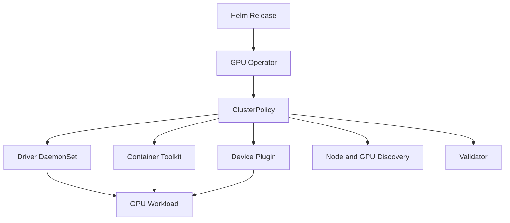

# Lab 02 — Install and Validate GPU Operator

```yaml
Title: Install and Validate GPU Operator
Volume: 10
Chapter: 06
Difficulty: Advanced
Estimated Time: 90 Minutes
Prerequisites: Kubernetes cluster, NVIDIA GPU node, Helm, cluster-admin access
Target Platform: Kubernetes with containerd
Target Audience: Platform Engineers and SREs
Lab Type: Installation
```

## 1. Objective

Install NVIDIA GPU Operator with Helm, inspect the ClusterPolicy-driven reconciliation model, validate each operand, and prove that a scheduled container can access a GPU.

## 2. Background

GPU Operator turns a collection of node-level components into a declared platform lifecycle. Installation is successful only when the operator, driver strategy, container toolkit, device plugin, discovery components, validation jobs, and optional telemetry all agree with the host environment.

## 3. Learning Outcomes

You will be able to:

- prepare a cluster for GPU Operator;
- select between operator-managed and host-managed drivers;
- install a pinned chart release;
- inspect ClusterPolicy and operand health;
- validate GPU resource advertisement and container access;
- collect evidence for common installation failures.

## 4. Architecture



## 5. Prerequisites

- Supported Kubernetes and operating-system combination
- containerd configured and healthy
- at least one visible NVIDIA GPU
- Helm 3
- outbound registry access or an approved mirrored registry
- a maintenance window for node-level changes

:::warning
Do not install an operator-managed driver over an unsupported or conflicting host driver configuration. Decide the driver ownership model before deployment.
:::

## 6. Environment

```bash
kubectl version
helm version
kubectl get nodes -o wide
```

Record:

- Kubernetes version;
- node OS and kernel;
- container runtime version;
- GPU model;
- whether an NVIDIA driver already exists on the host.

## 7. Components

| Component | Responsibility |
|---|---|
| GPU Operator | Reconciles desired GPU platform state |
| ClusterPolicy | Declares operand configuration |
| Driver | Makes the physical GPU usable by the OS |
| Container Toolkit | Injects GPU devices and libraries into containers |
| Device Plugin | Advertises schedulable GPU resources |
| NFD/GFD | Adds node and GPU capability labels |
| Validator | Tests critical platform paths |
| DCGM Exporter | Exposes GPU telemetry when enabled |

## 8. Deployment Steps

### Step 1 — Add the chart repository

```bash
helm repo add nvidia https://helm.ngc.nvidia.com/nvidia
helm repo update
helm search repo nvidia/gpu-operator --versions | head
```

Choose and record a tested chart version instead of relying on an unpinned latest release.

```bash
export GPU_OPERATOR_VERSION='<validated-chart-version>'
```

### Step 2 — Decide driver ownership

For operator-managed drivers, use the chart default after confirming support.

For a host-installed driver, prepare a values file:

```yaml
# values-host-driver.yaml
driver:
  enabled: false
```

This lab assumes operator-managed drivers unless your environment already has a qualified host driver.

### Step 3 — Install the release

```bash
helm upgrade --install gpu-operator nvidia/gpu-operator \
  --namespace gpu-operator \
  --create-namespace \
  --version "$GPU_OPERATOR_VERSION" \
  --wait \
  --timeout 15m
```

For host-managed drivers, add `-f values-host-driver.yaml`.

### Step 4 — Inspect the release and policy

```bash
helm status gpu-operator -n gpu-operator
kubectl get clusterpolicy
kubectl describe clusterpolicy cluster-policy
```

The ClusterPolicy status should converge, and operand resources should be created.

### Step 5 — Inspect operand Pods

```bash
kubectl get pods -n gpu-operator -o wide
kubectl get daemonsets -n gpu-operator
```

Explain each Pod rather than checking only that the namespace is non-empty.

## 9. Validation

Verify node resources:

```bash
kubectl get nodes -o custom-columns=NAME:.metadata.name,GPU:.status.allocatable.nvidia\.com/gpu
```

Run a CUDA validation Pod:

```yaml
apiVersion: v1
kind: Pod
metadata:
  name: gpu-operator-validation
spec:
  restartPolicy: Never
  containers:
    - name: cuda
      image: nvcr.io/nvidia/cuda:12.4.1-base-ubuntu22.04
      command: ["bash", "-lc", "nvidia-smi && echo GPU_OPERATOR_VALIDATED"]
      resources:
        limits:
          nvidia.com/gpu: 1
```

```bash
kubectl apply -f gpu-operator-validation.yaml
kubectl wait --for=condition=Ready pod/gpu-operator-validation --timeout=5m || true
kubectl logs gpu-operator-validation
```

The log must contain valid `nvidia-smi` output and `GPU_OPERATOR_VALIDATED`.

## 10. Verification

```bash
kubectl describe pod gpu-operator-validation
kubectl get node -o json | grep -F 'nvidia.com/gpu'
kubectl get nodes --show-labels | grep -F 'nvidia.com'
```

Verify:

- the Pod was scheduled on a GPU node;
- one GPU was allocated;
- GPU labels exist;
- no critical operand is crash-looping.

## 11. Observability

```bash
kubectl get events -n gpu-operator --sort-by=.lastTimestamp
kubectl logs -n gpu-operator deployment/gpu-operator --tail=200
kubectl get servicemonitors -A 2>/dev/null
```

Where DCGM Exporter is enabled, confirm its Pod and metrics endpoint exist.

## 12. Performance Measurements

Installation validation should include a lightweight compute or bandwidth test approved for the environment. Compare results only against a same-node baseline; this lab does not define universal performance thresholds.

## 13. Failure Injection

Scale the device-plugin DaemonSet to zero only in a disposable environment, or temporarily apply a node selector that matches no nodes. Observe how allocatable GPU resources and new scheduling behavior change, then restore the original configuration.

Before modification, export the resource:

```bash
kubectl get daemonset -n gpu-operator -l app=nvidia-device-plugin-daemonset -o yaml > device-plugin-backup.yaml
```

## 14. Troubleshooting

| Symptom | Diagnosis |
|---|---|
| Driver Pod fails | Check kernel compatibility, secure boot, host driver conflicts, and driver logs |
| Toolkit Pod fails | Check containerd configuration and filesystem permissions |
| Device plugin runs but no resource appears | Check driver state, plugin logs, and kubelet registration |
| Validator fails | Read the exact validator container log; identify the failing layer |
| Image pull fails | Validate registry, credentials, proxy, and mirror configuration |

Useful commands:

```bash
kubectl logs -n gpu-operator <pod> --all-containers
kubectl describe pod -n gpu-operator <pod>
kubectl get events -A --sort-by=.lastTimestamp
journalctl -u kubelet -n 300
```

## 15. Cleanup

```bash
kubectl delete pod gpu-operator-validation --ignore-not-found
helm uninstall gpu-operator -n gpu-operator
kubectl delete namespace gpu-operator --ignore-not-found
```

Removing the operator does not always restore every host modification automatically. Follow the qualified uninstall procedure for the selected driver strategy.

## 16. Summary

You deployed GPU Operator as a lifecycle controller and validated the entire path from ClusterPolicy to a functioning GPU container.

## 17. Challenge Exercises

- Install from a private registry mirror.
- Disable one optional operand and document the effect.
- Export all Helm values into Git.
- Add policy checks that reject unpinned chart versions.

## 18. Further Reading

- [GPU Operator Architecture](../chapter-06-gpu-operator-architecture)
- [Driver Containers and Node Operands](../chapter-07-driver-containers-and-node-operands)
- [Volume 10 Introduction](../index)
