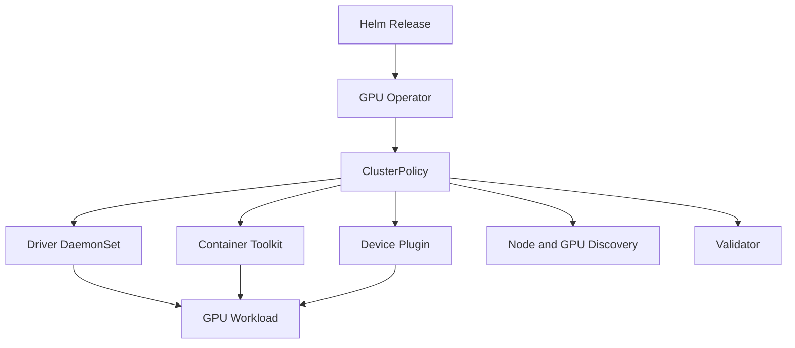

# Lab 02 — Install and Validate GPU Operator

```yaml
Title: Install and Validate GPU Operator
Volume: 10
Chapter: 06
Difficulty: Advanced
Estimated Time: 90 Minutes
Prerequisites: Kubernetes cluster, NVIDIA GPU node, Helm, cluster-admin access
Target Platform: Kubernetes with containerd
Target Audience: Platform Engineers and SREs
Lab Type: Installation
```

## 1. Objective

Install NVIDIA GPU Operator with Helm, inspect the ClusterPolicy-driven reconciliation model, validate each operand, and prove that a scheduled container can access a GPU.

## 2. Scenario

Your platform team has agreed that Kubernetes should own the lifecycle of the GPU stack. This lab treats that decision as an operational contract. A successful install is not just a Helm exit code. It is a reconciled operator, healthy operands, published node labels, allocatable GPU resources, and one workload that actually reaches CUDA.

## 3. Learning Outcomes

You will be able to:

- prepare a cluster for GPU Operator;
- choose host-managed or operator-managed driver ownership;
- install a pinned chart release;
- inspect ClusterPolicy and operand health;
- validate GPU resource advertisement and container access;
- collect evidence for common installation failures.

## 4. Architecture



## 5. Prerequisites

- Supported Kubernetes and operating-system combination.
- containerd configured and healthy.
- At least one visible NVIDIA GPU.
- Helm 3.
- Outbound registry access or an approved mirrored registry.
- A maintenance window for node-level changes.

## 6. Environment

Run the following commands and keep the output with your change record.

| Purpose | Command | Expected evidence | Explanation | Common failure interpretation |
|---|---|---|---|---|
| Confirm Kubernetes access | `kubectl version` | Client and server versions | Establishes the control plane you are about to modify | Your context may be pointed at the wrong cluster |
| Confirm Helm access | `helm version` | Helm client version | Verifies the packaging toolchain | An older Helm version can change rendering or install behavior |
| Confirm node inventory | `kubectl get nodes -o wide` | Node list with OS and internal IP data | Shows which node pool is available for GPU workloads | No GPU node is present, or the node is not Ready |

Record:

- Kubernetes version;
- node OS and kernel;
- container runtime version;
- GPU model;
- whether an NVIDIA driver already exists on the host.

## 7. Components

| Component | Responsibility |
|---|---|
| GPU Operator | Reconciles desired GPU platform state |
| ClusterPolicy | Declares operand configuration |
| Driver | Makes the physical GPU usable by the OS |
| Container Toolkit | Injects GPU devices and libraries into containers |
| Device Plugin | Advertises schedulable GPU resources |
| NFD/GFD | Adds node and GPU capability labels |
| Validator | Tests critical platform paths |
| DCGM Exporter | Exposes GPU telemetry when enabled |

## 8. Procedure

### 8.1 Add and inspect the chart repository

| Purpose | Command | Expected evidence | Explanation | Common failure interpretation |
|---|---|---|---|---|
| Register the NVIDIA chart repository | `helm repo add nvidia https://helm.ngc.nvidia.com/nvidia` | Repository is added locally | Gives Helm a source for the operator chart | Network, proxy, or certificate issues block access |
| Refresh repository metadata | `helm repo update` | Repository index downloads successfully | Keeps the local cache aligned with the repository | Stale metadata can point at the wrong release line |
| List available versions | `helm search repo nvidia/gpu-operator --versions | head` | A version list prints | Lets you choose a pinned chart version | Empty output means the repository is unavailable or misconfigured |

Choose a validated chart version and record it.

```bash
export GPU_OPERATOR_VERSION='<validated-chart-version>'
```

### 8.2 Decide driver ownership

| Purpose | Command | Expected evidence | Explanation | Common failure interpretation |
|---|---|---|---|---|
| Prepare a host-driver values file | `printf '%s\n' 'driver:' '  enabled: false' > values-host-driver.yaml` | A small values file appears | Disables the operator-managed driver when the host already owns it | Installing the wrong ownership model can break a working node |

If you use an operator-managed driver, keep the default behavior and document that decision in the environment notes.

### 8.3 Install the release

| Purpose | Command | Expected evidence | Explanation | Common failure interpretation |
|---|---|---|---|---|
| Install or upgrade the chart | `helm upgrade --install gpu-operator nvidia/gpu-operator --namespace gpu-operator --create-namespace --version "$GPU_OPERATOR_VERSION" --wait --timeout 15m` | Helm completes without a timeout | Applies the pinned chart in a controlled namespace | A timeout usually means one operand failed to converge |
| Use host-driver values when required | `helm upgrade --install gpu-operator nvidia/gpu-operator --namespace gpu-operator --create-namespace --version "$GPU_OPERATOR_VERSION" --wait --timeout 15m -f values-host-driver.yaml` | Helm completes with the host-driver policy applied | Keeps the lab aligned with environments that already manage drivers on the node | Forgetting the host-driver file can trigger a conflicting driver install |

### 8.4 Inspect the release and policy

| Purpose | Command | Expected evidence | Explanation | Common failure interpretation |
|---|---|---|---|---|
| Read Helm status | `helm status gpu-operator -n gpu-operator` | Release details and notes | Confirms that Helm considers the release deployed | Failed hooks or pending resources need follow-up |
| Read the ClusterPolicy list | `kubectl get clusterpolicy` | A policy object appears | Shows the operator has created its control object | No policy usually means the install never reconciled |
| Inspect the policy in detail | `kubectl describe clusterpolicy cluster-policy` | Spec, status, and events | Tells you which operands the operator is trying to manage | Events often point directly to the broken operand |

### 8.5 Inspect operand Pods

| Purpose | Command | Expected evidence | Explanation | Common failure interpretation |
|---|---|---|---|---|
| List operator Pods | `kubectl get pods -n gpu-operator -o wide` | Operator and operand Pods are visible | Shows reconciliation progress | CrashLoopBackOff or Pending points to the first failed layer |
| List DaemonSets | `kubectl get daemonsets -n gpu-operator` | Driver, toolkit, plugin, discovery, and telemetry DaemonSets where enabled | Shows which operands are actually deployed | Missing DaemonSets may be expected for disabled features, but not for the core platform |

## 9. Validation

Create a validation Pod that requests one GPU.

```yaml
apiVersion: v1
kind: Pod
metadata:
  name: gpu-operator-validation
spec:
  restartPolicy: Never
  containers:
    - name: cuda
      image: nvcr.io/nvidia/cuda:12.4.1-base-ubuntu22.04
      command: ["bash", "-lc", "nvidia-smi && echo GPU_OPERATOR_VALIDATED"]
      resources:
        limits:
          nvidia.com/gpu: 1
```

| Purpose | Command | Expected evidence | Explanation | Common failure interpretation |
|---|---|---|---|---|
| Apply the validation Pod | `kubectl apply -f gpu-operator-validation.yaml` | Pod object exists | Forces the scheduler and runtime to exercise the GPU path | Admission, quota, or image policy may block the Pod first |
| Wait for the Pod to finish | `kubectl wait --for=condition=Ready pod/gpu-operator-validation --timeout=5m || true` | Pod reaches Ready or provides a useful timeout | Gives the operator a chance to finish reconciliation | A timeout is a signal to inspect the underlying operand |
| Read the logs | `kubectl logs gpu-operator-validation` | `nvidia-smi` output and `GPU_OPERATOR_VALIDATED` | Proves the container could access a GPU | Runtime or driver issues usually show up here first |

## 10. Verification

| Purpose | Command | Expected evidence | Explanation | Common failure interpretation |
|---|---|---|---|---|
| Describe the Pod | `kubectl describe pod gpu-operator-validation` | Placement, events, and container state | Gives the exact reason for success or failure | Pending, scheduling, or runtime errors appear here |
| Confirm the GPU resource exists | `kubectl get node -o json | grep -F 'nvidia.com/gpu'` | Node status includes the GPU resource | Verifies that the resource was registered with Kubernetes | No match means the node is not advertising the resource |
| Confirm labels | `kubectl get nodes --show-labels | grep -F 'nvidia.com'` | NVIDIA-related labels appear on the node | Confirms discovery components are working | Missing labels usually mean NFD or GFD problems |

Verify:

- the Pod was scheduled on a GPU node;
- one GPU was allocated;
- GPU labels exist;
- no critical operand is crash-looping.

## 11. Observability

| Purpose | Command | Expected evidence | Explanation | Common failure interpretation |
|---|---|---|---|---|
| Inspect events | `kubectl get events -n gpu-operator --sort-by=.lastTimestamp` | Recent reconcile and scheduling events | Shows which resource changed last | A repeating event pattern often identifies the broken operand |
| Read operator logs | `kubectl logs -n gpu-operator deployment/gpu-operator --tail=200` | Operator reconciliation messages | Confirms whether the controller is progressing or stuck | Repeated errors usually point to policy, permissions, or image issues |
| Check monitoring objects | `kubectl get servicemonitors -A 2>/dev/null` | ServiceMonitor resources when monitoring is enabled | Confirms whether telemetry exposure is wired up | No ServiceMonitor may be normal if telemetry is disabled |

Where DCGM Exporter is enabled, confirm its Pod and metrics endpoint exist.

## 12. Performance Measurements

Use one lightweight compute or bandwidth test approved for the environment. Compare the result only with a same-node baseline. This lab does not define a universal performance threshold.

## 13. Failure Injection

Use a disposable environment only. Either scale the device-plugin DaemonSet to zero or apply a temporary node selector that matches no nodes, then restore the original configuration immediately after observation.

| Purpose | Command | Expected evidence | Explanation | Common failure interpretation |
|---|---|---|---|---|
| Back up the DaemonSet | `kubectl get daemonset -n gpu-operator -l app=nvidia-device-plugin-daemonset -o yaml > device-plugin-backup.yaml` | Backup file is written locally | Preserves the known-good resource before any change | Without a backup, restoration becomes guesswork |
| Observe the impact of removing the plugin | `kubectl scale daemonset -n gpu-operator -l app=nvidia-device-plugin-daemonset --replicas=0` | Allocatable GPU resources stop updating on affected nodes | Demonstrates how the resource disappears when the plugin is absent | If nothing changes, the selector may not match the real DaemonSet |
| Restore the DaemonSet | `kubectl apply -f device-plugin-backup.yaml` | The DaemonSet returns to its prior spec | Returns the cluster to the pre-test state | If the backup is stale, the restore may not match current values |

## 14. Troubleshooting

| Symptom | Diagnosis | First checks |
|---|---|---|
| Driver Pod fails | Kernel compatibility, secure boot, host driver conflicts | Driver logs, kernel messages, node readiness |
| Toolkit Pod fails | containerd configuration or filesystem permissions | runtime config and Pod logs |
| Device plugin runs but no resource appears | Driver state, plugin logs, kubelet registration | node status, logs, and events |
| Validator fails | Exact validator container log | image pull, runtime, and driver evidence |
| Image pull fails | Registry, credentials, proxy, or mirror configuration | image reference and pull secrets |

Useful commands:

| Purpose | Command | Expected evidence | Explanation | Common failure interpretation |
|---|---|---|---|---|
| Read container logs | `kubectl logs -n gpu-operator <pod> --all-containers` | All container output | Gives the full operand story | Missing logs may mean the Pod never started |
| Describe the failing Pod | `kubectl describe pod -n gpu-operator <pod>` | Events and container state | Shows why the Pod is unhealthy | Image pull, mount, or permission errors show up here |
| Inspect recent events | `kubectl get events -A --sort-by=.lastTimestamp` | Cluster-wide event timeline | Helps correlate multiple failures | Repeated warnings usually identify the earliest failing layer |
| Check kubelet logs | `journalctl -u kubelet -n 300` | Kubelet event and registration messages | Useful when the node advertises no GPU resource | No registration messages can mean the device plugin never reached kubelet |

## 15. Cleanup

| Purpose | Command | Expected evidence | Explanation | Common failure interpretation |
|---|---|---|---|---|
| Delete the validation Pod | `kubectl delete pod gpu-operator-validation --ignore-not-found` | Pod is removed | Clears the test workload | Stuck termination usually points to node or finalizer issues |
| Uninstall the release | `helm uninstall gpu-operator -n gpu-operator` | Helm removes the release | Reverses the install in a controlled way | Remaining host changes may still need a qualified uninstall |
| Remove the namespace | `kubectl delete namespace gpu-operator --ignore-not-found` | Namespace disappears | Cleans up objects left behind after uninstall | Leftover resources mean the uninstall was incomplete |

Removing the operator does not always restore every host modification automatically. Follow the qualified uninstall procedure for the selected driver strategy.

## 16. Summary

You installed GPU Operator as a lifecycle controller and validated the path from ClusterPolicy to a functioning GPU container.

## 17. Challenge Exercises

- Install from a private registry mirror.
- Disable one optional operand and document the effect.
- Export all Helm values into Git.
- Add policy checks that reject unpinned chart versions.

## 18. Further Reading

- [GPU Operator Architecture](../chapter-06-gpu-operator-architecture)
- [Driver Containers and Node Operands](../chapter-07-driver-containers-and-node-operands)
- [Volume 10 Introduction](../index)
