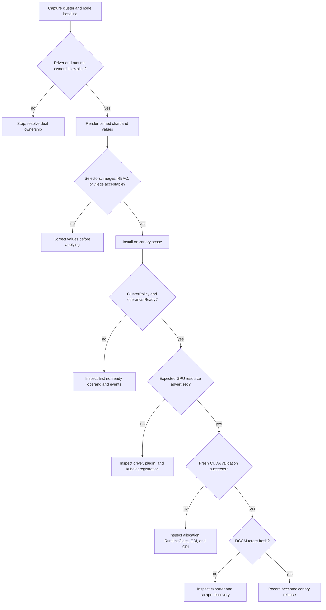

# Lab 02 — Install and Validate GPU Operator

| Field | Value |
|---|---|
| Chapter | 06 — GPU Operator Architecture |
| Difficulty / time | Advanced / 90 minutes |
| Type | Installation and validation |
| Scope | Approved non-production cluster or canary node pool |

## 1. Objective

Install a pinned GPU Operator chart using an explicit driver-ownership decision, then prove reconciliation, node resource advertisement, runtime injection, workload execution, and telemetry.

## 2. Production Story

An unpinned Helm install can appear healthy while an operand is incompatible with the node kernel, runtime, registry, or existing host driver. Production readiness is the agreement of every operand and an actual GPU workload—not a successful Helm exit code.

## 3. Learning Outcomes

You will select the ownership model, capture rollback artifacts, render and review manifests, install a controlled release, interpret ClusterPolicy and operand status, validate a fresh GPU workload, and collect failure evidence.

## 4. Architecture



**Figure L10.2 — Installation proceeds through evidence gates.** The chart is applied only after ownership and rendered-manifest review; the canary is accepted only after workload and telemetry proof.

## 5. Prerequisites

- Cluster-admin approval, Helm 3, an approved GPU canary pool, and a maintenance window.
- A reviewed chart release, approved registry or mirror, and an approved CUDA validation image.
- A documented decision: operator-managed driver or qualified host-installed driver.
- The release’s official support and compatibility documentation reviewed for the target environment.

The following values are **illustrative** and must be replaced by the approved change record:

```text
GPU_OPERATOR_VERSION=v25.3.2
CANARY_LABEL=gpu.platform.example/canary=true
CUDA_VALIDATION_IMAGE=registry.internal.example/platform/cuda-validation@sha256:9a2f...7c10
```

The version shown is not a recommendation or support claim.

## 6. Safety and Rollback Boundary

Run only in a disposable cluster or isolated canary pool. Preserve current values and the previous Helm revision before changing anything. Do not install an operator-managed driver over a host-owned driver without an approved migration procedure.

Stop immediately if:

- rendered manifests target unintended nodes;
- privileged resources or RBAC exceed the reviewed design;
- the driver or runtime ownership is ambiguous;
- canary operands do not converge;
- GPU resources disappear;
- a fresh CUDA Pod fails;
- telemetry becomes unavailable.

## 7. Environment

```bash
kubectl config current-context
helm version --short
export GPU_OPERATOR_VERSION='v25.3.2'
export CUDA_VALIDATION_IMAGE='registry.internal.example/platform/cuda-validation@sha256:9a2f...7c10'
```

**Representative output:**

```text
platform-lab-eu1
v3.15.3+g3bb50bb
```

The context must match the approved cluster. The Helm output proves client availability, not server compatibility. The exported version and image are illustrative; use the values from the reviewed release record.

### Verify the canary scope

```bash
kubectl get nodes -l gpu.platform.example/canary=true \
  -o custom-columns='NAME:.metadata.name,READY:.status.conditions[?(@.type=="Ready")].status,GPU:.status.allocatable.nvidia\.com/gpu,DRIVER-OWNER:.metadata.labels.gpu\.platform\.example/driver-owner'
```

**Representative output:**

```text
NAME             READY   GPU      DRIVER-OWNER
gpu-canary-01    True    <none>   operator
gpu-canary-02    True    <none>   operator
```

The two nodes are intentionally canaries and declare operator-owned drivers. Empty GPU resources are acceptable before installation. If the owner label says `host`, stop and select the host-driver values model instead.

## 8. Components

| Operand | Function | Preflight evidence |
|---|---|---|
| Operator and ClusterPolicy | Reconcile desired platform state | pinned chart and reviewed values |
| Driver | Initialize the host GPU | ownership label, kernel profile, driver strategy |
| Toolkit | Configure runtime device injection | supported CRI and handler design |
| Device plugin | Register extended resources | kubelet path and healthy host devices |
| NFD/GFD | Publish discovery labels | governed label contract |
| Validator | Exercise platform boundaries | acceptance criteria and image digest |
| DCGM Exporter | Expose telemetry | ServiceMonitor or target-discovery design |

## 9. Deployment Steps — Preserve and Render

### Capture pre-change evidence

```bash
mkdir -p gpu-operator-evidence
kubectl get nodes -o wide > gpu-operator-evidence/nodes-before.txt
helm list -A > gpu-operator-evidence/helm-before.txt
kubectl get pods -A -o wide > gpu-operator-evidence/pods-before.txt
```

**Representative `helm-before.txt`:**

```text
NAME          NAMESPACE     REVISION  UPDATED                   STATUS    CHART
metrics-stack monitoring    4         2026-08-01 09:22:11 UTC   deployed  kube-prometheus-stack-61.3.1
```

No GPU Operator release is present in this example. Preserve these files with the change record; do not overwrite them after installation.

### Discover candidate chart releases

```bash
helm repo add nvidia https://helm.ngc.nvidia.com/nvidia
helm repo update
helm search repo nvidia/gpu-operator --versions | head -5
```

**Representative output:**

```text
NAME                 CHART VERSION  APP VERSION  DESCRIPTION
nvidia/gpu-operator  v25.3.2        v25.3.2      NVIDIA GPU Operator
nvidia/gpu-operator  v25.3.1        v25.3.1      NVIDIA GPU Operator
nvidia/gpu-operator  v24.9.2        v24.9.2      NVIDIA GPU Operator
```

This only proves repository visibility. It does not approve the newest entry. Use the version qualified in the change record.

### Render the intended release

```bash
helm template gpu-operator nvidia/gpu-operator \
  --namespace gpu-operator \
  --version "$GPU_OPERATOR_VERSION" \
  -f target-values.yaml \
  > gpu-operator-evidence/rendered.yaml
```

Inspect high-risk fields:

```bash
yq 'select(.kind == "DaemonSet") | [.metadata.name,.spec.template.spec.nodeSelector,.spec.template.spec.containers[0].securityContext.privileged,.spec.template.spec.containers[0].image]' \
  gpu-operator-evidence/rendered.yaml
```

**Representative output excerpt:**

```text
- nvidia-driver-daemonset
- gpu.platform.example/canary: "true"
- true
- registry.internal.example/gpu/driver@sha256:8d4b...a2f1
```

The canary selector limits blast radius. `privileged=true` is an expected host-management boundary that must be explicitly approved. The digest pins content. If the selector is absent or the image points to an unapproved registry, do not install.

## 10. Deployment Steps — Install the Pinned Release

```bash
helm upgrade --install gpu-operator nvidia/gpu-operator \
  --namespace gpu-operator --create-namespace \
  --version "$GPU_OPERATOR_VERSION" \
  -f target-values.yaml \
  --wait --timeout 15m
```

**Representative output:**

```text
Release "gpu-operator" does not exist. Installing it now.
NAME: gpu-operator
NAMESPACE: gpu-operator
STATUS: deployed
REVISION: 1
```

`STATUS: deployed` proves Helm completed its release operation. It does not prove every operand or workload path.

## 11. Validation — Reconciliation

```bash
kubectl get clusterpolicy cluster-policy -o json | jq '{generation:.metadata.generation,observed:.status.observedGeneration,state:.status.state,conditions:.status.conditions}'
```

**Representative output:**

```json
{
  "generation": 1,
  "observed": 1,
  "state": "ready",
  "conditions": [
    {
      "type": "Ready",
      "status": "True",
      "reason": "AllComponentsReady"
    }
  ]
}
```

Matching generations prove the latest spec was observed. The Ready condition summarizes operands but remains weaker than a fresh workload.

```bash
kubectl -n gpu-operator get ds \
  -o custom-columns='NAME:.metadata.name,DESIRED:.status.desiredNumberScheduled,READY:.status.numberReady,AVAILABLE:.status.numberAvailable'
```

```text
NAME                                      DESIRED   READY   AVAILABLE
nvidia-driver-daemonset                   2         2       2
nvidia-container-toolkit-daemonset        2         2       2
nvidia-device-plugin-daemonset            2         2       2
gpu-feature-discovery                     2         2       2
nvidia-dcgm-exporter                      2         2       2
```

Every intended DaemonSet is available on both canaries. If one driver Pod is missing, inspect that node before evaluating the device plugin.

## 12. Verification — Resource Advertisement

```bash
kubectl get nodes -l gpu.platform.example/canary=true \
  -o custom-columns='NAME:.metadata.name,CAPACITY:.status.capacity.nvidia\.com/gpu,ALLOCATABLE:.status.allocatable.nvidia\.com/gpu,CLASS:.metadata.labels.gpu\.platform\.example/class'
```

**Representative output:**

```text
NAME             CAPACITY   ALLOCATABLE   CLASS
gpu-canary-01    8          8             training-topology
gpu-canary-02    8          8             training-topology
```

Capacity and Allocatable prove plugin registration. They do not prove runtime injection.

## 13. Observability

```bash
kubectl -n gpu-operator get pods -l app=nvidia-dcgm-exporter -o wide
```

**Representative output:**

```text
NAME                           READY   STATUS    NODE
nvidia-dcgm-exporter-7p8wd     1/1     Running   gpu-canary-01
nvidia-dcgm-exporter-8m2kc     1/1     Running   gpu-canary-02
```

Where Prometheus is available, verify the scrape target:

```bash
curl -s 'http://prometheus.monitoring.svc:9090/api/v1/query?query=up%7Bjob%3D%22dcgm-exporter%22%7D' | jq '.data.result[] | {instance:.metric.instance,value:.value[1]}'
```

```json
{"instance":"10.42.3.24:9400","value":"1"}
{"instance":"10.42.4.18:9400","value":"1"}
```

`1` means the targets are up. Confirm sample timestamps are current before accepting telemetry.

## 14. Performance Measurements

Create `gpu-operator-validation.yaml` using the approved image digest, one GPU, and the canary selector. The command should print the assigned GPU UUID and run a functional validation.

```bash
kubectl apply -f gpu-operator-validation.yaml
kubectl wait --for=jsonpath='{.status.phase}'=Succeeded pod/gpu-operator-validation --timeout=5m
kubectl logs gpu-operator-validation
```

**Representative output:**

```text
CUDA devices detected: 1
selected UUID: GPU-3c2e38d1-6a2c-4a31-b44b-9d82a8c80735
vector-add elements: 1048576
verification: PASS
```

Record illustrative acceptance measurements:

| Measurement | Representative result | Acceptance meaning |
|---|---:|---|
| Install start to all DaemonSets available | 6m 42s | comparison value for this environment |
| Validation Pod create to complete | 12.1s | proves new sandbox path |
| Allocatable GPUs per canary | 8 | matches physical and policy baseline |
| Prometheus targets | 2/2 up | monitoring coverage |

Do not use these values as universal thresholds.

## 15. Failure Injection

In the canary or disposable environment, create a Pod named `gpu-operator-unschedulable` that requests 99 GPUs and uses the same canary class.

```bash
kubectl apply -f gpu-operator-unschedulable.yaml
kubectl describe pod gpu-operator-unschedulable | sed -n '/Events:/,$p'
```

**Representative output:**

```text
Events:
  Warning  FailedScheduling  11s  default-scheduler  0/4 nodes are available:
  2 Insufficient nvidia.com/gpu,
  2 node(s) didn't match Pod's node affinity/selector.
```

This safely validates scheduler evidence without changing platform components. Delete the Pod after inspection.

## 16. Troubleshooting

| Symptom | Evidence | Interpretation |
|---|---|---|
| Helm timeout | nonready Pods and events | first failed reconciliation dependency |
| Driver Pod fails | previous log plus kernel evidence | kernel, signing, registry, or driver ownership |
| No GPU resource | host health, plugin log, kubelet registration | discovery and allocation path |
| Pod bound but fails | Pod event, RuntimeClass, CDI, CRI | runtime injection |
| Workload passes but metrics absent | exporter readiness and target health | telemetry acceptance failure |

### Helm timeout caused by registry authentication

```text
Warning  Failed  kubelet  Failed to pull image "registry.internal.example/gpu/driver@sha256:8d4b...a2f1": 401 Unauthorized
```

This is an image-supply-chain failure before driver initialization. Fix registry credentials or mirror access; kernel debugging is premature.

### Device plugin has no valid devices

```text
nvidia-device-plugin-daemonset-bp7jf   0/1   CrashLoopBackOff
error creating plugin manager: no valid devices found
```

Pair this with host `nvidia-smi`. If the host fails too, repair the driver. If the host succeeds, inspect plugin configuration and mounts.

### Runtime handler missing

```text
Warning  FailedCreatePodSandBox  kubelet  no runtime for "nvidia" is configured
```

The Pod was bound and reached sandbox creation. Compare RuntimeClass with the effective containerd configuration on that node.

## 17. Cleanup

```bash
kubectl delete pod gpu-operator-validation gpu-operator-unschedulable --ignore-not-found
```

**Representative output:**

```text
pod "gpu-operator-validation" deleted
pod "gpu-operator-unschedulable" deleted
```

Leave the operator installed unless the approved lab plan explicitly includes uninstall and a driver-strategy-specific recovery procedure. Never uninstall merely to hide an operand failure.

Handoff must include:

- chart version and digest or repository evidence;
- effective values file;
- rendered manifest review;
- driver ownership decision;
- ClusterPolicy conditions;
- operand counts;
- node resource state;
- workload output;
- telemetry target state;
- rollback revision.

## 18. Further Reading

- [GPU Operator Architecture](../chapter-06-gpu-operator-architecture)
- [Driver Containers and Node Operands](../chapter-07-driver-containers-and-node-operands)
- [Production Installation and Configuration](../chapter-10-production-installation-and-configuration)
- [Lab 04 — Perform a Controlled GPU Platform Upgrade](./lab-04-perform-a-controlled-gpu-platform-upgrade)
