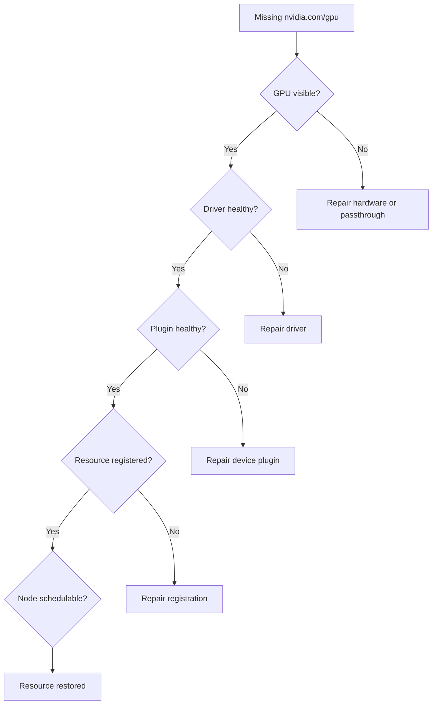

# Lab 03 — Diagnose a Missing Allocatable GPU

```yaml
Title: Diagnose a Missing Allocatable GPU
Volume: 10
Chapter: 11
Difficulty: Advanced
Estimated Time: 75 Minutes
Prerequisites: GPU-enabled Kubernetes cluster and node access
Target Platform: Kubernetes with GPU Operator or standalone device plugin
Target Audience: Platform Engineers and SREs
Lab Type: Failure & Troubleshooting
```

## 1. Objective

Diagnose a node that is Ready but does not advertise `nvidia.com/gpu`, separating hardware, driver, runtime, device-plugin, kubelet, and scheduler failures.

## 2. Background

A missing allocatable GPU is not one failure mode. Kubernetes may be healthy while the driver is broken; the driver may be healthy while the device plugin cannot register. Troubleshooting must start at the lowest layer that can prove the device exists.

## 3. Learning Outcomes

You will be able to distinguish Capacity from Allocatable, validate the physical and software stack, inspect plugin registration, recover safely, and create prevention controls.

## 4. Architecture



## 5. Prerequisites

- Permission to inspect Nodes, Pods, DaemonSets, and events
- Console or SSH access to the affected node
- A healthy comparison node from the same pool
- A maintenance window for service restarts

## 6. Environment

```bash
kubectl get nodes -o custom-columns=NAME:.metadata.name,CAPACITY:.status.capacity.nvidia\\.com/gpu,ALLOCATABLE:.status.allocatable.nvidia\\.com/gpu
export GPU_NODE='<affected-node>'
```

## 7. Components

| Layer | Evidence |
|---|---|
| Hardware | `lspci`, BMC inventory, firmware logs |
| Driver | `nvidia-smi`, modules, kernel journal |
| Runtime | containerd and NVIDIA runtime configuration |
| Device plugin | DaemonSet Pod and logs |
| Kubelet | registration logs and Node status |
| Scheduler | Pod events, taints, selectors, requests |

## 8. Deployment Steps

Prepare an evidence directory:

```bash
mkdir -p missing-gpu-evidence
kubectl get node "$GPU_NODE" -o yaml > missing-gpu-evidence/node.yaml
kubectl describe node "$GPU_NODE" > missing-gpu-evidence/node-describe.txt
kubectl get events -A --sort-by=.lastTimestamp > missing-gpu-evidence/events.txt
```

## 9. Validation

Confirm the symptom:

```bash
kubectl get node "$GPU_NODE" -o jsonpath='{.status.capacity.nvidia\\.com/gpu}{" capacity\n"}{.status.allocatable.nvidia\\.com/gpu}{" allocatable\n"}'
```

Do not create the failure in production merely to reproduce it.

## 10. Verification Workflow

### Hardware

```bash
lspci | grep -i nvidia
```

No device indicates a hardware, BIOS, passthrough, or PCIe enumeration issue.

### Driver

```bash
lsmod | grep '^nvidia'
nvidia-smi
journalctl -k | grep -Ei 'nvrm|nvidia|xid' | tail -n 100
```

### Device plugin

```bash
kubectl get pods -A -o wide | grep -i device-plugin | grep "$GPU_NODE"
kubectl logs -n gpu-operator <device-plugin-pod> --tail=200
```

Adjust the namespace for standalone deployments.

### Kubelet

```bash
journalctl -u kubelet -n 300 | grep -Ei 'device plugin|nvidia|registration'
```

### Scheduling policy

```bash
kubectl describe node "$GPU_NODE" | sed -n '/Taints:/,/Unschedulable:/p'
kubectl get node "$GPU_NODE" --show-labels
```

## 11. Observability

```bash
kubectl get pods -A -o wide | grep "$GPU_NODE" > missing-gpu-evidence/node-pods.txt
kubectl get daemonsets -A > missing-gpu-evidence/daemonsets.txt
nvidia-smi -q > missing-gpu-evidence/nvidia-smi-q.txt 2>&1
```

Compare this evidence with the healthy node.

## 12. Performance Measurements

After recovery, run an approved validation workload and compare initialization time, utilization, and error counters with the healthy baseline.

## 13. Failure Injection

In a disposable cluster, stop or mis-schedule the device-plugin Pod on one node. Observe the Node resource change, then restore the original DaemonSet immediately.

## 14. Troubleshooting Matrix

| Host healthy | Plugin healthy | Resource present | Likely cause |
|---|---|---|---|
| No | Any | No | Hardware or driver |
| Yes | No | No | DaemonSet, image, or policy |
| Yes | Erroring | No | Enumeration or configuration |
| Yes | Yes | No | Kubelet registration or stale state |
| Yes | Yes | Yes | Scheduling constraints |

Recovery order:

1. Repair the lowest failed layer.
2. Confirm `nvidia-smi`.
3. Confirm plugin health.
4. Verify kubelet registration.
5. Confirm Capacity and Allocatable.
6. Run a one-GPU validation Pod.
7. Return the node only after telemetry is normal.

## 15. Cleanup

Delete temporary validation Pods and retain the evidence bundle with the incident record.

## 16. Summary

You restored a Kubernetes GPU resource using dependency-ordered evidence rather than blind component restarts.

## 17. Challenge Exercises

Automate namespace detection, add alerts for device-plugin absence and resource loss, compare driver and plugin failure signatures, and quarantine unhealthy nodes automatically.

## 18. Further Reading

- [Device Plugin and Kubernetes Resource Model](../chapter-04-device-plugin-and-kubernetes-resource-model)
- [Upgrades and Production Troubleshooting](../chapter-11-upgrades-and-production-troubleshooting)
- [Lab 01 — Inspect a Kubernetes GPU Node](./lab-01-inspect-a-kubernetes-gpu-node)
