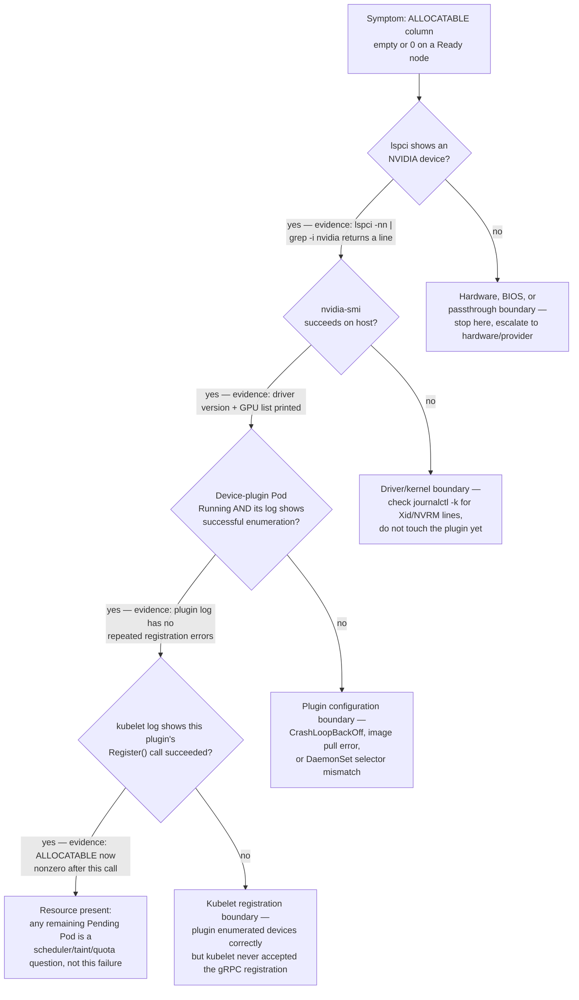

# Lab 03 — Diagnose a Missing Allocatable GPU

| Field | Value |
|---|---|
| Chapter | 11 — Upgrades and Production Troubleshooting |
| Difficulty / time | Advanced / 75 minutes |
| Type | Failure diagnosis and safe recovery planning |
| Scope | One affected node and a healthy comparison node |

## 1. Objective

Identify the lowest failed layer when a Ready node lacks `nvidia.com/gpu` Allocatable, then propose a verified, change-controlled recovery.

## 2. Production Story

After node maintenance, application Pods stay Pending even though Kubernetes reports the node Ready. Restarting every GPU component hides the evidence and can widen impact. Start with physical enumeration and advance only after each layer is proven.

## 3. Learning Outcomes

You will distinguish Capacity from Allocatable, compare a healthy node, inspect driver/plugin/kubelet evidence, separate resource loss from scheduling constraints, and define recovery gates.

## 4. Architecture



**Figure — this lab's diagnostic path IS this diagram, one step per node.** Each decision point below corresponds to exactly one numbered procedure step (11=B/C, 12=D, 13=E), and the rule that makes this lab fast instead of a fishing expedition is: never skip a `yes` branch to test a `no`-branch hypothesis further down the chain — a driver that hasn't been proven healthy makes every downstream check unreliable, not just slower to interpret.

## 5. Prerequisites

- Read access to Nodes, Pods, DaemonSets, events, and logs; approved SSH/console access.
- One affected node and one healthy node from the same pool/model where possible.
- Maintenance approval before any restart, drain, driver change, or plugin rollout.

## 6. Safety and Incident Boundary

This lab collects evidence and does not create the production failure. Do not delete Pods, restart kubelet, reload kernel modules, or modify DaemonSets until the incident owner approves a remediation plan.

## 7. Environment and Variables

**Purpose:** Bind investigation to named comparison targets.

**Command:**
```bash
export GPU_NODE='<affected-node>'
export HEALTHY_GPU_NODE='<healthy-comparison-node>'
kubectl get nodes -o custom-columns=NAME:.metadata.name,CAPACITY:.status.capacity.nvidia\.com/gpu,ALLOCATABLE:.status.allocatable.nvidia\.com/gpu
```

**Expected evidence:** The affected node has missing/zero resource information and the comparison node has a known-good state.

**Explanation:** A comparison eliminates assumptions about intended configuration.

**Common-failure interpretation:** If no healthy peer exists, use the node pool’s approved baseline/configuration repository and record the limitation.

## 8. Components and Evidence Map

| Layer | Proof | Typical owner |
|---|---|---|
| Hardware | PCI enumeration/BMC | hardware or cloud provider |
| Driver | `nvidia-smi`, kernel log | node platform |
| Runtime | runtime configuration | node platform |
| Device plugin | DaemonSet Pod/log | GPU platform |
| Kubelet | Node status/registration log | Kubernetes platform |
| Scheduler | Pod events/taints | workload + platform |

## 9. Procedure: Preserve Initial Evidence

**Purpose:** Capture evidence before any remediation changes timestamps or restarts components.

**Command:**
```bash
mkdir -p missing-gpu-evidence
kubectl get node "$GPU_NODE" -o yaml > missing-gpu-evidence/node.yaml
kubectl describe node "$GPU_NODE" > missing-gpu-evidence/node-describe.txt
kubectl get events -A --sort-by=.lastTimestamp > missing-gpu-evidence/events.txt
```

**Expected evidence:** Node status, conditions, events, labels, taints, Capacity, and Allocatable are retained.

**Explanation:** This is the incident’s before-state; do not overwrite it after recovery.

**Common-failure interpretation:** RBAC failures must be documented and resolved through approved access—not bypassed with cluster-admin credentials.

## 10. Validate the Symptom and Compare

**Purpose:** Confirm whether loss is Capacity, Allocatable, or only scheduling policy.

**Command:**
```bash
kubectl get node "$GPU_NODE" -o jsonpath='{.status.capacity.nvidia\.com/gpu}{" capacity\n"}{.status.allocatable.nvidia\.com/gpu}{" allocatable\n"}'
kubectl get node "$HEALTHY_GPU_NODE" -o jsonpath='{.status.capacity.nvidia\.com/gpu}{" capacity\n"}{.status.allocatable.nvidia\.com/gpu}{" allocatable\n"}'
```

**Expected evidence:**
```text
$ kubectl get node "$GPU_NODE" -o jsonpath='{.status.capacity.nvidia\.com/gpu}{" capacity\n"}{.status.allocatable.nvidia\.com/gpu}{" allocatable\n"}'
8 capacity

$ kubectl get node "$HEALTHY_GPU_NODE" -o jsonpath='{.status.capacity.nvidia\.com/gpu}{" capacity\n"}{.status.allocatable.nvidia\.com/gpu}{" allocatable\n"}'
8 capacity
8 allocatable
```
`8 capacity` printed on `$GPU_NODE` with **no second line at all** (not `0 allocatable` — the field is absent) is the exact symptom this lab exists to diagnose: the device plugin registered the node's total device count at some point in the past (that's where `Capacity` comes from), but nothing is currently being reported as schedulable. `$HEALTHY_GPU_NODE` printing both lines with matching values is the comparison baseline every later step will be checked against. This asymmetry — `Capacity` present, `Allocatable` absent — already rules out hardware being physically gone (a `Capacity` value had to come from somewhere) and points the investigation at driver, plugin, or kubelet, which is exactly the order Section 4's diagram walks next.

**Explanation:** A present resource with a Pending Pod is usually a scheduler/request/taint question, not this failure mode.

**Common-failure interpretation:** Empty output may mean no registered resource, not numeric zero; retain the raw node YAML.

## 11. Procedure: Hardware and Driver (Hardware Only)

Run on the affected node through the approved access path.

**Purpose:** Prove PCI visibility and driver initialization before inspecting Kubernetes components.

**Command:**
```bash
lspci | grep -i nvidia
lsmod | grep '^nvidia' || true
nvidia-smi
journalctl -k | grep -Ei 'nvrm|nvidia|xid' | tail -n 100
```

**Expected evidence:**
```text
$ lspci | grep -i nvidia
1b:00.0 3D controller: NVIDIA Corporation GA100 [A100 SXM4 80GB] (rev a1)

$ lsmod | grep '^nvidia' || true
nvidia_uvm          1622016  0
nvidia_drm             69632  0
nvidia_modeset       1249280  1 nvidia_drm
nvidia              56655872  86 nvidia_uvm,nvidia_modeset

$ nvidia-smi
NVIDIA-SMI has failed because it couldn't communicate with the NVIDIA driver.
Make sure that the latest NVIDIA driver is installed and running.

$ journalctl -k | grep -Ei 'nvrm|nvidia|xid' | tail -n 5
Aug 12 03:02:11 gpu-node-11 kernel: NVRM: GPU 0000:1b:00.0: RmInitAdapter failed! (0x62:0xffff:1487)
Aug 12 03:02:11 gpu-node-11 kernel: NVRM: GPU 0000:1b:00.0: rm_init_adapter failed, device minor number 0
```
This is a real example of `B: yes, C: no` from the Architecture diagram: `lspci` finds the device (`1b:00.0 ... A100 SXM4 80GB`) and `lsmod` shows the kernel modules are even loaded — but `nvidia-smi` still fails to communicate, and the kernel log names the exact reason: `RmInitAdapter failed`, an initialization failure at the hardware/driver handshake, not a missing module. This is the driver/kernel boundary the diagram routes to — the fix is not "reinstall the device plugin," it's a driver-level remediation (often a GPU reset or node reboot), and jumping ahead to inspect plugin logs at this point would waste a diagnostic step on a layer that can't possibly be healthy yet.

**Explanation:** The device plugin cannot advertise a GPU that the host cannot initialize.

**Common-failure interpretation:** No PCI device points to hardware/BIOS/passthrough. `nvidia-smi` failure with visible PCI points to the driver/kernel/firmware boundary; stop there and escalate appropriately.

## 12. Procedure: Device Plugin and Discovery

**Purpose:** Locate the actual device-plugin Pod on the affected node and inspect its recent output.

**Command:**
```bash
kubectl get pods -A -o wide | grep -i device-plugin | grep "$GPU_NODE" || true
kubectl get daemonsets -A | grep -Ei 'device.plugin|nvidia' || true
```

**Expected evidence:** The responsible Pod/DaemonSet and namespace are identified, or their absence is proven.

**Explanation:** Names and namespaces differ between GPU Operator and standalone deployments.

**Common-failure interpretation:** No Pod on a GPU node suggests DaemonSet selectors, tolerations, image pulls, or scheduling restrictions; inspect its actual DaemonSet and events next.

**Purpose:** Read the identified plugin’s logs without guessing its name.

**Command:**
```bash
kubectl logs -n <plugin-namespace> <plugin-pod-on-affected-node> --tail=200
kubectl describe pod -n <plugin-namespace> <plugin-pod-on-affected-node>
```

**Expected evidence:**
```text
$ kubectl logs -n gpu-operator nvidia-device-plugin-daemonset-9k2lp --tail=20
I0812 03:02:15.114231       1 main.go:279] Starting FS watcher.
I0812 03:02:15.114532       1 main.go:286] Starting OS watcher.
I0812 03:02:15.119887       1 main.go:365] Failed to initialize NVML: could not load NVML library.
I0812 03:02:15.119901       1 main.go:366] If this is a GPU node, did you forget to declare it as such using a label?
E0812 03:02:15.119910       1 main.go:290] error starting plugins: nvml init failed

$ kubectl describe pod -n gpu-operator nvidia-device-plugin-daemonset-9k2lp | tail -4
  Warning  BackOff   30s (x12 over 5m)  kubelet  Back-off restarting failed container
```
`Failed to initialize NVML: could not load NVML library` is the plugin telling you directly it cannot talk to the driver's user-space library — this is the `D: no` branch, and note it's a *downstream symptom* of the same driver failure Section 11 already found, not a second independent bug. `BackOff ... restarting failed container` confirms the plugin container itself is crash-looping, which is why `Capacity` (published once, historically) survived while `Allocatable` (requires an actively-registered plugin) did not. If Section 11's driver check had come back clean, this exact log line would instead point at a genuinely separate plugin-configuration problem — the value of doing the checks in order is knowing which of those two very different fixes you're looking at.

**Explanation:** Substitute the discovered values literally; placeholders prevent accidental inspection of the wrong Pod.

**Common-failure interpretation:** Enumeration errors return to the driver layer; CrashLoop/image errors require the deployment/registry path; a healthy plugin with no resource moves to kubelet.

## 13. Procedure: Kubelet and Runtime (Hardware Only)

**Purpose:** Find device-plugin registration and runtime-related kubelet evidence.

**Command:**
```bash
journalctl -u kubelet -n 300 | grep -Ei 'device plugin|nvidia|registration' || true
sudo crictl info
```

**Expected evidence:**
```text
$ journalctl -u kubelet -n 300 | grep -Ei 'device plugin|nvidia|registration' | tail -5
Aug 12 02:58:40 gpu-node-11 kubelet[1842]: I0812 device_plugin_handler.go:180: Got registration request from device plugin with resource name "nvidia.com/gpu"
Aug 12 02:58:40 gpu-node-11 kubelet[1842]: E0812 device_plugin_handler.go:212: Failed to dial device plugin with socket /var/lib/kubelet/device-plugins/nvidia.sock: context deadline exceeded
```
This is the healthy-plugin-but-failed-registration case (`D: yes, E: no` in the diagram) — different from what Section 12 found, included here to show what that branch's evidence looks like: kubelet logs a registration *request* arriving, then a `context deadline exceeded` dialing the plugin's own gRPC socket back. When you see this pattern instead of Section 12's NVML failure, the fix is entirely different — a kubelet-side socket/permission issue or a plugin that crashed between registering and kubelet's confirmation dial, not a driver problem at all. This is exactly why the table in Section 16 keeps "Plugin healthy, resource absent" and "Plugin absent/unhealthy" as two separate rows with two separate next actions.

**Explanation:** Kubelet owns the Node status update after a plugin registers.

**Common-failure interpretation:** No matching log line is not a verdict; compare timestamps and plugin state. Repeated registration errors need kubelet/plugin configuration review before restarting either service.

## 14. Scheduler Policy Check

**Purpose:** Separate missing resource advertisement from a resource that is unavailable to a particular workload.

**Command:**
```bash
kubectl describe node "$GPU_NODE" | sed -n '/Taints:/,/Unschedulable:/p'
kubectl get node "$GPU_NODE" --show-labels
```

**Expected evidence:** Taints, cordon state, and relevant labels are visible.

**Explanation:** These conditions do not remove Allocatable but can keep a correct GPU request Pending.

**Common-failure interpretation:** If resource values are present, inspect the workload’s requests, tolerations, selectors, affinity, quotas, and Pod events rather than repairing the node.

## 15. Recovery Plan and Acceptance Gates

Repair only the lowest failed layer through the approved platform runbook. After the change, require: host `nvidia-smi` (when applicable), healthy plugin, non-empty Capacity and Allocatable, a one-GPU validation Pod, and normal telemetry/error logs. Compare each result with `$HEALTHY_GPU_NODE` before returning the node to service.

## 16. Safe Failure Exercise and Troubleshooting Matrix

In a disposable cluster, prevent the device-plugin DaemonSet from matching one test node using a reviewed temporary selector; observe resource loss, restore the exact prior spec, and verify the gates above. Never use this injection in shared production.

| Evidence | Interpretation | Next action |
|---|---|---|
| PCI device absent | physical/passthrough issue | hardware/provider escalation |
| Driver fails | driver/kernel issue | approved node remediation |
| Plugin absent/unhealthy | DaemonSet/deployment issue | inspect selector/events/logs |
| Plugin healthy, resource absent | registration issue | kubelet/plugin config review |
| Resource present | scheduling issue | inspect Pod policy/events |

## 17. Cleanup and Handoff

**Purpose:** Preserve evidence and confirm no temporary validation workload remains.

**Command:**
```bash
kubectl delete pod gpu-missing-resource-validation --ignore-not-found
```

**Expected evidence:** The named disposable Pod is absent; no platform component changes are made by cleanup.

**Explanation:** Keep `missing-gpu-evidence` with the incident, including before/after Node YAML and remediation approval.

**Common-failure interpretation:** If a real workload has the same name, stop—the target assumption is invalid. Do not delete it.

## 18. Summary, Challenges, and Further Reading

You used dependency-ordered evidence instead of broad restarts. Next, automate peer comparison, alert on resource loss and plugin absence, and apply the controlled-change discipline in [Lab 04](./lab-04-perform-a-controlled-gpu-platform-upgrade).

- [Device Plugin and Kubernetes Resource Model](../chapter-04-device-plugin-and-kubernetes-resource-model)
- [GPU Observability with DCGM](../chapter-09-gpu-observability-with-dcgm)
- [Upgrades and Production Troubleshooting](../chapter-11-upgrades-and-production-troubleshooting)
