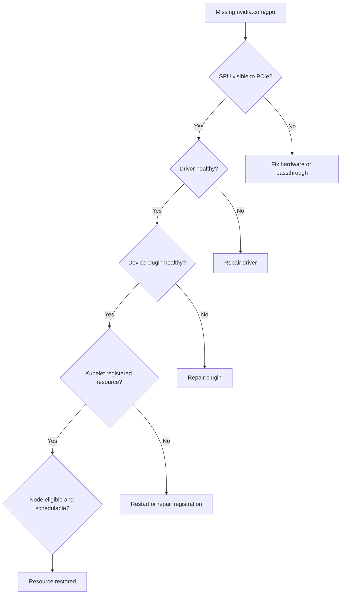

# Lab 03 — Diagnose a Missing Allocatable GPU

```yaml
Title: Diagnose a Missing Allocatable GPU
Volume: 10
Chapter: 11
Difficulty: Advanced
Estimated Time: 75 Minutes
Prerequisites: GPU-enabled Kubernetes cluster and node access
Target Platform: Kubernetes with GPU Operator or standalone device plugin
Target Audience: Platform Engineers and SREs
Lab Type: Failure & Troubleshooting
```

## 1. Objective

Diagnose a node that is Ready but does not advertise `nvidia.com/gpu`. Use a strict bottom-up workflow that separates hardware, driver, runtime, device-plugin, kubelet, and scheduler failures.

## 2. Background

A missing allocatable GPU is not a single failure mode. Kubernetes may be healthy while the driver is broken. The driver may be healthy while the device plugin is absent. The plugin may be running but unable to enumerate devices. Effective incident response begins at the lowest layer that can prove the device exists.

## 3. Learning Outcomes

You will be able to:

- distinguish Capacity from Allocatable;
- verify GPU hardware and driver health;
- inspect device-plugin registration and logs;
- correlate kubelet events with Node status;
- recover the resource safely;
- document prevention controls.

## 4. Architecture



## 5. Prerequisites

- Permission to inspect Nodes, Pods, DaemonSets, and events
- SSH or console access to the affected node
- A known-good GPU node for comparison
- A maintenance window before restarting node services

## 6. Environment

```bash
kubectl get nodes -o wide
kubectl get nodes -o custom-columns=NAME:.metadata.name,CAPACITY:.status.capacity.nvidia\.com/gpu,ALLOCATABLE:.status.allocatable.nvidia\.com/gpu
```

Select an affected node:

```bash
export GPU_NODE='<affected-node>'
```

## 7. Components

| Layer | Evidence source |
|---|---|
| Hardware | `lspci`, BMC inventory, firmware logs |
| Driver | `nvidia-smi`, kernel modules, journal |
| Runtime | containerd and NVIDIA runtime configuration |
| Device plugin | DaemonSet Pod and logs |
| Kubelet | Node status, plugin registration logs |
| Scheduler | Pod events, taints, selectors, resource requests |

## 8. Deployment Steps

This is a troubleshooting lab; deployment means preparing evidence and a controlled test workload.

```bash
mkdir -p missing-gpu-evidence
kubectl get node "$GPU_NODE" -o yaml > missing-gpu-evidence/node.yaml
kubectl describe node "$GPU_NODE" > missing-gpu-evidence/node-describe.txt
kubectl get events -A --sort-by=.lastTimestamp > missing-gpu-evidence/events.txt
```

## 9. Validation

Confirm the symptom:

```bash
kubectl get node "$GPU_NODE" -o jsonpath='{.status.capacity.nvidia\.com/gpu}{" capacity\n"}{.status.allocatable.nvidia\.com/gpu}{" allocatable\n"}'
```

If the resource is present, reproduce the issue only in a disposable cluster or use historical evidence instead of creating an outage.

## 10. Verification Workflow

### Layer 1 — Hardware

On the node:

```bash
lspci | grep -i nvidia
```

No NVIDIA device indicates hardware, BIOS, passthrough, or PCIe enumeration failure. Kubernetes cannot repair this layer.

### Layer 2 — Driver

```bash
lsmod | grep '^nvidia'
nvidia-smi
journalctl -k | grep -Ei 'nvrm|nvidia|xid' | tail -n 100
```

Healthy output must show the expected devices without a driver communication error.

### Layer 3 — Device plugin

```bash
kubectl get pods -A -o wide | grep -i device-plugin | grep "$GPU_NODE"
kubectl logs -n gpu-operator <device-plugin-pod> --tail=200
```

For a standalone deployment, use its namespace. Look for device discovery, registration, and health errors.

### Layer 4 — Kubelet

```bash
journalctl -u kubelet -n 300 | grep -Ei 'device plugin|nvidia|registration'
```

The kubelet must accept the plugin registration and update Node status.

### Layer 5 — Eligibility

```bash
kubectl describe node "$GPU_NODE" | sed -n '/Taints:/,/Unschedulable:/p'
kubectl get node "$GPU_NODE" --show-labels
```

Taints and labels do not normally remove capacity, but they explain why workloads still cannot schedule after the resource returns.

## 11. Observability

Collect operand state and logs:

```bash
kubectl get pods -A -o wide | grep "$GPU_NODE" > missing-gpu-evidence/node-pods.txt
kubectl get daemonsets -A > missing-gpu-evidence/daemonsets.txt
nvidia-smi -q > missing-gpu-evidence/nvidia-smi-q.txt 2>&1
```

Compare against a healthy node from the same hardware pool.

## 12. Performance Measurements

After recovery, run a small approved validation workload and compare initialization time and basic utilization with the healthy-node baseline. The goal is to detect a partially recovered state, not to certify peak performance.

## 13. Failure Injection

In a disposable cluster, temporarily stop or mis-schedule the device-plugin Pod on one node. Observe how Node capacity changes and how new GPU Pods behave. Restore the DaemonSet immediately after collecting evidence.

## 14. Troubleshooting Matrix

| Healthy host? | Plugin running? | Resource present? | Likely cause |
|---|---|---|---|
| No | Any | No | Hardware or driver |
| Yes | No | No | DaemonSet scheduling, image, or policy |
| Yes | Yes, erroring | No | Enumeration or plugin configuration |
| Yes | Yes | No | Kubelet registration or stale node state |
| Yes | Yes | Yes | Scheduling policy, taints, selectors, or request |

### Recovery sequence

1. Repair the lowest failed layer.
2. Restart only the affected component where possible.
3. Confirm `nvidia-smi` before touching Kubernetes components.
4. Confirm plugin health before restarting kubelet.
5. Verify Capacity and Allocatable.
6. Run a one-GPU validation Pod.
7. Return the node to service only after telemetry is normal.

## 15. Cleanup

Remove temporary test Pods and retain the evidence bundle with the incident record.

```bash
kubectl delete pod gpu-recovery-validation --ignore-not-found
```

## 16. Summary

You diagnosed a missing Kubernetes GPU resource by proving each dependency from hardware to scheduler rather than restarting components blindly.

## 17. Challenge Exercises

- Create a runbook that selects the correct namespace automatically.
- Add alerts for device-plugin absence and allocatable resource loss.
- Compare behavior when the plugin fails versus when the driver fails.
- Automate node quarantine when GPU health is lost.

## 18. Further Reading

- [Device Plugin and Kubernetes Resource Model](../chapter-04-device-plugin-and-kubernetes-resource-model)
- [Production Troubleshooting](../chapter-11-production-troubleshooting)
- [Lab 01 — Inspect a Kubernetes GPU Node](./lab-01-inspect-a-kubernetes-gpu-node)
