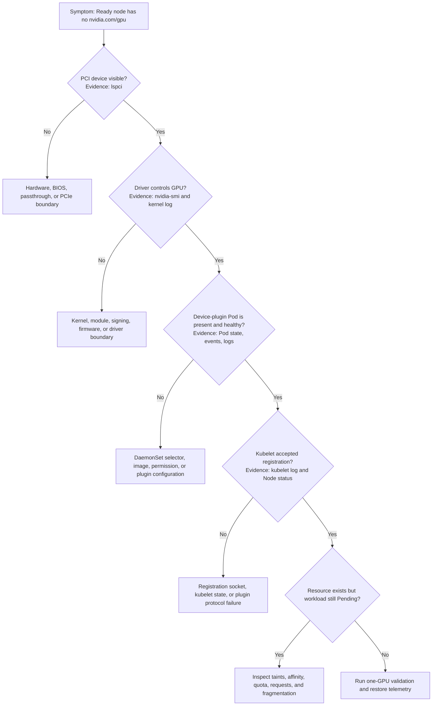

# Lab 03 — Diagnose a Missing Allocatable GPU

| Field | Value |
|---|---|
| Chapter | 11 — Upgrades and Production Troubleshooting |
| Difficulty / time | Advanced / 90 minutes |
| Type | Failure diagnosis and safe recovery planning |
| Scope | One affected node and one healthy comparison node |

## 1. Objective

Identify the lowest failed layer when a Kubernetes `Ready` node lacks `nvidia.com/gpu` in Capacity or Allocatable, preserve evidence before remediation, and prove recovery with an end-to-end GPU workload.

## 2. Production Story

After a kernel maintenance window, `gpu-worker-07` returns as `Ready`, but every new GPU Pod remains Pending. The node still has eight physical GPUs. Restarting every operator Pod would destroy the ordering evidence and might hide whether the first failure is the host driver, the device plugin, or kubelet registration. This lab follows the dependency chain and stops at the first failed boundary.

## 3. Learning Outcomes

By completion, you can:

- distinguish physical inventory, Capacity, Allocatable, and scheduler eligibility;
- compare an affected node with a known-good peer;
- read driver, device-plugin, kubelet, and scheduling evidence;
- avoid destructive “restart everything” troubleshooting;
- define and verify a scoped recovery gate.

## 4. Architecture



**Figure 10.L3.1 — The decision path advances only when the current layer is proven.** A healthy plugin Pod is not enough if kubelet rejected registration, and a present resource means the incident has moved from advertisement to scheduling policy.

## 5. Prerequisites

- Read access to Nodes, Pods, DaemonSets, events, and logs.
- Approved SSH or console access to the affected node.
- One healthy comparison node from the same pool where possible.
- Maintenance approval before any restart, drain, module change, or DaemonSet modification.
- An approved CUDA validation image available from the organization’s registry.

## 6. Safety and Incident Boundary

This lab begins read-only. Do not delete operator Pods, restart kubelet, reload modules, reboot, or change DaemonSet selectors until the incident owner approves the exact remediation. Capture the before-state first. If the affected node serves production traffic, cordon or quarantine it through the established runbook before disruptive recovery.

## 7. Environment

Use concrete example names, then replace them with your approved targets.

```bash
export GPU_NODE=gpu-worker-07
export HEALTHY_GPU_NODE=gpu-worker-03
export GPU_NAMESPACE=gpu-operator
export VALIDATION_IMAGE=registry.example.com/platform/cuda-validation:approved
```

**Purpose:** Confirm that both nodes exist and establish the cluster’s current resource view.

```bash
kubectl get nodes "$GPU_NODE" "$HEALTHY_GPU_NODE" \
  -o custom-columns=NAME:.metadata.name,READY:.status.conditions[-1].status,CAPACITY:.status.capacity.nvidia\.com/gpu,ALLOCATABLE:.status.allocatable.nvidia\.com/gpu
```

**Representative output:**

```text
NAME            READY   CAPACITY   ALLOCATABLE
gpu-worker-07   True    <none>     <none>
gpu-worker-03   True    8          8
```

`gpu-worker-07` is Kubernetes-ready but has no registered GPU extended resource. `gpu-worker-03` proves that the pool normally advertises eight units. Empty values are different from a numeric `0`: empty usually means kubelet has no resource key registered at all.

## 8. Components and Evidence Map

| Layer | Evidence | What healthy looks like | What it does not prove |
|---|---|---|---|
| Hardware | `lspci`, BMC/provider inventory | expected NVIDIA PCI functions exist | driver initialized them |
| Driver | `nvidia-smi`, modules, kernel log | expected GPU UUIDs and no initialization failure | Kubernetes advertises them |
| Device plugin | Pod state, events, logs | enumerates devices and registers | kubelet accepted and published resource |
| Kubelet | service logs and Node status | registration accepted and resource key published | workload meets scheduling policy |
| Scheduler | Pod events | eligible node and resource found | runtime can initialize CUDA |
| Runtime/workload | validation Pod | assigned device works in container | application-specific performance |

## 9. Preserve the Before-State

**Purpose:** Save evidence before any restart changes timestamps or removes the first error.

```bash
mkdir -p missing-gpu-evidence
kubectl get node "$GPU_NODE" -o yaml > missing-gpu-evidence/affected-node-before.yaml
kubectl get node "$HEALTHY_GPU_NODE" -o yaml > missing-gpu-evidence/healthy-node.yaml
kubectl describe node "$GPU_NODE" > missing-gpu-evidence/affected-node-describe.txt
kubectl get events -A --sort-by=.lastTimestamp > missing-gpu-evidence/events-before.txt
```

**Expected result:** Four files contain the raw Node state, comparison state, and incident timeline.

**Common failure:** An RBAC denial is itself an operational gap. Do not bypass it with unreviewed cluster-admin credentials; document the missing evidence and request approved access.

## 10. Validate the Missing Resource Precisely

```bash
kubectl get node "$GPU_NODE" -o jsonpath='{.status.capacity.nvidia\.com/gpu}{" capacity\n"}{.status.allocatable.nvidia\.com/gpu}{" allocatable\n"}'
kubectl get node "$HEALTHY_GPU_NODE" -o jsonpath='{.status.capacity.nvidia\.com/gpu}{" capacity\n"}{.status.allocatable.nvidia\.com/gpu}{" allocatable\n"}'
```

**Representative output:**

```text
 capacity
 allocatable
8 capacity
8 allocatable
```

The blank first pair confirms that the affected node does not publish the resource key. This is not resource exhaustion: an exhausted but registered resource would normally still show Capacity `8` and Allocatable `8`, while existing Pod allocations consume scheduling availability through requests.

## 11. Hardware and Driver Evidence

Run these commands on `gpu-worker-07` through the approved access path.

```bash
lspci -nn | grep -i nvidia
lsmod | grep '^nvidia' || true
nvidia-smi -L
nvidia-smi
journalctl -k --since '-60 min' | grep -Ei 'nvrm|nvidia|xid|module' | tail -n 80
```

### Healthy representative output

```text
$ lspci -nn | grep -i nvidia
41:00.0 3D controller [0302]: NVIDIA Corporation Device [10de:2330] (rev a1)
61:00.0 3D controller [0302]: NVIDIA Corporation Device [10de:2330] (rev a1)

$ nvidia-smi -L
GPU 0: NVIDIA H100 80GB HBM3 (UUID: GPU-3f1d...a902)
GPU 1: NVIDIA H100 80GB HBM3 (UUID: GPU-5a8b...d114)
...
GPU 7: NVIDIA H100 80GB HBM3 (UUID: GPU-b82c...7fd0)
```

The PCI functions prove enumeration. Eight UUIDs prove that the loaded driver controls eight devices. This evidence moves the investigation upward to the plugin; it does not prove Kubernetes registration.

### Broken representative output

```text
$ nvidia-smi
NVIDIA-SMI has failed because it couldn't communicate with the NVIDIA driver.

$ journalctl -k --since '-60 min' | grep -Ei 'nvrm|nvidia|module' | tail
Aug 06 15:18:21 gpu-worker-07 kernel: nvidia: version magic '6.8.0-48-generic ...' should be '6.8.0-49-generic ...'
Aug 06 15:18:21 gpu-worker-07 kernel: nvidia: module verification failed
```

The kernel changed but the module was built for the prior kernel. Stop here. Restarting the device plugin cannot repair a driver that the host cannot load.

## 12. Device-Plugin Evidence

Locate the plugin Pod on the affected node without assuming an exact release-specific name.

```bash
PLUGIN_POD=$(kubectl get pods -A -o jsonpath='{range .items[?(@.spec.nodeName=="'"$GPU_NODE"'")]}{.metadata.namespace}{" "}{.metadata.name}{"\n"}{end}' | awk 'tolower($0) ~ /device-plugin/ {print $2; exit}')
PLUGIN_NS=$(kubectl get pods -A -o jsonpath='{range .items[?(@.spec.nodeName=="'"$GPU_NODE"'")]}{.metadata.namespace}{" "}{.metadata.name}{"\n"}{end}' | awk 'tolower($0) ~ /device-plugin/ {print $1; exit}')
printf 'plugin namespace=%s pod=%s\n' "$PLUGIN_NS" "$PLUGIN_POD"
```

**Representative output:**

```text
plugin namespace=gpu-operator pod=nvidia-device-plugin-daemonset-k9m7x
```

Then inspect it:

```bash
kubectl get pod -n "$PLUGIN_NS" "$PLUGIN_POD" -o wide
kubectl describe pod -n "$PLUGIN_NS" "$PLUGIN_POD"
kubectl logs -n "$PLUGIN_NS" "$PLUGIN_POD" --tail=200
```

### Healthy representative output

```text
NAME                                      READY   STATUS    RESTARTS   NODE
nvidia-device-plugin-daemonset-k9m7x      1/1     Running   0          gpu-worker-07

I0806 15:22:11 Starting FS watcher for /var/lib/kubelet/device-plugins
I0806 15:22:11 Starting OS watcher
I0806 15:22:12 Registered device plugin for 'nvidia.com/gpu' with Kubelet
```

A registration message is useful, but the Node object remains the authoritative control-plane result. If logs claim registration while Capacity is absent, continue to kubelet evidence.

### Broken representative output

```text
E0806 15:22:11 Incompatible strategy detected auto
E0806 15:22:11 No valid devices detected. Waiting indefinitely.
```

This can occur when the driver or device-discovery path is unavailable inside the plugin Pod. Compare mounts, security context, configuration, and the healthy peer before changing the DaemonSet.

## 13. Kubelet Registration Evidence

Run on the affected node:

```bash
journalctl -u kubelet --since '-60 min' | grep -Ei 'device.?plugin|nvidia|registration' | tail -n 120
sudo ls -la /var/lib/kubelet/device-plugins
```

### Healthy representative output

```text
Aug 06 15:22:12 kubelet: Registered device plugin for resource nvidia.com/gpu
Aug 06 15:22:12 kubelet: Updating node status with capacity nvidia.com/gpu=8
```

### Broken representative output

```text
Aug 06 15:22:12 kubelet: Registration of device plugin failed: resourceName "nvidia.com/gpu" already registered
Aug 06 15:22:13 kubelet: Removing unusable device-plugin endpoint nvidia.sock
```

A duplicate or stale endpoint can block registration. Follow the platform runbook; do not delete kubelet state or restart services without approval because that affects every Pod on the node.

## 14. Distinguish Advertisement from Scheduling Policy

When Capacity and Allocatable reappear, a Pod may still remain Pending. Read its events before changing the node.

```bash
kubectl describe node "$GPU_NODE" | sed -n '/Taints:/,/Unschedulable:/p'
kubectl get node "$GPU_NODE" --show-labels
kubectl describe pod gpu-training-worker-0 -n ai-training
```

**Representative event:**

```text
Warning  FailedScheduling  32s  default-scheduler
0/8 nodes are available: 1 Insufficient nvidia.com/gpu,
3 node(s) didn't match Pod's node affinity/selector,
4 node(s) had untolerated taint {gpu.platform.example/maintenance: true}.
```

This is no longer a missing-resource incident. The event separates shortage, affinity, and taint exclusions. Weakening all three constraints would hide the actual capacity decision.

## 15. Recovery and Acceptance Gates

Repair only the lowest failed layer. After the approved remediation, require all gates:

1. `nvidia-smi -L` lists the expected eight UUIDs.
2. Plugin Pod is Ready with no new enumeration or registration errors.
3. Node Capacity and Allocatable both equal the approved count.
4. A fresh one-GPU validation Pod completes.
5. DCGM or the approved telemetry path shows fresh samples for the node.

Create the validation Pod:

```yaml
apiVersion: v1
kind: Pod
metadata:
  name: gpu-missing-resource-validation
spec:
  restartPolicy: Never
  nodeName: gpu-worker-07
  containers:
    - name: cuda
      image: registry.example.com/platform/cuda-validation:approved
      command: ["bash", "-lc", "nvidia-smi -L && echo GPU_RESOURCE_RECOVERED"]
      resources:
        limits:
          nvidia.com/gpu: 1
```

```bash
kubectl apply -f gpu-missing-resource-validation.yaml
kubectl wait --for=jsonpath='{.status.phase}'=Succeeded pod/gpu-missing-resource-validation --timeout=5m
kubectl logs gpu-missing-resource-validation
```

**Representative output:**

```text
GPU 0: NVIDIA H100 80GB HBM3 (UUID: GPU-3f1d...a902)
GPU_RESOURCE_RECOVERED
```

The Pod saw one allocated device, as expected. It does not need to see all eight host devices; seeing all eight would be an isolation concern.

## 16. Safe Failure Exercise and Troubleshooting Matrix

In a disposable cluster, apply a temporary node selector to the device-plugin DaemonSet so that it does not match one test node. Save the original manifest first, observe resource disappearance after kubelet updates, then restore the exact original spec. Do not run this exercise in a shared production cluster.

| Evidence | Interpretation | Next action |
|---|---|---|
| PCI device absent | hardware, firmware, passthrough, or PCIe boundary | provider or hardware escalation |
| PCI visible; `nvidia-smi` fails | driver/kernel/signing boundary | approved node remediation |
| Driver healthy; plugin absent | DaemonSet scheduling or image boundary | selectors, tolerations, events, registry |
| Plugin logs registration; resource absent | kubelet registration or stale endpoint | kubelet/plugin runbook |
| Resource present; Pod Pending | scheduling and policy | events, affinity, taints, quota, fragmentation |
| Pod allocated; CUDA fails | runtime, driver-to-image, or application | minimal image and runtime evidence |

## 17. Cleanup and Operational Handoff

```bash
kubectl delete pod gpu-missing-resource-validation --ignore-not-found
kubectl get node "$GPU_NODE" -o yaml > missing-gpu-evidence/affected-node-after.yaml
kubectl get events -A --sort-by=.lastTimestamp > missing-gpu-evidence/events-after.txt
```

Handoff the before/after Node YAML, host evidence, plugin and kubelet logs, remediation approval, validation output, telemetry status, and exact time the node returned to service.

## 18. Summary, Challenges, and Further Reading

You identified the first failed boundary instead of broadly restarting the GPU stack. Extend this lab by automating healthy-peer comparison, alerting on loss of the resource key, and recording the time between driver recovery and kubelet advertisement.

- [Device Plugin and Kubernetes Resource Model](../chapter-04-device-plugin-and-kubernetes-resource-model)
- [GPU Observability with DCGM](../chapter-09-gpu-observability-with-dcgm)
- [Upgrades and Production Troubleshooting](../chapter-11-upgrades-and-production-troubleshooting)
- [Lab 04 — Perform a Controlled GPU Platform Upgrade](./lab-04-perform-a-controlled-gpu-platform-upgrade)
