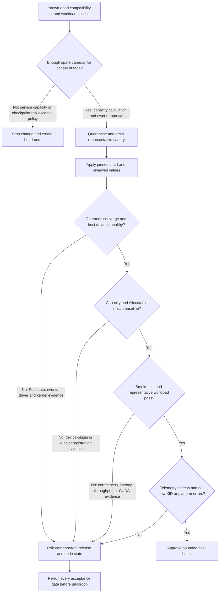

# Lab 04 — Perform a Controlled GPU Platform Upgrade

| Field | Value |
|---|---|
| Chapter | 10 — Production Installation and Configuration |
| Difficulty / time | Expert / 120–150 minutes |
| Type | Controlled production-like change |
| Scope | Isolated canary pool before wider rollout |

## 1. Objective

Execute a version-pinned GPU platform upgrade through one representative canary, use objective evidence to decide rollout or rollback, and retain a complete before/after record.

## 2. Production Story

A GPU platform upgrade crosses the kernel, driver, Container Toolkit, device plugin, GPU Operator, Kubernetes API, telemetry, and workload image boundaries. A chart can report `deployed` while the canary loses GPU resources or a fresh container cannot initialize CUDA. The canary is therefore a bounded experiment with explicit stop conditions, not a ceremonial first node.

## 3. Learning Outcomes

By completion, you can:

- build a compatibility and rollback record;
- calculate maintenance headroom and select a representative canary;
- drain without overriding workload safeguards casually;
- validate operator, host, resource, workload, telemetry, and performance gates;
- execute and verify rollback when a gate fails.

## 4. Architecture



**Figure 10.L4.1 — Promotion requires independent platform, workload, and observability evidence.** A Helm success message proves only release reconciliation from Helm’s perspective.

## 5. Prerequisites

- Approved maintenance change and named decision authority.
- Workload-owner agreement and verified checkpoint or rescheduling behavior.
- Spare capacity sufficient for the canary to remain unavailable.
- Reviewed compatibility sources for the target Kubernetes, OS/kernel, GPU Operator, driver ownership, runtime/toolkit, GPU model, validation image, and representative workload.
- Current and target values files in version control.
- A known previous Helm revision and a tested node-image or driver rollback path.
- Working monitoring before the change starts.

## 6. Safety, Scope, and Stop Conditions

Do not drain stateful or checkpoint-sensitive GPU workloads without owner approval. Stop immediately when any of these occur:

- required operands fail to converge;
- the driver or expected GPUs disappear;
- Capacity or Allocatable changes unexpectedly;
- a fresh one-GPU Pod fails;
- the representative workload fails correctness or exceeds the agreed regression threshold;
- telemetry becomes stale or absent;
- new kernel, XID, kubelet, runtime, or operator errors appear.

Do not convert a failed canary into a fleet-wide test.

## 7. Environment and Capacity Calculation

Use concrete examples, then replace them with approved values:

```bash
export CANARY_NODE=gpu-canary-01
export TARGET_VERSION=25.3.2
export VALIDATION_IMAGE=registry.example.com/platform/cuda-validation:approved
export GPU_NAMESPACE=gpu-operator
kubectl config current-context
```

`TARGET_VERSION` above is an example value for lab structure only. Use the version approved by your current support and compatibility review.

Before draining, calculate service headroom. Example:

```text
Current pool: 12 nodes × 8 GPUs = 96 GPUs
Canary unavailable: 11 nodes × 8 GPUs = 88 GPUs
Reserved failure headroom: 1 additional node = 8 GPUs
Guaranteed workload capacity during change: 80 GPUs

Current committed workload demand: 72 GPUs
Operational margin: 80 - 72 = 8 GPUs
Margin percentage: 8 / 80 × 100 = 10%
```

A positive count alone is not enough. Confirm that demand can fit the remaining node shapes; four free GPUs spread one per node cannot satisfy a four-GPU single-node request.

## 8. Compatibility Matrix and Acceptance Gates

Record the actual current and target values:

| Layer | Current | Target | Verification source | Rollback owner |
|---|---|---|---|---|
| Kubernetes | current cluster value | approved target or unchanged | distribution support docs | Kubernetes platform |
| OS/kernel | current node image | approved image/kernel | OS and NVIDIA support docs | node platform |
| GPU Operator chart | current Helm revision | approved chart | NVIDIA release docs | GPU platform |
| Driver ownership | host or operator managed | approved model | internal architecture record | node/GPU platform |
| Runtime/Toolkit | effective CRI config | approved config | NVIDIA and runtime docs | node platform |
| Validation image | current digest | approved digest | internal registry record | GPU platform |
| Representative workload | baseline release | unchanged or approved release | workload owner | application team |

The canary passes only when every gate below passes. Do not average a failure away with several successful checks.

## 9. Components and Change Ownership

| Component | Upgrade risk | Decisive evidence |
|---|---|---|
| Chart and ClusterPolicy | changed defaults, CRDs, operand configuration | rendered manifest, policy status, controller logs |
| Driver and kernel | module load, device initialization, CUDA interface | `nvidia-smi`, module and kernel evidence |
| Toolkit and runtime | sandbox creation and device injection | fresh Pod events, CRI/kubelet evidence |
| Device plugin | resource registration and allocation | Node Capacity/Allocatable and plugin logs |
| DCGM/observability | loss of health visibility | scrape freshness, target state, metric continuity |
| Representative workload | correctness or performance regression | application output and agreed SLI measurements |

## 10. Baseline and Rollback Evidence

```bash
mkdir -p gpu-upgrade-evidence
helm history gpu-operator -n "$GPU_NAMESPACE" > gpu-upgrade-evidence/helm-history-before.txt
helm get values gpu-operator -n "$GPU_NAMESPACE" -a > gpu-upgrade-evidence/values-before.yaml
helm get manifest gpu-operator -n "$GPU_NAMESPACE" > gpu-upgrade-evidence/manifest-before.yaml
kubectl get node "$CANARY_NODE" -o yaml > gpu-upgrade-evidence/canary-before.yaml
kubectl get pods -A -o wide --field-selector spec.nodeName="$CANARY_NODE" > gpu-upgrade-evidence/pods-before.txt
kubectl get events -A --sort-by=.lastTimestamp > gpu-upgrade-evidence/events-before.txt
```

**Representative `helm history` output:**

```text
REVISION  UPDATED                  STATUS      CHART                  DESCRIPTION
7         2026-07-12 09:14:11      superseded  gpu-operator-25.3.1    Upgrade complete
8         2026-07-26 10:02:44      deployed    gpu-operator-25.3.1    Upgrade complete
```

Revision `8` is the known Helm rollback target. It is not automatically a complete node rollback target if the new change modifies kernel, driver, or runtime state outside Helm.

Failure to capture current values, manifests, and node state is a stop condition.

## 11. Quarantine and Drain the Canary

Inspect workloads before draining:

```bash
kubectl cordon "$CANARY_NODE"
kubectl get pods -A -o wide --field-selector spec.nodeName="$CANARY_NODE"
kubectl drain "$CANARY_NODE" \
  --ignore-daemonsets \
  --delete-emptydir-data \
  --grace-period=120 \
  --timeout=20m
```

### Healthy representative output

```text
node/gpu-canary-01 cordoned
pod/inference-api-7cdb8 evicted
pod/training-worker-0 evicted
node/gpu-canary-01 drained
```

### Broken representative output

```text
error when evicting pods/"training-worker-0":
Cannot evict pod as it would violate the pod's disruption budget.
```

The PodDisruptionBudget is doing its job. Stop and obtain workload-owner direction. Do not add `--force` simply to keep the maintenance schedule.

## 12. Render and Apply the Pinned Upgrade

First render the exact candidate:

```bash
helm template gpu-operator nvidia/gpu-operator \
  --namespace "$GPU_NAMESPACE" \
  --version "$TARGET_VERSION" \
  -f target-values.yaml > gpu-upgrade-evidence/rendered-target.yaml
```

Review node selectors, tolerations, image references, privileged settings, host mounts, driver ownership, runtime settings, and monitoring configuration.

Then apply:

```bash
helm upgrade gpu-operator nvidia/gpu-operator \
  --namespace "$GPU_NAMESPACE" \
  --version "$TARGET_VERSION" \
  -f target-values.yaml \
  --wait --timeout 20m
helm history gpu-operator -n "$GPU_NAMESPACE"
```

**Representative output:**

```text
Release "gpu-operator" has been upgraded. Happy Helming!
NAME: gpu-operator
NAMESPACE: gpu-operator
STATUS: deployed
REVISION: 9
```

This proves Helm created revision `9` and considered the watched resources ready. It does not prove GPU resources, CUDA execution, workload performance, or telemetry.

## 13. Platform Validation

```bash
kubectl get pods,daemonsets -n "$GPU_NAMESPACE" -o wide
kubectl get clusterpolicy -o yaml
kubectl get node "$CANARY_NODE" \
  -o custom-columns=NAME:.metadata.name,READY:.status.conditions[-1].status,CAPACITY:.status.capacity.nvidia\.com/gpu,ALLOCATABLE:.status.allocatable.nvidia\.com/gpu
kubectl get events -n "$GPU_NAMESPACE" --sort-by=.lastTimestamp
```

### Healthy representative output

```text
NAME             READY   CAPACITY   ALLOCATABLE
gpu-canary-01    True    8          8

NAME                                      DESIRED   CURRENT   READY   AVAILABLE
nvidia-driver-daemonset                   1         1         1       1
nvidia-container-toolkit-daemonset        1         1         1       1
nvidia-device-plugin-daemonset            1         1         1       1
```

### Broken representative output

```text
NAME             READY   CAPACITY   ALLOCATABLE
gpu-canary-01    True    <none>     <none>

Warning  BackOff  pod/nvidia-driver-daemonset-x7k2p
Back-off restarting failed container nvidia-driver-ctr
```

This is a rollback or repair gate. `Ready=True` does not offset loss of the GPU resource.

On the canary host, capture:

```bash
uname -r
nvidia-smi -L
nvidia-smi
journalctl -k --since '-45 min' | grep -Ei 'nvrm|nvidia|xid|module' | tail -n 120
```

A new XID, module mismatch, missing UUID, or driver communication failure blocks promotion.

## 14. Workload and Observability Validation

Create `gpu-upgrade-validation.yaml`:

```yaml
apiVersion: v1
kind: Pod
metadata:
  name: gpu-upgrade-validation
spec:
  restartPolicy: Never
  nodeName: gpu-canary-01
  containers:
    - name: cuda
      image: registry.example.com/platform/cuda-validation:approved
      command: ["bash", "-lc", "nvidia-smi -L && echo GPU_UPGRADE_VALIDATED"]
      resources:
        limits:
          nvidia.com/gpu: 1
```

```bash
kubectl apply -f gpu-upgrade-validation.yaml
kubectl wait --for=jsonpath='{.status.phase}'=Succeeded pod/gpu-upgrade-validation --timeout=5m
kubectl logs gpu-upgrade-validation
kubectl describe pod gpu-upgrade-validation
```

**Representative output:**

```text
GPU 0: NVIDIA H100 80GB HBM3 (UUID: GPU-3f1d...a902)
GPU_UPGRADE_VALIDATED
```

The container sees exactly its assigned device and completed CUDA-facing initialization. Next run the approved representative workload.

Example acceptance arithmetic:

```text
Baseline p95 inference latency: 118 ms
Canary p95 latency: 123 ms
Regression: (123 - 118) / 118 × 100 = 4.24%
Approved threshold: no more than 5%
Result: PASS, assuming correctness and error-rate gates also pass
```

The values are illustrative. Use the workload’s pre-approved baseline, sample method, traffic level, and threshold.

For telemetry, verify target freshness and device identity. Example Prometheus query pattern:

```promql
time() - timestamp(DCGM_FI_DEV_GPU_UTIL{Hostname="gpu-canary-01"})
```

A result below two scrape intervals indicates fresh data. A missing series or stale timestamp is an observability failure even if the smoke test passes.

## 15. Measurements and Decision Record

Record:

| Gate | Baseline | Canary | Threshold | Result |
|---|---:|---:|---:|---|
| Capacity | 8 | 8 | exact match | Pass |
| Allocatable | 8 | 8 | exact match | Pass |
| Operand restarts | 0 | 0 | no unexplained restarts | Pass |
| Validation Pod completion | 31 s | 34 s | under 60 s | Pass |
| Representative p95 latency | 118 ms | 123 ms | ≤5% regression | Pass |
| Telemetry age | 14 s | 16 s | under two scrape intervals | Pass |
| New XID events | 0 | 0 | zero | Pass |

Do not promote when a required row is unknown. “No dashboard data” is not a pass.

## 16. Failure Exercise and Rollback

A safe disposable-environment exercise is to use an invalid validation-image reference. This should fail the workload gate without changing the host driver.

```text
Failed to pull image "registry.example.com/platform/cuda-validation:does-not-exist":
manifest unknown
```

That failure tests registry and gate behavior, not GPU compatibility. Restore the approved image and repeat validation.

For a real failed upgrade, identify the previous revision:

```bash
helm history gpu-operator -n "$GPU_NAMESPACE"
export PREVIOUS_REVISION=8
helm rollback gpu-operator "$PREVIOUS_REVISION" \
  --namespace "$GPU_NAMESPACE" \
  --wait --timeout 20m
```

**Representative output:**

```text
Rollback was a success! Happy Helming!
```

This proves Helm created a rollback revision. It does not prove the node returned to a coherent driver, kernel, runtime, and workload state. Re-run Sections 13–15. If the change touched the node image or driver outside Helm, execute the approved node rollback as well.

## 17. Cleanup and Operational Handoff

Only after every gate passes:

```bash
kubectl delete pod gpu-upgrade-validation --ignore-not-found
kubectl get node "$CANARY_NODE" -o yaml > gpu-upgrade-evidence/canary-after.yaml
kubectl get events -A --sort-by=.lastTimestamp > gpu-upgrade-evidence/events-after.txt
kubectl uncordon "$CANARY_NODE"
```

**Representative output:**

```text
pod "gpu-upgrade-validation" deleted
node/gpu-canary-01 uncordoned
```

If any gate remains failed or unknown, do not uncordon. Handoff the target and previous revisions, values, rendered manifests, before/after node state, host evidence, workload results, telemetry proof, capacity calculation, decision record, and rollback result.

## 18. Summary, Challenges, and Further Reading

You treated the upgrade as a compatibility-set experiment rather than a chart command. Extend the lab by automating evidence collection, adding a GitOps approval gate, testing a second hardware class, and measuring how long the canary remains unavailable during rollback.

- [Production Installation and Configuration](../chapter-10-production-installation-and-configuration)
- [Upgrades and Production Troubleshooting](../chapter-11-upgrades-and-production-troubleshooting)
- [GPU Observability with DCGM](../chapter-09-gpu-observability-with-dcgm)
- [Lab 02 — Install and Validate GPU Operator](./lab-02-install-and-validate-gpu-operator)
