# Lab 04 — Perform a Controlled GPU Platform Upgrade

| Field | Value |
|---|---|
| Chapter | 10 — Production Installation and Configuration |
| Difficulty / time | Expert / 120 minutes |
| Type | Controlled production-like change |
| Scope | Isolated canary pool before wider rollout |

## 1. Objective

Execute a version-pinned GPU platform upgrade through a canary, use objective gates to decide rollout or rollback, and retain evidence for the change record.

## 2. Production Story

GPU platform upgrades cross the kernel, driver, toolkit, device plugin, operator, Kubernetes API, telemetry, and workload image boundaries. A fleet-wide update converts one compatibility fault into an outage. The canary is a limited failure domain, not a formality.

## 3. Learning Outcomes

You will build a compatibility and rollback plan, protect a canary node, validate infrastructure and representative workloads, interpret gates, and restore a known revision when needed.

## 4. Architecture

```mermaid
flowchart LR
  B[Qualified baseline] -->|"evidence: helm history + values-before.yaml captured"| P[Plan and evidence]
  P -->|"evidence: canary cordoned,\neligible Pods drained"| C[Canary node/pool]
  C -->|"evidence: helm upgrade reports\nnew revision deployed"| U[Version-pinned upgrade]
  U -->|"evidence: operands Running,\nAllocatable == baseline,\nvalidation Pod GPU_UPGRADE_VALIDATED"| V[Platform + workload validation]
  V --> G{"Every acceptance gate passed?\n(operands, resource count,\nworkload, telemetry, no new errors)"}
  G -->|"pass"| R[Staged rollout to next batch]
  G -->|"fail — evidence: any single\ngate criterion unmet"| RB["Rollback: helm rollback to\nprevious revision, revalidate\nsame gates before uncordon"]
  RB -->|"evidence: rollback restored\nAllocatable + validation Pod passes"| Recheck{"Rollback itself\nverified healthy?"}
  Recheck -->|"No — Allocatable still wrong"| Escalate["This is now an incident, not a\nfailed canary — keep node cordoned,\nescalate per Chapter 11"]
```



**Figure — the gate is binary and the rollback path has its own gate.** The most common mistake this lab guards against is treating `helm rollback`'s exit code as proof of recovery — the `Recheck` decision exists because a chart-level rollback can succeed by every Kubernetes-visible signal while host state (driver, kernel) is still in the post-upgrade condition, which is precisely the "chart rollback is unsafe" lesson from [Chapter 11](../chapter-11-upgrades-and-production-troubleshooting).

## 5. Prerequisites

- Approved maintenance change, workload-owner agreement, spare capacity, and a canary node/pool.
- Reviewed support matrix covering OS/kernel, Kubernetes, GPU Operator, driver ownership, runtime/toolkit, GPU model, and representative CUDA/workload image.
- Current and target values files in version control, a known previous Helm revision, approved registries, and working monitoring.

## 6. Safety, Scope, and Stop Conditions

Do not drain checkpoint-sensitive training or inference workloads without owner approval. Stop rollout immediately if operands fail to converge, GPU resources disappear, a representative workload fails/regresses, telemetry disappears, or new kernel/XID/kubelet errors occur. This lab describes a canary process; do not target all GPU nodes with a global change unless the rollout gate has passed.

## 7. Environment and Variables

**Purpose:** Bind the activity to approved versions and an explicit canary target.

**Command:**
```bash
export TARGET_VERSION='<reviewed-target-chart-version>'
export CANARY_NODE='<approved-canary-gpu-node>'
export CUDA_VALIDATION_IMAGE='<approved-cuda-image>'
kubectl config current-context
```

**Expected evidence:** Values are reviewed/non-empty and the current context is the approved cluster.

**Explanation:** Version and target placeholders prevent a dangerous “latest” or fleet-wide default.

**Common-failure interpretation:** An uncertain target or context is a stop condition, not a reason to continue with assumptions.

## 8. Compatibility Matrix and Acceptance Gates

Document current and target versions of Kubernetes, OS, kernel, GPU Operator, driver, container runtime, toolkit, CUDA image, DCGM exporter, and workload framework. Record source links and approval for each combination; do not infer compatibility from version proximity.

The canary passes only when all of the following are true: required operands converge; Capacity/Allocatable match the approved baseline; a one-GPU Pod succeeds; representative workload correctness and agreed performance thresholds pass; telemetry/alerts are present; and kernel, XID, kubelet, and operator logs show no new errors.

## 9. Components and Change Ownership

| Component | Upgrade risk | Evidence owner |
|---|---|---|
| Chart/ClusterPolicy | CRD/default/operand changes | platform engineering |
| Driver + kernel | initialization compatibility | node platform |
| Toolkit/runtime | container startup | node platform |
| Device plugin | resource registration | GPU platform |
| DCGM/observability | metric continuity | observability |
| Workload | CUDA/framework behavior | application owner |

## 10. Baseline and Rollback Evidence

**Purpose:** Capture recoverable release state and baseline node behavior before change.

**Command:**
```bash
mkdir -p gpu-upgrade-evidence
helm history gpu-operator -n gpu-operator > gpu-upgrade-evidence/helm-history-before.txt
helm get values gpu-operator -n gpu-operator -a > gpu-upgrade-evidence/values-before.yaml
helm get manifest gpu-operator -n gpu-operator > gpu-upgrade-evidence/manifest-before.yaml
kubectl get node "$CANARY_NODE" -o yaml > gpu-upgrade-evidence/canary-before.yaml
```

**Expected evidence:** Previous revision, effective values, rendered resources, and the canary node’s baseline are retained.

**Explanation:** These artifacts are inputs to rollback and post-change comparison.

**Common-failure interpretation:** Failure to read current release state is a stop condition; do not upgrade without a verified rollback target.

## 11. Quarantine and Drain the Canary

**Purpose:** Prevent new placements and evacuate only workloads approved for movement.

**Command:**
```bash
kubectl cordon "$CANARY_NODE"
kubectl get pods -A -o wide --field-selector spec.nodeName="$CANARY_NODE"
kubectl drain "$CANARY_NODE" --ignore-daemonsets --delete-emptydir-data --grace-period=120 --timeout=20m
```

**Expected evidence:**
```text
$ kubectl cordon "$CANARY_NODE"
node/gpu-node-07 cordoned

$ kubectl get pods -A -o wide --field-selector spec.nodeName="$CANARY_NODE"
NAMESPACE     NAME                    READY   STATUS    NODE
ml-training   resnet-worker-3         1/1     Running   gpu-node-07
gpu-operator  nvidia-driver-ds-7z4kd  1/1     Running   gpu-node-07

$ kubectl drain "$CANARY_NODE" --ignore-daemonsets --delete-emptydir-data --grace-period=120 --timeout=20m
node/gpu-node-07 already cordoned
evicting pod ml-training/resnet-worker-3
pod/resnet-worker-3 evicted
node/gpu-node-07 drained
```
`nvidia-driver-ds-7z4kd` staying listed but never evicted is `--ignore-daemonsets` working as intended — the driver DaemonSet Pod belongs to the platform, not the workload, and draining it would defeat the point of a canary upgrade. `resnet-worker-3 evicted` followed by `node/gpu-node-07 drained` is your confirmation the node is now empty of ordinary workloads and safe to upgrade; if that training job's checkpoint path wasn't healthy, this eviction is exactly the moment that would have shown up as a stuck or refused drain — which is why the step's Common-failure interpretation says stop rather than force past it.

**Explanation:** Review the listed Pods with their owners before running drain. `--delete-emptydir-data` discards ephemeral data and is appropriate only after approval.

**Common-failure interpretation:** PodDisruptionBudget, local-storage, or long-running-workload blocks are intentional safeguards. Stop and obtain workload-owner direction; do not add `--force` casually.

## 12. Upgrade the Pinned Release

The reviewed `target-values.yaml` must scope operands to the canary mechanism selected by the platform design (for example, an isolated canary pool). Verify that scope in rendered manifests before execution.

**Purpose:** Reconcile the approved chart version and values with a bounded change domain.

**Command:**
```bash
helm upgrade gpu-operator nvidia/gpu-operator \
  --namespace gpu-operator --version "$TARGET_VERSION" \
  -f target-values.yaml --wait --timeout 20m
helm history gpu-operator -n gpu-operator
```

**Expected evidence:** Helm creates a new revision and reports deployment; history retains the previous revision.

**Explanation:** `--wait` covers Kubernetes readiness, not workload correctness or performance.

**Common-failure interpretation:** A timeout or failed revision is an immediate no-go. Preserve evidence and move to rollback assessment rather than retrying different values ad hoc.

## 13. Platform Validation

**Purpose:** Verify reconciliation, resource continuity, and recent platform events on the canary.

**Command:**
```bash
kubectl get pods -n gpu-operator -o wide
kubectl get clusterpolicy -o yaml
kubectl get node "$CANARY_NODE" -o jsonpath='{.status.capacity.nvidia\.com/gpu}{" capacity\n"}{.status.allocatable.nvidia\.com/gpu}{" allocatable\n"}'
kubectl get events -n gpu-operator --sort-by=.lastTimestamp
```

**Expected evidence:**
```text
$ kubectl get pods -n gpu-operator -o wide | grep gpu-node-07
nvidia-driver-daemonset-9m3vk         1/1   Running   0   4m    gpu-node-07
nvidia-container-toolkit-daemonset-2  1/1   Running   0   3m    gpu-node-07
nvidia-device-plugin-daemonset-7q1w   1/1   Running   0   3m    gpu-node-07

$ kubectl get node "$CANARY_NODE" -o jsonpath='{.status.capacity.nvidia\.com/gpu}{" capacity\n"}{.status.allocatable.nvidia\.com/gpu}{" allocatable\n"}'
8 capacity
8 allocatable
```
`8 capacity` / `8 allocatable` matching the `canary-before.yaml` baseline captured in Step 10 is the acceptance-gate criterion made concrete — this is a diff against a specific archived number, not a vibe check. All three operand Pods restarted (`AGE 3-4m`, post-upgrade) and reached `1/1 Running` on this specific node confirms the new chart revision's operands actually came up here, not just somewhere in the cluster. If `ALLOCATABLE` had come back empty or lower than `8`, this is the `G: fail` branch in the Architecture diagram, and Step 16's rollback procedure runs next — not a retry of this same check.

**Explanation:** This tests the infrastructure path before exposing application traffic.

**Common-failure interpretation:** Missing resource returns to [Lab 03](./lab-03-diagnose-a-missing-allocatable-gpu); a failed driver operand is a rollback gate.

## 14. Workload and Observability Validation

Create `gpu-upgrade-validation.yaml` with the approved image, `restartPolicy: Never`, `nodeName: <approved-canary-gpu-node>`, one `nvidia.com/gpu` limit, and command `bash -lc 'nvidia-smi && echo GPU_UPGRADE_VALIDATED'`.

**Purpose:** Prove that the upgraded canary can allocate and initialize a GPU.

**Command:**
```bash
kubectl apply -f gpu-upgrade-validation.yaml
kubectl wait --for=jsonpath='{.status.phase}'=Succeeded pod/gpu-upgrade-validation --timeout=5m
kubectl logs gpu-upgrade-validation
```

**Expected evidence:** The Pod completes on the canary and logs `GPU_UPGRADE_VALIDATED` with GPU inventory.

**Explanation:** Run the approved representative application/benchmark after this smoke test, using its established correctness and performance acceptance criteria.

**Common-failure interpretation:** A functional smoke test does not override a representative-workload regression; either is sufficient to stop rollout.

**Purpose:** Capture host-side error evidence and retain it with metrics/dashboard observations.

**Command:**
```bash
journalctl -u kubelet --since '30 minutes ago'
nvidia-smi -q
```

**Expected evidence:** Kubelet and GPU state are reviewable with the same time window as the change.

**Explanation:** Run these on the canary through approved access. Confirm DCGM metrics and alerting in the organization’s observability system.

**Common-failure interpretation:** New XID or kernel errors are rollback gates even if the Pod happens to succeed.

## 15. Measurements and Decision Record

Compare baseline and canary for resource count, operand restarts, Pod startup time, representative throughput/latency, correctness, GPU utilization/memory/power/thermals, multi-GPU communication where relevant, and telemetry coverage. Record the pre-agreed threshold and the observed value; no generic number is valid across workloads.

## 16. Failure Exercise and Rollback

In a disposable environment, use an invalid validation-image reference or a reviewed invalid test values file, prove the gate blocks rollout, then restore the last known release. Do not inject an incompatible driver into a shared cluster.

**Purpose:** Restore the recorded previous Helm revision after a failed canary gate.

**Command:**
```bash
helm history gpu-operator -n gpu-operator
helm rollback gpu-operator <previous-revision> --namespace gpu-operator --wait --timeout 20m
```

**Expected evidence:**
```text
$ helm history gpu-operator -n gpu-operator
REVISION  UPDATED                   STATUS      CHART               DESCRIPTION
1         Mon Jul 21 10:02:11 2026  superseded  gpu-operator-24.6.0 Install complete
2         Tue Aug 12 09:14:44 2026  deployed    gpu-operator-24.9.1 Upgrade complete

$ helm rollback gpu-operator 1 --namespace gpu-operator --wait --timeout 20m
Rollback was a success! Happy Helming!

$ kubectl get node "$CANARY_NODE" -o jsonpath='{.status.allocatable.nvidia\.com/gpu}{"\n"}'
0
```
Read this exact sequence carefully — it is the scenario [Chapter 11](../chapter-11-upgrades-and-production-troubleshooting)'s "chart rollback can be unsafe" argument is built on: Helm itself reports success (`Rollback was a success!`), the release history shows revision 1 restored, and yet `ALLOCATABLE` still reads `0`. That combination means the *chart* rolled back cleanly but *host* state — most likely the driver module loaded by the 24.9.1 upgrade — did not revert with it. This is precisely the `Recheck: No` branch in this lab's Architecture diagram: a Helm-successful rollback is not, by itself, proof of recovery, and the correct next step is the node-image/driver rollback procedure and an incident escalation, not a second `helm rollback` attempt.

**Explanation:** Helm rollback may not reverse every node-level state for every driver strategy; follow the reviewed driver/node-image rollback procedure too.

**Common-failure interpretation:** A rollback that does not restore `nvidia.com/gpu` is an incident: keep the node cordoned, collect evidence, and escalate rather than reintroducing workloads.

## 17. Cleanup and Operational Handoff

**Purpose:** Remove only the temporary validation workload and return the canary to scheduling only after gates pass.

**Command:**
```bash
kubectl delete pod gpu-upgrade-validation --ignore-not-found
kubectl uncordon "$CANARY_NODE"
```

**Expected evidence:** The named Pod is absent and the canary becomes schedulable.

**Explanation:** Run `uncordon` only after the decision record approves progression. Evidence files, values, manifests, benchmark results, approvals, and rollback result remain archived.

**Common-failure interpretation:** If any gate failed, do not uncordon; retain the failure domain and execute the approved recovery path.

## 18. Summary, Challenges, and Further Reading

You treated a GPU platform update as a controlled systems change. Next, design model-specific canaries, automate preflight/rollback checks, and add a GitOps approval gate for values changes.

- [Production Installation and Configuration](../chapter-10-production-installation-and-configuration)
- [Upgrades and Production Troubleshooting](../chapter-11-upgrades-and-production-troubleshooting)
- [Lab 02 — Install and Validate GPU Operator](./lab-02-install-and-validate-gpu-operator)
