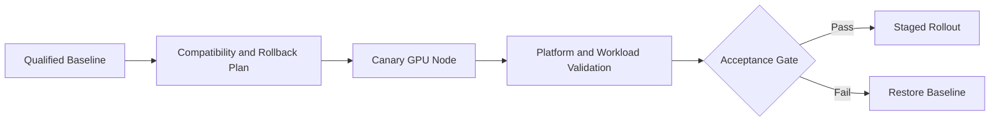

# Lab 04 — Perform a Controlled GPU Platform Upgrade

```yaml
Title: Perform a Controlled GPU Platform Upgrade
Volume: 10
Chapter: 10
Difficulty: Expert
Estimated Time: 120 Minutes
Prerequisites: Existing GPU Operator deployment, spare capacity, maintenance approval
Target Platform: Production-like Kubernetes cluster
Target Audience: Platform Engineers, SREs, Change Managers
Lab Type: Production Deployment
```

## 1. Objective

Upgrade a Kubernetes GPU platform through a canary node pool, validate compatibility and workload behavior, demonstrate rollback criteria, and produce the evidence required before wider rollout.

## 2. Background

A GPU platform upgrade crosses kernel, driver, container toolkit, device plugin, GPU Operator, Kubernetes, runtime, CUDA application, and monitoring boundaries. Updating every node at once converts an ordinary compatibility defect into a fleet outage. This lab uses staged change control.

## 3. Learning Outcomes

You will be able to build a compatibility matrix, define canary and rollback gates, drain a GPU node safely, upgrade a pinned Helm release, validate representative workloads, and decide whether to continue or roll back.

## 4. Architecture



## 5. Prerequisites

- Current Helm values and release version stored in Git
- Tested target chart and driver versions
- Canary GPU node or dedicated node pool
- Spare capacity for workload evacuation
- Validated workload images
- Monitoring and maintenance approval
- Confirmed rollback artifacts and registry availability

## 6. Environment

Capture the current state:

```bash
helm list -n gpu-operator
helm get values gpu-operator -n gpu-operator -a > current-values.yaml
helm get manifest gpu-operator -n gpu-operator > current-manifest.yaml
kubectl get clusterpolicy -o yaml > current-clusterpolicy.yaml
kubectl get nodes -o wide > current-nodes.txt
```

```bash
export TARGET_VERSION='<validated-target-version>'
export CANARY_NODE='<canary-gpu-node>'
```

## 7. Components

| Component | Upgrade concern |
|---|---|
| GPU Operator chart | CRDs, defaults, operand versions |
| Driver | Kernel and GPU compatibility |
| Container Toolkit | Runtime integration |
| Device Plugin | Resource registration and allocation |
| NFD/GFD | Label continuity |
| DCGM Exporter | Metric and dashboard continuity |
| Workload images | CUDA and framework compatibility |

## 8. Deployment Steps

### Build the compatibility matrix

Document current and target Kubernetes, OS, kernel, GPU Operator, driver, containerd, toolkit, CUDA image, and monitoring versions. Stop when any required combination is unsupported or untested.

### Establish acceptance gates

The upgrade must not proceed beyond canary unless:

1. Operator and required operands are Ready.
2. GPU capacity remains correct.
3. A CUDA validation Pod completes.
4. A representative application passes.
5. GPU telemetry remains visible.
6. No new XID, kernel, or kubelet errors appear.
7. Rollback has been demonstrated.

### Quarantine and drain the canary

```bash
kubectl cordon "$CANARY_NODE"
kubectl get pods -A -o wide --field-selector spec.nodeName="$CANARY_NODE"
kubectl drain "$CANARY_NODE" \
  --ignore-daemonsets \
  --delete-emptydir-data \
  --grace-period=120 \
  --timeout=20m
```

Do not force-delete training jobs that require checkpointing without application-owner approval.

### Upgrade the pinned release

```bash
helm repo update
helm upgrade gpu-operator nvidia/gpu-operator \
  --namespace gpu-operator \
  --version "$TARGET_VERSION" \
  -f target-values.yaml \
  --wait \
  --timeout 20m

helm history gpu-operator -n gpu-operator
```

Use a staging cluster or node-pool targeting mechanism so the target state reaches only the intended canary first.

## 9. Validation

```bash
kubectl get pods -n gpu-operator -o wide
kubectl get clusterpolicy -o yaml
kubectl get events -n gpu-operator --sort-by=.lastTimestamp
kubectl get node "$CANARY_NODE" -o jsonpath='{.status.allocatable.nvidia\\.com/gpu}{"\n"}'
```

Create a one-GPU validation Pod pinned to the canary node and confirm that its logs contain valid `nvidia-smi` output and an explicit success marker.

## 10. Verification

Compare before and after:

- GPU Capacity and Allocatable;
- driver and operand image versions;
- node labels;
- Pod startup time;
- representative application result;
- DCGM metrics and alerts;
- kubelet and kernel logs.

```bash
kubectl describe node "$CANARY_NODE"
journalctl -u kubelet --since '30 minutes ago'
nvidia-smi -q
```

Only after all gates pass:

```bash
kubectl uncordon "$CANARY_NODE"
```

## 11. Observability

Watch operator reconciliation errors, operand restarts, allocatable GPU count, XID events, thermals, workload errors, latency, and Pending scheduling events for a workload-relevant canary period.

## 12. Performance Measurements

Run the same representative benchmark before and after. Compare initialization time, throughput or latency, utilization, memory consumption, power, thermals, and multi-GPU communication. A meaningful regression is a failed gate even when functional tests pass.

## 13. Failure Injection

In a disposable environment, use an incompatible validation image or invalid target value. Confirm that the acceptance gate prevents rollout and that the previous release can be restored.

## 14. Rollback and Troubleshooting

```bash
helm history gpu-operator -n gpu-operator
helm rollback gpu-operator <previous-revision> \
  --namespace gpu-operator \
  --wait \
  --timeout 20m
```

After rollback, revalidate the driver, operands, allocatable resources, telemetry, and workload.

| Failure | Response |
|---|---|
| Operator cannot reconcile | Stop rollout and inspect CRD or values changes |
| Driver fails | Restore the previous release or node image |
| GPU resource disappears | Check plugin and kubelet registration |
| Workload regresses | Preserve evidence and roll back |
| Metrics disappear | Check exporter, ServiceMonitor, and labels |

## 15. Cleanup

Delete temporary validation Pods and archive values, manifests, logs, benchmark results, approvals, and rollback evidence.

## 16. Summary

You treated the GPU platform upgrade as a controlled production change with a limited failure domain, measurable acceptance gates, and a proven rollback path.

## 17. Challenge Exercises

Design a two-stage canary across GPU models, automate preflight checks, add a GitOps approval gate, and define an upgrade policy for long-running training jobs.

## 18. Further Reading

- [Volume 10 Introduction](../index)
- [Production Installation and Configuration](../chapter-10-production-installation-and-configuration)
- [Upgrades and Production Troubleshooting](../chapter-11-upgrades-and-production-troubleshooting)
