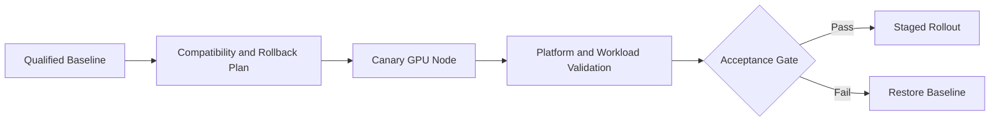

# Lab 04 — Perform a Controlled GPU Platform Upgrade

```yaml
Title: Perform a Controlled GPU Platform Upgrade
Volume: 10
Chapter: 10
Difficulty: Expert
Estimated Time: 120 Minutes
Prerequisites: Existing GPU Operator deployment, spare capacity, maintenance approval
Target Platform: Production-like Kubernetes cluster
Target Audience: Platform Engineers, SREs, Change Managers
Lab Type: Production Deployment
```

## 1. Objective

Upgrade a Kubernetes GPU platform through a canary node pool, validate compatibility and workload behavior, demonstrate rollback criteria, and produce the evidence required before wider rollout.

## 2. Scenario

A GPU platform upgrade crosses kernel, driver, container toolkit, device plugin, GPU Operator, Kubernetes, runtime, CUDA application, and monitoring boundaries. If you change the fleet without a canary, a normal compatibility problem becomes a platform outage. This lab keeps the blast radius small and the rollback path explicit.

## 3. Learning Outcomes

You will be able to build a compatibility matrix, define canary and rollback gates, drain a GPU node safely, upgrade a pinned Helm release, validate representative workloads, and decide whether to continue or roll back.

## 4. Architecture



## 5. Prerequisites

- Current Helm values and release version stored in Git.
- Tested target chart and driver versions.
- Canary GPU node or dedicated node pool.
- Spare capacity for workload evacuation.
- Validated workload images.
- Monitoring and maintenance approval.
- Confirmed rollback artifacts and registry availability.

## 6. Environment

Capture the current state before you touch the canary.

| Purpose | Command | Expected evidence | Explanation | Common failure interpretation |
|---|---|---|---|---|
| List the Helm release | `helm list -n gpu-operator` | The current release and revision | Establishes the baseline you will change | No release means there is nothing to upgrade yet |
| Save current values | `helm get values gpu-operator -n gpu-operator -a > current-values.yaml` | Values file on disk | Preserves the exact configuration in use | If the file is empty, the release name may be wrong |
| Save the rendered manifest | `helm get manifest gpu-operator -n gpu-operator > current-manifest.yaml` | Manifest file on disk | Helps compare old and new rendered resources | Missing output can mean Helm cannot read the release |
| Save the policy object | `kubectl get clusterpolicy -o yaml > current-clusterpolicy.yaml` | Current ClusterPolicy snapshot | Captures the operator-controlled spec before the change | If no policy exists, the operator is not installed or not healthy |
| Save the node list | `kubectl get nodes -o wide > current-nodes.txt` | Node inventory on disk | Lets you choose a safe canary and compare node state | No spare node means you need a maintenance window first |

Set the target version and canary node:

```bash
export TARGET_VERSION='<validated-target-version>'
export CANARY_NODE='<canary-gpu-node>'
```

## 7. Components

| Component | Upgrade concern |
|---|---|
| GPU Operator chart | CRDs, defaults, operand versions |
| Driver | Kernel and GPU compatibility |
| Container Toolkit | Runtime integration |
| Device Plugin | Resource registration and allocation |
| NFD/GFD | Label continuity |
| DCGM Exporter | Metric and dashboard continuity |
| Workload images | CUDA and framework compatibility |

## 8. Procedure

### 8.1 Build the compatibility matrix

| Purpose | Command | Expected evidence | Explanation | Common failure interpretation |
|---|---|---|---|---|
| Capture the current release revision | `helm history gpu-operator -n gpu-operator` | Revision history visible | Gives you a concrete rollback target | If history is empty, you need to verify the release name |
| Compare current configuration | `diff -u current-values.yaml target-values.yaml || true` | Differences are explicit | Lets you see what is actually changing | Large unreviewed diffs usually hide operational risk |

Document current and target Kubernetes, OS, kernel, GPU Operator, driver, containerd, toolkit, CUDA image, and monitoring versions. Stop when any required combination is unsupported or untested.

### 8.2 Establish acceptance gates

The upgrade must not proceed beyond canary unless:

1. Operator and required operands are Ready.
2. GPU capacity remains correct.
3. A CUDA validation Pod completes.
4. A representative application passes.
5. GPU telemetry remains visible.
6. No new XID, kernel, or kubelet errors appear.
7. Rollback has been demonstrated.

### 8.3 Quarantine and drain the canary

| Purpose | Command | Expected evidence | Explanation | Common failure interpretation |
|---|---|---|---|---|
| Stop new scheduling on the canary | `kubectl cordon "$CANARY_NODE"` | Node becomes unschedulable | Prevents new Pods from landing during maintenance | If the node stays schedulable, the command did not target the right node |
| Inspect the current pod set | `kubectl get pods -A -o wide --field-selector spec.nodeName="$CANARY_NODE"` | Pods running on the canary are listed | Shows what must be moved before the upgrade | Unexpected GPU workloads on the node need owner review |
| Drain the node | `kubectl drain "$CANARY_NODE" --ignore-daemonsets --delete-emptydir-data --grace-period=120 --timeout=20m` | Workloads evacuate from the node | Gives the canary a clean maintenance window | Stuck Pods or checkpointed jobs may need application-owner input |

Do not force-delete training jobs that require checkpointing without application-owner approval.

### 8.4 Upgrade the pinned release

| Purpose | Command | Expected evidence | Explanation | Common failure interpretation |
|---|---|---|---|---|
| Refresh chart metadata | `helm repo update` | Repository index updates successfully | Makes sure Helm sees the current chart metadata | Repository or network issues can block the upgrade |
| Apply the pinned release | `helm upgrade gpu-operator nvidia/gpu-operator --namespace gpu-operator --version "$TARGET_VERSION" -f target-values.yaml --wait --timeout 20m` | Helm completes successfully | Upgrades only the intended release to the intended version | A timeout usually means the new operand set did not converge |
| Save the post-upgrade history | `helm history gpu-operator -n gpu-operator` | New revision appears | Confirms the upgrade landed on the release record | If history did not change, the upgrade did not apply |

Use a staging cluster or node-pool targeting mechanism so the target state reaches only the intended canary first.

## 9. Validation

| Purpose | Command | Expected evidence | Explanation | Common failure interpretation |
|---|---|---|---|---|
| Check the operator namespace | `kubectl get pods -n gpu-operator -o wide` | Operator and operand Pods are visible | Confirms the new revision is reconciling | CrashLoopBackOff or Pending indicates the first failed layer |
| Read the policy | `kubectl get clusterpolicy -o yaml` | Updated ClusterPolicy | Shows what the operator is trying to maintain | A stale policy means the operator may not have reconciled fully |
| Inspect recent events | `kubectl get events -n gpu-operator --sort-by=.lastTimestamp` | Reconciliation and scheduling events | Helps identify the earliest regression | Repeated events often point to the failed operand |
| Confirm GPU allocatable on the canary | `kubectl get node "$CANARY_NODE" -o jsonpath='{.status.allocatable.nvidia\\.com/gpu}{"\n"}'` | A positive count | Confirms the node still advertises GPUs after the change | Zero or missing allocatable means the canary should not advance |

Create a one-GPU validation Pod pinned to the canary node and confirm that its logs contain valid `nvidia-smi` output and an explicit success marker.

## 10. Verification

Compare before and after:

- GPU Capacity and Allocatable;
- driver and operand image versions;
- node labels;
- Pod startup time;
- representative application result;
- DCGM metrics and alerts;
- kubelet and kernel logs.

| Purpose | Command | Expected evidence | Explanation | Common failure interpretation |
|---|---|---|---|---|
| Inspect the canary node | `kubectl describe node "$CANARY_NODE"` | Node state, labels, and events | Lets you compare the post-upgrade node with the baseline | New taints, labels, or events can explain workload changes |
| Review recent kubelet logs | `journalctl -u kubelet --since '30 minutes ago'` | Recent kubelet activity | Useful for catching registration or runtime issues after the upgrade | Missing log continuity may mean the node has another problem entirely |
| Check GPU health from the host | `nvidia-smi -q` | Driver and device status | Confirms the host still recognizes the GPU after the upgrade | Hardware or driver regressions usually surface here |

Only after all gates pass:

```bash
kubectl uncordon "$CANARY_NODE"
```

## 11. Observability

Watch operator reconciliation errors, operand restarts, allocatable GPU count, XID events, thermals, workload errors, latency, and Pending scheduling events for a workload-relevant canary period.

## 12. Performance Measurements

Run the same representative benchmark before and after. Compare initialization time, throughput or latency, utilization, memory consumption, power, thermals, and multi-GPU communication. A meaningful regression is a failed gate even when functional tests pass.

## 13. Failure Injection

Use a disposable environment only. The purpose is to prove your gates and rollback path, not to break a production canary.

| Purpose | Command | Expected evidence | Explanation | Common failure interpretation |
|---|---|---|---|---|
| Force an invalid target during a dry run | `helm upgrade gpu-operator nvidia/gpu-operator --namespace gpu-operator --version "$TARGET_VERSION" -f invalid-values.yaml --wait --timeout 20m` | Upgrade fails in a controlled way | Lets you confirm your gate catches a bad change | If the command succeeds, the invalid file may not be invalid |
| Use an incompatible validation image | `kubectl run bad-gpu-validation --image=nvcr.io/nvidia/cuda:12.4.1-base-ubuntu22.04 --restart=Never --overrides='{"spec":{"nodeName":"'"$CANARY_NODE"'","containers":[{"name":"bad-gpu-validation","image":"nvcr.io/nvidia/cuda:12.4.1-base-ubuntu22.04","command":["bash","-lc","sleep 30"],"resources":{"limits":{"nvidia.com/gpu":1}}}]}}'` | Validation fails or reveals the mismatch | Demonstrates how the acceptance gate protects rollout | If it passes, your target image is not incompatible enough for the test |

## 14. Rollback and Troubleshooting

| Purpose | Command | Expected evidence | Explanation | Common failure interpretation |
|---|---|---|---|---|
| Show Helm history | `helm history gpu-operator -n gpu-operator` | Prior revision is visible | Identifies the rollback point | No prior revision means you need a different rollback strategy |
| Roll back the release | `helm rollback gpu-operator <previous-revision> --namespace gpu-operator --wait --timeout 20m` | Helm restores the earlier revision | Returns the operator to the last known-good state | If rollback fails, the problem may be in CRDs or host changes |

After rollback, revalidate the driver, operands, allocatable resources, telemetry, and workload.

| Failure | Response |
|---|---|
| Operator cannot reconcile | Stop rollout and inspect CRD or values changes |
| Driver fails | Restore the previous release or node image |
| GPU resource disappears | Check plugin and kubelet registration |
| Workload regresses | Preserve evidence and roll back |
| Metrics disappear | Check exporter, ServiceMonitor, and labels |

## 15. Cleanup

| Purpose | Command | Expected evidence | Explanation | Common failure interpretation |
|---|---|---|---|---|
| Delete temporary validation Pods | `kubectl delete pod bad-gpu-validation --ignore-not-found` | Pod removed | Removes the lab-only workload | Stuck termination usually means the node or Pod needs manual cleanup |
| Uncordon the canary after validation | `kubectl uncordon "$CANARY_NODE"` | Node returns to schedulable state | Restores normal cluster capacity | If the node remains cordoned, later workloads will not land there |
| Archive the evidence | keep `current-values.yaml`, `current-manifest.yaml`, and logs | Evidence remains on disk or in Git | The upgrade record belongs with the change ticket | Throwing away the evidence makes future audits harder |

## 16. Summary

You treated the GPU platform upgrade as a controlled production change with a limited failure domain, measurable acceptance gates, and a proven rollback path.

## 17. Challenge Exercises

- Design a two-stage canary across GPU models.
- Automate preflight checks.
- Add a GitOps approval gate.
- Define an upgrade policy for long-running training jobs.

## 18. Further Reading

- [Volume 10 Introduction](../index)
- [Production Installation and Configuration](../chapter-10-production-installation-and-configuration)
- [Upgrades and Production Troubleshooting](../chapter-11-upgrades-and-production-troubleshooting)
