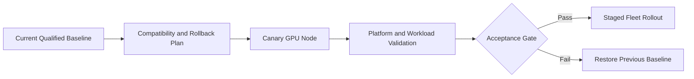

# Lab 04 — Perform a Controlled GPU Platform Upgrade

```yaml
Title: Perform a Controlled GPU Platform Upgrade
Volume: 10
Chapter: 10
Difficulty: Expert
Estimated Time: 120 Minutes
Prerequisites: Existing GPU Operator deployment, spare capacity, maintenance approval
Target Platform: Production-like Kubernetes cluster
Target Audience: Platform Engineers, SREs, Change Managers
Lab Type: Production Deployment
```

## 1. Objective

Upgrade a Kubernetes GPU platform through a canary node pool, validate compatibility and workload behavior, demonstrate rollback criteria, and document the evidence required before wider rollout.

## 2. Background

A GPU platform upgrade crosses several compatibility boundaries: kernel, driver, container toolkit, device plugin, GPU Operator chart, Kubernetes version, container runtime, CUDA applications, and monitoring. Updating every node at once turns an ordinary compatibility defect into a cluster-wide outage. This lab uses staged change control.

## 3. Learning Outcomes

You will be able to:

- build an upgrade compatibility matrix;
- define canary and rollback gates;
- drain a GPU node safely;
- upgrade a pinned Helm release;
- validate operands and representative workloads;
- decide whether to continue, pause, or roll back.

## 4. Architecture



## 5. Prerequisites

- Current Helm values and release version stored in Git
- Tested target chart and driver versions
- At least one canary GPU node or dedicated node pool
- Spare capacity for workload evacuation
- Validated workload images
- Monitoring and maintenance-window approval
- Confirmed rollback artifacts and registry availability

## 6. Environment

Capture the current state:

```bash
helm list -n gpu-operator
helm get values gpu-operator -n gpu-operator -a > current-values.yaml
helm get manifest gpu-operator -n gpu-operator > current-manifest.yaml
kubectl get clusterpolicy -o yaml > current-clusterpolicy.yaml
kubectl get nodes -o wide > current-nodes.txt
```

Record the target release:

```bash
export TARGET_VERSION='<validated-target-version>'
export CANARY_NODE='<canary-gpu-node>'
```

## 7. Components

| Component | Upgrade concern |
|---|---|
| GPU Operator chart | CRDs, defaults, operand versions |
| Driver | Kernel and GPU compatibility |
| Container Toolkit | containerd integration |
| Device Plugin | Resource registration and allocation |
| NFD/GFD | Label continuity |
| DCGM Exporter | Metric continuity and dashboard compatibility |
| Workload images | CUDA and framework compatibility |

## 8. Deployment Steps

### Step 1 — Build the compatibility matrix

Document current and target versions for:

- Kubernetes;
- Linux kernel and OS image;
- GPU Operator chart;
- NVIDIA driver;
- containerd;
- NVIDIA Container Toolkit;
- CUDA workload images;
- monitoring stack.

Do not proceed when a required combination is unsupported or untested.

### Step 2 — Establish acceptance gates

Minimum gates:

1. Operator and all required operands are Ready.
2. `nvidia.com/gpu` capacity remains correct.
3. A CUDA validation Pod completes.
4. A representative application meets its functional checks.
5. GPU telemetry remains visible.
6. No new XID, kernel, or kubelet errors appear.
7. Rollback can be executed from retained artifacts.

### Step 3 — Quarantine and drain the canary node

```bash
kubectl cordon "$CANARY_NODE"
kubectl get pods -A -o wide --field-selector spec.nodeName="$CANARY_NODE"
```

Evacuate workloads according to their disruption and checkpoint policy.

```bash
kubectl drain "$CANARY_NODE" \
  --ignore-daemonsets \
  --delete-emptydir-data \
  --grace-period=120 \
  --timeout=20m
```

Do not force-delete training workloads that require checkpoints unless the application owner approves.

### Step 4 — Apply canary targeting

Use the deployment method approved for the environment. Common approaches include a dedicated GPU node pool, node labels with operand selectors, or a separate staging cluster. The goal is to prevent an unvalidated change from touching every GPU node.

### Step 5 — Upgrade the pinned release

```bash
helm repo update
helm upgrade gpu-operator nvidia/gpu-operator \
  --namespace gpu-operator \
  --version "$TARGET_VERSION" \
  -f target-values.yaml \
  --wait \
  --timeout 20m
```

Record the Helm revision:

```bash
helm history gpu-operator -n gpu-operator
```

## 9. Validation

Inspect reconciliation:

```bash
kubectl get pods -n gpu-operator -o wide
kubectl get clusterpolicy -o yaml
kubectl get events -n gpu-operator --sort-by=.lastTimestamp
```

Confirm the canary node:

```bash
kubectl get node "$CANARY_NODE" -o jsonpath='{.status.allocatable.nvidia\.com/gpu}{"\n"}'
```

Run a validation Pod pinned to the canary node:

```yaml
apiVersion: v1
kind: Pod
metadata:
  name: gpu-upgrade-validation
spec:
  nodeName: REPLACE_WITH_CANARY_NODE
  restartPolicy: Never
  containers:
    - name: cuda
      image: nvcr.io/nvidia/cuda:12.4.1-base-ubuntu22.04
      command: ["bash", "-lc", "nvidia-smi && echo CANARY_PASS"]
      resources:
        limits:
          nvidia.com/gpu: 1
```

```bash
kubectl apply -f gpu-upgrade-validation.yaml
kubectl logs -f gpu-upgrade-validation
```

## 10. Verification

Compare before and after:

- Node GPU capacity and labels
- Driver version
- Operand image versions
- Pod startup time
- Representative workload result
- DCGM metrics and alerts
- Kubelet and kernel logs

```bash
kubectl describe node "$CANARY_NODE"
journalctl -u kubelet --since '30 minutes ago'
nvidia-smi -q
```

Only uncordon the canary after every mandatory gate passes.

```bash
kubectl uncordon "$CANARY_NODE"
```

## 11. Observability

Watch during the canary period:

- operator reconciliation errors;
- operand restarts;
- allocatable GPU count;
- GPU XID events;
- temperature and power anomalies;
- workload error and latency rates;
- scheduler Pending events.

Keep the canary under observation for a workload-relevant period before wider rollout.

## 12. Performance Measurements

Run the same representative benchmark before and after the upgrade. Compare:

- initialization time;
- throughput or latency;
- GPU utilization;
- memory consumption;
- power and thermal behavior;
- communication performance for multi-GPU workloads.

Treat statistically meaningful regression as a failed gate even when the platform is functionally healthy.

## 13. Failure Injection

In a disposable environment, deploy an intentionally incompatible validation image or invalid target value. Confirm that the acceptance gate blocks rollout and that the team can restore the prior Helm revision.

## 14. Rollback and Troubleshooting

List revisions:

```bash
helm history gpu-operator -n gpu-operator
```

Rollback:

```bash
helm rollback gpu-operator <previous-revision> \
  --namespace gpu-operator \
  --wait \
  --timeout 20m
```

After rollback, revalidate the driver, operands, allocatable resources, telemetry, and workload.

| Failure | Response |
|---|---|
| Operator cannot reconcile | Stop rollout; inspect CRD and values changes |
| Driver fails on canary | Restore previous release or node image |
| GPU resource disappears | Validate plugin and kubelet registration |
| Workload regression | Preserve evidence and roll back before expansion |
| Metrics disappear | Check exporter version, ServiceMonitor, and labels |

## 15. Cleanup

```bash
kubectl delete pod gpu-upgrade-validation --ignore-not-found
rm -f gpu-upgrade-validation.yaml
```

Archive current and target values, manifests, logs, benchmark results, approval records, and rollback evidence.

## 16. Summary

You upgraded a GPU platform as a controlled production change rather than a package update. The canary, acceptance gate, and rollback path limited the failure domain.

## 17. Challenge Exercises

- Design a two-stage canary across different GPU models.
- Automate preflight compatibility checks.
- Add a GitOps approval gate based on validation results.
- Define an upgrade policy for long-running training jobs.

## 18. Further Reading

- [Volume 10 Introduction](../index)
- [Driver Containers and Node Operands](../chapter-07-driver-containers-and-node-operands)
- [Production Troubleshooting](../chapter-11-production-troubleshooting)
