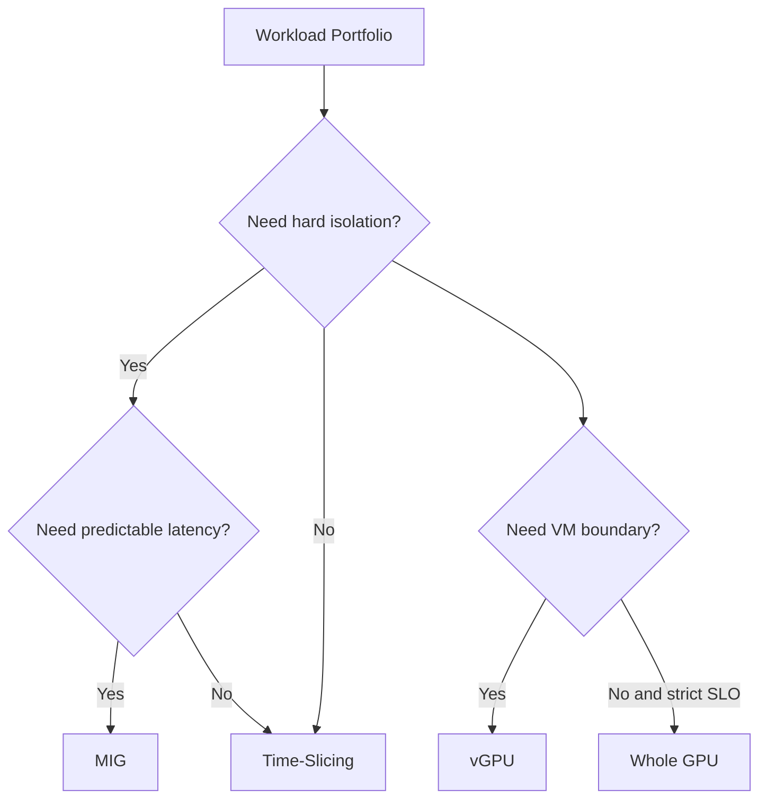

# Why GPU Sharing Exists

A platform team owns a cluster of large accelerators. Training jobs use whole GPUs efficiently, but notebooks, experiments, preprocessing tasks, and smaller inference services often consume only a fraction of the available compute or memory. Procurement asks why utilization is low while users wait in a queue.

The obvious answer—place several users on each GPU—creates a second problem. Shared access can introduce memory interference, latency variance, fault propagation, security concerns, and accounting ambiguity. GPU sharing exists to balance utilization against isolation and predictability.

## Learning Objectives

After completing this chapter, you will be able to:

- explain why whole-GPU allocation strands capacity;
- distinguish access sharing from resource isolation;
- identify workloads suited to sharing;
- recognize when sharing should not be used;
- frame the customer decision in terms of SLOs and risk.

## Architecture Before Mechanism

**Figure 11.1.1 — The sharing decision begins with isolation and service requirements.**

## What Problem Existed Before Sharing?

Whole-GPU scheduling is operationally simple. A job receives a device, and the scheduler avoids most cross-tenant interference. The trade-off is granularity. A workload that uses 20 percent of a GPU still reserves 100 percent of the device.

The wasted capacity is particularly visible in development clusters and mixed inference fleets. However, measured utilization must be interpreted carefully. Low arithmetic utilization does not automatically mean a workload can share safely. It may still require most of the GPU memory, depend on burst capacity, or have strict tail-latency requirements.

## Three Different Meanings of Sharing

| Model | What is shared? | Isolation character |
|---|---|---|
| Time-slicing | Execution time on one physical GPU | Weakest; memory and fault domains remain shared |
| MIG | Hardware-partitioned compute and memory slices | Stronger device-level isolation on supported GPUs |
| vGPU | Virtual GPU presented through a hypervisor and licensed stack | VM-oriented lifecycle and policy boundary |

The models solve different problems. They are not interchangeable configuration options.

## When Sharing Helps

Sharing is useful when workloads are small, bursty, tolerant of variable performance, or naturally partitionable. Common examples include interactive development, low-rate inference, CI validation, and educational environments.

## When Sharing Hurts

Avoid or constrain sharing when a workload requires deterministic latency, uses nearly all device memory, performs synchronized distributed training, processes sensitive data without an adequate isolation boundary, or cannot tolerate a neighbor-induced reset.

## Production Story

A team enables time-slicing for eight logical replicas per GPU. Queue time improves, but inference p99 latency becomes unstable. The root cause is not the scheduler. The replicas are logical access slots, not reserved compute partitions. Several services become busy simultaneously and contend for the same device.

The correct response is to classify workloads. Latency-sensitive services move to MIG or whole-GPU pools. Bursty development workloads remain on time-sliced nodes.

## Troubleshooting Pattern

**Symptoms:** high logical allocation, low predictable throughput, OOM events across tenants, or latency variance.

**Diagnosis:** compare requested logical resources with physical memory use, process lists, scheduler events, and per-workload SLOs.

**Root cause:** the sharing model was selected to maximize allocation density without defining the required isolation.

**Prevention:** require a workload classification and an explicit statement of what is guaranteed: access, memory, compute, fault isolation, or latency.

## Customer Perspective

The question is not “How many users fit on a GPU?” It is “What service can the platform guarantee when those users are active together?”

## Interview Preparation

- Why can low GPU utilization be a misleading reason to enable sharing?
- Compare access multiplexing with hardware partitioning.
- Design separate pools for development, batch inference, and latency-sensitive inference.

## Key Takeaways

- Whole-GPU allocation is simple but coarse.
- Sharing improves utilization only when workload behavior is compatible.
- Time-slicing, MIG, and vGPU provide different boundaries.
- The design must define guarantees before choosing a mechanism.
