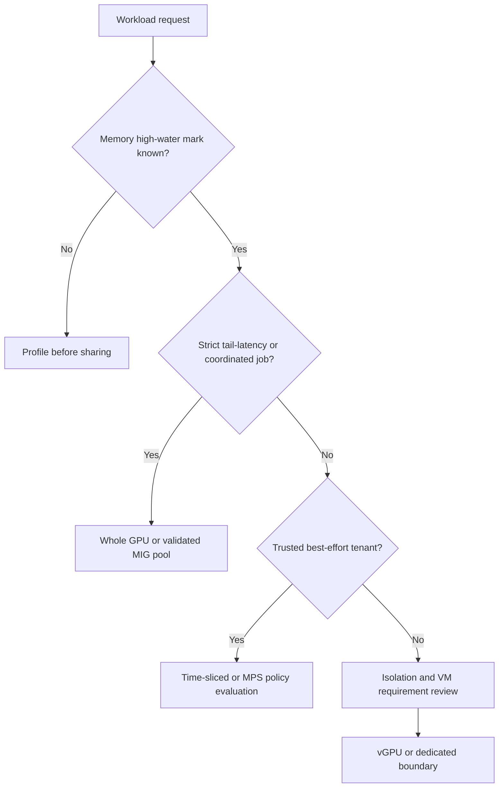

# Why GPU Sharing Exists

A GPU platform team has a familiar paradox: expensive accelerators are reserved for days, while utilization charts often look unconvincing. The first instinct is to increase allocations per GPU. The production question is harder: what does an allocation guarantee when every tenant becomes busy at once?

This chapter establishes the decision language for the rest of the volume. It does not begin with a configuration file because the configuration is the last step. First decide whether the workload needs exclusive capacity, a hardware slice, shared best-effort access, or a VM boundary.

## Learning objectives

After this chapter, you can:

- separate scheduler access from hardware isolation;
- classify workloads by memory, latency, trust, and recovery needs;
- explain why average utilization alone is an unsafe sizing signal;
- identify cases where whole-GPU allocation remains the correct answer; and
- write a service contract for a shared-GPU pool.

| Prerequisites | Difficulty | Reading time |
|---|---:|---:|
| Kubernetes GPU resource model, basic CUDA process model | Advanced | 45 minutes |

## The problem is stranded capacity, not merely low utilization

Whole-GPU allocation is simple: Kubernetes grants a device, the runtime exposes it to a pod, and the platform has a clear owner. That simplicity is valuable for distributed training, large models, and latency-critical inference. It is also coarse. A notebook using a small model, a CI job that runs briefly, or a low-rate inference endpoint can reserve an accelerator for much longer than it actively uses it.

Average device utilization is a clue, not proof. A workload can have low SM activity while it consumes most memory, waits on data, or periodically bursts into a critical latency window. Sharing it with another workload may improve a monthly utilization report while breaking the only SLO that mattered.

**Figure 11.1.1 — Classification precedes mechanism selection.** A request without memory and SLO evidence is not ready for a density decision.

## Four things people call “sharing”

| Mechanism | Scheduler view | Principal guarantee | Important non-guarantee |
|---|---|---|---|
| Whole GPU | one physical device | exclusive platform allocation | no protection from host/device failure |
| MIG | profile-specific device | hardware-partitioned compute and memory resources on supported GPUs | not separate power, firmware, or host domains |
| Time-slicing | multiple logical replicas | access to a multiplexed GPU | no memory or fault isolation between replicas |
| vGPU | virtual GPU attached to VM | VM-oriented virtualization lifecycle and policy boundary | not a substitute for host compatibility planning |

CUDA MPS is related but distinct. It coordinates multiple CUDA processes to run concurrently on a GPU; it is not a Kubernetes tenancy or memory-isolation solution. Treat MPS as a deliberate, application-aware concurrency choice, not as an answer to a multi-tenant platform request.

## Production story: the “eight GPUs per GPU” incident

An internal platform advertised eight logical GPU replicas for every physical inference GPU. Queue time fell immediately. Two weeks later, an otherwise healthy product launch created simultaneous demand. All pods remained `Running`; users saw p99 latency increase and occasional out-of-memory failures. The scheduler had honored each request. The platform had never promised a compute share, a memory reservation, or a latency envelope.

The repair was organizational before it was technical. The team separated workloads into three pools: best-effort notebooks, bounded inference services with measured MIG profiles, and whole-GPU workloads. They added per-namespace quotas, a load test before admission, and a runbook that made “logical replica” explicit in incident communication.

## Build a workload contract

A useful intake record is short but testable:

| Field | Example question | Why it matters |
|---|---|---|
| Workload class | interactive, batch, online inference, training? | determines burst and preemption tolerance |
| Memory envelope | what is the observed high-water mark including runtime buffers? | rules out unsafe profile sizes |
| Performance objective | throughput, p95/p99, deadline, or best effort? | determines contention tolerance |
| Tenant trust | same team, internal tenants, external customers? | scopes isolation requirements |
| Recovery behavior | can it restart, queue, checkpoint, or fail over? | bounds blast radius |
| Placement scope | bare metal, container, VM, regulated environment? | affects vGPU and policy choice |

Do not treat a request for `nvidia.com/gpu: 1` as this contract. It is only a scheduler request. Chapters 7 through 10 turn the contract into resources, admission policy, measurement, and chargeback.

## Trade-offs that survive the design review

More density increases the chance that a noisy neighbor affects a workload. More isolation usually reduces packing flexibility. Dynamic reconfiguration can recover stranded capacity, but it introduces drain and rollback risk. A platform should therefore optimize the **service**, not the maximum count of allocatable tokens.

| Design choice | Gains | Costs | Good fit |
|---|---|---|---|
| Dedicated pool | simple diagnosis and stable behavior | lower packing efficiency | critical inference, distributed training |
| Standard MIG layouts | predictable inventory | profile fragmentation, more pools | repeatable model-serving shapes |
| Time-sliced pool | broad access, supports older GPUs | shared memory and fault domain | development, bursty best effort |
| vGPU pool | VM lifecycle integration | licensing and compatibility operations | VDI, VM-centric estates |

## A practical intake workshop

Run the first sharing discussion with the application owner, security owner, and platform operator together. Asking only the application owner produces optimistic utilization assumptions; asking only the platform owner produces a resource menu without a service objective. The following sequence keeps the decision auditable.

1. Establish the unit of work: request, token, batch, experiment, render, or training step.
2. Measure the high-water memory behavior under the largest expected input and concurrency—not only during model load.
3. Identify whether missed latency or throughput targets are recoverable by queueing, retrying, or checkpointing.
4. Identify administrative and data boundaries. A namespace is not equivalent to a VM boundary, and neither is equivalent to physical separation.
5. Choose a candidate pool, then test the workload while its intended neighbors are active.
6. Record the failure action: throttle, queue, move, restart, fail over, or decline admission.

The result should be a short decision record. It is more useful than a long generic architecture document because it gives on-call responders the intended behavior when demand exceeds the shared device’s capacity.

## Capacity signals that should not be collapsed

| Signal | What it tells you | What it does not tell you |
|---|---|---|
| GPU utilization | active execution over a sampling interval | available latency headroom |
| Memory used | current allocation pressure | peak request-state requirement |
| Pod GPU request | scheduler accounting | actual memory or compute use |
| Queue depth | incoming pressure | whether GPU or an upstream dependency is limiting |
| p99 latency | user-visible tail behavior | which tenant caused contention |
| Restart count | visible failures | the root cause or physical blast radius |

This distinction prevents a common failure mode: choosing a sharing mechanism from one metric and declaring the resulting service predictable.

## Troubleshooting scenario 1: utilization says “idle,” users say “slow”

**Symptoms:** average utilization is low, but p99 latency rises after a new tenant is admitted.

**Blast radius:** services on the same physical device or shared profile pool.

**Triage:** compare request rate, active CUDA processes, memory high-water mark, queue time, and application latency over the same interval. Check whether the new workload has burst phases hidden by an average chart.

**Diagnosis:** low average SM utilization does not establish spare latency capacity. The workload may be memory-bound, bursty, or blocked on a dependency before issuing GPU work.

**Resolution:** reproduce with a workload-specific load envelope; reduce concurrency or move the latency-sensitive service to MIG or a dedicated pool. Do not declare a density ratio from a single dashboard screenshot.

**Prevention:** make p95/p99 latency, memory headroom, and concurrent-active-load tests part of admission.

## Troubleshooting scenario 2: a tenant asks for “isolation”

**Symptoms:** security review rejects a proposal that calls time-slicing isolated.

**Triage:** ask which boundary is required: memory, fault, VM administration, Kubernetes identity, network, or data access. Map each to a concrete control.

**Diagnosis:** “isolation” was used as a product adjective instead of an engineering claim.

**Resolution:** document the selected mechanism’s guarantees and remaining shared dependencies. Use vGPU when the VM boundary is material; use MIG only on supported hardware and only for the resources it partitions; keep platform controls such as RBAC and network policy separate.

**Prevention:** require threat-model sign-off for cross-tenant pools.

## Customer architecture discussion

For a research organization, a time-sliced development pool may be a good service: fast access, explicit best-effort behavior, and a separate protected pool for production endpoints. For a regulated customer with VM-based operations, the design conversation starts with the virtualization boundary and support matrix, not Kubernetes replicas. For an inference provider, the deciding evidence is usually the model’s memory envelope and tail-latency behavior under realistic concurrency.

## Production deployment pattern

Expose sharing as named services, not as a cluster-wide default. For example, a platform can offer `gpu-best-effort`, `gpu-mig-small`, and `gpu-dedicated` pools with separate labels, quotas, support expectations, and escalation paths. Admission policy should prevent a production namespace from silently consuming the best-effort class. Capacity reports should show both logical allocations and physical-device exposure so leadership does not mistake overcommit for installed capacity.

During a rollout, start with a canary node pool and a small set of known workloads. Capture baseline throughput, latency, memory, and recovery evidence before increasing density. Keep a dedicated-pool escape hatch while the service is new. The fastest rollback is often placement: stop admitting new shared work and move the critical workload to known-good capacity.

## First principles: why a GPU is not a CPU socket

A CPU scheduler normally shares cores, caches, memory, and I/O among many processes. GPU workloads also share a device, but their demand patterns are unusually coupled. A single model-serving request can allocate persistent weights, request-dependent state, temporary workspace, and kernels that run in bursts. A training step can synchronize many GPUs and make one delayed participant visible to every rank. The platform cannot infer a safe concurrency level from the number of processes alone.

At a high level, a CUDA process creates a context and submits work to GPU engines. The process can be limited by arithmetic throughput, memory bandwidth, device memory capacity, host-to-device transfer, kernel launch behavior, or an upstream dependency. A utilization value sampled over time does not identify which limit applies. This is why a safe sharing design starts with a workload experiment and not a desired tenant count.

| Constraint | Typical outward symptom | Sharing implication |
|---|---|---|
| Device-memory capacity | allocation failure, eviction pressure, restart | requires headroom; time-slicing is not a quota |
| Memory bandwidth | throughput flattens as neighbors activate | consider hardware partitioning or separation |
| Compute throughput | throughput collapses under concurrent kernels | benchmark contention before admitting peers |
| Host/data path | low GPU utilization and high request latency | adding replicas may amplify the bottleneck |
| Tail-latency target | p99 misses while average looks acceptable | reserve or isolate capacity |
| Failure recovery | restarts are expensive or stateful | reduce shared blast radius |

## A decision tree that can be operated

The following questions should lead to a documented decision, not a verbal preference.

1. **Does the workload need an exclusive failure or performance envelope?** If it does, begin with whole-GPU capacity or a validated MIG shape. Do not start with time-slicing because it creates a later migration when the SLO fails.
2. **Is the workload’s memory envelope known under peak input and concurrency?** If it is not known, measure it in a discovery pool. A model that starts successfully is not yet sized.
3. **Is the workload permitted to wait?** Batch work can often queue. Online traffic needs an explicit admission or load-shedding behavior before a GPU is saturated.
4. **Which boundary is required?** A hardware resource partition, a VM administration boundary, Kubernetes identity, and network/data isolation are separate controls.
5. **Can the node layout change safely?** If not, use stable profile pools and provision for demand rather than treating every request as dynamically reshapeable.

| Requirement | Default safe direction | Evidence before exception |
|---|---|---|
| strict p99 service | dedicated or validated MIG pool | concurrent load test proves a shared design |
| long-running distributed training | dedicated GPU pool | topology and collective test proves partition suitability |
| interactive notebook | shared best-effort pool | memory/process limits and fair-use policy |
| VM-managed application | vGPU evaluation | supported matrix, license, host/guest lifecycle |
| unknown model behavior | discovery or dedicated capacity | measured memory and latency envelope |

## Service tiers and failure semantics

Every tier should specify what happens when demand exceeds design capacity. “Best effort” is not an absence of responsibility; it is a contract that states that requests can wait, slow down, or be rejected. A latency tier should state its admission limit and fallback. A reserved tier should state its availability target and maintenance behavior.

| Tier | Promise | Overload action | On-call owner |
|---|---|---|---|
| Discovery | access for measurement; no production SLO | queue or stop experiment | platform support |
| Best effort | shared access with variable completion | queue, throttle, or evict by policy | tenant with platform escalation |
| Bounded service | validated model/profile/concurrency envelope | admission control or failover | service owner |
| Reserved | capacity and change control | protect reservation; use approved failover | platform and service owner |

This table also prevents an accounting error. A logical allocation can be chargeable as a service entitlement without being interpreted as a physical reservation. The chargeback model in Chapter 09 should preserve that distinction.

## Security and governance implications

Sharing does not remove the need for platform controls. Kubernetes RBAC controls API actions; namespaces and quotas constrain allocation; network policy and identity govern traffic; image provenance affects what code reaches the device; node access and driver changes remain privileged operations. MIG and vGPU influence device exposure, but neither replaces the rest of the control plane.

For each shared pool, record the approved tenant class, allowed image sources, data classification, incident notification expectation, and escalation package. The most damaging production ambiguity is often social: responders do not know which tenant can be disrupted while an unsafe workload is stopped.

## Observability design before rollout

Build the dashboard before increasing density. The dashboard should let an operator answer five questions during the first incident:

1. Which physical GPU and node are involved?
2. Which pods or VMs were allocated against that device?
3. Did application latency, queueing, memory, or hardware health change first?
4. Is the blast radius one workload, one shared device, one node pool, or the fleet?
5. Is the approved action to throttle, move, drain, or replace?

The platform should retain an allocation-to-device mapping long enough to investigate delayed reports. GPU-level metrics without workload identity are still useful, but they do not prove tenant attribution.

## Design review anti-patterns

| Anti-pattern | Why it fails | Better review question |
|---|---|---|
| “The GPU is only 30% utilized.” | average does not expose peak or memory pressure | what occurs under simultaneous peak demand? |
| “Each pod gets one replica.” | replicas are not compute reservations | what hardware and memory guarantee exists? |
| “MIG solves multi-tenancy.” | host, policy, and device dependencies remain | what exact threat and fault boundaries are required? |
| “We can reshape on demand.” | reconfiguration is a lifecycle event | who drains, validates, and rolls back? |
| “The pods remained healthy.” | process liveness is not SLO success | what did users experience at p99? |

## Final production checklist

- A workload classification exists for every shared service.
- The chosen mechanism and non-guarantees are visible to users.
- Load tests include intended neighbors and peak input shape.
- Quota and admission behavior are documented and tested.
- Critical services have a dedicated or hardware-partitioned escape path.
- Incident telemetry maps allocation, application impact, and physical health.
- Change records define the rollback state for any node-level layout change.

## Failure-domain analysis

Before calling a pool multi-tenant, write down every failure domain.

| Domain | Shared by time-sliced replicas | Shared by MIG instances | Typical control |
|---|---|---|---|
| Application process | no | no | restart, limits, code review |
| Device memory capacity | yes | profile-defined partition | admission and profile selection |
| GPU execution resources | yes | profile-defined partition | workload classification |
| Physical board | yes | yes | health monitoring and spare capacity |
| Host OS and driver | yes | yes | staged lifecycle management |
| Kubernetes node | yes | yes | pools, drain, replacement |
| Power/cooling/rack | yes | yes | facility and topology design |

This list is useful in a customer meeting because it replaces vague claims with a recovery conversation. A partition may reduce one neighbor’s ability to affect another workload while leaving the node and board as common points of failure. Availability design therefore needs replica placement across nodes, not only more slices on one device.

## Customer decision narrative: research versus production

A research group commonly values immediate access over predictable completion. Its safe service can be a clearly labeled best-effort pool with quotas, limits, and a simple escalation path. The group can accept a queued notebook when a protected service needs capacity.

An external inference service usually has the opposite priority. It needs an agreed tail-latency target, controlled rollout, and a known recovery action. The same physical GPU may host both services only if measured behavior and the isolation model prove it safe. In many cases, separate pools are cheaper than recurring incident response.

Ask customers to choose the failure they prefer: unused capacity, queued work, slower responses, a reconfiguration window, or a larger hardware footprint. There is no mechanism that makes all five disappear.

## Review questions for an architecture board

| Question | Acceptable answer shape |
|---|---|
| What is the protected service? | named workloads and measurable objectives |
| What does a request reserve? | access, profile resources, or dedicated device |
| What happens at saturation? | documented admission, queue, or failover behavior |
| How is tenant impact identified? | allocation history plus application and device evidence |
| How is capacity restored after failure? | compatible spare inventory and tested placement |
| Who approves a sharing-ratio change? | accountable service and platform owners |

If an answer is “we will see,” the design is not yet production-ready. A sharing system is most likely to be questioned during a demand spike, when experiments are least safe.

## Additional incident playbook: wrong workload admitted

**Symptoms:** a new job type enters a shared pool and protected requests begin timing out.

**Evidence to collect:** deployment identity, image/version, resource request, namespace policy decision, start time, allocation mapping, request latency, queue depth, and device memory/process evidence.

**Containment:** stop new admissions of the workload class; move the protected service to its approved capacity if necessary. Do not immediately terminate all tenants, because the evidence is needed to improve policy.

**Root cause:** eligibility was based on a resource request or team membership, not the workload’s measured memory and latency behavior.

**Verification:** confirm protected-service objectives recover and the excluded workload cannot be scheduled into the tier again.

**Prevention:** version workload classifications and require re-evaluation when model, runtime, input envelope, or concurrency changes.

## Additional incident playbook: capacity report conflicts with reality

**Symptoms:** a dashboard shows available logical GPU allocations while users wait or services are degraded.

**Evidence to collect:** logical requests, allocatable resources, active allocations, physical device count, memory high-water marks, node readiness, reserve policy, and pending events.

**Diagnosis:** the report presents schedulable tokens as capacity and omits physical saturation, incompatible profile inventory, or maintenance reserve.

**Resolution:** publish both tenant-facing allocatable service capacity and operator-facing physical/compatible reserve capacity. Correct the planning model before increasing the advertised ratio.

**Verification:** a new report explains why a request can be admitted, queued, or denied using the same inventory as the scheduler.

## Terms to use precisely

| Term | Use it when | Do not use it for |
|---|---|---|
| allocation | scheduler has granted a resource | proof of performance |
| reservation | capacity is withheld by policy | a best-effort replica |
| isolation | a named boundary is technically enforced | a vague expectation |
| utilization | a measured signal with interval/context | a capacity guarantee |
| headroom | measured spare capacity under stated load | untested free memory |

## Revision prompts

1. What does this tenant receive when all neighbors are active?
2. Which layer enforces that outcome?
3. Which failure domains remain shared?
4. What evidence proves the service objective?
5. How is capacity restored after a node failure?

## Closing principle

Share only what the platform can describe, observe, and recover.

Anything else is an unbounded production experiment.

Document the guarantee.

Measure the workload.

Protect the failure boundary.

Retain recovery capacity.

Review the service after every material change.

## Senior interview questions

1. Why is average GPU utilization insufficient evidence for oversubscription?
2. Explain the difference between access sharing, resource partitioning, and a tenant boundary.
3. How would you classify an LLM endpoint with variable prompt lengths before choosing a sharing method?
4. What is the rollback plan if a new sharing policy breaks tail latency?

## Revision checklist

- Can you name the exact guarantee a tenant receives?
- Did you measure memory and concurrent demand, rather than infer capacity from averages?
- Does the selected pool match the trust and recovery model?
- Are dedicated capacity and a rollback path available for critical workloads?

## Further reading

- [NVIDIA MIG User Guide: introduction](https://docs.nvidia.com/datacenter/tesla/mig-user-guide/introduction.html)
- [NVIDIA GPU Operator: time-slicing GPUs](https://docs.nvidia.com/datacenter/cloud-native/gpu-operator/latest/gpu-sharing.html)
- [Volume 10: Kubernetes GPU Platform](../volume-10/index)
