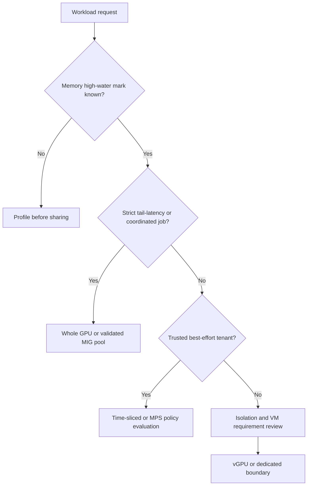

# Why GPU Sharing Exists

A GPU platform team has a familiar paradox: expensive accelerators are reserved for days, while utilization charts often look unconvincing. The first instinct is to increase allocations per GPU. The production question is harder: what does an allocation guarantee when every tenant becomes busy at once?

This chapter establishes the decision language for the rest of the volume. It does not begin with a configuration file because the configuration is the last step. First decide whether the workload needs exclusive capacity, a hardware slice, shared best-effort access, or a VM boundary.

## Learning objectives

After this chapter, you can:

- separate scheduler access from hardware isolation;
- classify workloads by memory, latency, trust, and recovery needs;
- explain why average utilization alone is an unsafe sizing signal;
- identify cases where whole-GPU allocation remains the correct answer; and
- write a service contract for a shared-GPU pool.

| Prerequisites | Difficulty | Reading time |
|---|---:|---:|
| Kubernetes GPU resource model, basic CUDA process model | Advanced | 45 minutes |

## The problem is stranded capacity, not merely low utilization

Whole-GPU allocation is simple: Kubernetes grants a device, the runtime exposes it to a pod, and the platform has a clear owner. That simplicity is valuable for distributed training, large models, and latency-critical inference. It is also coarse. A notebook using a small model, a CI job that runs briefly, or a low-rate inference endpoint can reserve an accelerator for much longer than it actively uses it.

Average device utilization is a clue, not proof. A workload can have low SM activity while it consumes most memory, waits on data, or periodically bursts into a critical latency window. Sharing it with another workload may improve a monthly utilization report while breaking the only SLO that mattered.

**Figure 11.1.1 — Classification precedes mechanism selection.** A request without memory and SLO evidence is not ready for a density decision.

## Four things people call “sharing”

| Mechanism | Scheduler view | Principal guarantee | Important non-guarantee |
|---|---|---|---|
| Whole GPU | one physical device | exclusive platform allocation | no protection from host/device failure |
| MIG | profile-specific device | hardware-partitioned compute and memory resources on supported GPUs | not separate power, firmware, or host domains |
| Time-slicing | multiple logical replicas | access to a multiplexed GPU | no memory or fault isolation between replicas |
| vGPU | virtual GPU attached to VM | VM-oriented virtualization lifecycle and policy boundary | not a substitute for host compatibility planning |

CUDA MPS is related but distinct. It coordinates multiple CUDA processes to run concurrently on a GPU; it is not a Kubernetes tenancy or memory-isolation solution. Treat MPS as a deliberate, application-aware concurrency choice, not as an answer to a multi-tenant platform request.

## Production story: the “eight GPUs per GPU” incident

An internal platform advertised eight logical GPU replicas for every physical inference GPU. Queue time fell immediately. Two weeks later, an otherwise healthy product launch created simultaneous demand. All pods remained `Running`; users saw p99 latency increase and occasional out-of-memory failures. The scheduler had honored each request. The platform had never promised a compute share, a memory reservation, or a latency envelope.

The repair was organizational before it was technical. The team separated workloads into three pools: best-effort notebooks, bounded inference services with measured MIG profiles, and whole-GPU workloads. They added per-namespace quotas, a load test before admission, and a runbook that made “logical replica” explicit in incident communication.

## Build a workload contract

A useful intake record is short but testable:

| Field | Example question | Why it matters |
|---|---|---|
| Workload class | interactive, batch, online inference, training? | determines burst and preemption tolerance |
| Memory envelope | what is the observed high-water mark including runtime buffers? | rules out unsafe profile sizes |
| Performance objective | throughput, p95/p99, deadline, or best effort? | determines contention tolerance |
| Tenant trust | same team, internal tenants, external customers? | scopes isolation requirements |
| Recovery behavior | can it restart, queue, checkpoint, or fail over? | bounds blast radius |
| Placement scope | bare metal, container, VM, regulated environment? | affects vGPU and policy choice |

Do not treat a request for `nvidia.com/gpu: 1` as this contract. It is only a scheduler request. Chapters 7 through 10 turn the contract into resources, admission policy, measurement, and chargeback.

## Trade-offs that survive the design review

More density increases the chance that a noisy neighbor affects a workload. More isolation usually reduces packing flexibility. Dynamic reconfiguration can recover stranded capacity, but it introduces drain and rollback risk. A platform should therefore optimize the **service**, not the maximum count of allocatable tokens.

| Design choice | Gains | Costs | Good fit |
|---|---|---|---|
| Dedicated pool | simple diagnosis and stable behavior | lower packing efficiency | critical inference, distributed training |
| Standard MIG layouts | predictable inventory | profile fragmentation, more pools | repeatable model-serving shapes |
| Time-sliced pool | broad access, supports older GPUs | shared memory and fault domain | development, bursty best effort |
| vGPU pool | VM lifecycle integration | licensing and compatibility operations | VDI, VM-centric estates |

## A practical intake workshop

Run the first sharing discussion with the application owner, security owner, and platform operator together. Asking only the application owner produces optimistic utilization assumptions; asking only the platform owner produces a resource menu without a service objective. The following sequence keeps the decision auditable.

1. Establish the unit of work: request, token, batch, experiment, render, or training step.
2. Measure the high-water memory behavior under the largest expected input and concurrency—not only during model load.
3. Identify whether missed latency or throughput targets are recoverable by queueing, retrying, or checkpointing.
4. Identify administrative and data boundaries. A namespace is not equivalent to a VM boundary, and neither is equivalent to physical separation.
5. Choose a candidate pool, then test the workload while its intended neighbors are active.
6. Record the failure action: throttle, queue, move, restart, fail over, or decline admission.

The result should be a short decision record. It is more useful than a long generic architecture document because it gives on-call responders the intended behavior when demand exceeds the shared device’s capacity.

## Capacity signals that should not be collapsed

| Signal | What it tells you | What it does not tell you |
|---|---|---|
| GPU utilization | active execution over a sampling interval | available latency headroom |
| Memory used | current allocation pressure | peak request-state requirement |
| Pod GPU request | scheduler accounting | actual memory or compute use |
| Queue depth | incoming pressure | whether GPU or an upstream dependency is limiting |
| p99 latency | user-visible tail behavior | which tenant caused contention |
| Restart count | visible failures | the root cause or physical blast radius |

This distinction prevents a common failure mode: choosing a sharing mechanism from one metric and declaring the resulting service predictable.

## Troubleshooting scenario 1: utilization says “idle,” users say “slow”

**Symptoms:** average utilization is low, but p99 latency rises after a new tenant is admitted.

**Blast radius:** services on the same physical device or shared profile pool.

**Triage:** compare request rate, active CUDA processes, memory high-water mark, queue time, and application latency over the same interval. Check whether the new workload has burst phases hidden by an average chart.

**Diagnosis:** low average SM utilization does not establish spare latency capacity. The workload may be memory-bound, bursty, or blocked on a dependency before issuing GPU work.

**Resolution:** reproduce with a workload-specific load envelope; reduce concurrency or move the latency-sensitive service to MIG or a dedicated pool. Do not declare a density ratio from a single dashboard screenshot.

**Prevention:** make p95/p99 latency, memory headroom, and concurrent-active-load tests part of admission.

## Troubleshooting scenario 2: a tenant asks for “isolation”

**Symptoms:** security review rejects a proposal that calls time-slicing isolated.

**Triage:** ask which boundary is required: memory, fault, VM administration, Kubernetes identity, network, or data access. Map each to a concrete control.

**Diagnosis:** “isolation” was used as a product adjective instead of an engineering claim.

**Resolution:** document the selected mechanism’s guarantees and remaining shared dependencies. Use vGPU when the VM boundary is material; use MIG only on supported hardware and only for the resources it partitions; keep platform controls such as RBAC and network policy separate.

**Prevention:** require threat-model sign-off for cross-tenant pools.

## Customer architecture discussion

For a research organization, a time-sliced development pool may be a good service: fast access, explicit best-effort behavior, and a separate protected pool for production endpoints. For a regulated customer with VM-based operations, the design conversation starts with the virtualization boundary and support matrix, not Kubernetes replicas. For an inference provider, the deciding evidence is usually the model’s memory envelope and tail-latency behavior under realistic concurrency.

## Production deployment pattern

Expose sharing as named services, not as a cluster-wide default. For example, a platform can offer `gpu-best-effort`, `gpu-mig-small`, and `gpu-dedicated` pools with separate labels, quotas, support expectations, and escalation paths. Admission policy should prevent a production namespace from silently consuming the best-effort class. Capacity reports should show both logical allocations and physical-device exposure so leadership does not mistake overcommit for installed capacity.

During a rollout, start with a canary node pool and a small set of known workloads. Capture baseline throughput, latency, memory, and recovery evidence before increasing density. Keep a dedicated-pool escape hatch while the service is new. The fastest rollback is often placement: stop admitting new shared work and move the critical workload to known-good capacity.

## Senior interview questions

1. Why is average GPU utilization insufficient evidence for oversubscription?
2. Explain the difference between access sharing, resource partitioning, and a tenant boundary.
3. How would you classify an LLM endpoint with variable prompt lengths before choosing a sharing method?
4. What is the rollback plan if a new sharing policy breaks tail latency?

## Revision checklist

- Can you name the exact guarantee a tenant receives?
- Did you measure memory and concurrent demand, rather than infer capacity from averages?
- Does the selected pool match the trust and recovery model?
- Are dedicated capacity and a rollback path available for critical workloads?

## Further reading

- [NVIDIA MIG User Guide: introduction](https://docs.nvidia.com/datacenter/tesla/mig-user-guide/introduction.html)
- [NVIDIA GPU Operator: time-slicing GPUs](https://docs.nvidia.com/datacenter/cloud-native/gpu-operator/latest/gpu-sharing.html)
- [Volume 10: Kubernetes GPU Platform](../volume-10/index)
