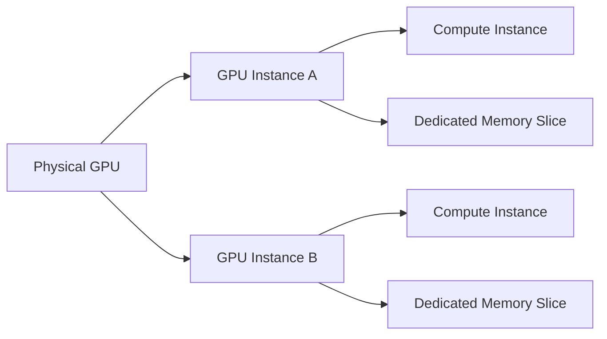

# MIG Architecture and Isolation

MIG was created for environments that need finer granularity than a whole GPU but stronger isolation than time-based multiplexing.

## Learning Objectives

You will be able to explain GPU instances, compute instances, memory slices, profile geometry, reset boundaries, and the operational limits of MIG.

## Big Picture



MIG partitions supported resources into independently exposed devices. Each instance receives a defined portion of compute and memory resources. This creates a stronger boundary than several processes merely taking turns on the same full GPU.

## Isolation Model

MIG improves isolation for memory capacity, memory bandwidth slices, cache resources, and compute allocation. It also limits the blast radius of some workload failures. It does not turn one physical accelerator into unrelated physical machines. Power, thermals, firmware, and the underlying device remain shared.

| Boundary | MIG behavior |
|---|---|
| Memory capacity | Reserved by profile |
| Compute resources | Partitioned by profile |
| Host and driver | Shared platform dependency |
| Power and cooling | Shared physical device |
| Firmware and hardware failure | Can affect multiple instances |

## Internal Working

The operator first enables MIG mode where required, then creates GPU instances using supported profiles. Compute instances are exposed to workloads through the driver and device-management stack. Kubernetes commonly advertises profile-specific resources through the NVIDIA device plugin.

## Production Trade-offs

MIG provides predictable partitions, but capacity can fragment. A set of small profiles may prevent creation of a larger requested profile until the layout is changed. Reconfiguration may require draining workloads and recreating instances.

## Verification

```bash
nvidia-smi -L
nvidia-smi mig -lgip
nvidia-smi mig -lgi
```

Healthy output lists the physical GPU, supported profiles, and active GPU instances.

## Troubleshooting

**Symptom:** a scheduler reports free capacity, but a requested MIG profile cannot be created.

**Diagnosis:** inspect the active instance layout and supported profile placement.

**Root cause:** aggregate free slices do not form the geometry required by the requested profile.

**Resolution:** drain affected workloads, apply a validated profile layout, and re-advertise resources.

## Customer Perspective

MIG should be positioned as hardware partitioning for supported use cases, not as unlimited consolidation. Profile planning and operational reconfiguration remain part of the platform design.

## Interview Questions

- Which resources are isolated by MIG, and which remain shared?
- Why can MIG capacity fragment?
- Design a rollback plan for changing a production MIG layout.
