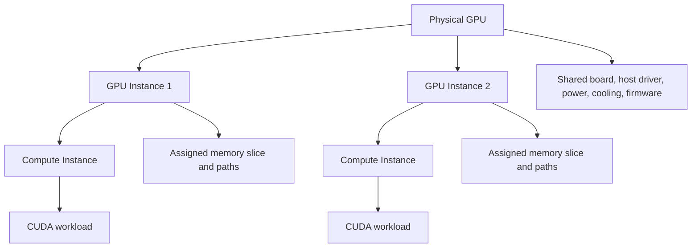

# MIG Architecture and Isolation

MIG is hardware partitioning on supported NVIDIA GPUs, not a more attractive name for oversubscription. It creates GPU instances from defined compute and memory resources and exposes them as devices that workloads can schedule. This gives a platform a stronger performance and fault boundary than several processes taking turns on one full GPU, but it does not make one board into several independent servers.

## Learning objectives

After completing this chapter, you can describe the difference between a GPU instance and a compute instance, identify shared dependencies, design a safe MIG lifecycle, and explain why profile changes belong in change management.

| Prerequisites | Difficulty | Reading time |
|---|---:|---:|
| Chapter 01 and CUDA device concepts | Advanced | 55 minutes |

## The hierarchy



**Figure 11.2.1 — MIG has two layers.** A GPU instance (GI) is the hardware resource partition; a compute instance (CI) is the compute partition exposed for CUDA execution. The exact supported profiles and capacities are GPU-specific, so inspect the installed hardware rather than copying an A100 example into an H100 or Blackwell fleet.

NVIDIA documents distinct paths through the memory system for MIG instances, including assigned cache and memory-controller resources. That is why a MIG-backed workload has a more bounded memory-bandwidth and cache-interference story than time-sliced contexts. It remains a physical GPU with shared board-level dependencies.

**Concrete example — listing available profiles on an H100:**
```bash
# Check which profiles are supported on this GPU
nvidia-smi -i 0 -L
nvidia-smi mig -lgip -i 0
```
Typical H100 output:
```text
GPU 0: NVIDIA H100 80GB HBM3

MIG Profiles (GI):
[0] 1g.10gb, 1 GI of 10GB, max 7 concurrent instances
[1] 1g.20gb, 1 GI of 20GB, max 4 concurrent instances
[2] 2g.20gb, 1 GI of 20GB with 2 SMs, max 3 concurrent instances
[3] 3g.40gb, 1 GI of 40GB with 3 SMs, max 2 concurrent instances
[4] 4g.40gb, 1 GI of 40GB with 4 SMs, max 1 concurrent instance
[5] 7g.80gb, 1 GI of 80GB with 7 SMs, max 1 (full GPU)
```

The profile name encodes: `<SMs>g.<memory>gb`. A `1g.10gb` instance gets 1 SM group (10% of H100 compute) and 10GB of the 80GB HBM, with distinct cache and memory-controller paths. You can create up to 7 such instances on one H100, but **you cannot exceed 100% compute or 80GB memory in aggregate**—this is why profile placement matters.

## What MIG isolates—and what it cannot

| Resource or event | MIG effect | Platform implication |
|---|---|---|
| Profile-defined compute and memory resources | partitioned | a workload receives its configured hardware shape |
| Memory system paths | assigned per instance | neighbor cache/DRAM pressure is constrained by partitioning |
| CUDA context failure | bounded by the driver/instance model | still validate application and driver failure behavior |
| Host driver and runtime | shared | driver incidents can affect multiple instances |
| Power, thermal, board, and firmware faults | shared | one device issue can have a multi-tenant blast radius |
| Kubernetes identity and network access | not supplied by MIG | add RBAC, namespaces, policy, and data controls |

This table is deliberately conservative. Do not equate hardware partitioning with a complete security architecture. A tenant can still be harmed by an unavailable node, a bad driver rollout, a host compromise, or an incorrectly exposed device.

## Internal working and lifecycle

1. Verify that the exact GPU, driver, operating environment, and operator/device-plugin versions support the intended MIG configuration.
2. Drain or otherwise protect workloads according to the change plan. MIG mode changes may require a reset on some generations; NVIDIA notes different behavior beginning with Hopper.
3. Enable MIG mode per GPU where required, create supported GI/CI layouts, and expose the resulting devices through the runtime and scheduler.
4. Validate at each layer: driver inventory, CUDA visibility, Kubernetes allocatable resources, and an application smoke test.
5. Persist the desired configuration declaratively where the platform supports it, then monitor for drift after reboots, driver changes, and node replacement.

The lifecycle is important because enabling MIG mode alone is insufficient for CUDA work: GPU and corresponding compute instances must exist. Layout changes can require draining workloads and should be treated like a node-level capacity migration, not a routine pod restart.

## Kubernetes consequences

The NVIDIA device plugin can expose MIG inventory with `none`, `single`, or `mixed` strategies. The strategy determines the resource shape the scheduler sees; it does not decide whether a pod is appropriate for a profile. Chapter 7 covers scheduling in depth. At this point, retain two rules:

- schedule only the exact advertised resource type; do not assume every node has the same layout; and
- use node pools and labels to keep profile inventory predictable for operators and users.

## Validation is a chain, not a command

An engineer can see a MIG mode flag and still have an unusable platform. Validate each boundary in order:

| Layer | Question | Evidence | Example command |
|---|---|---|---|
| Hardware and driver | Is this GPU and driver combination supported? | approved inventory and driver documentation | `nvidia-smi --query-gpu=gpu_name,driver_version --format=csv` |
| MIG configuration | Do the desired GIs and CIs exist? | `nvidia-smi mig -lgi` shows active instances | `nvidia-smi mig -lgi -i 0` |
| Container runtime | Can a test container see only its assigned device? | container log shows expected device | `docker run --gpus device=gpu:0:0 nvidia/cuda nvidia-smi` |
| Kubernetes | Are the intended resources allocatable and schedulable? | `kubectl get nodes -o wide` shows resources | `kubectl describe node GPU_NODE` |
| Application | Does the workload meet its objective at expected concurrency? | measured latency, throughput, and memory evidence | run production workload, capture metrics |
| Operations | Can the team detect drift and reverse the change? | alerts, change record, rollback rehearsal | test manual rollback on canary node |

Never use a production tenant workload as the first application validation. A minimal, version-pinned smoke test avoids turning an infrastructure change into an unbounded application incident.

**Worked example — enabling MIG on an H100 and validating through all layers:**

```bash
# Layer 1: Driver support
nvidia-smi --query-gpu=gpu_name,driver_version --format=csv
# Output: NVIDIA H100 80GB HBM3, 575.10

# Layer 2: Enable MIG mode (requires GPU reset on some architectures)
sudo nvidia-smi -i 0 -mig 1
# May show: Warning: GPU 0 will be reset on next load

# After reset, verify MIG mode is on and create instances
nvidia-smi -i 0 -mig 1 -pm ENABLED
nvidia-smi mig -cgi 1g.10gb,1g.10gb,1g.10gb -C -i 0
# Creates three 1g.10gb instances on GPU 0

# Verify GI and CI exist
nvidia-smi mig -lgi -i 0
# Output:
# | GPU  0 GPU Instance Profile | Placement | Size  |
# |------|---------------------------|-----------|-------|
# |   0  1g.10gb                 |   NONE    | 10GB  |
# |   1  1g.10gb                 |   NONE    | 10GB  |
# |   2  1g.10gb                 |   NONE    | 10GB  |

# Layer 3: Container runtime visibility (requires Container Toolkit integration)
docker run --gpus device=gpu:0:0 nvidia/cuda nvidia-smi
# Output inside container:
# | NVIDIA-SMI 575.10    Driver Version: 575.10    CUDA Version: 12.5     |
# +-------------------------------+----------------------+----------------------+
# | GPU  Name         Temp  Perf  Pwr:Usage/Cap|         Memory-Usage | GPU-Util  Compute M. |
# |   0  NVIDIA H100...  28C   P0    42W / 700W |    100MiB / 10000MiB |      0%      Default |

# Layer 4: Kubernetes device plugin reconciliation
kubectl get nodes -o custom-columns=NAME:.metadata.name,GPU_ALLOCATABLE:.status.allocatable.nvidia\\.com/gpu
# Output: gpu-node-1    3 (three MIG instances advertised)

# Layer 5: Application smoke test
kubectl create -f - <<EOF
apiVersion: v1
kind: Pod
metadata:
  name: mig-smoke-test
spec:
  containers:
  - name: test
    image: nvidia/cuda:12.5-runtime
    resources:
      limits:
        nvidia.com/gpu: 1
    command: ["/bin/bash"]
    args: ["-c", "nvidia-smi && python3 -c 'import torch; print(torch.cuda.device_count())'"]
EOF

# Wait for pod to complete and check logs
kubectl logs mig-smoke-test
# Expected output: NVIDIA H100 listed, device_count=1 (only the assigned MIG instance visible)

# Layer 6: Validation – can we roll back?
# Capture the state
BASELINE_STATE=$(nvidia-smi mig -lgi -i 0)
echo "$BASELINE_STATE" > /tmp/mig-baseline.txt

# Test rollback: reset to no-MIG
sudo nvidia-smi -i 0 -mig 0
nvidia-smi -i 0 -mig 0 -pm DISABLED
# Verify GPU returns to full device
nvidia-smi --query-gpu=gpu_name,gpu_uuid --format=csv -i 0
```

All six layers passing = MIG is production-ready on this node.

## Maintenance and rollback

The rollback target is a previously captured, working state: MIG mode, GI/CI layout, labels, device-plugin configuration, and node eligibility. Before changing a node, capture that state and identify the workload drain owner. After a failed change, avoid repeatedly toggling mode while processes retain device handles. Restore the documented baseline, validate it through the same chain, and preserve evidence for the post-incident review.

MIG configuration persistence behavior differs by generation and driver. The platform must validate the desired state after reboot, maintenance, and node replacement rather than assume that a one-time command is durable everywhere.

## Resource anatomy in more detail

MIG divides supported hardware into profile-defined GPU instances. A GPU instance contains allocated compute and memory-system resources. The GPU instance can then contain one or more compute instances, depending on the supported configuration. CUDA applications consume the exposed compute-instance view. The exact geometry is not portable: profile names, instance limits, engines, and placement depend on the GPU product and driver.

| Term | Operational meaning | Common mistake |
|---|---|---|
| Physical GPU | board-level accelerator managed by the host driver | assuming it disappears as a common failure domain |
| GPU instance (GI) | profile-defined hardware partition | treating it as a Kubernetes namespace |
| Compute instance (CI) | compute partition inside a GI exposed to CUDA | assuming it independently changes all GI properties |
| MIG device | user-visible logical device identity | assuming a static name survives every lifecycle event |
| Placement | where a valid profile can be created | treating free fractions as interchangeable |

The NVIDIA documentation describes separate paths for MIG instances through parts of the memory system. This is the source of the stronger predictability argument. It is not permission to omit host hardening, workload identity, or board-health monitoring.

## Supported-configuration discipline

Before enabling a production pool, verify the entire chain from official current documentation: GPU model, driver, operating system, Container Toolkit/runtime, Kubernetes device plugin or Operator version, and selected strategy. Do not copy a command or support claim from an old A100 deployment into a newer generation. Record the source URL and version in the change record, because support matrices change independently of the workload manifests.

| Checkpoint | Acceptance evidence | Stop condition |
|---|---|---|
| Hardware qualification | exact SKU is in current supported-GPU documentation | SKU or platform is not listed |
| Driver qualification | approved version and compatible stack | untested version mix |
| Profile qualification | driver lists the intended GI/CI profiles | desired layout cannot be represented |
| Runtime qualification | constrained container sees expected device | unexpected or missing devices |
| Scheduler qualification | node advertises intended resource | resource name/strategy mismatch |
| Workload qualification | service meets measured objective | only a synthetic startup test passes |

## Node lifecycle sequence

MIG changes affect device inventory. Treat them as node lifecycle operations.

1. Freeze new workload admission to the target pool.
2. Record current driver inventory, allocation mapping, GI/CI state, node labels, and expected rollback layout.
3. Cordon and drain according to the workload’s checkpoint and availability plan.
4. Stop or coordinate managed components that hold device handles if the platform’s procedure requires it.
5. Apply the approved configuration once; capture command output and node events.
6. Validate mode, instances, runtime visibility, device-plugin reconciliation, scheduler inventory, and smoke workload.
7. Re-enable admission only after the new state and monitoring are healthy.
8. If validation fails, restore the captured state rather than experimenting on a production node.

## Troubleshooting scenario 3: post-reboot drift

**Symptoms:** a replacement or rebooted node joins the cluster with a different GPU resource inventory than peer nodes.

**Evidence:** compare desired configuration, boot-time automation status, `nvidia-smi` inventory, node labels, and device-plugin logs. Confirm whether the node is on the same driver and platform image as the pool.

**Diagnosis:** configuration was treated as an imperative one-time action, or automation ran before prerequisites were ready.

**Resolution:** keep the node unschedulable, apply the approved configuration using the normal lifecycle tool, and validate the full chain. Do not relabel the node to make inventory appear consistent.

**Prevention:** make desired layout part of node provisioning and alert on resource-inventory drift.

## Troubleshooting scenario 4: a container sees an unexpected device

**Symptoms:** an application sees more than the assigned device, or no device, despite apparently correct GPU instances.

**Triage:** verify the pod/containers, runtime class or runtime configuration, device-plugin allocation record, container environment, and an isolated smoke test. Check the exact device identity rather than relying only on a count.

**Diagnosis:** the failure is usually in runtime/device-plugin integration or an assumption about how a MIG device is enumerated, not in profile geometry alone.

**Resolution:** return to the last known-good runtime configuration and revalidate with a minimal test. Escalate with driver, runtime, pod specification, and device inventory evidence.

**Prevention:** test device visibility after every driver, runtime, or Operator change.

## Production story: the mode-change outage that looked like a scheduler bug

A team enabled MIG during business hours because the command completed quickly in staging. Production monitoring agents and running workloads held device handles; the requested state did not become a clean, validated inventory. Pods then remained pending while an operator investigated scheduler logs. The real failure was an unmanaged node lifecycle change.

The corrected runbook had a maintenance window, cordon/drain checks, a saved pre-change inventory, explicit service stops where required, per-layer validation, and a rollback to the known layout. The scheduler was never the root cause.

## Troubleshooting scenario 1: MIG appears enabled, but no allocatable slices exist

**Symptoms:** `nvidia-smi` reports MIG mode, while Kubernetes has no expected profile resource.

**Evidence collection:**
```bash
# Host: Check MIG mode and instances
nvidia-smi -i 0 --query-gpu=mig.mode.current --format=csv
# Output: Enabled

nvidia-smi mig -lgi -i 0
# Output: 0  1g.10gb   | placement_id=0  | 10GB
# (instances exist)

# Kubernetes: Check device plugin logs and node status
kubectl logs -n nvidia-driver-install ds/nvidia-device-plugin-daemonset | tail -20
# Look for: device discovery errors, resource advertisement failures

kubectl describe node gpu-node-1 | grep -A 20 "Allocated resources"
# Expected: nvidia.com/gpu should be listed
# Actual: not present or count mismatch

# Device plugin config check
kubectl get daemonsets -n nvidia-driver-install
kubectl get configmap -n nvidia-driver-install device-plugin-configs -o yaml
```

**Diagnosis:** common causes:
- Device plugin not reconciled: GI/CI exist on host but plugin hasn't seen them
- Wrong MIG strategy: device plugin configured with `mig-strategy: none` instead of `single`
- Plugin crashed/not running: resource advertisement failed mid-change
- Cache issue: plugin running but cached old inventory

**Resolution:** do not hand-create a partial production state. Instead:
```bash
# 1. Drain the node
kubectl drain gpu-node-1 --ignore-daemonsets --delete-emptydir-data

# 2. Verify target state matches documentation
nvidia-smi mig -lgi -i 0

# 3. Restart device plugin to force reconciliation
kubectl delete pod -n nvidia-driver-install -l app=nvidia-device-plugin

# 4. Wait for plugin to discover and advertise resources
sleep 30
kubectl describe node gpu-node-1 | grep nvidia.com/gpu

# 5. Validate with a test pod BEFORE admitting production work
kubectl apply -f - <<EOF
apiVersion: v1
kind: Pod
metadata:
  name: mig-validation
spec:
  containers:
  - image: nvidia/cuda:12.5-runtime
    name: test
    resources:
      limits:
        nvidia.com/gpu: 1
    command: ["nvidia-smi"]
EOF
```

**Prevention:** validate driver, runtime, plugin, and profile support together in a canary pool. Include device-plugin log checks in the validation checklist.

## Troubleshooting scenario 2: one tenant reports a failure and every slice becomes suspect

**Symptoms:** a process failure is initially reported as a GPU-wide incident.

**Triage:** determine whether the evidence is an application exit, CUDA error, CI/GI inventory change, node event, XID/driver event, or host health event. Scope the blast radius before draining the fleet.

**Resolution:** isolate the affected workload where the evidence supports it; escalate board, driver, or host events using captured logs and inventory. Do not promise that MIG eliminates physical-device incidents.

**Prevention:** retain per-node device inventory and correlate it with application, Kubernetes, and DCGM evidence.

## Customer architecture discussion

MIG is compelling for a stable family of model-serving workloads that fit known profiles and need more predictable behavior than shared execution provides. It is less attractive when every request has an arbitrary shape, when reconfiguration cannot be drained safely, or when a VM boundary is the governing requirement. A small number of standard layouts is usually easier to support than a theoretically optimal but constantly changing geometry.

## Change workflow runbook

Use the following workflow for a planned MIG layout change. It is intentionally control-plane and evidence focused; exact commands depend on the supported platform image and approved automation.

| Phase | Owner | Required evidence | Abort condition |
|---|---|---|---|
| Plan | platform owner | compatible SKU/driver, desired layout, rollback layout | no compatible reserve or unclear ownership |
| Notify | service owner | maintenance scope and workload drain plan | protected workload cannot move/checkpoint |
| Prepare | node operator | cordon state, allocation mapping, pre-change inventory | unaccounted tenant still active |
| Apply | authorized operator | managed tool output and change record | unexpected device/driver event |
| Validate | platform and service owner | GI/CI, scheduler, runtime, smoke and service test | any validation layer fails |
| Release | change owner | admission restored and monitoring baseline | alerts or inventory drift remain |

The most important artifact is the pre-change inventory. It makes rollback a restoration of known state rather than a reconstruction under pressure.

## Device-discovery consequences

MIG is not usable by Kubernetes merely because the driver can list an instance. The device plugin and GPU feature discovery components translate host inventory into labels and extended resources. Their configuration determines whether the node advertises a non-MIG resource, a single MIG resource type, or a mixed set of profile-specific resources. The scheduler only sees that advertised representation.

| Observation | Likely layer | Next evidence |
|---|---|---|
| GI/CI exists, no node resource | discovery/device-plugin | component logs and configuration |
| node resource exists, pod Pending | scheduler/admission | events, selector, taint, quota |
| pod scheduled, no CUDA device | runtime allocation | runtime class and container evidence |
| CUDA device visible, service fails | application/profile | memory, concurrency, model behavior |

Do not skip layers. A device-plugin restart can mask a stale host configuration briefly; a successful pod allocation can mask an application that no longer fits after a model update.

## Customer decision narrative: why static layouts win

A customer with three recurring model shapes initially requested free-form MIG reconfiguration. Their test results showed that drains and validation took longer than the business value of perfect packing. The resulting design used two standard layouts, a whole-GPU pool for exceptional jobs, and a small reserve. Queueing was visible but predictable; emergency changes fell sharply.

The lesson is not that dynamic layout changes are forbidden. They are justified when demand is volatile and the customer has enough compatible reserve, automation, validation, and maintenance tolerance. They should never be represented as a zero-cost scheduler feature.

## Revision aid: capability boundaries

- MIG partitions supported GPU resources; it is not a hypervisor.
- A GI/CI layout must be valid for the actual SKU and driver.
- Device discovery and scheduling are separate from instance creation.
- Board, host, driver, power, and cooling dependencies remain shared.
- Reconfiguration is a node lifecycle event with evidence and rollback.

## Operational evidence package

For every MIG change, retain the following evidence with the change record.

- requested and approved layout;
- node and GPU identity;
- driver and platform-component versions;
- pre-change allocation mapping;
- pre-change and post-change GI/CI inventory;
- node labels and allocatable resources;
- device-plugin and relevant node events;
- smoke-test identity and outcome;
- service validation outcome;
- rollback decision and final state.

This package gives a support case or incident commander enough context to determine whether the failure is physical, lifecycle, discovery, scheduling, runtime, or workload-specific.

## Capacity and availability trade-offs

MIG increases granularity but does not guarantee fleet availability. A node with many small instances can have a larger tenant blast radius for a board failure than a dedicated node. The availability decision is therefore two-dimensional: how much isolation exists inside one device, and how replicas are distributed across devices, nodes, racks, and maintenance domains.

| Choice | Availability benefit | Cost |
|---|---|---|
| many slices per node | efficient resource use | more tenants share device/node event |
| replicas across nodes | reduces single-node impact | uses compatible inventory |
| dedicated reserve | fast recovery | lower average packing |
| frequent reshaping | adapts to demand | increases change exposure |

## Escalation questions

1. Is the GPU SKU and driver in the approved support set?
2. What exact GI/CI state existed when impact began?
3. Did the runtime and device plugin report the same inventory?
4. Is there driver, XID, node, or power evidence of a shared physical event?
5. Can the issue be reproduced in a drained canary with the same stack?

## Design review walkthrough

Walk a proposed MIG service through a normal day and a bad day.

On a normal day, a workload selects an eligible node pool.

The device plugin exposes only the intended resources.

The scheduler allocates a matching resource.

The runtime exposes the assigned device.

The application proves its measured envelope.

On a bad day, a node is drained or a device reports a health event.

The platform identifies every allocation on that node.

Protected workloads use compatible reserve capacity or approved failover.

Best-effort workloads queue or restart according to policy.

The team restores the node only after driver, layout, discovery, and application validation.

This walkthrough reveals whether the design is an inventory feature or an operable service.

## Security boundary discussion

MIG reduces resource interference within supported hardware.

It does not authenticate a tenant.

It does not authorize Kubernetes API actions.

It does not segment network traffic.

It does not validate container provenance.

It does not prevent an authorized host administrator from changing the device state.

Use platform security controls for those requirements.

State those controls separately in customer architecture documents.

## Monitoring objectives

Monitor desired versus actual MIG mode.

Monitor desired versus actual GI/CI inventory.

Monitor node resource inventory drift.

Monitor device and node health events.

Monitor application error and latency outcomes.

Monitor drain duration and failed change attempts.

Alert on deviations that make a pool no longer homogeneous.

## Short revision exercise

Describe a request that requires MIG rather than time-slicing.

Name the remaining shared failure domains.

List the five layers that must validate before admission reopens.

Explain why a successful driver command is insufficient proof of service readiness.

## Revision checklist and senior interview questions

- Can you distinguish GI, CI, and a Kubernetes resource name?
- Have you stated the common device, node, and host failure domains?
- Is every layout change paired with drain ownership and rollback evidence?
- Can the team prove availability in the driver, runtime, scheduler, and application?

1. What is the relationship between a GPU instance and a compute instance?
2. Which dependencies remain shared after MIG partitioning?
3. Why should a MIG mode change be a planned node lifecycle event?
4. How would you prove a profile is available end-to-end, not merely visible to `nvidia-smi`?

## Further reading

- [NVIDIA MIG concepts](https://docs.nvidia.com/datacenter/tesla/mig-user-guide/concepts.html)
- [NVIDIA MIG deployment considerations](https://docs.nvidia.com/datacenter/tesla/mig-user-guide/deployment-considerations.html)
- [NVIDIA Kubernetes MIG support](https://docs.nvidia.com/datacenter/cloud-native/kubernetes/latest/index.html)
- Next: [MIG Profiles and Placement](./chapter-03-mig-profiles-and-placement)
