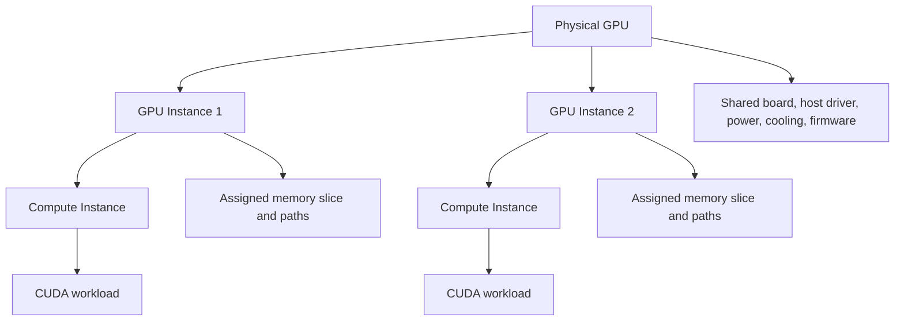

# MIG Architecture and Isolation

MIG is hardware partitioning on supported NVIDIA GPUs, not a more attractive name for oversubscription. It creates GPU instances from defined compute and memory resources and exposes them as devices that workloads can schedule. This gives a platform a stronger performance and fault boundary than several processes taking turns on one full GPU, but it does not make one board into several independent servers.

## Learning objectives

After completing this chapter, you can describe the difference between a GPU instance and a compute instance, identify shared dependencies, design a safe MIG lifecycle, and explain why profile changes belong in change management.

| Prerequisites | Difficulty | Reading time |
|---|---:|---:|
| Chapter 01 and CUDA device concepts | Advanced | 55 minutes |

## The hierarchy

**Figure 11.2.1 — MIG has two layers.** A GPU instance (GI) is the hardware resource partition; a compute instance (CI) is the compute partition exposed for CUDA execution. The exact supported profiles and capacities are GPU-specific, so inspect the installed hardware rather than copying an A100 example into an H100 or Blackwell fleet.

NVIDIA documents distinct paths through the memory system for MIG instances, including assigned cache and memory-controller resources. That is why a MIG-backed workload has a more bounded memory-bandwidth and cache-interference story than time-sliced contexts. It remains a physical GPU with shared board-level dependencies.

## What MIG isolates—and what it cannot

| Resource or event | MIG effect | Platform implication |
|---|---|---|
| Profile-defined compute and memory resources | partitioned | a workload receives its configured hardware shape |
| Memory system paths | assigned per instance | neighbor cache/DRAM pressure is constrained by partitioning |
| CUDA context failure | bounded by the driver/instance model | still validate application and driver failure behavior |
| Host driver and runtime | shared | driver incidents can affect multiple instances |
| Power, thermal, board, and firmware faults | shared | one device issue can have a multi-tenant blast radius |
| Kubernetes identity and network access | not supplied by MIG | add RBAC, namespaces, policy, and data controls |

This table is deliberately conservative. Do not equate hardware partitioning with a complete security architecture. A tenant can still be harmed by an unavailable node, a bad driver rollout, a host compromise, or an incorrectly exposed device.

## Internal working and lifecycle

1. Verify that the exact GPU, driver, operating environment, and operator/device-plugin versions support the intended MIG configuration.
2. Drain or otherwise protect workloads according to the change plan. MIG mode changes may require a reset on some generations; NVIDIA notes different behavior beginning with Hopper.
3. Enable MIG mode per GPU where required, create supported GI/CI layouts, and expose the resulting devices through the runtime and scheduler.
4. Validate at each layer: driver inventory, CUDA visibility, Kubernetes allocatable resources, and an application smoke test.
5. Persist the desired configuration declaratively where the platform supports it, then monitor for drift after reboots, driver changes, and node replacement.

The lifecycle is important because enabling MIG mode alone is insufficient for CUDA work: GPU and corresponding compute instances must exist. Layout changes can require draining workloads and should be treated like a node-level capacity migration, not a routine pod restart.

## Kubernetes consequences

The NVIDIA device plugin can expose MIG inventory with `none`, `single`, or `mixed` strategies. The strategy determines the resource shape the scheduler sees; it does not decide whether a pod is appropriate for a profile. Chapter 7 covers scheduling in depth. At this point, retain two rules:

- schedule only the exact advertised resource type; do not assume every node has the same layout; and
- use node pools and labels to keep profile inventory predictable for operators and users.

## Validation is a chain, not a command

An engineer can see a MIG mode flag and still have an unusable platform. Validate each boundary in order:

| Layer | Question | Evidence |
|---|---|---|
| Hardware and driver | Is this GPU and driver combination supported? | approved inventory and driver documentation |
| MIG configuration | Do the desired GIs and CIs exist? | `nvidia-smi` inventory captured before and after change |
| Container runtime | Can a test container see only its assigned device? | controlled smoke test |
| Kubernetes | Are the intended resources allocatable and schedulable? | node status plus a constrained test pod |
| Application | Does the workload meet its objective at expected concurrency? | measured latency, throughput, and memory evidence |
| Operations | Can the team detect drift and reverse the change? | alerts, change record, rollback rehearsal |

Never use a production tenant workload as the first application validation. A minimal, version-pinned smoke test avoids turning an infrastructure change into an unbounded application incident.

## Maintenance and rollback

The rollback target is a previously captured, working state: MIG mode, GI/CI layout, labels, device-plugin configuration, and node eligibility. Before changing a node, capture that state and identify the workload drain owner. After a failed change, avoid repeatedly toggling mode while processes retain device handles. Restore the documented baseline, validate it through the same chain, and preserve evidence for the post-incident review.

MIG configuration persistence behavior differs by generation and driver. The platform must validate the desired state after reboot, maintenance, and node replacement rather than assume that a one-time command is durable everywhere.

## Production story: the mode-change outage that looked like a scheduler bug

A team enabled MIG during business hours because the command completed quickly in staging. Production monitoring agents and running workloads held device handles; the requested state did not become a clean, validated inventory. Pods then remained pending while an operator investigated scheduler logs. The real failure was an unmanaged node lifecycle change.

The corrected runbook had a maintenance window, cordon/drain checks, a saved pre-change inventory, explicit service stops where required, per-layer validation, and a rollback to the known layout. The scheduler was never the root cause.

## Troubleshooting scenario 1: MIG appears enabled, but no allocatable slices exist

**Symptoms:** `nvidia-smi` reports MIG mode, while Kubernetes has no expected profile resource.

**Evidence:** capture GPU inventory, GI/CI listing, device-plugin logs, node labels, allocatable resources, and the configured MIG strategy.

**Diagnosis:** the configuration may lack compute instances, the device plugin may not have reconciled, or the scheduler strategy may not match the layout.

**Resolution:** do not hand-create a partial production state. Drain as required, apply the approved geometry, restart/reconcile the platform component through its managed lifecycle, and validate a test workload.

**Prevention:** validate driver, runtime, plugin, and profile support together in a canary pool.

## Troubleshooting scenario 2: one tenant reports a failure and every slice becomes suspect

**Symptoms:** a process failure is initially reported as a GPU-wide incident.

**Triage:** determine whether the evidence is an application exit, CUDA error, CI/GI inventory change, node event, XID/driver event, or host health event. Scope the blast radius before draining the fleet.

**Resolution:** isolate the affected workload where the evidence supports it; escalate board, driver, or host events using captured logs and inventory. Do not promise that MIG eliminates physical-device incidents.

**Prevention:** retain per-node device inventory and correlate it with application, Kubernetes, and DCGM evidence.

## Customer architecture discussion

MIG is compelling for a stable family of model-serving workloads that fit known profiles and need more predictable behavior than shared execution provides. It is less attractive when every request has an arbitrary shape, when reconfiguration cannot be drained safely, or when a VM boundary is the governing requirement. A small number of standard layouts is usually easier to support than a theoretically optimal but constantly changing geometry.

## Revision checklist

- Can you distinguish GI, CI, and a Kubernetes resource name?
- Have you stated which failure domains remain common to all instances?
- Is every layout change paired with drain ownership and a verified rollback baseline?
- Can the team prove availability in the driver, runtime, scheduler, and application?

## Senior interview questions

1. What is the relationship between a GPU instance and a compute instance?
2. Which dependencies remain shared after MIG partitioning?
3. Why should a MIG mode change be a planned node lifecycle event?
4. How would you prove a profile is available end-to-end, not merely visible to `nvidia-smi`?

## Further reading

- [NVIDIA MIG concepts](https://docs.nvidia.com/datacenter/tesla/mig-user-guide/concepts.html)
- [NVIDIA MIG deployment considerations](https://docs.nvidia.com/datacenter/tesla/mig-user-guide/deployment-considerations.html)
- [NVIDIA Kubernetes MIG support](https://docs.nvidia.com/datacenter/cloud-native/kubernetes/latest/index.html)
- Next: [MIG Profiles and Placement](./chapter-03-mig-profiles-and-placement)
