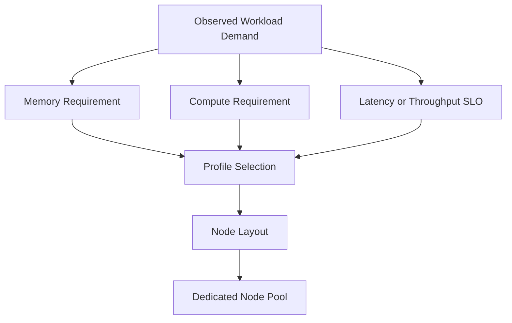

# MIG Profiles and Placement

A MIG profile is both a technical shape and a capacity promise. The profile must fit the model, runtime buffers, and expected concurrency while preserving enough layout flexibility for the rest of the fleet.

## Architecture Model

## Profile Selection

Do not size only from model weights. Include framework overhead, activations, KV cache, temporary buffers, and operational headroom. A profile that barely loads a model is not a production fit.

## Placement and Fragmentation

MIG profiles consume specific physical slices. The remaining slices may be unusable for another requested profile even when arithmetic suggests sufficient capacity. Standardized layouts reduce fragmentation and simplify scheduling.

| Strategy | Benefit | Cost |
|---|---|---|
| One standard layout per pool | Predictable capacity and operations | More pools |
| Dynamic reconfiguration | Better theoretical utilization | Drains, churn, and failure risk |
| Mixed layouts | Flexibility | Harder scheduling and support |

## Production Pattern

Create a small number of validated node pools: small inference, medium inference, large single-instance, and whole-GPU. Route workloads by measured requirements rather than allowing arbitrary profile creation.

## Troubleshooting

**Symptom:** Pods request a profile that exists in policy but remain Pending.

**Diagnosis:** inspect node labels, advertised profile resources, current instance geometry, taints, quotas, and selectors.

**Root cause:** desired profile inventory does not match actual pool state.

## Interview Questions

- Why should a platform standardize MIG layouts?
- How would you estimate memory headroom?
- When is dynamic reconfiguration justified?
