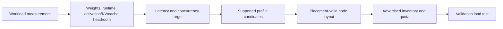

# MIG Profiles and Placement

A MIG profile is a capacity promise with a physical geometry. It is not a percentage slider. The profile encodes a GPU-specific allocation of compute and memory resources; the available combinations and placements come from the driver for the actual device. A platform that ignores placement can report plenty of free capacity and still be unable to create the requested shape.

## Learning objectives

You will be able to size a profile from an observed workload envelope, recognize fragmentation, choose between standardized and dynamic layouts, and troubleshoot a profile request that cannot be placed.

| Prerequisites | Difficulty | Reading time |
|---|---:|---:|
| Chapters 01–02 | Advanced | 50 minutes |

## From model to profile

**Figure 11.3.1 — Size from evidence, then test on an available geometry.** Model weights alone are not a production memory budget. Include framework allocation, temporary buffers, request-dependent state, and operational headroom.

## Read the driver, not a diagram

Use the installed driver to list GPU-instance profiles and placements. Names such as `1g` and `3g` are device-generation-specific labels, not portable service tiers. NVIDIA’s MIG guide explicitly documents that profiles and placements are returned by the driver and that the order of certain profile combinations can matter.

The safe workflow is:

1. record the GPU SKU, driver, and current layout;
2. list supported profiles and the placement information on a representative node;
3. select a short, approved set of layouts per node pool;
4. test model load, representative concurrency, and failure recovery; and
5. advertise only inventory the scheduler can actually satisfy.

## Fragmentation is geometric

| Situation | Arithmetic view | Physical result | Operational response |
|---|---|---|---|
| several small instances exist | “enough free fractions” | requested larger profile cannot fit | route to compatible pool or reconfigure during a drain |
| mixed node layouts | same total slice count | inconsistent resource inventory | standardize layouts or label pools precisely |
| profile just fits model | zero apparent spare memory | runtime bursts cause failures | add measured headroom or select a larger class |
| dynamic reshaping | maximum theoretical packing | availability interrupted by lifecycle work | use only with an approved drain/rollback path |

Think of a parking garage, not a bucket of water: available spaces need the right size and position. This is why standardized layouts often outperform a constantly optimized fleet in real operations.

## Design patterns

**Static profile pools.** Assign a small profile family to dedicated node pools: for example, a tested small-serving shape, a medium-serving shape, and whole-GPU nodes. This makes quota, capacity reporting, and incident triage legible.

**Reserved large-profile pool.** Keep a limited number of nodes in a layout that can accept an important large workload. The apparent unused capacity is an availability decision, not waste.

**Canary reconfiguration pool.** If business demand requires layout changes, test the exact sequence and restore path on a dedicated canary before moving a production node. Never let an arbitrary user request trigger a node-level reconfiguration.

## Profile-sizing worksheet

Use a worksheet that preserves measurement context. Avoid turning it into a universal profile table because available shapes vary by GPU model.

| Input | Capture | Decision use |
|---|---|---|
| GPU SKU and driver | exact installed identity | select the valid profile catalog |
| Model/runtime version | immutable artifact reference | reproduce memory behavior |
| Peak input and batch shape | production-like request envelope | bound dynamic allocations |
| Warm and cold memory high-water mark | measured values, not estimates | determine headroom |
| Concurrency target | active rather than requested clients | test stability |
| p95/p99 objective | agreed service target | reject profiles that only load |
| Failure behavior | OOM, restart, queue, fallback | define operational response |

If inputs are unknown, assign the workload to a discovery or dedicated pool until measurement is complete. A profile that “barely fits” creates a fragile service because ordinary cache growth, batching, and framework upgrades turn the margins into incidents.

## Inventory reporting pattern

Report capacity in two views. The tenant view states allocatable resource counts by profile and region/pool. The operator view also shows physical GPUs, active layouts, fragmentation, reserved headroom, nodes draining, and nodes excluded by health. Both views are needed: the first supports requests; the second predicts whether a request can be fulfilled without a disruptive reconfiguration.

When a pool is intentionally reserved for a larger profile, label it as reserved capacity. Hiding it as “idle” encourages emergency repacking and makes availability look like inefficiency.

## Placement strategy and scheduler strategy are different

Placement is a hardware/driver property: it determines which GI shapes can coexist on a particular GPU. Scheduling is a control-plane property: it chooses a node from the resources advertised to Kubernetes. A scheduler cannot create a missing placement. Conversely, a valid physical layout may be invisible if the device plugin, resource strategy, labels, or node readiness are wrong.

| Layer | Question | Failure evidence |
|---|---|---|
| Hardware layout | can this profile coexist with active instances? | GI placement listing rejects or lacks the shape |
| Node configuration | is the desired layout applied consistently? | peers advertise different inventory |
| Device plugin | is the inventory discovered and exposed? | no allocatable extended resource |
| Kubernetes scheduling | can an eligible pod select the node? | Pending event cites resources/taints/affinity |
| Service admission | should this workload consume the profile? | quota/policy or SLO policy blocks it |

This separation makes incidents faster to diagnose: first ask which layer cannot satisfy the request, then collect evidence for that layer.

## Capacity planning example without invented numbers

Do not use a universal “models per GPU” conversion. Instead, model each service class as a demand vector: required profile type, replicas per service instance, expected concurrent-active percentage, planned headroom, and recovery reserve. Sum demand by profile, then compare it with allocatable profile inventory by node pool. Keep an explicit reserve for failed nodes, maintenance, and large-profile requests.

For a new workload, run three tests: cold start, steady state, and concurrent peak. Record memory high-water marks and service objectives for all three. A profile that passes only cold start is not capacity; it is a deployment experiment.

## Day-two operations

Profile pools need lifecycle ownership. Inventory drift, driver changes, node replacement, and a new model version can invalidate an earlier profile decision. Review the following at a regular cadence:

- profile demand versus allocatable inventory;
- pending time by requested profile and node pool;
- fragmentation and reserve consumption;
- model/runtime version changes that affect memory;
- drain duration and success rate for planned layout changes; and
- discrepancies between billing allocation, scheduler allocation, and actual service demand.

The goal is not to maximize instantaneous packing. It is to avoid surprise reconfiguration during a customer incident.

## Troubleshooting scenario 3: inventory varies among identical nodes

**Symptoms:** identical-looking nodes advertise different profile resources; a deployment succeeds on only some nodes.

**Evidence:** compare GPU SKU, driver version, MIG layout, node image, device-plugin configuration, labels, taints, and recent change history.

**Diagnosis:** the fleet is not actually homogeneous, or configuration drift produced different geometry.

**Resolution:** remove inconsistent nodes from the eligible pool until they are converged through the managed lifecycle. Do not broaden a pod selector to hide the drift.

**Prevention:** validate inventory as part of node provisioning and expose drift in fleet dashboards.

## Troubleshooting scenario 4: reconfiguration consumes the recovery reserve

**Symptoms:** a planned profile change completes, but a subsequent node failure leaves no capacity for protected workloads.

**Diagnosis:** the plan optimized packing without reserving enough compatible profile inventory for maintenance and failure.

**Resolution:** stop noncritical admissions, restore or add compatible reserve capacity, and communicate the reduced service tier. Capture the planner assumptions for review.

**Prevention:** calculate reserve by profile and failure domain, not by total free GPU memory.

## Production story: the impossible “free” capacity

A platform sold a medium profile as available because the sum of unallocated memory across a node exceeded the profile’s memory. The request stayed pending. The node had been filled with small instances in a placement that could not form the requested GI. Operators tried rescheduling repeatedly and made the capacity report worse.

They fixed it by reporting capacity by **allocatable profile and node pool**, not by aggregate free memory. A reserve pool supplied the urgent workload; later, a planned drain returned a node to the desired standard layout.

## Troubleshooting scenario 1: profile policy exists, pod remains Pending

**Symptoms:** a deployment requests a documented MIG resource and has no eligible node.

**Evidence:** inspect the pod event, exact extended resource name, node allocatable resources, labels/taints, namespace quota, current GI/CI layout, and the platform’s intended pool layout.

**Diagnosis:** common causes are a resource-name mismatch, a node that has a different layout than policy assumes, exhausted quota, or physical fragmentation.

**Resolution:** correct the request or route it to a compatible pool. Reconfigure only through the approved maintenance workflow; do not delete production instances opportunistically.

## Troubleshooting scenario 2: model loads in test but fails under production traffic

**Symptoms:** initialization succeeds, then requests fail with memory errors or severe latency instability.

**Diagnosis:** profile sizing used static model weights but omitted runtime allocations, activations, cache growth, batching effects, or concurrent request state.

**Resolution:** reproduce with recorded traffic shape, cap concurrency, reserve headroom, and move to a validated larger profile if needed.

**Prevention:** publish the load-test envelope and maximum supported concurrency with every service tier.

## Customer architecture discussion

Customers often ask for arbitrary fractions because their cost model starts at the accelerator price. The more useful offer is a small menu of measured service classes with stated memory envelopes, latency expectations, and lead time for reconfiguration. It is easier to buy, operate, and defend than a promise that every profile can appear instantly on every node.

## Revision checklist

- Is the profile valid for the exact GPU and driver in the pool?
- Was memory measured under representative concurrency and input shape?
- Does capacity reporting distinguish allocatable profile inventory from free aggregate memory?
- Does a larger-profile request have a route other than an unplanned node drain?
- Does the capacity plan include a profile-compatible maintenance and failure reserve?
- Can an operator identify whether a failure is placement, discovery, scheduling, or admission?

## Senior interview questions

1. Why is aggregate free memory not a MIG capacity metric?
2. What evidence belongs in a profile-sizing decision?
3. When does dynamic reconfiguration justify its operational cost?
4. How do standardized layouts improve incident response?

## Further reading

- [NVIDIA MIG: getting started and profile placement](https://docs.nvidia.com/datacenter/tesla/mig-user-guide/getting-started-with-mig.html)
- [NVIDIA MIG supported GPUs](https://docs.nvidia.com/datacenter/tesla/mig-user-guide/supported-gpus.html)
- Next: [Time-Slicing and Oversubscription](./chapter-04-time-slicing-and-oversubscription)

## Planning example: profile demand as a queueing problem

Imagine three application classes, without assigning universal GPU sizes: an interactive class with short bursts, a sustained inference class with a measured profile, and an exceptional class that needs the largest available shape. The planner should not combine their memory estimates and call the result free capacity. It should maintain independent demand and reserve views for each compatible profile.

| Class | Demand behavior | Inventory policy | Failure behavior |
|---|---|---|---|
| Interactive | bursty, delay-tolerant | bounded small-profile pool | queue or defer |
| Sustained service | stable, SLO-bound | dedicated standard layout plus reserve | fail over or protect admission |
| Exceptional request | infrequent, large | whole/large-profile reserve | scheduled lead time or approved change |

This model forces an honest choice: either reserve compatible capacity, accept queueing, or automate a lifecycle change with a stated availability cost.

## Release and upgrade effects

A profile decision is invalidated by more than hardware changes. A new driver, CUDA runtime, serving engine, model quantization setting, batching policy, or observability agent can alter memory and throughput behavior. Treat these as a reason to repeat the workload envelope, especially before increasing density. A configuration that still lists the same profile may nevertheless no longer deliver the same service.

| Change | Revalidate |
|---|---|
| driver or Operator update | discovery, scheduling, device visibility, node drift |
| model/runtime update | cold/steady/peak memory and latency |
| concurrency policy change | headroom and p95/p99 behavior |
| node replacement | GPU SKU, driver, intended layout, labels |
| capacity ratio change | compatible reserve and recovery time |

## Customer decision narrative: reserve is a feature

When finance sees an unused large-profile node, it may appear inefficient. Explain that it is the same kind of reserve as a spare database node or network path: it converts a high-impact reconfiguration into a placement decision. The decision record should quantify the protected service and state when the reserve can be borrowed. That makes capacity governance explicit rather than informal.

## Revision aid

- Profiles are GPU-specific hardware shapes, not portable fractions.
- Placement determines which shapes can coexist.
- Inventory must be reported by allocatable compatible profile.
- Standardized layouts simplify scheduling, support, and recovery.
- Headroom is measured under representative peak behavior.

## Profile governance record

Store each approved service profile with its evidence.

| Record field | Reason |
|---|---|
| workload artifact/version | makes tests repeatable |
| compatible GPU and driver | prevents false portability |
| intended GI/CI profile | ties service to real inventory |
| test input/concurrency | explains memory and latency result |
| accepted SLO | distinguishes startup from service success |
| reserve requirement | preserves recovery capacity |
| change owner | makes reconfiguration accountable |

## Decision questions

1. Can the profile be placed with the active standard layout?
2. Does the workload fit during cold start, steady state, and burst?
3. Is compatible capacity available after one expected failure?
4. Is the next larger service tier defined?
5. Does the customer accept queueing instead of dynamic reconfiguration?

## Placement review workflow

Start by listing the actual profiles and placements on the target GPU.

Do not begin from a profile name copied from another fleet.

Compare the desired service shape with the current node layout.

Check whether a compatible profile is allocatable now.

Check whether the requested node is eligible by labels, taints, and quota.

Check the compatible reserve after planned maintenance or one expected failure.

Only then decide whether to schedule, queue, or reconfigure.

If reconfiguration is selected, route through the change workflow in Chapter 02.

## Operational anti-patterns

Do not calculate capacity from total unused memory.

Do not promise a profile that no node advertises.

Do not treat a layout change as a pod-level adjustment.

Do not size only from model artifact size.

Do not borrow emergency reserve without recording the service impact.

Do not mix layouts without exposing the difference to scheduling and support.

## Interview exercise

An application fits in a profile during startup but fails under peak traffic.

Explain which measurements were missing.

Explain how you would choose the next candidate profile.

Explain why free aggregate memory does not resolve the request.

Explain how the platform prevents a repeated incident.

The answer should include measurement.

It should include compatible inventory.

It should include clear admission behavior.

It should include a change-controlled recovery path.
