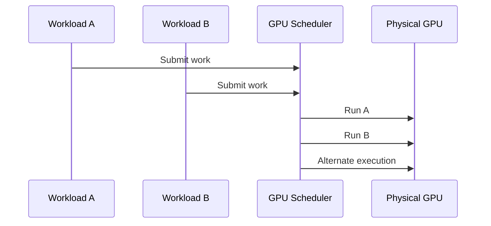

# Time-Slicing and Oversubscription

Time-slicing increases the number of workloads that may access a GPU. It does not divide the hardware into guaranteed slices.

## Big Picture

Logical replicas advertised to Kubernetes are scheduling tokens. They are not reserved memory, compute, or latency.

## Appropriate Workloads

Use time-slicing for bursty development, low-duty-cycle tasks, best-effort inference, and environments where access matters more than deterministic performance.

Avoid it for strict p99 latency, untrusted tenants requiring strong isolation, memory-heavy services, or synchronized distributed jobs.

## Oversubscription Risk

A node can report many logical GPU resources while still containing one physical failure domain. Capacity planning must track both logical allocation and physical saturation.

## Observability

Measure active processes, memory occupancy, utilization, throttling, queue time, application latency, and OOM events. Scheduler allocation alone is insufficient.

## Troubleshooting

**Symptom:** several Pods are Running, but all are slow.

**Root cause:** simultaneous demand exceeds the physical GPU’s capacity.

**Resolution:** reduce replica count, separate workload classes, move critical services to MIG or whole-GPU pools, and add admission controls.

## Customer Question

“How many replicas can one GPU support?” Answer with a benchmark envelope tied to workload shape and SLO—not a universal number.
