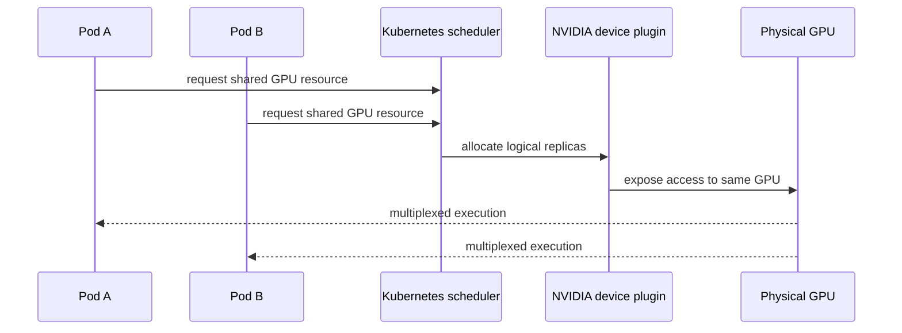

# Time-Slicing and Oversubscription

Time-slicing increases the number of workloads Kubernetes can place against a physical GPU. It does not divide that GPU into guaranteed compute, memory, or fault-isolated pieces. This distinction is the entire operational model: a logical replica is an admission token for shared access, not a capacity reservation.

## Learning objectives

After reading this chapter, you can explain how device-plugin replicas affect scheduling, select appropriate best-effort workloads, measure contention, and respond safely when oversubscription damages latency or memory availability.

| Prerequisites | Difficulty | Reading time |
|---|---:|---:|
| Chapters 01–03 and Kubernetes resource requests | Advanced | 45 minutes |

## What the Kubernetes configuration changes

NVIDIA’s GPU Operator documents time-slicing as a device-plugin configuration that defines a number of replicas for a GPU resource. The scheduler can allocate each replica independently. Internally, work from those replicas is multiplexed on the underlying GPU. Unlike MIG, time-sliced replicas have no memory or fault isolation.

| Claim | Correct interpretation |
|---|---|
| Pod is `Running` | it received access, not a fixed fraction of SMs or memory |
| Node has eight GPU replicas | one physical device may be represented by eight allocatable tokens |
| Pod requests two replicas | it does not guarantee proportional compute power |
| GPUs are shared | all users remain in a shared physical-device failure and contention domain |

## Where time-slicing belongs

Good candidates are interactive development, short experiments, CI validation, and low-duty-cycle workloads whose owners accept variable completion time. It can also offer practical shared access on GPUs that do not support MIG. It is not a default deployment shape for strict tail-latency services, large memory consumers, untrusted tenants needing a strong isolation claim, or coordinated distributed jobs.

CUDA MPS may be relevant when a controlled set of CUDA processes needs concurrent execution. It does not add tenant memory isolation, quota, or an independent scheduler guarantee. Treat it as an application/runtime optimization with its own compatibility and operational testing.

## Design the service, not the replica count

Start with a benchmark envelope: workloads, concurrency, request shape, memory behavior, power/thermal state, and success criteria. Select a replica count that preserves the service objective under that envelope, then set a policy for overload.

| Control | Why it exists |
|---|---|
| separate shared node pool and explicit resource name | prevents a critical pod accidentally receiving best-effort access |
| namespace quota and admission control | limits a single tenant’s allocation burst |
| concurrency/request limits in the application | protects memory and tail latency |
| queueing or load shedding | makes overload visible rather than silently slow |
| telemetry correlated by workload | distinguishes allocation from actual pressure |
| dedicated escape hatch | moves critical workloads to MIG or whole GPU during incidents |

If the platform uses `renameByDefault`, the device plugin can advertise a `.shared` resource name. This is often clearer than silently changing the meaning of the ordinary GPU resource: workload authors can see that they are asking for shared access. Follow the current Operator documentation for the exact configuration and supported resource types.

## Safe rollout sequence

1. Select a noncritical node pool and label it as shared before configuring replicas.
2. Capture a baseline with the same workloads running one at a time and concurrently.
3. Introduce a small replica count; validate actual allocation, application latency, memory use, and recovery.
4. Increase density only while the agreed service envelope still passes.
5. Publish the shared resource name, workload eligibility, escalation path, and the exit path to dedicated capacity.
6. Rehearse removal of the shared configuration in a canary so responders know how to restore a conservative state.

This sequence makes a failed density experiment reversible. It also prevents the misleading success criterion of “the pods scheduled.” Scheduling is an early control-plane check, not workload acceptance.

## Fairness and admission

GPU time-slicing multiplexes execution; it is not a billing or fairness system. Kubernetes quotas can restrict resource requests, while application admission limits and queues control demand before GPU memory and latency become unstable. A fairness policy should name the protected unit—namespace, team, service tier, or customer—and state what happens during contention. Without that policy, the most aggressive client can consume the practical capacity of a shared pool even when every request is formally valid.

## Production story: “all pods are healthy”

An engineering team configured shared replicas for a notebook pool and later placed a customer-facing model endpoint there. Kubernetes reported every pod healthy because the process endpoints continued responding. The application’s own p99 SLO had failed: the endpoint was competing with bursty notebook kernels and cache growth.

The remediation did not involve tuning the scheduler first. The team added a separate shared resource class, guarded production namespaces with admission policy, and moved the service to a measured MIG pool. Application latency, GPU memory, active processes, and queue depth became the health signals for the shared pool.

## Observability: allocation is not utilization

For each shared pool, correlate at least:

- scheduler allocation and pending demand;
- per-device memory use and active process count;
- device utilization, clocks, power, thermal state, and error evidence;
- application throughput and p50/p95/p99 latency; and
- OOMs, restarts, and node/device-plugin events.

NVIDIA documents a limitation: when time-slicing is enabled with the Kubernetes device plugin, DCGM Exporter cannot associate metrics to containers. Build your incident workflow accordingly; a GPU-level graph alone cannot identify the responsible pod. Chapter 10 expands this into SLO design.

## Troubleshooting scenario 1: all replicas slow at once

**Symptoms:** several pods are `Running`, requests complete slowly, and no single pod is obviously unhealthy.

**Blast radius:** every replica sharing the physical GPU.

**Triage:** verify the node’s replica configuration, compare active workload windows, inspect memory occupancy, application queue depth and latency, and check device health. Do not infer fairness from equal Kubernetes resource requests.

**Diagnosis:** simultaneous demand exceeds physical compute, memory bandwidth, or memory capacity. Logical allocation has hidden a saturation event.

**Resolution:** reduce admission, shed or queue work, move the latency-sensitive workload to a measured partition/dedicated pool, and restore service before pursuing packing efficiency.

**Prevention:** load-test at the intended replica count with concurrent-active, not sequential, clients.

## Troubleshooting scenario 2: one job causes memory failures for neighbors

**Symptoms:** unrelated shared pods fail allocations or restart after a new workload begins.

**Evidence:** collect process memory use, pod events, application logs, and the exact shared-resource policy. Avoid killing processes indiscriminately; preserve evidence and follow the tenant escalation path.

**Diagnosis:** time-slicing does not reserve per-replica memory. A workload’s actual allocations consumed device memory needed by its neighbors.

**Resolution:** stop or throttle the offending workload under the documented incident policy; enforce application-level bounds; move workloads requiring reserved memory to MIG or whole GPU.

**Prevention:** use memory envelope testing at admission and state explicitly that shared replicas do not provide memory quotas.

## Customer architecture discussion

Time-slicing is valuable when the customer wants access density and can accept a best-effort service. It is a poor answer to “guarantee every tenant 25% of a GPU.” The honest offer includes a tested workload class, a concurrency limit, a response to overload, and a separate path for critical services. That clarity often produces a more useful platform than a larger advertised replica number.

## Operational complexity and cost

Time-slicing may improve the number of schedulable users, but it increases incident ambiguity. A single physical-device alert can affect many logical allocations, and container-level attribution can be limited. Account for that support cost when choosing the replica ratio. Chargeback should distinguish reserved shared access from measured service consumption; otherwise a dashboard encourages teams to reserve tokens they cannot safely use at the same time.

## Senior interview questions

1. Why does a time-sliced request for two replicas not promise twice the compute?
2. What signals would you use to prove a shared pool is overloaded?
3. How would you prevent a critical deployment from landing on a best-effort GPU pool?
4. Compare the operational consequences of time-slicing and MIG during an OOM incident.

## Revision checklist

- Have you labeled shared access as shared access?
- Are workload-specific latency and memory limits part of the design?
- Can responders correlate application impact with GPU-level evidence?
- Is there a safe migration path to MIG or dedicated capacity?

## Further reading

- [NVIDIA GPU Operator: time-slicing GPUs](https://docs.nvidia.com/datacenter/cloud-native/gpu-operator/latest/gpu-sharing.html)
- [NVIDIA MIG User Guide: application considerations](https://docs.nvidia.com/datacenter/tesla/mig-user-guide/deployment-considerations.html)
- Next: [vGPU Architecture and Enterprise Virtualization](./chapter-05-vgpu-architecture-and-enterprise-virtualization)
