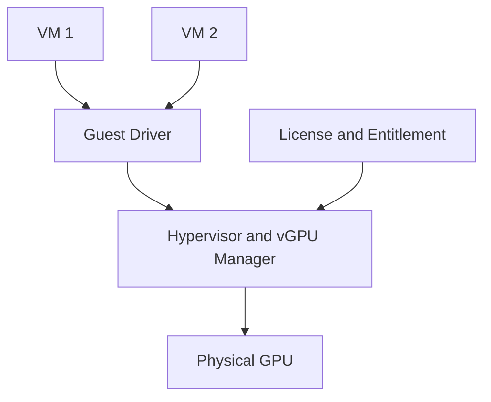

# vGPU Architecture and Enterprise Virtualization

vGPU addresses environments where the workload boundary is a virtual machine rather than a container or bare-metal process.

## Architecture

The complete lifecycle spans guest drivers, host components, hypervisor support, vGPU profiles, licensing, and hardware compatibility.

## Why It Exists

Enterprises often standardize on VM-based isolation, desktop delivery, regulated tenancy, or existing virtualization operations. vGPU integrates GPU access into that model.

## Trade-offs

| Benefit | Operational cost |
|---|---|
| VM lifecycle and isolation | Version compatibility matrix |
| Centralized virtualization policy | Licensing and entitlement |
| Familiar enterprise tooling | Hypervisor dependency |
| Flexible profile assignment | Host and guest coordination |

## Production Operations

Maintain a tested matrix covering GPU, host driver, vGPU manager, hypervisor, guest OS, guest driver, and licensed feature set. Upgrade the stack as one qualified unit.

## Troubleshooting

**Symptom:** a VM starts but the vGPU device is unavailable.

**Diagnosis:** verify profile assignment, host service health, guest driver compatibility, license state, and physical capacity.

**Root cause:** one lifecycle layer is outside the supported combination.

## Customer Perspective

vGPU is appropriate when VM operations and isolation are first-class requirements. It is not automatically the best choice for Kubernetes-native bare-metal AI clusters.
